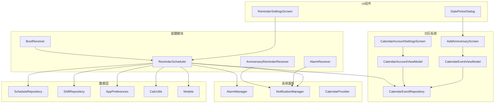
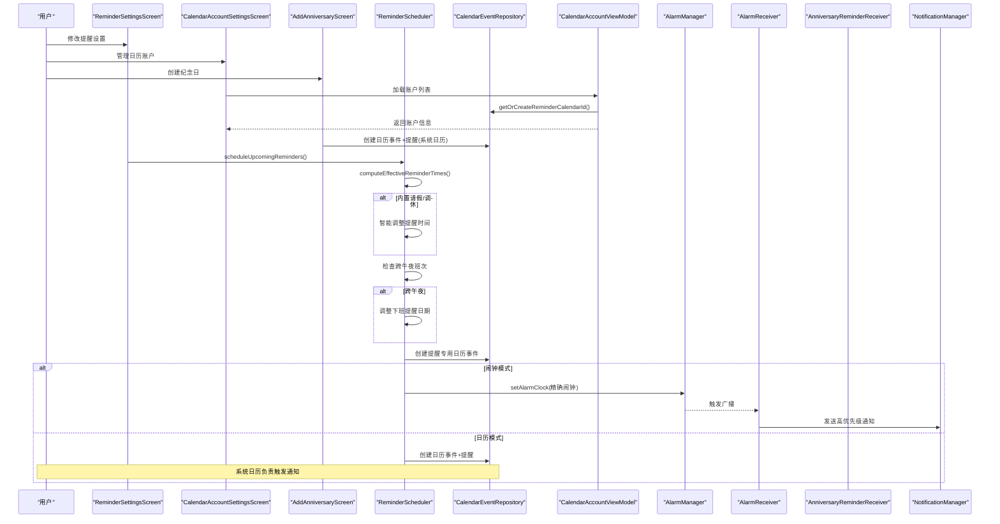
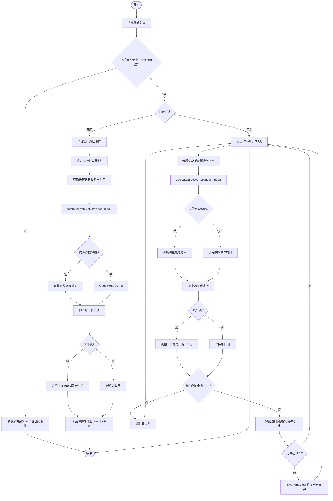
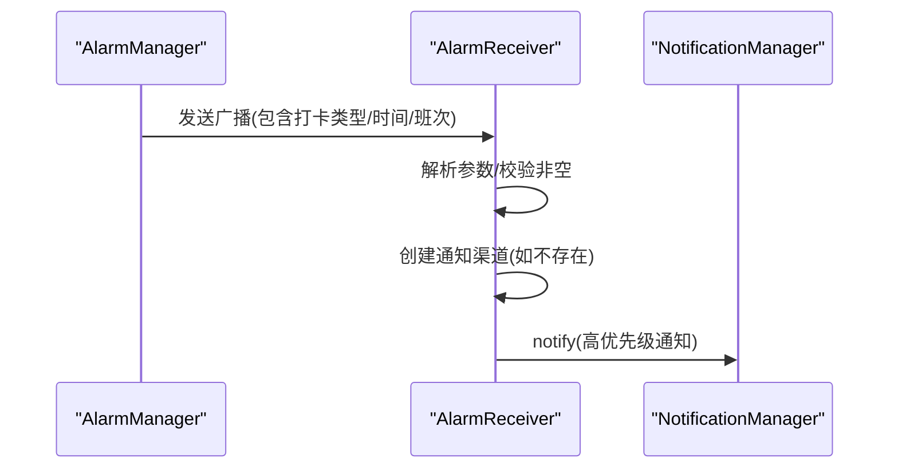
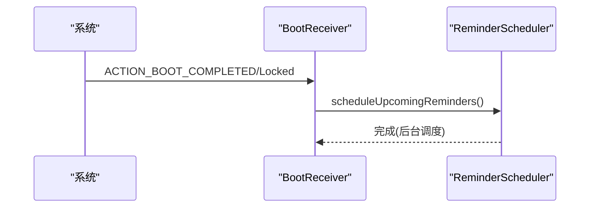
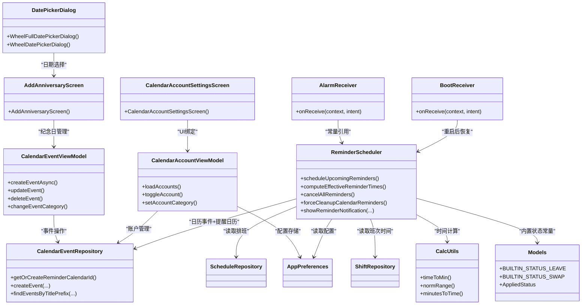

# 提醒通知系统

<cite>
**本文引用的文件**   
- [ReminderScheduler.kt](file://app/src/main/java/com/schedulecalendar/app/reminder/ReminderScheduler.kt)
- [AlarmReceiver.kt](file://app/src/main/java/com/schedulecalendar/app/reminder/AlarmReceiver.kt)
- [BootReceiver.kt](file://app/src/main/java/com/schedulecalendar/app/reminder/BootReceiver.kt)
- [AnniversaryReminderReceiver.kt](file://app/src/main/java/com/schedulecalendar/app/reminder/AnniversaryReminderReceiver.kt)
- [AndroidManifest.xml](file://app/src/main/AndroidManifest.xml)
- [CalcUtils.kt](file://app/src/main/java/com/schedulecalendar/app/domain/model/CalcUtils.kt)
- [Models.kt](file://app/src/main/java/com/schedulecalendar/app/domain/model/Models.kt)
- [CalendarEventRepository.kt](file://app/src/main/java/com/schedulecalendar/app/data/calendar/CalendarEventRepository.kt)
- [ScheduleRepository.kt](file://app/src/main/java/com/schedulecalendar/app/data/repository/ScheduleRepository.kt)
- [ShiftRepository.kt](file://app/src/main/java/com/schedulecalendar/app/data/repository/ShiftRepository.kt)
- [AppPreferences.kt](file://app/src/main/java/com/schedulecalendar/app/data/prefs/AppPreferences.kt)
- [ReminderSettingsScreen.kt](file://app/src/main/java/com/schedulecalendar/app/ui/settings/ReminderSettingsScreen.kt)
- [ReminderSettingsViewModel.kt](file://app/src/main/java/com/schedulecalendar/app/ui/settings/ReminderSettingsViewModel.kt)
- [CalendarAccountSettingsScreen.kt](file://app/src/main/java/com/schedulecalendar/app/ui/settings/CalendarAccountSettingsScreen.kt)
- [CalendarAccountViewModel.kt](file://app/src/main/java/com/schedulecalendar/app/ui/settings/CalendarAccountViewModel.kt)
- [DatePickerDialog.kt](file://app/src/main/java/com/schedulecalendar/app/ui/component/DatePickerDialog.kt)
- [AddAnniversaryScreen.kt](file://app/src/main/java/com/schedulecalendar/app/ui/todo/AddAnniversaryScreen.kt)
- [CalendarEventViewModel.kt](file://app/src/main/java/com/schedulecalendar/app/ui/todo/CalendarEventViewModel.kt)
</cite>

## 更新摘要
**变更内容**   
- **重要修复跨午夜班次处理逻辑**：新增computeEffectiveReminderTimes()方法，智能处理内置请假和调休状态的提醒时间计算，确保跨午夜夜班场景下的打卡提醒时机准确
- **修复AlarmReceiver配置问题**：修正了android:exported属性配置，确保Android系统能够正确传递闹钟广播给接收器
- **增强提醒系统准确性**：通过智能时间计算和日期调整，提升了请假/调休状态下的提醒可靠性

## 目录
1. [简介](#简介)
2. [项目结构](#项目结构)
3. [核心组件](#核心组件)
4. [架构总览](#架构总览)
5. [详细组件分析](#详细组件分析)
6. [依赖关系分析](#依赖关系分析)
7. [性能与可靠性考虑](#性能与可靠性考虑)
8. [故障排查指南](#故障排查指南)
9. [结论](#结论)
10. [附录：权限与用户引导流程](#附录权限与用户引导流程)

## 简介
本文件面向提醒通知系统的实现，聚焦 Android 定时任务与通知机制。重点覆盖以下方面：
- ReminderScheduler 的调度逻辑：如何基于排班数据计算触发时间、使用 AlarmManager.setAlarmClock 精确调度、以及日历事件提醒模式。
- 接收器实现：AlarmReceiver（闹钟触发）、BootReceiver（开机恢复）。
- **简化的纪念日提醒**：仅使用系统日历原生提醒功能，移除了独立的闹钟调度机制。
- **智能时间计算**：新增 computeEffectiveReminderTimes() 方法处理内置请假和调休状态的智能时间计算。
- **跨午夜班次处理**：修复跨午夜夜班场景下的打卡提醒时机问题。
- 通知渠道管理与高优先级通知展示。
- 精确调度策略与电池优化影响规避。
- 通知权限处理与用户引导。
- 调试方法与常见问题解决方案。

## 项目结构
提醒通知相关代码主要位于 reminder 包，配合数据层仓库与设置界面完成端到端能力：
- 调度与通知：ReminderScheduler、AlarmReceiver
- 开机恢复：BootReceiver
- 纪念日提醒：AnniversaryReminderReceiver（简化版）
- 日历集成：CalendarEventRepository（支持提醒专用日历）
- 数据源：ScheduleRepository、ShiftRepository
- 配置：AppPreferences（支持账户管理配置）
- UI 入口：ReminderSettingsScreen、CalendarAccountSettingsScreen、AddAnniversaryScreen
- 自定义组件：DatePickerDialog（滚轮式日期选择器）
- 清单注册：AndroidManifest.xml

**图表来源**   
- [ReminderScheduler.kt:1-497](file://app/src/main/java/com/schedulecalendar/app/reminder/ReminderScheduler.kt#L1-L497)
- [AlarmReceiver.kt:1-78](file://app/src/main/java/com/schedulecalendar/app/reminder/AlarmReceiver.kt#L1-L78)
- [AnniversaryReminderReceiver.kt:1-57](file://app/src/main/java/com/schedulecalendar/app/reminder/AnniversaryReminderReceiver.kt#L1-L57)
- [BootReceiver.kt:1-46](file://app/src/main/java/com/schedulecalendar/app/reminder/BootReceiver.kt#L1-L46)

## 核心组件
- ReminderScheduler：负责读取用户设置与排班数据，计算未来 9 天的提醒触发时间（前3天到后5天），并采用两种模式进行调度：
  - 闹钟提醒：使用 AlarmManager.setAlarmClock 精确调度，确保在 Doze/省电模式下也能准时触发。
  - 日历提醒：通过 CalendarEventRepository 创建系统日历事件并设置提醒，由系统日历应用触发通知；同时清理窗口外的旧事件避免污染系统日历。
  - **智能时间计算**：新增 computeEffectiveReminderTimes() 方法，根据内置请假/调休状态智能调整提醒时间。
  - **跨午夜处理**：自动检测跨午夜班次，将下班提醒推后至次日。
- AlarmReceiver：接收闹钟广播，构建并发送高优先级通知，点击可跳转至主界面执行打卡动作。
- BootReceiver：监听设备启动完成，重新调度未来 9 天提醒，保证重启后提醒可用。
- AnniversaryReminderReceiver：简化的纪念日提醒接收器，仅用于显示通知。
- CalendarEventRepository：封装对系统日历账户与事件的读写，支持创建带提醒的事件、批量删除、按前缀查找等，包含提醒专用日历管理功能。
- ScheduleRepository / ShiftRepository：提供排班记录与班次信息查询。
- AppPreferences：持久化提醒开关、方式、提前分钟数等配置，包含日历账户管理配置。
- CalcUtils：提供时间计算工具方法，包括时间归一化、跨天处理等。
- Models：定义内置状态常量（BUILTIN_STATUS_LEAVE、BUILTIN_STATUS_SWAP）和数据模型。
- ReminderSettingsScreen / AddAnniversaryScreen：提供用户交互入口，保存配置或创建纪念日事件。
- CalendarAccountSettingsScreen：管理日历账户的启用/禁用和分类设置。
- DatePickerDialog：提供滚轮式日期和时间选择器界面。
- CalendarEventViewModel：管理日历事件的创建、更新、删除和分类切换逻辑。

**章节来源**   
- [ReminderScheduler.kt:1-497](file://app/src/main/java/com/schedulecalendar/app/reminder/ReminderScheduler.kt#L1-L497)
- [AlarmReceiver.kt:1-78](file://app/src/main/java/com/schedulecalendar/app/reminder/AlarmReceiver.kt#L1-L78)
- [AnniversaryReminderReceiver.kt:1-57](file://app/src/main/java/com/schedulecalendar/app/reminder/AnniversaryReminderReceiver.kt#L1-L57)
- [BootReceiver.kt:1-46](file://app/src/main/java/com/schedulecalendar/app/reminder/BootReceiver.kt#L1-L46)
- [CalcUtils.kt:1-536](file://app/src/main/java/com/schedulecalendar/app/domain/model/CalcUtils.kt#L1-L536)
- [Models.kt:1-277](file://app/src/main/java/com/schedulecalendar/app/domain/model/Models.kt#L1-L277)

## 架构总览
提醒系统整体分为三层：
- 调度层：ReminderScheduler 根据配置与数据计算触发时间，选择闹钟或日历模式进行调度，并应用智能时间计算。
- 触发层：AlarmManager 触发广播给对应 Receiver；系统日历在事件提醒时弹出通知。
- 展示层：Receiver 调用 NotificationManager 发送高优先级通知，点击跳转到主界面执行操作。
- 日历管理层：CalendarAccountViewModel 管理日历账户的启用/禁用状态和分类设置。

**图表来源**   
- [ReminderScheduler.kt:101-203](file://app/src/main/java/com/schedulecalendar/app/reminder/ReminderScheduler.kt#L101-L203)
- [ReminderScheduler.kt:244-287](file://app/src/main/java/com/schedulecalendar/app/reminder/ReminderScheduler.kt#L244-L287)

## 详细组件分析

### ReminderScheduler 调度逻辑
- 初始化阶段：创建通知渠道（IMPORTANCE_HIGH），确保后续通知能正确显示。
- 调度入口 scheduleUpcomingReminders：
  - 读取偏好设置（是否启用、方式、上班/下班开关、提前分钟数）。
  - 若禁用或未开启任一类提醒，则取消所有闹钟并清理日历提醒事件。
  - 根据方法分支：
    - 日历模式：先取消所有闹钟，再清理窗口外旧事件，随后为今天前后各 3 天到后 5 天（共 9 天）的排班创建日历事件与提醒。
    - 闹钟模式：清理可能残留的日历事件，遍历未来 9 天，为每个有效班次上下班时间设置精确闹钟。
- **智能时间计算 computeEffectiveReminderTimes**：
  - 检测内置请假/调休状态（BUILTIN_STATUS_LEAVE、BUILTIN_STATUS_SWAP）
  - 全天请假/调休（时间段均为 null）→ 跳过该日期的提醒
  - 部分时段请假/调休 → 排除该时间段后，取最长的有效工作段作为提醒时间
  - 支持跨午夜班次和跨午夜状态时间段的处理
- **跨午夜班次处理**：
  - 检测下班时间早于上班时间（timeToMin(clockOutTime) < timeToMin(clockInTime)）
  - 自动将下班提醒日期推后至次日
- 单个提醒 scheduleReminder：
  - 校验精确闹钟权限（SDK 31+ 检查 canScheduleExactAlarms）。
  - 解析时间字符串，计算触发时刻（当前时间减去提前分钟数），过滤过去时间。
  - 构造 PendingIntent 指向 AlarmReceiver，并使用 AlarmClockInfo 注册 setAlarmClock。
- 日历提醒 scheduleCalendarReminder：
  - 强制使用提醒专用日历 ID：calendarRepo.getOrCreateReminderCalendarId()
  - 创建日历事件时设置 HAS_ALARM 标志和 Reminders 表记录
  - 写入 ExtendedProperties 以兼容国产 ROM 的 need_alarm 标志
- 取消与清理：
  - cancelAllReminders：针对近两周范围生成 requestCode 并取消对应 PendingIntent。
  - cleanupCalendarReminders / forceCleanupCalendarReminders：按标题前缀查找并批量删除日历事件。
- 通知展示 showReminderNotification：
  - 根据 isClockIn 决定通知 ID 与内容，点击打开 MainActivity 并携带打卡动作。

**更新** 提醒窗口管理已从对称的±3天调整为不对称的-3天到+5天，提供更长的未来提醒覆盖范围。**新增智能时间计算和跨午夜处理逻辑**，显著提升提醒系统的准确性和可靠性。

**图表来源**   
- [ReminderScheduler.kt:101-203](file://app/src/main/java/com/schedulecalendar/app/reminder/ReminderScheduler.kt#L101-L203)
- [ReminderScheduler.kt:244-287](file://app/src/main/java/com/schedulecalendar/app/reminder/ReminderScheduler.kt#L244-L287)
- [ReminderScheduler.kt:301-353](file://app/src/main/java/com/schedulecalendar/app/reminder/ReminderScheduler.kt#L301-L353)

**章节来源**   
- [ReminderScheduler.kt:1-497](file://app/src/main/java/com/schedulecalendar/app/reminder/ReminderScheduler.kt#L1-L497)

### 智能时间计算与跨午夜处理
- **computeEffectiveReminderTimes() 方法**：
  - 检测内置请假/调休状态（BUILTIN_STATUS_LEAVE、BUILTIN_STATUS_SWAP）
  - 全天请假/调休（startTime/endTime 均为 null）→ 返回 null，跳过该日期的提醒
  - 部分时段请假/调休 → 计算有效工作时间段
  - 支持跨午夜班次和跨午夜状态时间段的复杂场景
  - 取最长有效工作段作为最终提醒时间
- **跨午夜班次检测**：
  - 使用 CalcUtils.timeToMin() 比较上下班时间
  - 当下班时间早于上班时间时，判定为跨午夜班次
  - 自动将下班提醒日期设置为次日
- **时间归一化处理**：
  - 使用 CalcUtils.normRange() 处理跨天时间范围
  - 统一时间轴，便于区间计算和重叠判断

**更新** 新增的智能时间计算功能显著提升了系统在复杂请假/调休场景下的准确性，特别是跨午夜夜班的处理逻辑得到了完善。

**章节来源**   
- [ReminderScheduler.kt:244-287](file://app/src/main/java/com/schedulecalendar/app/reminder/ReminderScheduler.kt#L244-L287)
- [CalcUtils.kt:20-34](file://app/src/main/java/com/schedulecalendar/app/domain/model/CalcUtils.kt#L20-L34)
- [Models.kt:8-9](file://app/src/main/java/com/schedulecalendar/app/domain/model/Models.kt#L8-L9)

### 纪念日提醒简化架构
- **移除精确闹钟提醒**：纪念日提醒不再使用独立的闹钟调度机制。
- **统一使用系统日历提醒**：纪念日事件通过 CalendarEventRepository 创建系统日历事件，利用系统日历的原生提醒机制。
- **简化的用户界面**：AddAnniversaryScreen 中移除了闹钟提醒选项，仅保留"系统日历提醒"功能。
- **日历事件配置**：
  - 支持多种提醒提前时间：事件发生时、提前5分钟、30分钟、1小时、1天
  - 支持年度重复事件（FREQ=YEARLY）
  - 自动写入纪念日专用日历或用户选择的日历账户
- **简化的接收器**：AnniversaryReminderReceiver 仅负责显示通知，不包含复杂的调度逻辑。

**章节来源**   
- [AnniversaryReminderReceiver.kt:1-57](file://app/src/main/java/com/schedulecalendar/app/reminder/AnniversaryReminderReceiver.kt#L1-L57)
- [AddAnniversaryScreen.kt:354-393](file://app/src/main/java/com/schedulecalendar/app/ui/todo/AddAnniversaryScreen.kt#L354-L393)
- [CalendarEventViewModel.kt:400-469](file://app/src/main/java/com/schedulecalendar/app/ui/todo/CalendarEventViewModel.kt#L400-L469)

### 提醒专用日历系统
- 提醒专用日历创建：getOrCreateReminderCalendarId() 方法
  - 与应用日历使用相同的账户（AccountManager），但创建独立的日历条目
  - 显示名称为 "应用名-提醒"，颜色为绿色（0xFF059669）
  - 用于上下班提醒日历事件的创建和管理
- 日历账户管理：CalendarAccountViewModel.loadAccounts()
  - 首次加载时自动禁用非应用账户和提醒账户
  - 根据显示名称判断日历分类（日程 vs 纪念日）
  - 支持启用/禁用账户和分类设置
- 权限管理：
  - 进入日历账户设置页面时请求 READ_CALENDAR 权限
  - 创建日历事件时检查 WRITE_CALENDAR 权限
  - 提醒设置切换日历模式时检查读写权限

**章节来源**   
- [CalendarEventRepository.kt:521-586](file://app/src/main/java/com/schedulecalendar/app/data/calendar/CalendarEventRepository.kt#L521-L586)
- [CalendarAccountViewModel.kt:48-96](file://app/src/main/java/com/schedulecalendar/app/ui/settings/CalendarAccountViewModel.kt#L48-L96)
- [CalendarAccountSettingsScreen.kt:54-58](file://app/src/main/java/com/schedulecalendar/app/ui/settings/CalendarAccountSettingsScreen.kt#L54-L58)

### 自定义时间选择器界面
- WheelFullDatePickerDialog：三列滚轮日期选择器
  - 支持年/月/日独立滚轮选择
  - 动态计算月份天数，支持农历等特殊场景
  - 紧凑布局，最大宽度为屏幕 85%
- WheelDatePickerDialog：年月选择器
  - 简化版日期选择，仅包含年和月
  - 适用于需要快速选择年月场景
- 集成使用：
  - AddAnniversaryScreen 中使用滚轮日期选择器
  - ReminderSettingsScreen 中使用滚轮时间选择器
  - 提供流畅的用户交互体验

**章节来源**   
- [DatePickerDialog.kt:34-186](file://app/src/main/java/com/schedulecalendar/app/ui/component/DatePickerDialog.kt#L34-L186)
- [AddAnniversaryScreen.kt:552-588](file://app/src/main/java/com/schedulecalendar/app/ui/todo/AddAnniversaryScreen.kt#L552-588)
- [ReminderSettingsScreen.kt:401-429](file://app/src/main/java/com/schedulecalendar/app/ui/settings/ReminderSettingsScreen.kt#L401-L429)

### AlarmReceiver 闹钟触发
- onReceive 解析 Intent 中的打卡类型、日期、时间与班次名称。
- 确保通知渠道存在（兼容首次运行场景）。
- 构建高优先级通知，点击跳转 MainActivity 并携带打卡动作。
- **配置修复**：android:exported="true" 确保系统能够正确传递闹钟广播。

**图表来源**   
- [AlarmReceiver.kt:19-62](file://app/src/main/java/com/schedulecalendar/app/reminder/AlarmReceiver.kt#L19-L62)

**章节来源**   
- [AlarmReceiver.kt:1-78](file://app/src/main/java/com/schedulecalendar/app/reminder/AlarmReceiver.kt#L1-L78)

### BootReceiver 开机恢复
- 监听 BOOT_COMPLETED 与 LOCKED_BOOT_COMPLETED。
- 通过 Hilt EntryPoint 获取 ReminderScheduler 单例。
- 在 IO 协程中调用 scheduleUpcomingReminders 重新调度未来 9 天提醒。

**图表来源**   
- [BootReceiver.kt:31-44](file://app/src/main/java/com/schedulecalendar/app/reminder/BootReceiver.kt#L31-L44)

**章节来源**   
- [BootReceiver.kt:1-46](file://app/src/main/java/com/schedulecalendar/app/reminder/BootReceiver.kt#L1-L46)

### 通知渠道与高优先级展示
- 上下班提醒渠道：
  - CHANNEL_ID 固定，IMPORTANCE_HIGH，描述为"上下班打卡提醒"。
- 通知构建：
  - 小图标使用系统资源，内容标题与正文包含关键信息。
  - 点击通知通过 PendingIntent 打开 MainActivity 并携带打卡动作。
  - AutoCancel 自动清除。

**章节来源**   
- [ReminderScheduler.kt:78-88](file://app/src/main/java/com/schedulecalendar/app/reminder/ReminderScheduler.kt#L78-L88)
- [ReminderScheduler.kt:461-495](file://app/src/main/java/com/schedulecalendar/app/reminder/ReminderScheduler.kt#L461-L495)
- [AlarmReceiver.kt:51-62](file://app/src/main/java/com/schedulecalendar/app/reminder/AlarmReceiver.kt#L51-L62)

### 精确调度策略与电池优化
- 使用 setAlarmClock 将提醒视为用户设置的闹钟，系统在 Doze/省电模式下仍会准时触发。
- SDK 31+ 显式检查 canScheduleExactAlarms，未授权时跳过该提醒以避免异常。
- 清单声明 USE_EXACT_ALARM 权限，安装时自动授予，满足精确闹钟需求。

**章节来源**   
- [ReminderScheduler.kt:301-353](file://app/src/main/java/com/schedulecalendar/app/reminder/ReminderScheduler.kt#L301-L353)
- [AndroidManifest.xml:8](file://app/src/main/AndroidManifest.xml#L8)

### 通知权限处理与用户引导
- 清单声明 POST_NOTIFICATIONS 权限（Android 13+ 需要运行时请求）。
- 日历账户设置页面进入时请求 READ_CALENDAR 权限。
- 提醒设置页面切换日历模式时检查读写权限。
- 纪念日页面在进入时即请求 WRITE_CALENDAR 权限，以便创建日历事件。
- 提醒设置界面提供开关与说明，帮助用户理解触发规则与提前时间。

**章节来源**   
- [AndroidManifest.xml:4](file://app/src/main/AndroidManifest.xml#L4)
- [CalendarAccountSettingsScreen.kt:54-58](file://app/src/main/java/com/schedulecalendar/app/ui/settings/CalendarAccountSettingsScreen.kt#L54-L58)
- [ReminderSettingsViewModel.kt:87-105](file://app/src/main/java/com/schedulecalendar/app/ui/settings/ReminderSettingsViewModel.kt#L87-L105)
- [AddAnniversaryScreen.kt:85-90](file://app/src/main/java/com/schedulecalendar/app/ui/todo/AddAnniversaryScreen.kt#L85-L90)

## 依赖关系分析
- ReminderScheduler 依赖：
  - AppPreferences：读取提醒开关、方式、提前分钟数。
  - ScheduleRepository：按日期获取排班记录。
  - ShiftRepository：按 shiftId 获取班次时间（含内置休息/调休判断）。
  - CalendarEventRepository：日历事件创建与清理，包含提醒专用日历管理。
  - CalcUtils：时间计算工具方法。
  - Models：内置状态常量定义。
  - AlarmManager：精确闹钟注册。
  - NotificationManager：发送通知。
- BootReceiver 通过 Hilt EntryPoint 获取 ReminderScheduler，避免在 BroadcastReceiver 中直接注入。
- AddAnniversaryScreen 直接与 CalendarEventViewModel 交互，通过 ViewModel 管理日历事件创建。
- CalendarAccountViewModel 依赖 CalendarEventRepository 和 AppPreferences，管理日历账户状态。
- DatePickerDialog 作为通用组件被多个界面复用。

**图表来源**   
- [ReminderScheduler.kt:1-497](file://app/src/main/java/com/schedulecalendar/app/reminder/ReminderScheduler.kt#L1-L497)
- [CalcUtils.kt:1-536](file://app/src/main/java/com/schedulecalendar/app/domain/model/CalcUtils.kt#L1-L536)
- [Models.kt:1-277](file://app/src/main/java/com/schedulecalendar/app/domain/model/Models.kt#L1-L277)
- [CalendarEventRepository.kt:521-586](file://app/src/main/java/com/schedulecalendar/app/data/calendar/CalendarEventRepository.kt#L521-L586)
- [CalendarAccountViewModel.kt:31-96](file://app/src/main/java/com/schedulecalendar/app/ui/settings/CalendarAccountViewModel.kt#L31-L96)
- [CalendarAccountSettingsScreen.kt:31-58](file://app/src/main/java/com/schedulecalendar/app/ui/settings/CalendarAccountSettingsScreen.kt#L31-L58)
- [AddAnniversaryScreen.kt:1-590](file://app/src/main/java/com/schedulecalendar/app/ui/todo/AddAnniversaryScreen.kt#L1-L590)
- [CalendarEventViewModel.kt:1-469](file://app/src/main/java/com/schedulecalendar/app/ui/todo/CalendarEventViewModel.kt#L1-L469)
- [DatePickerDialog.kt:34-186](file://app/src/main/java/com/schedulecalendar/app/ui/component/DatePickerDialog.kt#L34-L186)

**章节来源**   
- [ReminderScheduler.kt:1-497](file://app/src/main/java/com/schedulecalendar/app/reminder/ReminderScheduler.kt#L1-L497)
- [CalcUtils.kt:1-536](file://app/src/main/java/com/schedulecalendar/app/domain/model/CalcUtils.kt#L1-L536)
- [Models.kt:1-277](file://app/src/main/java/com/schedulecalendar/app/domain/model/Models.kt#L1-L277)
- [CalendarAccountViewModel.kt:31-96](file://app/src/main/java/com/schedulecalendar/app/ui/settings/CalendarAccountViewModel.kt#L31-L96)
- [AddAnniversaryScreen.kt:1-590](file://app/src/main/java/com/schedulecalendar/app/ui/todo/AddAnniversaryScreen.kt#L1-L590)
- [CalendarEventViewModel.kt:1-469](file://app/src/main/java/com/schedulecalendar/app/ui/todo/CalendarEventViewModel.kt#L1-L469)
- [DatePickerDialog.kt:34-186](file://app/src/main/java/com/schedulecalendar/app/ui/component/DatePickerDialog.kt#L34-L186)

## 性能与可靠性考虑
- 精确闹钟 vs 普通闹钟：
  - setAlarmClock 具备最高可靠性，适合上下班打卡场景。
  - 纪念日提醒使用系统日历原生机制，兼顾用户体验与系统整合。
- 窗口限制：
  - 闹钟模式仅调度未来 9 天（前3天到后5天），减少系统负担与重复计算。
  - 日历模式仅保留前3天到后5天事件，避免长期污染系统日历。
- 去重与幂等：
  - 日历事件按日期+标题去重，避免重复创建。
  - 取消与清理逻辑覆盖较宽时间范围，确保状态一致。
- 权限前置检查：
  - 精确闹钟权限在 SDK 31+ 显式检查，避免无效调度。
  - 日历写入权限在进入纪念日页面时请求，提升成功率。
- 日历账户管理优化：
  - 首次加载时自动初始化应用日历账户
  - 批量加载日历信息，避免 N+1 查询问题
  - 支持账户启用/禁用状态持久化
- **智能时间计算优化**：
  - computeEffectiveReminderTimes() 方法高效处理复杂请假/调休场景
  - 跨午夜处理逻辑避免重复计算和资源浪费
  - 时间归一化处理确保计算准确性

## 故障排查指南
- 通知未显示：
  - 检查通知渠道是否存在且 IMPORTANCE_HIGH 是否正确创建。
  - 确认 POST_NOTIFICATIONS 权限已授予（Android 13+）。
- 闹钟未触发：
  - 检查精确闹钟权限是否可用（canScheduleExactAlarms）。
  - 确认 setAlarmClock 是否成功注册，PendingIntent 的 requestCode 是否唯一。
  - 设备重启后是否由 BootReceiver 重新调度。
  - **配置检查**：确认 AlarmReceiver 的 android:exported="true" 配置正确。
- 日历提醒失效：
  - 确认 WRITE_CALENDAR 权限已授予。
  - 检查日历账户是否存在并可写，事件是否成功插入 Reminders 表。
  - 国产 ROM 需检查 ExtendedProperties 的 need_alarm 标志是否写入成功。
  - 检查提醒专用日历是否创建成功。
- 重复提醒：
  - 检查日历事件去重逻辑是否生效（日期+标题匹配）。
  - 确认取消与清理逻辑在切换模式或关闭提醒时被调用。
- 日历账户相关问题：
  - 检查账户权限是否授予（READ_CALENDAR/WRITE_CALENDAR）。
  - 确认账户分类设置是否正确。
  - 验证账户启用/禁用状态是否符合预期。
- **纪念日提醒问题**：
  - 确认纪念日事件已成功创建到系统日历。
  - 检查系统日历应用的提醒设置是否正常。
  - 验证纪念日事件的重复规则（FREQ=YEARLY）是否正确设置。
- **智能时间计算问题**：
  - 检查内置请假/调休状态是否正确识别（BUILTIN_STATUS_LEAVE、BUILTIN_STATUS_SWAP）。
  - 验证跨午夜班次的检测和日期调整逻辑。
  - 确认 computeEffectiveReminderTimes() 方法的计算结果符合预期。
  - 检查 AppliedStatus 的时间段设置是否正确。

**章节来源**   
- [ReminderScheduler.kt:301-353](file://app/src/main/java/com/schedulecalendar/app/reminder/ReminderScheduler.kt#L301-L353)
- [ReminderScheduler.kt:244-287](file://app/src/main/java/com/schedulecalendar/app/reminder/ReminderScheduler.kt#L244-L287)
- [AlarmReceiver.kt:1-78](file://app/src/main/java/com/schedulecalendar/app/reminder/AlarmReceiver.kt#L1-L78)
- [AndroidManifest.xml:93-95](file://app/src/main/AndroidManifest.xml#L93-L95)
- [CalendarEventRepository.kt:521-586](file://app/src/main/java/com/schedulecalendar/app/data/calendar/CalendarEventRepository.kt#L521-L586)
- [CalendarAccountViewModel.kt:48-96](file://app/src/main/java/com/schedulecalendar/app/ui/settings/CalendarAccountViewModel.kt#L48-L96)
- [AddAnniversaryScreen.kt:354-393](file://app/src/main/java/com/schedulecalendar/app/ui/todo/AddAnniversaryScreen.kt#L354-L393)

## 结论
本提醒通知系统通过 ReminderScheduler 统一调度，结合 AlarmManager 精确闹钟与系统日历提醒两种方式，兼顾可靠性与用户体验。**重要的技术改进**包括：新增的 computeEffectiveReminderTimes() 方法实现了智能时间计算，能够正确处理内置请假和调休状态下的提醒时间调整；完善的跨午夜班次处理逻辑确保了夜班场景下提醒的准确性；修复的 AlarmReceiver 配置问题保证了闹钟广播的正确传递。**简化的纪念日提醒架构**移除了复杂的闹钟调度机制，完全依赖系统日历原生提醒功能，提升了系统的稳定性和可维护性。**提醒专用日历系统**提供了独立的日历空间管理，支持账户分类和权限控制。**自定义时间选择器界面**提升了用户交互体验。**更新的不对称提醒窗口管理**（前3天到后5天）提供了更灵活的时间覆盖范围，更好地满足用户的实际使用需求。接收器职责清晰，通知渠道与权限处理完善，开机恢复与清理策略保障长期稳定运行。建议在复杂机型上进一步验证日历提醒兼容性，并在用户首次使用时提供清晰的权限引导。

## 附录：权限与用户引导流程
- 清单权限：
  - POST_NOTIFICATIONS：通知权限（Android 13+ 需运行时请求）。
  - WRITE_CALENDAR：日历写入权限（纪念日功能）。
  - READ_CALENDAR：日历读取权限（账户管理功能）。
  - USE_EXACT_ALARM：精确闹钟权限（安装时自动授予）。
  - SCHEDULE_EXACT_ALARM：精确闹钟调度权限。
  - RECEIVE_BOOT_COMPLETED：开机广播接收。
  - AUTHENTICATE_ACCOUNTS：日历账户认证权限。
- 运行时引导：
  - 日历账户设置页面进入时请求 READ_CALENDAR 权限。
  - 纪念日页面进入时请求 WRITE_CALENDAR 权限。
  - 提醒设置页面切换日历模式时检查读写权限。
  - 提醒设置界面提供说明文字，帮助用户理解触发规则与提前时间。

**章节来源**   
- [AndroidManifest.xml:4-11](file://app/src/main/AndroidManifest.xml#L4-L11)
- [CalendarAccountSettingsScreen.kt:54-58](file://app/src/main/java/com/schedulecalendar/app/ui/settings/CalendarAccountSettingsScreen.kt#L54-L58)
- [ReminderSettingsViewModel.kt:87-105](file://app/src/main/java/com/schedulecalendar/app/ui/settings/ReminderSettingsViewModel.kt#L87-L105)
- [AddAnniversaryScreen.kt:85-90](file://app/src/main/java/com/schedulecalendar/app/ui/todo/AddAnniversaryScreen.kt#L85-L90)