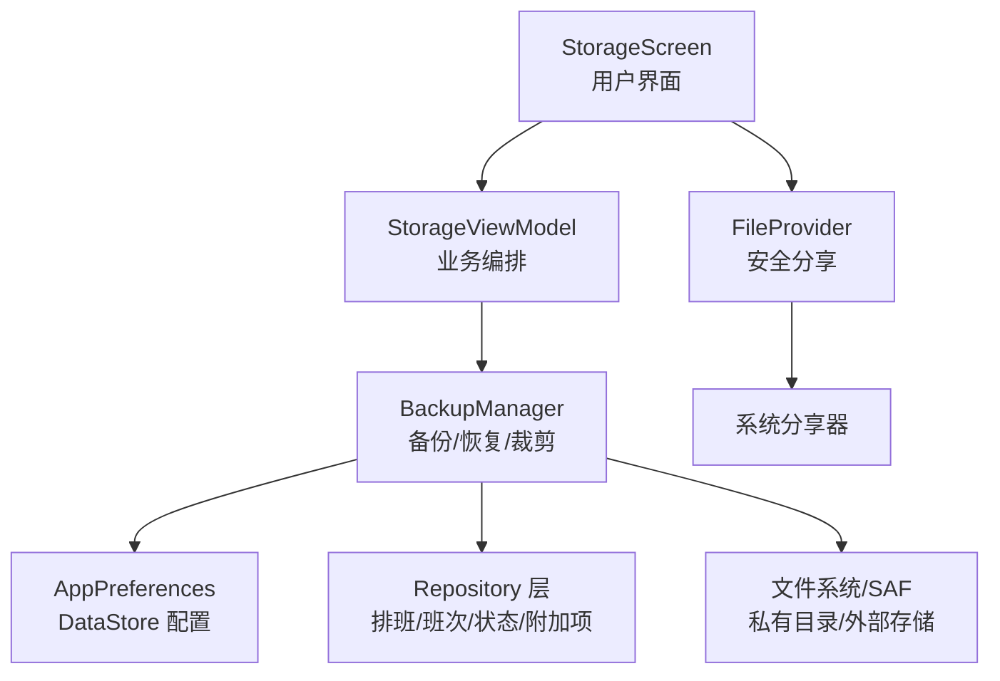
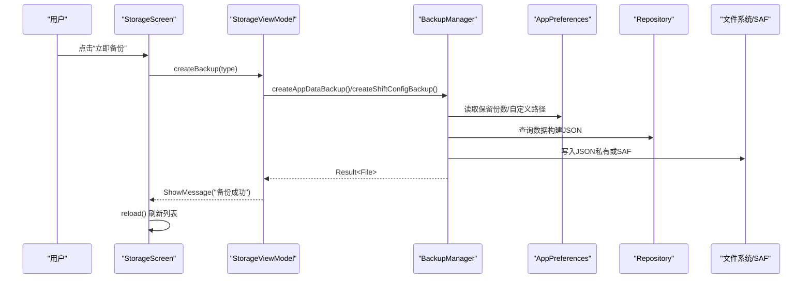
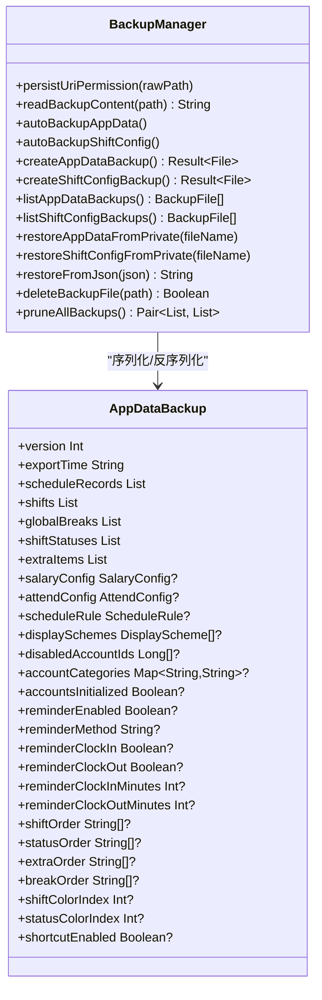
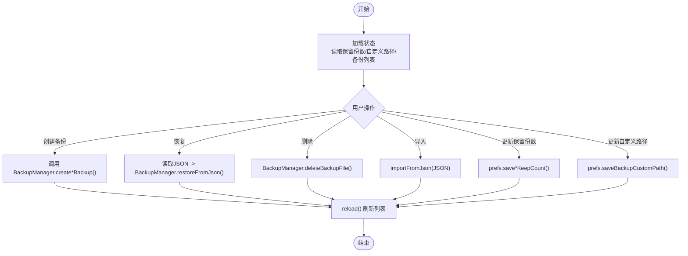
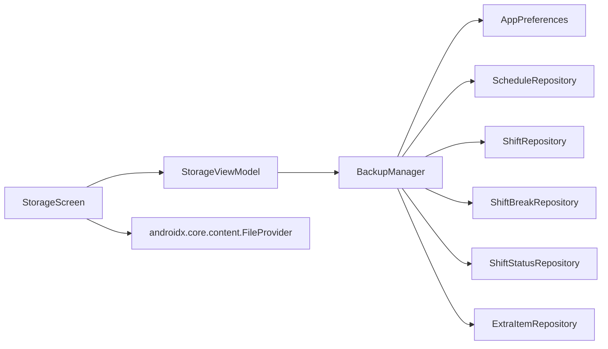

# 文件系统操作

<cite>
**本文引用的文件**   
- [BackupManager.kt](file://app/src/main/java/com/schedulecalendar/app/ui/settings/BackupManager.kt)
- [StorageViewModel.kt](file://app/src/main/java/com/schedulecalendar/app/ui/settings/StorageViewModel.kt)
- [StorageScreen.kt](file://app/src/main/java/com/schedulecalendar/app/ui/settings/StorageScreen.kt)
- [AppPreferences.kt](file://app/src/main/java/com/schedulecalendar/app/data/prefs/AppPreferences.kt)
- [AndroidManifest.xml](file://app/src/main/AndroidManifest.xml)
- [file_paths.xml](file://app/src/main/res/xml/file_paths.xml)
</cite>

## 目录
1. [简介](#简介)
2. [项目结构](#项目结构)
3. [核心组件](#核心组件)
4. [架构总览](#架构总览)
5. [详细组件分析](#详细组件分析)
6. [依赖关系分析](#依赖关系分析)
7. [性能与优化](#性能与优化)
8. [故障排查指南](#故障排查指南)
9. [结论](#结论)
10. [附录：权限、存储与清理最佳实践](#附录权限存储与清理最佳实践)

## 简介
本文件围绕应用的文件系统操作进行系统化说明，重点解析 BackupManager 的备份与恢复流程、数据导入导出机制、文件存储策略（内部与外部）、FileProvider 配置与安全共享、文件格式设计与版本演进、大文件处理与进度反馈、错误恢复方案，以及权限管理、存储空间检查与清理维护的最佳实践。文档以源码为依据，提供可视化图示与可追溯引用，帮助开发者快速理解并扩展该模块。

## 项目结构
与文件系统操作相关的代码主要分布在设置模块与偏好存储层：
- 备份管理器：BackupManager.kt
- 视图模型与UI事件：StorageViewModel.kt
- 界面交互与导入导出入口：StorageScreen.kt
- 偏好配置（保留份数、自定义路径等）：AppPreferences.kt
- 清单与 FileProvider 配置：AndroidManifest.xml、file_paths.xml

图表来源
- [StorageScreen.kt](file://app/src/main/java/com/schedulecalendar/app/ui/settings/StorageScreen.kt)
- [StorageViewModel.kt](file://app/src/main/java/com/schedulecalendar/app/ui/settings/StorageViewModel.kt)
- [BackupManager.kt](file://app/src/main/java/com/schedulecalendar/app/ui/settings/BackupManager.kt)
- [AppPreferences.kt](file://app/src/main/java/com/schedulecalendar/app/data/prefs/AppPreferences.kt)
- [AndroidManifest.xml](file://app/src/main/AndroidManifest.xml)
- [file_paths.xml](file://app/src/main/res/xml/file_paths.xml)

章节来源
- [BackupManager.kt](file://app/src/main/java/com/schedulecalendar/app/ui/settings/BackupManager.kt)
- [StorageViewModel.kt](file://app/src/main/java/com/schedulecalendar/app/ui/settings/StorageViewModel.kt)
- [StorageScreen.kt](file://app/src/main/java/com/schedulecalendar/app/ui/settings/StorageScreen.kt)
- [AppPreferences.kt](file://app/src/main/java/com/schedulecalendar/app/data/prefs/AppPreferences.kt)
- [AndroidManifest.xml](file://app/src/main/AndroidManifest.xml)
- [file_paths.xml](file://app/src/main/res/xml/file_paths.xml)

## 核心组件
- BackupManager：单例，负责应用数据与班次配置的自动/手动备份、恢复、列表合并、裁剪、SAF 读写、路径解析、权限持久化。
- StorageViewModel：编排 UI 操作（创建备份、恢复、删除、导入、更新保留份数、自定义路径），并通过 Channel 发送消息到 UI。
- StorageScreen：Compose 界面，集成 SAF 导入、文件分享、路径选择、确认弹窗、废弃数据扫描与清理。
- AppPreferences：基于 DataStore 的键值配置，包括备份保留份数、自定义路径、提醒与排序等。
- AndroidManifest.xml + file_paths.xml：声明 FileProvider 及可共享路径，确保跨应用分享 JSON 备份的安全。

章节来源
- [BackupManager.kt](file://app/src/main/java/com/schedulecalendar/app/ui/settings/BackupManager.kt)
- [StorageViewModel.kt](file://app/src/main/java/com/schedulecalendar/app/ui/settings/StorageViewModel.kt)
- [StorageScreen.kt](file://app/src/main/java/com/schedulecalendar/app/ui/settings/StorageScreen.kt)
- [AppPreferences.kt](file://app/src/main/java/com/schedulecalendar/app/data/prefs/AppPreferences.kt)
- [AndroidManifest.xml](file://app/src/main/AndroidManifest.xml)
- [file_paths.xml](file://app/src/main/res/xml/file_paths.xml)

## 架构总览
整体采用“界面层 → ViewModel → 备份管理器 → 数据仓库/偏好”的分层架构。备份文件统一为 JSON 格式，支持两种存储目标：
- 内部私有目录：应用私有 filesDir/backups，始终用于恢复读取。
- 外部存储（SAF）：通过 OpenDocumentTree 选择的目录，需持久化 URI 权限；也兼容普通路径字符串。

图表来源
- [StorageScreen.kt](file://app/src/main/java/com/schedulecalendar/app/ui/settings/StorageScreen.kt)
- [StorageViewModel.kt](file://app/src/main/java/com/schedulecalendar/app/ui/settings/StorageViewModel.kt)
- [BackupManager.kt](file://app/src/main/java/com/schedulecalendar/app/ui/settings/BackupManager.kt)
- [AppPreferences.kt](file://app/src/main/java/com/schedulecalendar/app/data/prefs/AppPreferences.kt)

## 详细组件分析

### BackupManager 实现要点
- 备份类型与命名
  - 应用数据：前缀“应用数据_”，文件名包含日期与时间戳，后缀 .json。
  - 班次配置：前缀“班次配置_”，文件名包含时间戳，后缀 .json。
  - 手动备份在文件名中包含 “_manual” 标记，避免被自动裁剪逻辑删除。
- 存储策略
  - 私有目录：context.filesDir/backups，恢复时始终从该目录读取。
  - 外部目录：通过 SAF content:// URI 或旧版 /tree/... 路径，支持解析为真实文件系统路径。
  - 自定义路径为空时回退到私有目录。
- 自动备份策略
  - 应用数据：每天只保留最新一条（按 keepCount=0 禁用）。
  - 班次配置：每次修改保存后生成新备份（按 keepCount=0 禁用）。
  - 写新备份前先清理当天旧自动备份，再执行全局裁剪 pruneAllBackups。
- 恢复流程
  - 从私有目录恢复：restoreAppDataFromPrivate/restoreShiftConfigFromPrivate。
  - 从外部 JSON 内容恢复：restoreFromJson，根据 JSON 字段自动识别类型。
- 列表与裁剪
  - listAppDataBackups/listShiftConfigBackups：合并私有目录与自定义路径，去重后返回。
  - pruneAppDataBackups/pruneShiftConfigBackups：仅裁剪自动备份，保留手动备份。
- SAF 读写与权限
  - persistUriPermission：持久化 content:// URI 的读/写权限。
  - writeSafBackupFile：通过 DocumentFile 创建/覆盖文件，使用 openOutputStream 写入。
  - readBackupContent：兼容 SAF URI 与普通文件路径。
  - deleteBackupFile：兼容 SAF URI 与本地文件删除。
- 数据结构与版本
  - AppDataBackup v2：包含排班记录、班次、不计时段、状态、附加项、薪资/考勤/规则/显示方案、账户分类与初始化标志、提醒设置、排序顺序、颜色索引、快捷方式开关等。
  - ShiftExportData：班次配置导出结构（版本号、shifts、globalBreaks、shiftStatuses、extraItems）。

图表来源
- [BackupManager.kt](file://app/src/main/java/com/schedulecalendar/app/ui/settings/BackupManager.kt)

章节来源
- [BackupManager.kt](file://app/src/main/java/com/schedulecalendar/app/ui/settings/BackupManager.kt)

### StorageViewModel 职责与流程
- 状态管理：StorageUiState 包含备份列表、保留份数、自定义路径、数据库大小、备份大小、可用空间、加载状态、废弃数据扫描结果等。
- 备份操作：createBackup(type) 调用 BackupManager 对应方法，成功后触发 reload() 刷新列表。
- 恢复操作：restoreBackup(file) 读取 JSON 并调用 restoreFromJson，根据类型自动恢复。
- 删除操作：deleteBackup(file) 调用 deleteBackupFile，成功后刷新。
- 导入导出：prepareExportJson 读取备份 JSON 供 UI 层导出；importFromJson 直接导入外部 JSON。
- 路径解析：resolveDisplayPath 将 SAF URI 转换为可读路径用于展示。
- 清空数据：clearAllData 调用各 Repository 与 prefs.clearAll。
- 废弃数据清理：scanOrphanData 与 cleanupOrphanData 基于排班记录引用关系识别并删除已归档且无引用的数据。

图表来源
- [StorageViewModel.kt](file://app/src/main/java/com/schedulecalendar/app/ui/settings/StorageViewModel.kt)

章节来源
- [StorageViewModel.kt](file://app/src/main/java/com/schedulecalendar/app/ui/settings/StorageViewModel.kt)

### StorageScreen 交互与导入导出
- 导入：OpenDocument() 选择 JSON 文件，读取文本后调用 vm.importFromJson。
- 分享：对 SAF URI 直接使用 content:// URI，对本地文件通过 FileProvider.getUriForFile 生成安全 URI，构造 ACTION_SEND Intent 分享。
- 路径选择：OpenDocumentTree() 选择目录，持久化 URI 权限并保存为自定义路径。
- 确认弹窗：恢复、删除、清空数据、清理废弃数据均提供二次确认。
- 废弃数据详情：展开分组显示数量与详情，支持一键清理。

章节来源
- [StorageScreen.kt](file://app/src/main/java/com/schedulecalendar/app/ui/settings/StorageScreen.kt)

### AppPreferences 配置项
- 备份相关：
  - KEY_APP_DATA_KEEP_COUNT：应用数据保留份数（默认 5，0 禁用）。
  - KEY_SHIFT_CONFIG_KEEP_COUNT：班次配置保留份数（默认 10，0 禁用）。
  - KEY_BACKUP_CUSTOM_PATH：自定义备份路径（空表示私有目录）。
- 其他相关：提醒设置、排序顺序、颜色索引、快捷方式开关、账户分类与初始化标志等。

章节来源
- [AppPreferences.kt](file://app/src/main/java/com/schedulecalendar/app/data/prefs/AppPreferences.kt)

### FileProvider 配置与跨应用共享
- 清单中声明 androidx.core.content.FileProvider，authorities 为 ${applicationId}.fileprovider，grantUriPermissions=true。
- file_paths.xml 定义可共享路径：
  - files-path: backups（应用私有目录下的备份文件夹）
  - external-files-path: external_backups（应用外部文件目录下的备份文件夹）
  - cache-path: cache（缓存根目录）
  - root-path: root（根目录，覆盖用户通过 SAF 选择的自定义备份路径）
- StorageScreen 在分享时使用 FileProvider.getUriForFile 生成 URI，确保跨应用安全访问。

章节来源
- [AndroidManifest.xml](file://app/src/main/AndroidManifest.xml)
- [file_paths.xml](file://app/src/main/res/xml/file_paths.xml)
- [StorageScreen.kt](file://app/src/main/java/com/schedulecalendar/app/ui/settings/StorageScreen.kt)

## 依赖关系分析
- StorageScreen 依赖 StorageViewModel 暴露的状态与事件。
- StorageViewModel 依赖 BackupManager 完成实际备份/恢复逻辑，同时依赖 AppPreferences 持久化配置。
- BackupManager 依赖多个 Repository 获取数据构建 JSON，依赖 AppPreferences 读取配置，依赖文件系统/SAF 进行读写。
- FileProvider 由系统提供，配合 file_paths.xml 限制可共享范围。

图表来源
- [StorageScreen.kt](file://app/src/main/java/com/schedulecalendar/app/ui/settings/StorageScreen.kt)
- [StorageViewModel.kt](file://app/src/main/java/com/schedulecalendar/app/ui/settings/StorageViewModel.kt)
- [BackupManager.kt](file://app/src/main/java/com/schedulecalendar/app/ui/settings/BackupManager.kt)
- [AppPreferences.kt](file://app/src/main/java/com/schedulecalendar/app/data/prefs/AppPreferences.kt)
- [AndroidManifest.xml](file://app/src/main/AndroidManifest.xml)
- [file_paths.xml](file://app/src/main/res/xml/file_paths.xml)

章节来源
- [StorageScreen.kt](file://app/src/main/java/com/schedulecalendar/app/ui/settings/StorageScreen.kt)
- [StorageViewModel.kt](file://app/src/main/java/com/schedulecalendar/app/ui/settings/StorageViewModel.kt)
- [BackupManager.kt](file://app/src/main/java/com/schedulecalendar/app/ui/settings/BackupManager.kt)
- [AppPreferences.kt](file://app/src/main/java/com/schedulecalendar/app/data/prefs/AppPreferences.kt)
- [AndroidManifest.xml](file://app/src/main/AndroidManifest.xml)
- [file_paths.xml](file://app/src/main/res/xml/file_paths.xml)

## 性能与优化
- SAF 列表性能：使用 DocumentsContract.query 单次 IPC 列出子文档，避免 DocumentFile 多次 IPC 的性能陷阱。
- 自动备份裁剪：先清理当天旧自动备份，再写入新备份，最后统一裁剪，减少重复扫描与误删。
- 列表合并去重：合并私有目录与自定义路径后按 path 去重，避免重复条目。
- 恢复读取：优先从私有目录恢复，保证一致性；对外部 JSON 导入通过字段识别类型，简化流程。
- 大文件处理：当前备份为 JSON 文本，未启用压缩；如需优化，可在写入前使用 GZIP 压缩，并在读取时解压，注意内存占用与耗时。
- 进度反馈：当前为同步/协程一次性操作，未实现分块进度回调；如需改进，可在写入流中分段读取/写入并上报进度。
- 传输协议：分享使用系统 ACTION_SEND 与 application/json MIME，无需自定义协议。

[本节为通用指导，不直接分析具体文件]

## 故障排查指南
- 无法读取备份文件（SAF）：检查是否已持久化 URI 权限；确认 contentResolver.openInputStream 是否返回非空。
- 无法写入备份文件（SAF）：确认 DocumentFile.fromTreeUri 是否成功；openOutputStream 是否成功打开；MIME 类型是否为 application/json。
- 恢复失败（JSON 解析异常）：检查 JSON 结构是否符合 AppDataBackup/ShiftExportData 版本要求；必要时降级兼容旧版本。
- 删除失败（SAF）：确认 DocumentFile.fromSingleUri 是否有效；权限是否仍有效。
- 路径解析异常：content:// URI 或 /tree/... 格式解码失败时回退原始路径；检查 URLDecoder 编码是否正确。
- 存储空间不足：StorageViewModel 在加载时计算 freeSpaceBytes，UI 应提示用户清理空间后再操作。

章节来源
- [BackupManager.kt](file://app/src/main/java/com/schedulecalendar/app/ui/settings/BackupManager.kt)
- [StorageViewModel.kt](file://app/src/main/java/com/schedulecalendar/app/ui/settings/StorageViewModel.kt)
- [StorageScreen.kt](file://app/src/main/java/com/schedulecalendar/app/ui/settings/StorageScreen.kt)

## 结论
该文件系统操作模块以 BackupManager 为核心，结合 StorageViewModel 与 StorageScreen 实现了完整的备份、恢复、导入导出与清理功能。通过 SAF 与 FileProvider 的组合，既保证了跨应用共享的安全性，又提供了灵活的存储策略。建议后续引入压缩与进度反馈以提升大文件体验，并完善错误恢复与重试机制。

[本节为总结性内容，不直接分析具体文件]

## 附录：权限、存储与清理最佳实践
- 权限管理
  - 使用 SAF 时务必调用 persistUriPermission 持久化 URI 权限，确保重启后可用。
  - 分享文件时使用 FileProvider，限定可共享路径，避免泄露敏感数据。
- 存储空间检查
  - 在备份/导入前检查 freeSpaceBytes，不足时提示用户清理。
  - 定期统计数据库与备份大小，引导用户清理冗余备份。
- 清理维护
  - 利用 pruneAllBackups 统一裁剪自动备份，保留手动备份。
  - 扫描并清理已归档且无引用的废弃数据，释放数据库空间。
  - 提供“清空所有数据”危险操作的二次确认，防止误删。

[本节为通用指导，不直接分析具体文件]