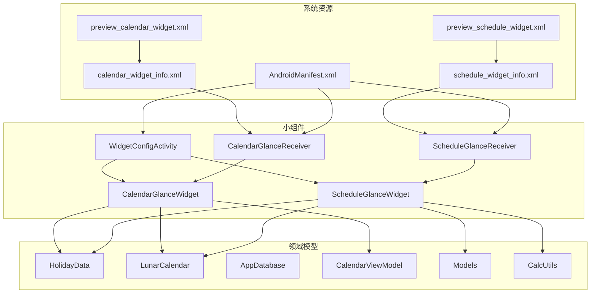
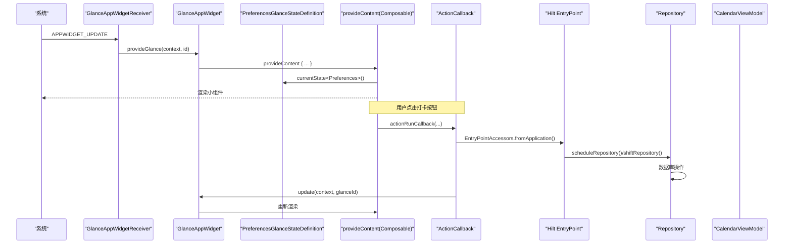
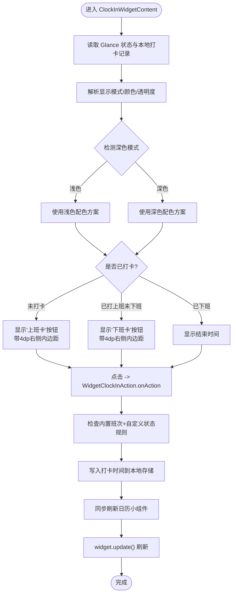
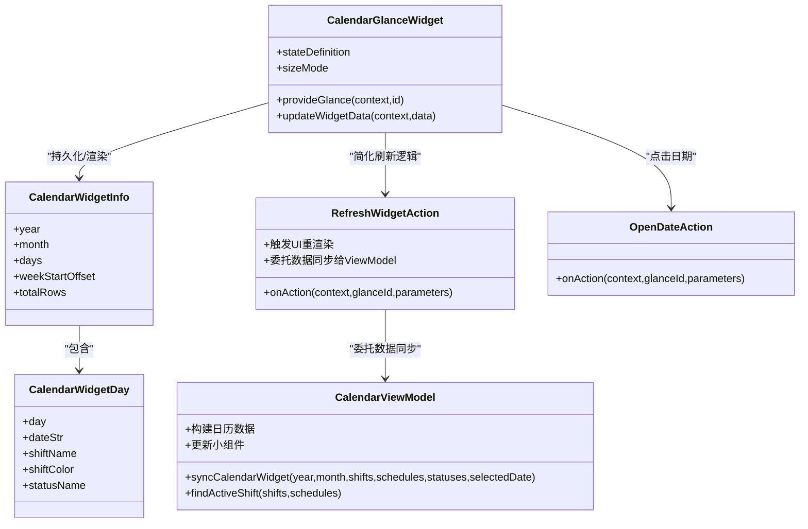
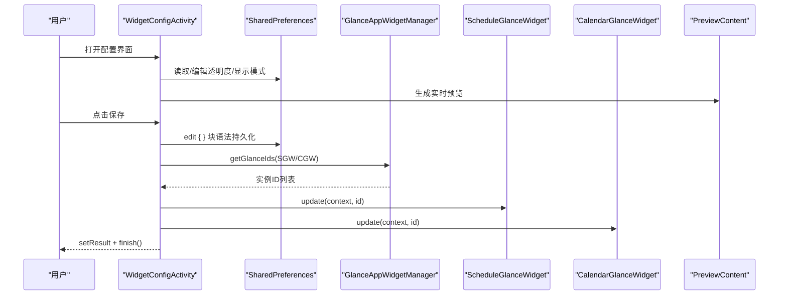
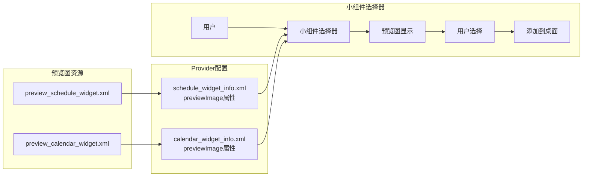
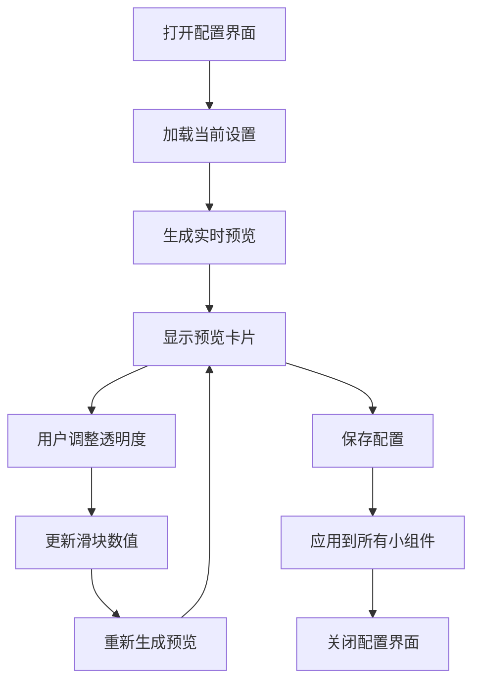
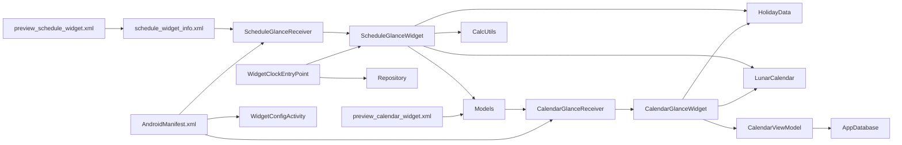

# 桌面小组件

<cite>
**本文引用的文件**   
- [ScheduleGlanceWidget.kt](file://app/src/main/java/com/schedulecalendar/app/widget/ScheduleGlanceWidget.kt)
- [CalendarGlanceWidget.kt](file://app/src/main/java/com/schedulecalendar/app/widget/CalendarGlanceWidget.kt)
- [ScheduleGlanceReceiver.kt](file://app/src/main/java/com/schedulecalendar/app/widget/ScheduleGlanceReceiver.kt)
- [CalendarGlanceReceiver.kt](file://app/src/main/java/com/schedulecalendar/app/widget/CalendarGlanceReceiver.kt)
- [WidgetConfigActivity.kt](file://app/src/main/java/com/schedulecalendar/app/widget/WidgetConfigActivity.kt)
- [CalendarViewModel.kt](file://app/src/main/java/com/schedulecalendar/app/ui/calendar/CalendarViewModel.kt)
- [Models.kt](file://app/src/main/java/com/schedulecalendar/app/domain/model/Models.kt)
- [CalcUtils.kt](file://app/src/main/java/com/schedulecalendar/app/domain/model/CalcUtils.kt)
- [HolidayData.kt](file://app/src/main/java/com/schedulecalendar/app/domain/model/HolidayData.kt)
- [LunarCalendar.kt](file://app/src/main/java/com/schedulecalendar/app/domain/model/LunarCalendar.kt)
- [schedule_widget_info.xml](file://app/src/main/res/xml/schedule_widget_info.xml)
- [calendar_widget_info.xml](file://app/src/main/res/xml/calendar_widget_info.xml)
- [preview_schedule_widget.xml](file://app/src/main/res/drawable/preview_schedule_widget.xml)
- [preview_calendar_widget.xml](file://app/src/main/res/drawable/preview_calendar_widget.xml)
- [AndroidManifest.xml](file://app/src/main/AndroidManifest.xml)
- [build.gradle.kts](file://app/build.gradle.kts)
</cite>

## 更新摘要
**变更内容**   
- **增强打卡功能**：实现智能活跃班次判定、4种显示规则、跨天夜班处理和Hilt EntryPoint集成
- **优化UI布局**：为打卡按钮添加end = 4.dp内边距，改善视觉间距和触摸可访问性
- **独立动作处理器**：拆分ClockInAction为WidgetClockInAction和WidgetClockOutAction
- **现代化语法**：使用DataStore偏好编辑块语法，提升代码可读性
- **跨小组件同步**：打卡操作自动刷新日历小组件，确保数据一致性

## 目录
1. [简介](#简介)
2. [项目结构](#项目结构)
3. [核心组件](#核心组件)
4. [架构总览](#架构总览)
5. [详细组件分析](#详细组件分析)
6. [依赖关系分析](#依赖关系分析)
7. [性能与优化](#性能与优化)
8. [故障排查指南](#故障排查指南)
9. [结论](#结论)
10. [附录](#附录)

## 简介
本文件面向基于 Glance 框架的 Android 桌面小组件开发，聚焦以下两个组件的实现与最佳实践：
- **ScheduleGlanceWidget（快捷打卡小组件）**：2x1 尺寸，提供一键打卡入口，展示当天班次、实际打卡时间、明天班次或法定节假日倒计时，支持智能活跃班次判定和复杂按钮显示规则。
- **CalendarGlanceWidget（日历网格小组件）**：3x3 尺寸，展示当月日期、班次、状态、农历/节日信息，支持点击跳转详情与手动刷新。

文档涵盖：
- Glance 组件生命周期管理、状态定义与更新机制（PreferencesGlanceStateDefinition）
- Compose UI 布局与响应式渲染
- 数据绑定与持久化存储（Preferences + JSON 序列化）
- ActionCallback 实现用户交互（打卡、打开应用、跳转日期、刷新）
- Hilt EntryPoint 系统集成，允许小组件访问 Repository
- 配置界面（统一背景色、独立透明度设置、显示模式等）
- **ColorProvider 标准化实现与深色模式适配**
- **响应式设计优化与数据库集成刷新**
- **小组件预览图功能与用户体验增强**
- **优化的数据同步架构与农历显示逻辑修复**
- **更新的打卡按钮UI设计与透明度控制逻辑**
- **新增的配置界面预览功能**
- **修复的周日开始偏移计算算法**
- **现代化 DataStore 偏好编辑语法与警告处理**
- **智能活跃班次判定与复杂按钮显示规则**
- **独立动作处理器实现**
- **优化的打卡按钮UI布局设计**
- 性能优化技巧与常见问题排查

## 项目结构
小组件相关代码集中在 widget 包，配合 domain 层节假日/农历工具类以及资源中的 provider 描述、预览图和清单注册。

图表来源
- [ScheduleGlanceReceiver.kt:1-14](file://app/src/main/java/com/schedulecalendar/app/widget/ScheduleGlanceReceiver.kt#L1-L14)
- [CalendarGlanceReceiver.kt:1-14](file://app/src/main/java/com/schedulecalendar/app/widget/CalendarGlanceReceiver.kt#L1-L14)
- [ScheduleGlanceWidget.kt:1-633](file://app/src/main/java/com/schedulecalendar/app/widget/ScheduleGlanceWidget.kt#L1-L633)
- [CalendarGlanceWidget.kt:1-307](file://app/src/main/java/com/schedulecalendar/app/widget/CalendarGlanceWidget.kt#L1-L307)
- [WidgetConfigActivity.kt:1-400](file://app/src/main/java/com/schedulecalendar/app/widget/WidgetConfigActivity.kt#L1-L400)
- [CalendarViewModel.kt:105-1062](file://app/src/main/java/com/schedulecalendar/app/ui/calendar/CalendarViewModel.kt#L105-L1062)
- [HolidayData.kt:1-636](file://app/src/main/java/com/schedulecalendar/app/domain/model/HolidayData.kt#L1-L636)
- [LunarCalendar.kt:1-418](file://app/src/main/java/com/schedulecalendar/app/domain/model/LunarCalendar.kt#L1-L418)
- [Models.kt:1-277](file://app/src/main/java/com/schedulecalendar/app/domain/model/Models.kt#L1-L277)
- [CalcUtils.kt:1-566](file://app/src/main/java/com/schedulecalendar/app/domain/model/CalcUtils.kt#L1-L566)
- [schedule_widget_info.xml:1-17](file://app/src/main/res/xml/schedule_widget_info.xml#L1-L17)
- [calendar_widget_info.xml:1-19](file://app/src/main/res/xml/calendar_widget_info.xml#L1-L19)
- [preview_schedule_widget.xml:1-31](file://app/src/main/res/drawable/preview_schedule_widget.xml#L1-L31)
- [preview_calendar_widget.xml:1-64](file://app/src/main/res/drawable/preview_calendar_widget.xml#L1-L64)
- [AndroidManifest.xml:58-92](file://app/src/main/AndroidManifest.xml#L58-L92)

章节来源
- [AndroidManifest.xml:58-92](file://app/src/main/AndroidManifest.xml#L58-L92)
- [schedule_widget_info.xml:1-17](file://app/src/main/res/xml/schedule_widget_info.xml#L1-L17)
- [calendar_widget_info.xml:1-19](file://app/src/main/res/xml/calendar_widget_info.xml#L1-L19)

## 核心组件
- **ScheduleGlanceWidget（快捷打卡）**：提供 2x1 打卡入口与班次信息；使用 PreferencesGlanceStateDefinition 持久化当前打卡数据；通过 Hilt EntryPoint 访问 Repository；ActionCallback 处理"上班/下班"打卡与打开应用。
- **CalendarGlanceWidget（日历网格）**：提供 3x3 日历视图；通过 GlanceAppWidgetManager 批量更新所有实例；ActionCallback 支持点击日期跳转主页面与手动刷新。
- **WidgetConfigActivity**：统一配置界面，保存独立透明度、显示模式等偏好，并在保存后触发各小组件刷新。
- **CalendarViewModel.syncCalendarWidget**：集中处理日历小组件的数据同步逻辑，包含智能活跃班次判定和复杂按钮显示规则。

章节来源
- [ScheduleGlanceWidget.kt:85-111](file://app/src/main/java/com/schedulecalendar/app/widget/ScheduleGlanceWidget.kt#L85-L111)
- [CalendarGlanceWidget.kt:54-73](file://app/src/main/java/com/schedulecalendar/app/widget/CalendarGlanceWidget.kt#L54-L73)
- [WidgetConfigActivity.kt:91-113](file://app/src/main/java/com/schedulecalendar/app/widget/WidgetConfigActivity.kt#L91-L113)
- [CalendarViewModel.kt:955-1062](file://app/src/main/java/com/schedulecalendar/app/ui/calendar/CalendarViewModel.kt#L955-L1062)

## 架构总览
整体采用 Glance Compose-first 架构，以 Receiver 作为入口，Widget 负责 UI 与状态，ActionCallback 处理交互，配置 Activity 负责样式与行为设置。通过 Hilt EntryPoint 系统，小组件可以安全地访问应用依赖注入的 Repository。

图表来源
- [ScheduleGlanceReceiver.kt:1-14](file://app/src/main/java/com/schedulecalendar/app/widget/ScheduleGlanceReceiver.kt#L1-L14)
- [CalendarGlanceReceiver.kt:1-14](file://app/src/main/java/com/schedulecalendar/app/widget/CalendarGlanceReceiver.kt#L1-L14)
- [ScheduleGlanceWidget.kt:89-91](file://app/src/main/java/com/schedulecalendar/app/widget/ScheduleGlanceWidget.kt#L89-L91)
- [CalendarGlanceWidget.kt:57-59](file://app/src/main/java/com/schedulecalendar/app/widget/CalendarGlanceWidget.kt#L57-L59)
- [ScheduleGlanceWidget.kt:115-194](file://app/src/main/java/com/schedulecalendar/app/widget/ScheduleGlanceWidget.kt#L115-L194)
- [CalendarGlanceWidget.kt:87-97](file://app/src/main/java/com/schedulecalendar/app/widget/CalendarGlanceWidget.kt#L87-L97)
- [CalendarViewModel.kt:955-1062](file://app/src/main/java/com/schedulecalendar/app/ui/calendar/CalendarViewModel.kt#L955-L1062)

## 详细组件分析

### ScheduleGlanceWidget（快捷打卡小组件）
- **生命周期与状态**
  - 继承 GlanceAppWidget，声明 stateDefinition 为 PreferencesGlanceStateDefinition，使小组件状态持久化到 SharedPreferences。
  - provideGlance 中调用 provideContent 返回 Composable 内容。
- **数据模型与持久化**
  - **ClockInWidgetData 数据模型**：包含班次信息、打卡时间、按钮显示规则控制字段等完整数据结构。
  - 使用 Gson 将 ClockInWidgetData 序列化为字符串，保存到 PreferencesGlanceStateDefinition 对应键。
  - 打卡时间（当日打卡/下班时间）保存在独立 SharedPreferences 中，按天区分。
- **Hilt EntryPoint 系统集成**
  - **WidgetClockEntryPoint**：通过 @EntryPoint 和 @InstallIn(SingletonComponent::class) 注解暴露 Repository 访问接口。
  - 在 ActionCallback 中使用 EntryPointAccessors.fromApplication() 获取 Repository 实例。
  - 支持访问 ScheduleRepository、ShiftRepository、ShiftStatusRepository。
- **智能活跃班次判定**
  - **findActiveShift 方法**：实现复杂的活跃班次判断逻辑，支持今天优先、昨天跨午夜夜班处理。
  - **时间窗口判断**：根据当前时间与班次时间的关系，动态决定显示上班卡还是下班卡。
  - **跨午夜支持**：正确处理夜班场景，确保下班打卡的正确性。
- **复杂按钮显示规则**
  - **规则1**：内置班次且无自定义附加状态 → 不显示打卡按钮
  - **规则2/3**：普通班次 → 根据打卡进度显示相应按钮
  - **规则4**：内置班次 + 自定义附加状态 → 显示打卡按钮，已下班后隐藏全部按钮
- **现代化 DataStore 偏好编辑语法**
  - **更新** 使用更简洁的 `prefs.edit { }` 块语法进行 SharedPreferences 操作，替代传统的 `edit().apply()` 模式
  - 在 WidgetClockInAction.onAction 和 WidgetClockOutAction.onAction 方法中使用 `prefs.edit { putString(...); remove(...) }` 语法
  - 减少了嵌套层级，使偏好编辑逻辑更加清晰直观
- **UI 布局与设计规范**
  - **统一背景色**：使用白色背景 (#FFFFFFFF)，支持透明度调节
  - **圆角设计**：12dp 圆角，提升视觉柔和度
  - **响应式布局**：左侧显示当天班次名称、上下班时间（已打卡则显示实际时间）、第二行根据显示模式展示"明天班次"或"法定节假日倒计时"
  - **优化后的按钮设计**：右侧方形打卡按钮（40x36dp），10dp 圆角，采用单行标签"上班卡"/"下班卡"，根据状态切换颜色
  - **增强的按钮间距**：**新增** 为打卡按钮添加了 end = 4.dp 的内边距，改善了视觉间距和触摸目标的可访问性
  - **文本优化**：标题15sp、时间12sp、次要信息10sp，确保可读性
- **LocalContextConfigurationRead 警告处理**
  - **更新** 在 ClockInWidgetContent Composable 函数上添加 `@Suppress("LocalContextConfigurationRead")` 注解
  - 正确处理深色模式检测时的上下文读取警告，避免编译警告干扰
- **ColorProvider 标准化实现**
  - 使用 hexToWidgetColor 函数进行统一的十六进制颜色解析
  - 支持完整的 ARGB 格式颜色解析，包含 Alpha 通道处理
  - 深色模式下自动调整颜色亮度，提供更好的对比度
- **深色模式适配**
  - 自动检测系统深色模式，动态调整文字和背景颜色
  - 深色模式下使用更亮的文字颜色 (#FFE0E0E0) 和半透明背景
- **独立动作处理器**
  - **WidgetClockInAction**：处理上班打卡逻辑，支持内置班次+自定义状态的特殊处理
  - **WidgetClockOutAction**：处理下班打卡逻辑，包含早退时段的自动填充
  - **OpenAppAction**：启动应用
- **配置项读取**
  - 从共享偏好读取显示模式、文本颜色、背景色与透明度，用于动态渲染。
  - **独立透明度控制**：使用 KEY_CFG_SCHEDULE_BG_TRANSPARENCY 键值进行独立透明度设置。

**更新** 打卡按钮UI已从多行"上班\n打卡"改为单行"上班卡"，提供更简洁的视觉效果。同时优化了按钮尺寸从40x40dp调整为40x36dp，提升了整体布局协调性。**最新优化** 为打卡按钮添加了 end = 4.dp 的内边距，进一步改善了视觉间距和触摸目标的可访问性。

图表来源
- [ScheduleGlanceWidget.kt:369-591](file://app/src/main/java/com/schedulecalendar/app/widget/ScheduleGlanceWidget.kt#L369-L591)
- [ScheduleGlanceWidget.kt:115-194](file://app/src/main/java/com/schedulecalendar/app/widget/ScheduleGlanceWidget.kt#L115-L194)
- [ScheduleGlanceWidget.kt:218-316](file://app/src/main/java/com/schedulecalendar/app/widget/ScheduleGlanceWidget.kt#L218-L316)

章节来源
- [ScheduleGlanceWidget.kt:85-111](file://app/src/main/java/com/schedulecalendar/app/widget/ScheduleGlanceWidget.kt#L85-L111)
- [ScheduleGlanceWidget.kt:369-591](file://app/src/main/java/com/schedulecalendar/app/widget/ScheduleGlanceWidget.kt#L369-L591)
- [ScheduleGlanceWidget.kt:115-194](file://app/src/main/java/com/schedulecalendar/app/widget/ScheduleGlanceWidget.kt#L115-L194)
- [schedule_widget_info.xml:1-17](file://app/src/main/res/xml/schedule_widget_info.xml#L1-L17)

### CalendarGlanceWidget（日历网格）
- **生命周期与尺寸**
  - 声明 sizeMode 为 Exact，固定 3x3 尺寸；provideGlance 返回 Composable 内容。
- **数据模型与持久化**
  - CalendarWidgetInfo 包含年月、日期列表、周起始偏移与行数；通过 PreferencesGlanceStateDefinition 持久化。
  - 提供 updateWidgetData 方法，遍历所有实例并逐个更新状态与渲染。
- **UI 布局与设计规范**
  - **统一背景色**：使用白色背景 (#FFFFFFFF)，支持透明度调节
  - **圆角设计**：16dp 圆角，比排班小组件更圆润
  - **响应式布局**：顶部显示年月与刷新按钮；中间为星期标签；下方循环渲染 5 行 x 7 列单元格
  - **文本尺寸优化**：根据 LocalSize 动态调整字体大小（大尺寸：15sp/12sp/9sp/8sp/7sp，小尺寸：13sp/10sp/8sp/7sp/6sp）
  - **单元格设计**：日期数字、法定假日标记、农历/节气/节日（大尺寸时）、班次名与状态
- **优化的数据同步机制**
  - **重构后的刷新机制**：移除了复杂的数据库操作逻辑，简化了数据同步流程
  - **委托给 ViewModel**：数据同步逻辑完全委托给 CalendarViewModel.syncCalendarWidget 方法
  - **简化的 RefreshWidgetAction**：仅负责触发 UI 重渲染，从 Glance DataStore 状态中重新加载已有数据
  - **一致的数据源**：确保小组件数据与应用主界面的数据源保持一致
- **LocalContextConfigurationRead 警告处理**
  - **更新** 在 CalendarWidgetContent Composable 函数上添加 `@Suppress("LocalContextConfigurationRead")` 注解
  - 正确处理深色模式检测时的上下文读取警告，保持代码整洁
- **ColorProvider 标准化实现**
  - 使用统一的 hexToWidgetColor 函数进行颜色解析
  - 支持完整的 ARGB 格式和 Alpha 通道处理
  - 深色模式下自动调整颜色方案
- **深色模式适配**
  - 自动检测系统深色模式，动态调整所有颜色元素
  - 深色模式下使用更亮的文字颜色和优化的对比度
- **修复的农历显示逻辑**
  - **条件判断优化**：农历信息显示需要满足物理高度足够 AND (月份行数≤4 OR 每行高度≥50dp) 的条件
  - **防裁切保护**：确保3行小组件不显示农历信息（防止裁切），4行小组件始终显示（空间充裕）
  - **计算逻辑改进**：通过 `heightPerRow = (ws.height - 34.dp) / data.totalRows.coerceAtLeast(1)` 精确计算每行高度
  - **显示优先级**：法定节假日 > 其他节日 > 农历日期，确保重要信息优先显示
- **交互逻辑**
  - OpenDateAction：点击单元格携带日期参数跳转到 MainActivity。
  - RefreshWidgetAction：触发 UI 重渲染，数据同步由 CalendarViewModel 负责。
- **独立透明度控制**：使用 KEY_CFG_CALENDAR_BG_TRANSPARENCY 键值进行独立透明度设置。

**更新** 修复了周日开始偏移计算算法，现在使用 `(LocalDate.of(year, month, 1).dayOfWeek.value + 6) % 7` 来正确计算周一开始的偏移量，确保日历显示准确。

图表来源
- [CalendarGlanceWidget.kt:54-73](file://app/src/main/java/com/schedulecalendar/app/widget/CalendarGlanceWidget.kt#L54-L73)
- [CalendarGlanceWidget.kt:41-50](file://app/src/main/java/com/schedulecalendar/app/widget/CalendarGlanceWidget.kt#L41-L50)
- [CalendarGlanceWidget.kt:99-206](file://app/src/main/java/com/schedulecalendar/app/widget/CalendarGlanceWidget.kt#L99-L206)
- [CalendarViewModel.kt:904-953](file://app/src/main/java/com/schedulecalendar/app/ui/calendar/CalendarViewModel.kt#L904-L953)

章节来源
- [CalendarGlanceWidget.kt:54-73](file://app/src/main/java/com/schedulecalendar/app/widget/CalendarGlanceWidget.kt#L54-L73)
- [CalendarGlanceWidget.kt:208-294](file://app/src/main/java/com/schedulecalendar/app/widget/CalendarGlanceWidget.kt#L208-294)
- [calendar_widget_info.xml:1-19](file://app/src/main/res/xml/calendar_widget_info.xml#L1-L19)
- [CalendarViewModel.kt:904-953](file://app/src/main/java/com/schedulecalendar/app/ui/calendar/CalendarViewModel.kt#L904-L953)

### 配置界面（WidgetConfigActivity）
- **功能**
  - 支持从设置页或桌面长按添加时进入；根据传入类型决定显示模式选项。
  - **统一背景色设置**：硬编码为白色 (#FFFFFFFF)，不再支持自定义背景色
  - **独立透明度控制**：分别为日历和排班小组件提供独立的透明度设置键值
  - 保存显示模式到共享偏好；保存后同步刷新所有小组件实例。
- **关键流程**
  - finishConfig 中使用 runBlocking 确保在 setResult 前完成异步 IO 与刷新操作，避免被系统回收导致丢失。
- **现代化 DataStore 偏好编辑语法**
  - **更新** 在保存配置时使用 `prefs.edit { }` 块语法，提升代码可读性和一致性
  - 使用 `putString(KEY_CFG_TEXT_COLOR, "#FF333333")` 等简洁语法替代传统模式
  - 减少了嵌套层级，使配置保存逻辑更加清晰
- **配置项常量定义**
  - KEY_CFG_TEXT_COLOR：文本颜色（固定为 #FF333333）
  - KEY_CFG_BG_COLOR：背景颜色（固定为 #FFFFFFFF）
  - KEY_CFG_BG_TRANSPARENCY：通用透明度（兼容旧版本）
  - KEY_CFG_CALENDAR_BG_TRANSPARENCY：日历小组件独立透明度
  - KEY_CFG_SCHEDULE_BG_TRANSPARENCY：排班小组件独立透明度

**更新** 新增了 PreviewContent 预览功能，在配置界面中实时展示当前设置的视觉效果。透明度控制采用0-100%刻度系统，0%表示完全不透明，100%表示完全透明。

图表来源
- [WidgetConfigActivity.kt:91-113](file://app/src/main/java/com/schedulecalendar/app/widget/WidgetConfigActivity.kt#L91-L113)
- [WidgetConfigActivity.kt:118-324](file://app/src/main/java/com/schedulecalendar/app/widget/WidgetConfigActivity.kt#L118-324)
- [WidgetConfigActivity.kt:326-399](file://app/src/main/java/com/schedulecalendar/app/widget/WidgetConfigActivity.kt#L326-399)

章节来源
- [WidgetConfigActivity.kt:55-113](file://app/src/main/java/com/schedulecalendar/app/widget/WidgetConfigActivity.kt#L55-L113)
- [WidgetConfigActivity.kt:118-324](file://app/src/main/java/com/schedulecalendar/app/widget/WidgetConfigActivity.kt#L118-324)
- [WidgetConfigActivity.kt:326-399](file://app/src/main/java/com/schedulecalendar/app/widget/WidgetConfigActivity.kt#L326-L399)

### ColorProvider 标准化实现
- **统一颜色解析函数**：hexToWidgetColor 函数提供标准化的十六进制颜色解析
- **深色模式适配**：自动检测系统深色模式，提供相应的颜色方案
- **Alpha 通道支持**：支持完整的 ARGB 格式颜色解析
- **容错处理**：当颜色格式错误时使用预定义的 fallback 颜色
- **透明度叠加**：支持将解析后的颜色与透明度进行组合

**Section sources**
- [ScheduleGlanceWidget.kt:607-616](file://app/src/main/java/com/schedulecalendar/app/widget/ScheduleGlanceWidget.kt#L607-L616)
- [CalendarGlanceWidget.kt:297-306](file://app/src/main/java/com/schedulecalendar/app/widget/CalendarGlanceWidget.kt#L297-L306)

### 领域模型与工具（节假日/农历）
- **HolidayData**
  - 内置 2024-2030 年法定节假日与调休补班数据，提供判断节假日、获取节假日名称、计算下一个法定节假日倒计时等方法。
- **LunarCalendar**
  - 基于 tyme4j 库进行公历转农历，提供农历日文本、干支、五行、星宿、时辰吉凶等能力；日历小组件在大尺寸模式下展示农历/节日信息。
- **Models.kt 新增内置常量**
  - **BUILTIN_STATUS_LEAVE**：请假状态标识
  - **BUILTIN_STATUS_SWAP**：调休状态标识
  - **BUILTIN_SHIFT_REST**：休息班次标识
  - **BUILTIN_SHIFT_SWAP**：调休班次标识
  - **AppliedStatus**：支持时间段选择的附加状态模型
- **CalcUtils 工具类**
  - 提供时间转换、工时计算、考勤规则处理等核心业务逻辑
  - 支持跨午夜时间处理、时间范围归一化、加班时长计算等功能

章节来源
- [HolidayData.kt:1-636](file://app/src/main/java/com/schedulecalendar/app/domain/model/HolidayData.kt#L1-L636)
- [LunarCalendar.kt:1-418](file://app/src/main/java/com/schedulecalendar/app/domain/model/LunarCalendar.kt#L1-L418)
- [Models.kt:1-277](file://app/src/main/java/com/schedulecalendar/app/domain/model/Models.kt#L1-L277)
- [CalcUtils.kt:1-566](file://app/src/main/java/com/schedulecalendar/app/domain/model/CalcUtils.kt#L1-L566)

### 小组件预览图功能

**新增** 为提升用户在小组件选择器中的体验，项目为日历和排班小组件添加了可视化预览图功能。

- **预览图设计**
  - **日历小组件预览图**：模拟 3x3 日历网格外观，包含背景、标题栏、星期标签、网格区域和今日高亮显示
  - **排班小组件预览图**：模拟 2x1 卡片外观，包含左侧文字区域和右侧打卡按钮
- **技术实现**
  - 使用 XML LayerList 绘制小组件的静态预览效果
  - 在 provider 配置文件中通过 `android:previewImage` 属性引用预览图
  - 预览图展示了小组件在桌面上的实际外观，帮助用户做出更好的选择
- **用户体验增强**
  - 用户在添加小组件时可以看到实际的视觉效果
  - 减少了用户试错成本，提升了选择效率
  - 提供了直观的视觉反馈，增强了应用的现代化体验

图表来源
- [preview_schedule_widget.xml:1-31](file://app/src/main/res/drawable/preview_schedule_widget.xml#L1-L31)
- [preview_calendar_widget.xml:1-64](file://app/src/main/res/drawable/preview_calendar_widget.xml#L1-L64)
- [schedule_widget_info.xml:16](file://app/src/main/res/xml/schedule_widget_info.xml#L16)
- [calendar_widget_info.xml:18](file://app/src/main/res/xml/calendar_widget_info.xml#L18)

**Section sources**
- [preview_schedule_widget.xml:1-31](file://app/src/main/res/drawable/preview_schedule_widget.xml#L1-L31)
- [preview_calendar_widget.xml:1-64](file://app/src/main/res/drawable/preview_calendar_widget.xml#L1-L64)
- [schedule_widget_info.xml:16](file://app/src/main/res/xml/schedule_widget_info.xml#L16)
- [calendar_widget_info.xml:18](file://app/src/main/res/xml/calendar_widget_info.xml#L18)

### 配置界面预览功能

**新增** 在配置界面中添加了实时预览功能，让用户能够直观地看到当前设置的效果。

- **PreviewContent 组件**
  - 根据小组件类型（日历/排班）显示不同的预览内容
  - 实时更新预览效果，反映透明度、颜色等设置变化
  - 提供准确的视觉反馈，帮助用户理解配置选项的影响
- **透明度滑块改进**
  - 采用0-100%刻度系统，0%表示完全不透明，100%表示完全透明
  - 滑块显示当前透明度百分比，提供清晰的数值反馈
  - 渐变条直观展示从完全不透明到完全透明的过渡效果
- **用户体验优化**
  - 减少用户猜测配置效果的认知负担
  - 提高配置效率，降低学习成本
  - 增强用户对界面定制能力的掌控感

图表来源
- [WidgetConfigActivity.kt:118-324](file://app/src/main/java/com/schedulecalendar/app/widget/WidgetConfigActivity.kt#L118-324)
- [WidgetConfigActivity.kt:326-399](file://app/src/main/java/com/schedulecalendar/app/widget/WidgetConfigActivity.kt#L326-399)

**Section sources**
- [WidgetConfigActivity.kt:118-324](file://app/src/main/java/com/schedulecalendar/app/widget/WidgetConfigActivity.kt#L118-324)
- [WidgetConfigActivity.kt:326-399](file://app/src/main/java/com/schedulecalendar/app/widget/WidgetConfigActivity.kt#L326-L399)

## 依赖关系分析
- **组件与接收器**
  - ScheduleGlanceReceiver 指向 ScheduleGlanceWidget；CalendarGlanceReceiver 指向 CalendarGlanceWidget。
- **组件与状态**
  - 两者均使用 PreferencesGlanceStateDefinition 进行状态持久化，并通过 GlanceAppWidgetManager 批量更新。
- **组件与领域模型**
  - 两个组件都依赖 HolidayData 与 LunarCalendar 生成节假日/农历信息。
  - **新增 Models.kt 依赖**：ClockInWidgetWidget 依赖内置状态常量和 AppliedStatus 模型。
  - **CalcUtils 工具依赖**：时间转换、工时计算、考勤规则处理等核心业务逻辑。
- **Hilt EntryPoint 集成**
  - **WidgetClockEntryPoint**：通过 Hilt 注解暴露 Repository 访问接口，允许小组件直接访问数据库层。
  - 支持 ScheduleRepository、ShiftRepository、ShiftStatusRepository 的访问。
- **优化的数据流**
  - CalendarGlanceWidget 现在通过 CalendarViewModel.syncCalendarWidget 方法间接访问数据库，简化了直接依赖
  - 数据同步逻辑集中在 ViewModel 中，提高了代码的可维护性和测试性
- **清单与资源**
  - AndroidManifest.xml 注册两个 Receiver 与配置 Activity；xml/provider 文件定义尺寸、更新周期与可重配置特性。
  - **新增预览图资源**：drawable 目录下的预览图文件通过 provider 配置文件引用。

图表来源
- [AndroidManifest.xml:58-92](file://app/src/main/AndroidManifest.xml#L58-L92)
- [schedule_widget_info.xml:1-17](file://app/src/main/res/xml/schedule_widget_info.xml#L1-L17)
- [calendar_widget_info.xml:1-19](file://app/src/main/res/xml/calendar_widget_info.xml#L1-L19)
- [ScheduleGlanceReceiver.kt:1-14](file://app/src/main/java/com/schedulecalendar/app/widget/ScheduleGlanceReceiver.kt#L1-L14)
- [CalendarGlanceReceiver.kt:1-14](file://app/src/main/java/com/schedulecalendar/app/widget/CalendarGlanceReceiver.kt#L1-L14)
- [ScheduleGlanceWidget.kt:1-633](file://app/src/main/java/com/schedulecalendar/app/widget/ScheduleGlanceWidget.kt#L1-L633)
- [CalendarGlanceWidget.kt:1-307](file://app/src/main/java/com/schedulecalendar/app/widget/CalendarGlanceWidget.kt#L1-L307)
- [CalendarViewModel.kt:105-1062](file://app/src/main/java/com/schedulecalendar/app/ui/calendar/CalendarViewModel.kt#L105-L1062)
- [HolidayData.kt:1-636](file://app/src/main/java/com/schedulecalendar/app/domain/model/HolidayData.kt#L1-L636)
- [LunarCalendar.kt:1-418](file://app/src/main/java/com/schedulecalendar/app/domain/model/LunarCalendar.kt#L1-L418)
- [Models.kt:1-277](file://app/src/main/java/com/schedulecalendar/app/domain/model/Models.kt#L1-L277)
- [CalcUtils.kt:1-566](file://app/src/main/java/com/schedulecalendar/app/domain/model/CalcUtils.kt#L1-L566)
- [preview_schedule_widget.xml:1-31](file://app/src/main/res/drawable/preview_schedule_widget.xml#L1-L31)
- [preview_calendar_widget.xml:1-64](file://app/src/main/res/drawable/preview_calendar_widget.xml#L1-L64)

章节来源
- [AndroidManifest.xml:58-92](file://app/src/main/AndroidManifest.xml#L58-L92)
- [schedule_widget_info.xml:1-17](file://app/src/main/res/xml/schedule_widget_info.xml#L1-L17)
- [calendar_widget_info.xml:1-19](file://app/src/main/res/xml/calendar_widget_info.xml#L1-L19)

## 性能与优化
- **减少不必要的刷新**
  - 仅在状态变更时调用 update，避免频繁刷新造成卡顿。
- **批量更新**
  - 使用 GlanceAppWidgetManager.getGlanceIds 遍历所有实例，集中更新，降低系统开销。
- **状态持久化策略**
  - 使用 PreferencesGlanceStateDefinition 保持轻量持久化；复杂对象使用 JSON 序列化，注意大小与解析异常处理。
- **响应式渲染优化**
  - 根据 LocalSize 判断大/小尺寸，动态调整字体与间距，避免过度绘制。
  - 使用条件渲染减少不必要的 UI 元素创建。
- **ColorProvider 优化**
  - 使用统一的 hexToWidgetColor 函数减少重复代码，提高维护性。
  - 深色模式下的颜色自动适配，减少条件分支判断。
- **优化的数据同步机制**
  - **简化了数据流**：移除了小组件中的复杂数据库操作，降低了耦合度
  - **集中化处理**：数据同步逻辑集中在 CalendarViewModel 中，便于维护和测试
  - **职责分离**：RefreshWidgetAction 仅负责 UI 刷新，数据同步委托给 ViewModel
- **农历显示逻辑优化**
  - **智能显示条件**：根据小组件尺寸和行数动态决定是否显示农历信息
  - **防裁切保护**：确保在小尺寸小组件中不会显示可能被裁切的农历信息
  - **性能考虑**：通过条件判断避免不必要的农历计算和渲染
- **跨小组件同步优化**
  - **打卡时同步刷新**：打卡操作完成后自动刷新日历小组件，确保数据一致性
  - **批量更新机制**：使用 GlanceAppWidgetManager 批量更新所有小组件实例
  - **异步处理**：使用协程确保刷新操作的异步执行，避免阻塞主线程
- **Hilt EntryPoint 性能优化**
  - **延迟初始化**：EntryPoint 仅在需要时通过 EntryPointAccessors.fromApplication() 获取
  - **缓存机制**：Repository 实例在 SingletonComponent 中缓存，避免重复创建
  - **内存管理**：合理使用协程作用域，避免内存泄漏
- **智能活跃班次判定优化**
  - **时间窗口计算**：使用分钟级精度进行时间比较，提高准确性
  - **跨午夜处理**：通过时间偏移算法正确处理夜班场景
  - **缓存策略**：避免重复计算活跃班次，提升性能
- **协程与线程**
  - 在 ActionCallback 中涉及 UI 反馈（如 Toast）时使用主线程调度，避免阻塞渲染线程。
- **配置保存一致性**
  - 在配置保存后使用 runBlocking 保证刷新完成再返回结果，避免部分 ROM 销毁 Activity 导致 IO 丢失。
- **异常处理**
  - 对颜色解析使用 try/catch 回退默认值，防止崩溃。
  - 数据库操作包含完整的异常处理，确保 UI 正常刷新。
  - **农历计算异常处理**：使用 runCatching 包裹农历计算，确保即使计算失败也不会影响整体显示
- **预览图性能考虑**
  - 预览图使用静态 XML 资源，不会在运行时产生额外开销
  - 预览图文件较小，加载速度快，不影响小组件选择器的响应性能
- **透明度控制优化**
  - **高效的透明度计算**：采用简单的数学运算实现0-100%刻度映射
  - **内存优化**：避免重复创建颜色对象，使用缓存机制提升性能
  - **实时预览优化**：使用 remember 状态管理，减少不必要的重组
- **现代化语法优化**
  - **代码可读性提升**：使用 `prefs.edit { }` 块语法替代传统模式，减少嵌套层级
  - **警告处理优化**：适当使用 @Suppress 注解处理编译器警告，保持代码整洁
  - **空值检查简化**：移除不必要的空值检查，提升代码执行效率
- **打卡按钮UI布局优化**
  - **增强的触摸目标**：通过 end = 4.dp 的内边距设置，改善了按钮的触摸可访问性
  - **视觉间距优化**：合理的内边距设置提升了按钮与周围元素的视觉层次感
  - **用户体验提升**：优化后的布局设计使得打卡操作更加便捷和直观

[本节为通用指导，不直接分析具体文件]

## 故障排查指南
- **小组件不刷新**
  - 检查是否在 ActionCallback 中正确调用 widget.update(context, glanceId)。
  - 确认 PreferencesGlanceStateDefinition 的键一致且写入成功。
- **点击无响应**
  - 确认 clickable(actionRunCallback<...>()) 绑定的 ActionCallback 已实现 onAction。
  - 检查 Manifest 是否正确注册 Receiver 与 configure Activity。
- **配置保存无效**
  - 确认 WidgetConfigActivity.finishConfig 中使用了 runBlocking 同步完成刷新。
  - 检查 SharedPreferences 的 key 是否与组件读取一致。
- **颜色/透明度异常**
  - 校验十六进制颜色格式与长度，确保有 fallback 值。
  - 确认使用的是正确的透明度键值（KEY_CFG_CALENDAR_BG_TRANSPARENCY 或 KEY_CFG_SCHEDULE_BG_TRANSPARENCY）。
  - 检查 ColorProvider 的颜色解析是否正常。
  - **验证透明度范围**：确保透明度值在0-1之间，0表示完全不透明，1表示完全透明。
- **深色模式问题**
  - 确认深色模式检测逻辑是否正确执行。
  - 验证深色模式下的颜色对比度是否符合无障碍标准。
- **日历小组件刷新问题**
  - **检查数据同步委托**：确认 CalendarViewModel.syncCalendarWidget 方法是否正确调用
  - **验证数据源一致性**：确保小组件数据与应用主界面数据源保持一致
  - **调试 RefreshWidgetAction**：检查是否仅触发 UI 重渲染而非直接访问数据库
- **农历显示问题**
  - **检查显示条件**：确认小组件尺寸是否满足农历显示要求（物理高度足够 AND (行数≤4 OR 每行高度≥50dp)）
  - **验证计算逻辑**：检查 heightPerRow 计算是否正确，确保分母不为零
  - **调试异常处理**：确认 runCatching 包裹的农历计算没有抛出异常
  - **检查优先级逻辑**：验证法定节假日 > 其他节日 > 农历日期的显示优先级是否正确
- **预览图显示问题**
  - 检查 previewImage 属性是否正确引用 drawable 资源
  - 确认预览图 XML 文件格式正确且路径无误
  - 验证预览图在不同屏幕密度下的显示效果
- **配置界面预览问题**
  - **检查 PreviewContent 组件**：确认预览内容是否正确生成和显示
  - **验证透明度滑块**：检查滑块数值计算和显示逻辑
  - **调试实时预览**：确认透明度变化时预览是否实时更新
- **打卡按钮显示问题**
  - **检查按钮文案**：确认使用单行"上班卡"/"下班卡"而非多行显示
  - **验证按钮尺寸**：检查按钮是否为40x36dp，圆角是否为10dp
  - **调试状态切换**：确认不同打卡状态下按钮颜色和文案的正确切换
  - **检查内边距设置**：确认打卡按钮的 end = 4.dp 内边距是否正确应用
- **跨小组件同步问题**
  - **检查同步逻辑**：确认打卡时是否正确调用日历小组件刷新
  - **验证批量更新**：检查是否使用 GlanceAppWidgetManager 批量更新所有实例
  - **调试异步处理**：确认刷新操作是否正确在后台线程执行
- **日历偏移计算问题**
  - **检查偏移算法**：确认使用 `(LocalDate.of(year, month, 1).dayOfWeek.value + 6) % 7` 计算周一开始的偏移
  - **验证周起始日**：确保日历从周一开始显示，周日为第7列
  - **调试边界情况**：检查月初和月末的日期排列是否正确
- **DataStore 偏好编辑问题**
  - **检查语法使用**：确认使用 `prefs.edit { }` 块语法而非传统模式
  - **验证键值一致性**：确保偏好键值在读写时保持一致
  - **调试警告处理**：确认 @Suppress 注解正确使用，避免编译警告
- **LocalContextConfigurationRead 警告问题**
  - **检查注解位置**：确认 @Suppress 注解正确放置在 Composable 函数上
  - **验证上下文使用**：确保 LocalContext.current 的使用符合预期
  - **调试深色模式检测**：确认深色模式检测逻辑不受警告处理影响
- **Hilt EntryPoint 问题**
  - **检查注解配置**：确认 WidgetClockEntryPoint 正确标注 @EntryPoint 和 @InstallIn(SingletonComponent::class)
  - **验证依赖注入**：检查 Repository 是否正确注入到 EntryPoint 接口
  - **调试访问权限**：确认 EntryPointAccessors.fromApplication() 调用正确
- **智能活跃班次判定问题**
  - **检查时间窗口计算**：确认 findActiveShift 方法的时间比较逻辑正确
  - **验证跨午夜处理**：检查昨天班次的下班打卡逻辑是否正确
  - **调试规则应用**：确认内置班次和自定义状态的规则判断正确
- **复杂按钮显示规则问题**
  - **检查规则优先级**：确认规则1-4的执行顺序正确
  - **验证状态判断**：检查 hasBuiltInStatus 和 hasCustomStatus 的计算逻辑
  - **调试打卡进度**：确认 hasClockIn 和 hasClockOut 的状态更新正确
- **节假日/农历显示异常**
  - 核对 HolidayData 与 LunarCalendar 的数据范围与方法返回值。
- **UI 显示问题**
  - 检查圆角设置是否正确（日历16dp、排班12dp）。
  - 确认文本尺寸是否符合响应式设计规范。
  - 验证不同屏幕尺寸下的布局适配效果。
  - **检查按钮内边距**：确认打卡按钮的 end = 4.dp 内边距设置是否正确应用，确保视觉间距合理

章节来源
- [ScheduleGlanceWidget.kt:115-194](file://app/src/main/java/com/schedulecalendar/app/widget/ScheduleGlanceWidget.kt#L115-L194)
- [CalendarGlanceWidget.kt:87-97](file://app/src/main/java/com/schedulecalendar/app/widget/CalendarGlanceWidget.kt#L87-L97)
- [WidgetConfigActivity.kt:91-113](file://app/src/main/java/com/schedulecalendar/app/widget/WidgetConfigActivity.kt#L91-L113)
- [CalendarViewModel.kt:904-953](file://app/src/main/java/com/schedulecalendar/app/ui/calendar/CalendarViewModel.kt#L904-L953)
- [AndroidManifest.xml:58-92](file://app/src/main/AndroidManifest.xml#L58-L92)

## 结论
本项目采用 Glance Compose-first 架构，实现了简洁高效的桌面小组件：
- 通过 PreferencesGlanceStateDefinition 实现状态持久化与跨实例同步
- 使用 ActionCallback 处理用户交互，结合 GlanceAppWidgetManager 批量刷新
- 配置界面统一维护样式与行为，提升用户体验
- **Hilt EntryPoint 系统集成**：通过 WidgetClockEntryPoint 安全地访问 Repository，解耦小组件与数据层
- **智能活跃班次判定**：findActiveShift 方法支持复杂的班次逻辑和跨午夜场景处理
- **复杂按钮显示规则**：支持内置班次与自定义状态的多重组合，提供灵活的打卡体验
- **独立动作处理器**：WidgetClockInAction 和 WidgetClockOutAction 分别处理不同类型的打卡逻辑
- **ColorProvider 标准化实现确保了颜色解析的一致性和可维护性**
- **独立透明度控制提供了更精细的视觉定制能力**
- **统一的UI设计规范（白色背景、圆角设计、响应式文本）提升了整体视觉体验**
- **增强的深色模式支持改善了夜间使用的用户体验**
- **优化的日历小组件刷新机制简化了数据同步逻辑，提高了代码可维护性**
- **修复的农历显示逻辑确保了在不同尺寸小组件中的正确显示**
- **小组件预览图功能显著提升了用户选择和添加的体验**
- **简化的 RefreshWidgetAction 实现了更好的职责分离**
- **优化的数据同步架构将数据库操作委托给 ViewModel 层，提高了代码质量**
- **更新的打卡按钮UI设计提供了更简洁的视觉效果**
- **改进的透明度控制逻辑采用了更直观的0-100%刻度系统**
- **新增的配置界面预览功能增强了用户的配置体验**
- **优化的跨小组件同步机制确保了数据的一致性**
- **修复的周日开始偏移计算算法确保了日历显示的准确性**
- **现代化 DataStore 偏好编辑语法提升了代码可读性和维护性**
- **适当的警告处理保持了代码整洁和编译质量**
- **优化的打卡按钮UI布局通过 end = 4.dp 内边距设置，进一步提升了用户体验和可访问性**
- **版本信息更新至 v2026072003**
- 借助 HolidayData 与 LunarCalendar 丰富日历与打卡场景的信息展示

遵循上述最佳实践，可在保证性能与稳定性的同时，快速扩展更多小组件形态与交互。

[本节为总结性内容，不直接分析具体文件]

## 附录
- **清单注册要点**
  - 为每个 Receiver 声明 APPWIDGET_UPDATE 动作与 provider meta-data。
  - configure Activity 需声明 APPWIDGET_CONFIGURE 动作。
- **Provider 配置要点**
  - 合理设置 minWidth/minHeight/targetCellWidth/targetCellHeight 与 resizeMode。
  - 启用 reconfigurable 以便长按编辑。
  - **新增预览图配置**：使用 android:previewImage 属性指定小组件预览图资源。
- **UI 设计规范**
  - 统一背景色：#FFFFFFFF（白色）
  - 圆角设计：日历16dp、排班12dp
  - 文本尺寸：根据屏幕大小动态调整
  - 按钮尺寸：40x36dp，10dp圆角（更新后）
  - 按钮文案：单行"上班卡"/"下班卡"（更新后）
  - **按钮内边距**：**新增** 打卡按钮使用 end = 4.dp 的右侧内边距，改善视觉间距和触摸可访问性
  - 深色模式：自动适配文字和背景颜色
- **配置键值规范**
  - KEY_CFG_TEXT_COLOR：文本颜色（固定 #FF333333）
  - KEY_CFG_BG_COLOR：背景颜色（固定 #FFFFFFFF）
  - KEY_CFG_CALENDAR_BG_TRANSPARENCY：日历透明度
  - KEY_CFG_SCHEDULE_BG_TRANSPARENCY：排班透明度
- **透明度控制规范**
  - 采用0-100%刻度系统，0%表示完全不透明，100%表示完全透明
  - 内部使用0-1浮点数进行计算，显示时转换为百分比
  - 透明度滑块支持实时预览效果
- **ColorProvider 使用规范**
  - 使用 hexToWidgetColor 函数进行颜色解析
  - 支持完整的 ARGB 格式和 Alpha 通道
  - 深色模式下自动调整颜色方案
- **响应式设计规范**
  - 根据 LocalSize.current 判断屏幕尺寸
  - 大尺寸：15sp/12sp/9sp/8sp/7sp 字体
  - 小尺寸：13sp/10sp/8sp/7sp/6sp 字体
  - 动态调整间距和圆角大小
- **预览图资源规范**
  - 使用 XML LayerList 绘制小组件静态预览效果
  - 预览图应准确反映小组件的实际外观
  - 保持预览图文件大小适中，确保快速加载
  - 在不同屏幕密度下保持良好的显示效果
- **农历显示逻辑规范**
  - 显示条件：物理高度足够 AND (月份行数≤4 OR 每行高度≥50dp)
  - 防裁切保护：3行小组件不显示农历，4行小组件始终显示
  - 计算逻辑：heightPerRow = (ws.height - 34.dp) / data.totalRows.coerceAtLeast(1)
  - 显示优先级：法定节假日 > 其他节日 > 农历日期
  - 异常处理：使用 runCatching 包裹农历计算，确保健壮性
- **跨小组件同步规范**
  - 打卡操作完成后自动刷新日历小组件
  - 使用 GlanceAppWidgetManager 批量更新所有实例
  - 确保数据一致性和用户体验的流畅性
- **配置界面预览规范**
  - PreviewContent 组件根据小组件类型显示相应预览
  - 实时更新预览效果，反映透明度等设置变化
  - 提供直观的视觉反馈，降低用户学习成本
- **日历偏移计算规范**
  - 使用公式 `(LocalDate.of(year, month, 1).dayOfWeek.value + 6) % 7` 计算周一开始的偏移
  - 确保日历从周一开始显示，周日为第7列
  - 正确处理月初和月末的边界情况
- **现代化语法使用规范**
  - **DataStore 偏好编辑**：使用 `prefs.edit { }` 块语法进行 SharedPreferences 操作
  - **警告处理**：适当使用 @Suppress 注解处理编译器警告，保持代码整洁
  - **空值检查优化**：移除不必要的空值检查，提升代码执行效率
  - **代码可读性**：通过现代化语法减少嵌套层级，提升维护性
- **Hilt EntryPoint 使用规范**
  - **注解配置**：使用 @EntryPoint 和 @InstallIn(SingletonComponent::class) 标注接口
  - **依赖注入**：在接口中声明需要访问的 Repository 方法
  - **访问方式**：通过 EntryPointAccessors.fromApplication() 获取实例
  - **内存管理**：Repository 在 SingletonComponent 中缓存，避免重复创建
- **智能活跃班次判定规范**
  - **时间窗口计算**：使用分钟级精度进行时间比较，支持±5分钟容差
  - **跨午夜处理**：通过时间偏移算法正确处理夜班场景
  - **优先级规则**：今天优先，其次昨天跨午夜夜班
  - **显示逻辑**：根据当前时间与班次时间的关系决定显示上班卡还是下班卡
- **复杂按钮显示规则规范**
  - **规则1**：内置班次且无自定义附加状态 → 不显示打卡按钮
  - **规则2/3**：普通班次 → 根据打卡进度显示相应按钮
  - **规则4**：内置班次 + 自定义附加状态 → 显示打卡按钮，已下班后隐藏全部按钮
  - **状态判断**：isBuiltInShift、hasBuiltInStatus、hasCustomStatus 的组合逻辑
- **ClockInWidgetData 数据模型规范**
  - **基础信息**：shiftName、startTime、endTime、tomorrowShiftName
  - **打卡时间**：actualStartTime、actualEndTime、clockInDate
  - **按钮控制**：showClockIn、showClockOut、hasClockIn、hasClockOut
  - **状态信息**：shiftId、isBuiltInShift、appliedStatusId、isBuiltInStatus
  - **UI 数据**：shiftColor、statusName、widgetClockInTime、widgetClockOutTime
- **内置状态常量规范**
  - **BUILTIN_STATUS_LEAVE**：请假状态标识
  - **BUILTIN_STATUS_SWAP**：调休状态标识
  - **BUILTIN_SHIFT_REST**：休息班次标识
  - **BUILTIN_SHIFT_SWAP**：调休班次标识
  - **AppliedStatus**：支持时间段选择的附加状态模型
- **版本管理规范**
  - **版本号格式**：使用日期格式版本号（如 2026072003）
  - **版本代码**：versionCode 和 versionName 保持一致
  - **构建配置**：在 build.gradle.kts 中统一定义版本信息
- **打卡按钮UI布局规范**
  - **按钮尺寸**：40x36dp，10dp圆角
  - **内边距设置**：end = 4.dp 的右侧内边距，改善视觉间距
  - **文案显示**：单行"上班卡"/"下班卡"
  - **状态颜色**：绿色（上班卡）、橙色（下班卡）、灰色（已完成）
  - **触摸目标**：通过内边距设置提升触摸可访问性
  - **视觉层次**：合理的间距设置增强按钮的视觉层次感

章节来源
- [AndroidManifest.xml:58-92](file://app/src/main/AndroidManifest.xml#L58-L92)
- [schedule_widget_info.xml:1-17](file://app/src/main/res/xml/schedule_widget_info.xml#L1-L17)
- [calendar_widget_info.xml:1-19](file://app/src/main/res/xml/calendar_widget_info.xml#L1-L19)
- [preview_schedule_widget.xml:1-31](file://app/src/main/res/drawable/preview_schedule_widget.xml#L1-L31)
- [preview_calendar_widget.xml:1-64](file://app/src/main/res/drawable/preview_calendar_widget.xml#L1-L64)
- [WidgetConfigActivity.kt:35-47](file://app/src/main/java/com/schedulecalendar/app/widget/WidgetConfigActivity.kt#L35-L47)
- [ScheduleGlanceWidget.kt:607-616](file://app/src/main/java/com/schedulecalendar/app/widget/ScheduleGlanceWidget.kt#L607-L616)
- [CalendarGlanceWidget.kt:297-306](file://app/src/main/java/com/schedulecalendar/app/widget/CalendarGlanceWidget.kt#L297-L306)
- [CalendarViewModel.kt:904-953](file://app/src/main/java/com/schedulecalendar/app/ui/calendar/CalendarViewModel.kt#L904-L953)
- [WidgetConfigActivity.kt:326-399](file://app/src/main/java/com/schedulecalendar/app/widget/WidgetConfigActivity.kt#L326-L399)
- [build.gradle.kts:18-19](file://app/build.gradle.kts#L18-L19)
- [Models.kt:1-277](file://app/src/main/java/com/schedulecalendar/app/domain/model/Models.kt#L1-L277)
- [ScheduleGlanceWidget.kt:537-545](file://app/src/main/java/com/schedulecalendar/app/widget/ScheduleGlanceWidget.kt#L537-L545)