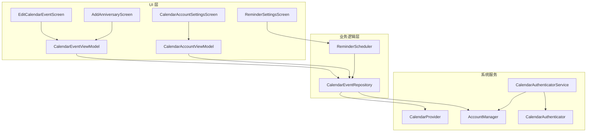
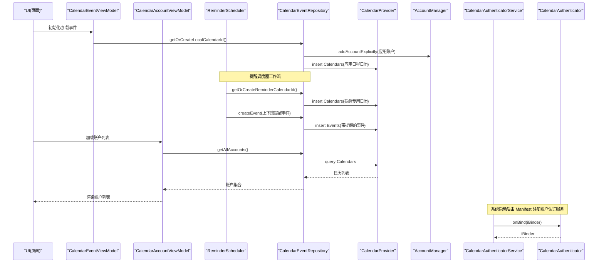
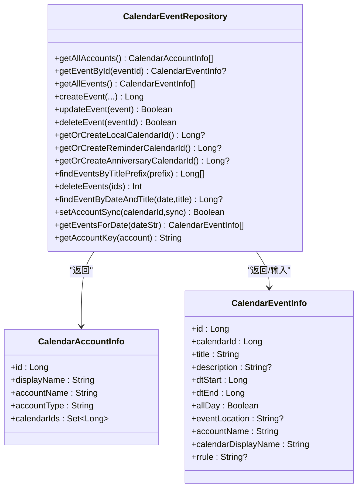
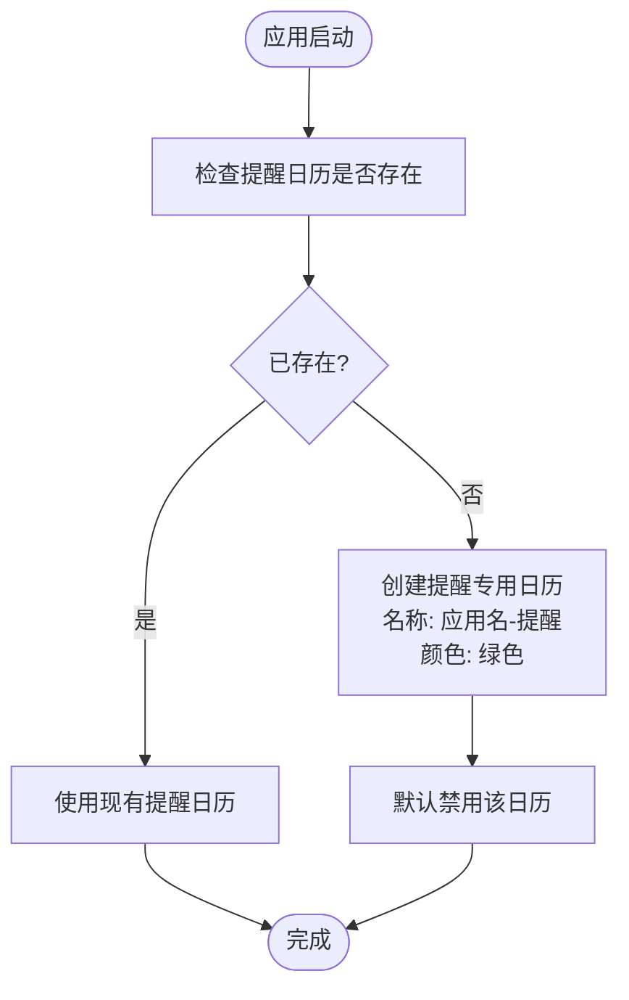
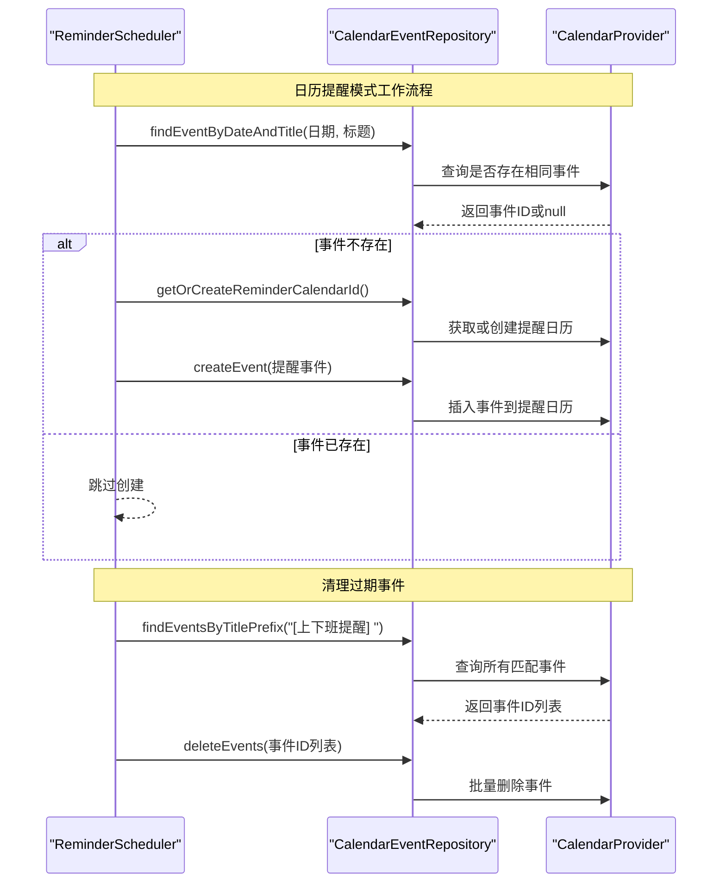
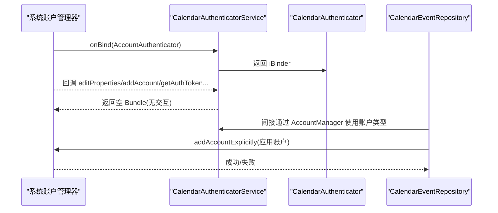
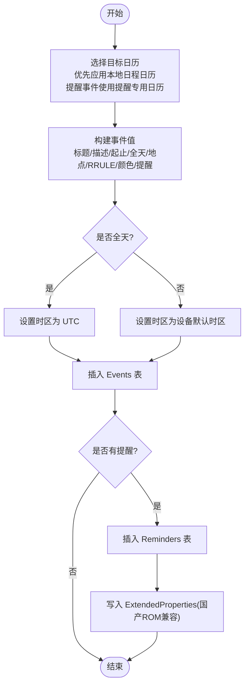
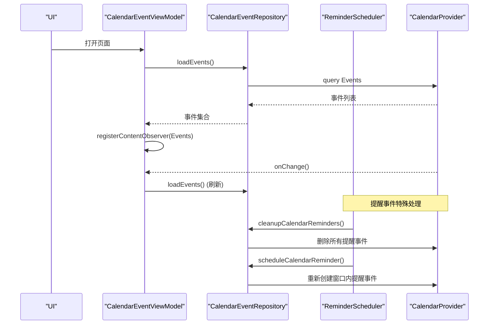
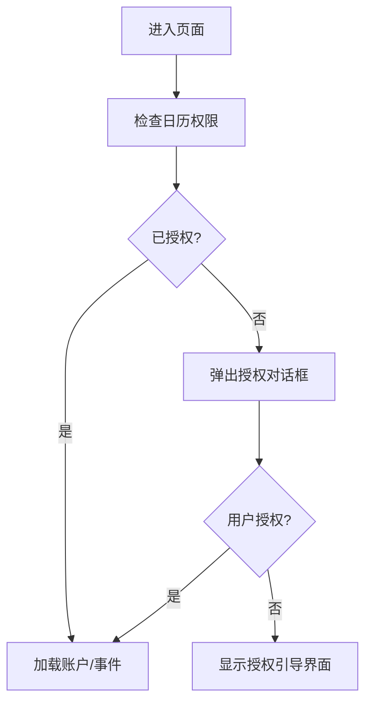
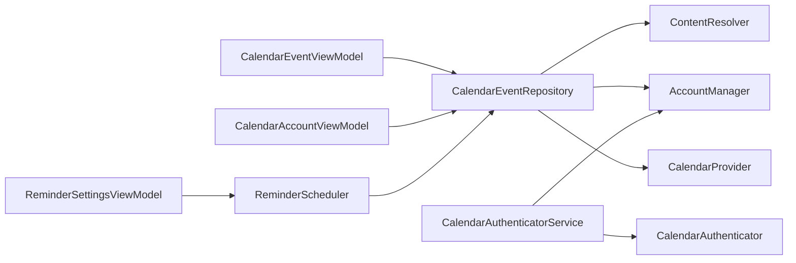

# 系统日历集成

<cite>
**本文引用的文件**   
- [CalendarEventRepository.kt](file://app/src/main/java/com/schedulecalendar/app/data/calendar/CalendarEventRepository.kt)
- [CalendarAuthenticator.kt](file://app/src/main/java/com/schedulecalendar/app/data/calendar/CalendarAuthenticator.kt)
- [CalendarAuthenticatorService.kt](file://app/src/main/java/com/schedulecalendar/app/data/calendar/CalendarAuthenticatorService.kt)
- [AndroidManifest.xml](file://app/src/main/AndroidManifest.xml)
- [authenticator.xml](file://app/src/main/res/xml/authenticator.xml)
- [CalendarEventViewModel.kt](file://app/src/main/java/com/schedulecalendar/app/ui/todo/CalendarEventViewModel.kt)
- [CalendarAccountSettingsScreen.kt](file://app/src/main/java/com/schedulecalendar/app/ui/settings/CalendarAccountSettingsScreen.kt)
- [CalendarAccountViewModel.kt](file://app/src/main/java/com/schedulecalendar/app/ui/settings/CalendarAccountViewModel.kt)
- [EditCalendarEventScreen.kt](file://app/src/main/java/com/schedulecalendar/app/ui/todo/EditCalendarEventScreen.kt)
- [AddAnniversaryScreen.kt](file://app/src/main/java/com/schedulecalendar/app/ui/todo/AddAnniversaryScreen.kt)
- [ReminderScheduler.kt](file://app/src/main/java/com/schedulecalendar/app/reminder/ReminderScheduler.kt)
- [ReminderSettingsScreen.kt](file://app/src/main/java/com/schedulecalendar/app/ui/settings/ReminderSettingsScreen.kt)
</cite>

## 更新摘要
**变更内容**   
- 新增提醒专用日历的创建和管理功能，支持独立的提醒日历与常规日程日历分离
- 扩展 CalendarEventRepository 以支持提醒日历的 CRUD 操作
- 集成 ReminderScheduler 实现上下班提醒事件的自动创建和管理
- 增强账户初始化逻辑，默认禁用提醒日历以避免污染用户日历视图
- 新增提醒事件的前缀管理和批量清理机制

## 目录
1. [简介](#简介)
2. [项目结构](#项目结构)
3. [核心组件](#核心组件)
4. [架构总览](#架构总览)
5. [详细组件分析](#详细组件分析)
6. [依赖关系分析](#依赖关系分析)
7. [性能与一致性](#性能与一致性)
8. [权限与授权流程](#权限与授权流程)
9. [故障排查与异常恢复](#故障排查与异常恢复)
10. [结论](#结论)

## 简介
本文件面向 Android 应用与系统日历集成的实现，围绕 Calendar Provider API 的使用展开，重点说明：
- CalendarEventRepository 的数据访问层实现（CRUD、查询过滤、数据同步）
- CalendarAuthenticator 与 CalendarAuthenticatorService 的认证机制与应用账户绑定
- 日历事件的创建、更新、删除细节（属性映射、时区处理、重复事件支持）
- **新增**：提醒专用日历的独立管理与上下班提醒事件的自动化处理
- 双向数据同步策略、冲突解决与数据一致性保证
- 日历权限申请与用户授权引导
- 错误处理与异常恢复方案

## 项目结构
与日历集成相关的代码主要分布在 data.calendar 与 ui.todo、ui.settings、reminder 等模块中。整体采用分层设计：UI 层通过 ViewModel 调用 Repository，Repository 直接操作 CalendarProvider；认证器服务用于注册自定义账户类型，使应用创建的日历在系统账户管理中可见。**新增的提醒调度器负责根据排班记录自动创建和管理提醒事件。**

**图表来源**
- [CalendarEventRepository.kt:1-828](file://app/src/main/java/com/schedulecalendar/app/data/calendar/CalendarEventRepository.kt#L1-L828)
- [CalendarAuthenticator.kt:1-75](file://app/src/main/java/com/schedulecalendar/app/data/calendar/CalendarAuthenticator.kt#L1-L75)
- [CalendarAuthenticatorService.kt:1-26](file://app/src/main/java/com/schedulecalendar/app/data/calendar/CalendarAuthenticatorService.kt#L1-L26)
- [CalendarEventViewModel.kt:1-464](file://app/src/main/java/com/schedulecalendar/app/ui/todo/CalendarEventViewModel.kt#L1-L464)
- [CalendarAccountViewModel.kt:1-167](file://app/src/main/java/com/schedulecalendar/app/ui/settings/CalendarAccountViewModel.kt#L1-L167)
- [CalendarAccountSettingsScreen.kt:1-239](file://app/src/main/java/com/schedulecalendar/app/ui/settings/CalendarAccountSettingsScreen.kt#L1-L239)
- [EditCalendarEventScreen.kt:1-200](file://app/src/main/java/com/schedulecalendar/app/ui/todo/EditCalendarEventScreen.kt#L1-L200)
- [AddAnniversaryScreen.kt:1-632](file://app/src/main/java/com/schedulecalendar/app/ui/todo/AddAnniversaryScreen.kt#L1-L632)
- [ReminderScheduler.kt:1-421](file://app/src/main/java/com/schedulecalendar/app/reminder/ReminderScheduler.kt#L1-L421)
- [ReminderSettingsScreen.kt:1-458](file://app/src/main/java/com/schedulecalendar/app/ui/settings/ReminderSettingsScreen.kt#L1-L458)

## 核心组件
- CalendarEventRepository：封装对 CalendarProvider 的读写，提供账户管理、事件 CRUD、批量查询、按日期筛选、提醒与扩展属性写入、本地日历自动创建等功能。**新增提醒专用日历的创建与管理能力**。
- CalendarAuthenticator + CalendarAuthenticatorService：向系统注册自定义账户类型，使应用创建的日历在系统账户管理中可见并可被识别。
- CalendarEventViewModel：负责 UI 状态、权限检查、事件加载与监听、分类与禁用账户逻辑、事件编辑与删除等。
- CalendarAccountViewModel + CalendarAccountSettingsScreen：管理账户启用/禁用、分类设置（日程/纪念日/提醒），并持久化到偏好存储。
- EditCalendarEventScreen / AddAnniversaryScreen：负责用户交互、表单校验、权限请求、时间与时区处理、RRULE 生成与保存。
- **新增**：ReminderScheduler + ReminderSettingsScreen：负责上下班提醒的调度管理，包括闹钟模式和日历模式两种提醒方式。

## 架构总览
下图展示了从 UI 到系统日历的核心调用链路与账户认证注册过程，**以及新增的提醒调度器工作流程**。

**图表来源**
- [CalendarEventRepository.kt:414-519](file://app/src/main/java/com/schedulecalendar/app/data/calendar/CalendarEventRepository.kt#L414-L519)
- [CalendarEventRepository.kt:528-586](file://app/src/main/java/com/schedulecalendar/app/data/calendar/CalendarEventRepository.kt#L528-L586)
- [ReminderScheduler.kt:307-353](file://app/src/main/java/com/schedulecalendar/app/reminder/ReminderScheduler.kt#L307-L353)
- [CalendarAccountViewModel.kt:48-96](file://app/src/main/java/com/schedulecalendar/app/ui/settings/CalendarAccountViewModel.kt#L48-L96)
- [CalendarAuthenticatorService.kt:17-24](file://app/src/main/java/com/schedulecalendar/app/data/calendar/CalendarAuthenticatorService.kt#L17-L24)
- [CalendarAuthenticator.kt:15-74](file://app/src/main/java/com/schedulecalendar/app/data/calendar/CalendarAuthenticator.kt#L15-L74)

## 详细组件分析

### CalendarEventRepository 数据访问层
职责与能力
- 账户与日历管理：获取所有账户/日历、创建或查找应用本地"日程"、"纪念日"**和"提醒"专用日历**、设置账户同步开关。
- 事件 CRUD：创建事件（含提醒与扩展属性）、更新事件、删除事件、按 ID 查询、批量删除。
- 查询与过滤：全量事件加载（优化为批量加载日历信息避免 N+1）、按标题前缀查找、按日期范围筛选、按日期字符串聚合当天事件（含年度重复纪念日）。
- 兼容性与健壮性：国产 ROM 扩展属性写入、异常捕获与日志记录、权限缺失时的安全返回。

**更新** 新增提醒专用日历管理功能

关键实现要点
- 账户与日历创建
  - 使用自定义账户类型（与应用包名一致），确保在系统账户管理中可见。
  - 首次创建时通过 AccountManager.addAccountExplicitly 添加账户，并设置 ContentResolver 同步标志。
  - 创建"日程"日历（名称带"-日程"后缀）、"纪念日"日历（名称带"-纪念日"后缀，颜色红色）**和"提醒"日历（名称带"-提醒"后缀，颜色绿色）**，均标记为可写、可见、允许提醒与可用状态。
- 提醒专用日历特性
  - 显示名称格式："应用名-提醒"
  - 颜色标识：绿色（0xFF059669）
  - 用途：专门存放上下班提醒相关的事件
  - 默认行为：首次加载时自动禁用，避免污染用户日历视图
- 事件创建
  - 字段映射：标题、描述、起止时间、是否全天、地点、RRULE、颜色、提醒分钟数。
  - 时区处理：全天事件使用 UTC 时区，非全天使用设备默认时区。
  - 提醒：插入 Reminders 表，同时写入 ExtendedProperties 以兼容部分国产 ROM。
- 事件更新/删除
  - 更新覆盖标题、描述、起止时间、是否全天、地点、RRULE。
  - 删除直接基于事件 ID 执行。
- 查询优化
  - getAllEvents 先批量加载日历信息 Map，再遍历事件，避免 N+1 查询。
  - getEventsForDate 支持全年重复纪念日（FREQ=YEARLY）与常规事件的时间区间判断。
- 账户同步控制
  - setAccountSync 通过更新 Calendars.SYNC_EVENTS 控制显示与同步。

**图表来源**
- [CalendarEventRepository.kt:17-40](file://app/src/main/java/com/schedulecalendar/app/data/calendar/CalendarEventRepository.kt#L17-L40)
- [CalendarEventRepository.kt:64-105](file://app/src/main/java/com/schedulecalendar/app/data/calendar/CalendarEventRepository.kt#L64-L105)
- [CalendarEventRepository.kt:110-149](file://app/src/main/java/com/schedulecalendar/app/data/calendar/CalendarEventRepository.kt#L110-L149)
- [CalendarEventRepository.kt:155-203](file://app/src/main/java/com/schedulecalendar/app/data/calendar/CalendarEventRepository.kt#L155-L203)
- [CalendarEventRepository.kt:275-330](file://app/src/main/java/com/schedulecalendar/app/data/calendar/CalendarEventRepository.kt#L275-L330)
- [CalendarEventRepository.kt:528-586](file://app/src/main/java/com/schedulecalendar/app/data/calendar/CalendarEventRepository.kt#L528-L586)
- [CalendarEventRepository.kt:594-652](file://app/src/main/java/com/schedulecalendar/app/data/calendar/CalendarEventRepository.kt#L594-L652)
- [CalendarEventRepository.kt:699-719](file://app/src/main/java/com/schedulecalendar/app/data/calendar/CalendarEventRepository.kt#L699-L719)
- [CalendarEventRepository.kt:737-752](file://app/src/main/java/com/schedulecalendar/app/data/calendar/CalendarEventRepository.kt#L737-L752)

**章节来源**
- [CalendarEventRepository.kt:1-828](file://app/src/main/java/com/schedulecalendar/app/data/calendar/CalendarEventRepository.kt#L1-L828)

### 提醒专用日历管理系统
**新增** 提醒专用日历是独立于常规日程日历和纪念日日历的第三个专用日历，专门用于存放上下班提醒相关的事件。

核心特性
- **独立标识**：显示名称为"应用名-提醒"，使用绿色（0xFF059669）作为视觉标识
- **自动创建**：在应用启动时自动创建，确保提醒功能可用
- **智能管理**：支持按标题前缀查找和批量删除，便于清理过期提醒事件
- **默认禁用**：首次加载时自动禁用，避免污染用户的日历视图

实现细节
- 日历创建流程与常规日历类似，但使用不同的显示名称和后缀
- 提供专门的查询方法 `findEventsByTitlePrefix` 用于查找特定前缀的提醒事件
- 支持按日期和标题精确查找，避免重复创建相同的提醒事件
- 与 ReminderScheduler 深度集成，实现自动化提醒管理

**图表来源**
- [CalendarEventRepository.kt:528-586](file://app/src/main/java/com/schedulecalendar/app/data/calendar/CalendarEventRepository.kt#L528-L586)
- [CalendarAccountViewModel.kt:65-71](file://app/src/main/java/com/schedulecalendar/app/ui/settings/CalendarAccountViewModel.kt#L65-L71)

**章节来源**
- [CalendarEventRepository.kt:528-586](file://app/src/main/java/com/schedulecalendar/app/data/calendar/CalendarEventRepository.kt#L528-L586)
- [CalendarAccountViewModel.kt:65-71](file://app/src/main/java/com/schedulecalendar/app/ui/settings/CalendarAccountViewModel.kt#L65-L71)

### 提醒调度器与事件管理
**新增** ReminderScheduler 负责根据用户的排班记录自动创建和管理上下班提醒事件，支持两种提醒模式：闹钟模式和日历模式。

核心功能
- **双模式支持**：闹钟模式（AlarmManager）和日历模式（CalendarProvider）
- **智能去重**：通过日期+标题组合避免重复创建相同提醒事件
- **窗口管理**：仅维护今天前后各 3 天的提醒事件，自动清理过期事件
- **灵活配置**：支持上班/下班提醒分别配置，自定义提前提醒时间

事件管理策略
- **标题规范**：使用"[上下班提醒] "前缀，便于批量管理
- **去重机制**：通过 `findEventByDateAndTitle` 检查事件是否已存在
- **批量清理**：使用 `findEventsByTitlePrefix` 查找并删除所有相关事件
- **日历隔离**：强制使用提醒专用日历，避免与用户其他事件混淆

**图表来源**
- [ReminderScheduler.kt:307-353](file://app/src/main/java/com/schedulecalendar/app/reminder/ReminderScheduler.kt#L307-L353)
- [ReminderScheduler.kt:370-380](file://app/src/main/java/com/schedulecalendar/app/reminder/ReminderScheduler.kt#L370-L380)
- [CalendarEventRepository.kt:699-719](file://app/src/main/java/com/schedulecalendar/app/data/calendar/CalendarEventRepository.kt#L699-L719)
- [CalendarEventRepository.kt:737-752](file://app/src/main/java/com/schedulecalendar/app/data/calendar/CalendarEventRepository.kt#L737-L752)

**章节来源**
- [ReminderScheduler.kt:1-421](file://app/src/main/java/com/schedulecalendar/app/reminder/ReminderScheduler.kt#L1-L421)
- [CalendarEventRepository.kt:699-719](file://app/src/main/java/com/schedulecalendar/app/data/calendar/CalendarEventRepository.kt#L699-L719)
- [CalendarEventRepository.kt:737-752](file://app/src/main/java/com/schedulecalendar/app/data/calendar/CalendarEventRepository.kt#L737-L752)

### 认证机制与账户绑定
- CalendarAuthenticatorService：作为系统账户认证服务，暴露 iBinder，供系统调用。
- CalendarAuthenticator：继承 AbstractAccountAuthenticator，实现最小必要方法，返回空 Bundle，表示无需交互式登录。
- authenticator.xml：声明账户类型与应用图标、标签，使系统识别该账户类型。
- AndroidManifest.xml：注册 Service 与 IntentFilter，关联 authenticator.xml。

**图表来源**
- [CalendarAuthenticatorService.kt:17-24](file://app/src/main/java/com/schedulecalendar/app/data/calendar/CalendarAuthenticatorService.kt#L17-L24)
- [CalendarAuthenticator.kt:15-74](file://app/src/main/java/com/schedulecalendar/app/data/calendar/CalendarAuthenticator.kt#L15-L74)
- [authenticator.xml:1-7](file://app/src/main/res/xml/authenticator.xml#L1-L7)
- [AndroidManifest.xml:114-124](file://app/src/main/AndroidManifest.xml#L114-L124)
- [CalendarEventRepository.kt:414-443](file://app/src/main/java/com/schedulecalendar/app/data/calendar/CalendarEventRepository.kt#L414-L443)

**章节来源**
- [CalendarAuthenticator.kt:1-75](file://app/src/main/java/com/schedulecalendar/app/data/calendar/CalendarAuthenticator.kt#L1-L75)
- [CalendarAuthenticatorService.kt:1-26](file://app/src/main/java/com/schedulecalendar/app/data/calendar/CalendarAuthenticatorService.kt#L1-L26)
- [authenticator.xml:1-7](file://app/src/main/res/xml/authenticator.xml#L1-L7)
- [AndroidManifest.xml:114-124](file://app/src/main/AndroidManifest.xml#L114-L124)
- [CalendarEventRepository.kt:414-443](file://app/src/main/java/com/schedulecalendar/app/data/calendar/CalendarEventRepository.kt#L414-L443)

### 事件创建、更新、删除的实现细节
- 创建事件
  - 选择目标日历：优先应用本地"日程"日历，否则取第一个可写日历。**新增**：提醒事件强制使用提醒专用日历。
  - 属性映射：标题、描述、起止时间、是否全天、地点、RRULE、颜色、提醒分钟数。
  - 时区处理：全天事件使用 UTC 时区；非全天使用设备默认时区。
  - 提醒：插入 Reminders 表，并写入 ExtendedProperties 以兼容国产 ROM。
- 更新事件
  - 覆盖标题、描述、起止时间、是否全天、地点、RRULE。
- 删除事件
  - 根据事件 ID 删除，返回影响行数判断成功与否。

**图表来源**
- [CalendarEventRepository.kt:275-330](file://app/src/main/java/com/schedulecalendar/app/data/calendar/CalendarEventRepository.kt#L275-L330)
- [CalendarEventRepository.kt:335-381](file://app/src/main/java/com/schedulecalendar/app/data/calendar/CalendarEventRepository.kt#L335-L381)
- [CalendarEventRepository.kt:387-404](file://app/src/main/java/com/schedulecalendar/app/data/calendar/CalendarEventRepository.kt#L387-L404)
- [CalendarEventRepository.kt:588-622](file://app/src/main/java/com/schedulecalendar/app/data/calendar/CalendarEventRepository.kt#L588-L622)

**章节来源**
- [CalendarEventRepository.kt:275-330](file://app/src/main/java/com/schedulecalendar/app/data/calendar/CalendarEventRepository.kt#L275-L330)
- [CalendarEventRepository.kt:335-381](file://app/src/main/java/com/schedulecalendar/app/data/calendar/CalendarEventRepository.kt#L335-L381)
- [CalendarEventRepository.kt:387-404](file://app/src/main/java/com/schedulecalendar/app/data/calendar/CalendarEventRepository.kt#L387-L404)
- [CalendarEventRepository.kt:588-622](file://app/src/main/java/com/schedulecalendar/app/data/calendar/CalendarEventRepository.kt#L588-L622)

### 双向数据同步策略、冲突解决与一致性
- 读取侧实时同步
  - 通过 ContentObserver 监听 CalendarContract.Events.CONTENT_URI 变化，触发重新加载事件列表，保证 UI 与系统日历一致。
- 写入侧一致性
  - 创建/更新/删除操作均直接写入 CalendarProvider，并通过返回值与异常捕获保障结果。
  - 对于重复创建场景，提供 findEventsByTitlePrefix 与 findEventByDateAndTitle 辅助方法，避免重复条目。
- 冲突解决
  - 当前实现未引入版本戳或 lastModified 字段进行服务端冲突检测；若未来需要多端同步，建议引入版本号或时间戳字段，并在更新前比较差异，必要时提示用户合并策略。
- 账户级同步控制
  - 通过 setAccountSync 控制 Calendars.SYNC_EVENTS，配合 UI 的启用/禁用开关，实现账户级显示与同步控制。
- **新增**：提醒事件的特殊处理
  - 提醒事件采用"删除全部 + 重新创建"策略，确保数据一致性
  - 通过标题前缀统一管理，便于批量操作和维护

**图表来源**
- [CalendarEventViewModel.kt:270-289](file://app/src/main/java/com/schedulecalendar/app/ui/todo/CalendarEventViewModel.kt#L270-L289)
- [CalendarEventViewModel.kt:236-265](file://app/src/main/java/com/schedulecalendar/app/ui/todo/CalendarEventViewModel.kt#L236-L265)
- [CalendarEventRepository.kt:155-203](file://app/src/main/java/com/schedulecalendar/app/data/calendar/CalendarEventRepository.kt#L155-L203)
- [ReminderScheduler.kt:362-380](file://app/src/main/java/com/schedulecalendar/app/reminder/ReminderScheduler.kt#L362-L380)

**章节来源**
- [CalendarEventViewModel.kt:270-289](file://app/src/main/java/com/schedulecalendar/app/ui/todo/CalendarEventViewModel.kt#L270-L289)
- [CalendarEventViewModel.kt:236-265](file://app/src/main/java/com/schedulecalendar/app/ui/todo/CalendarEventViewModel.kt#L236-L265)
- [CalendarEventRepository.kt:630-683](file://app/src/main/java/com/schedulecalendar/app/data/calendar/CalendarEventRepository.kt#L630-L683)
- [CalendarEventRepository.kt:688-701](file://app/src/main/java/com/schedulecalendar/app/data/calendar/CalendarEventRepository.kt#L688-L701)
- [ReminderScheduler.kt:362-380](file://app/src/main/java/com/schedulecalendar/app/reminder/ReminderScheduler.kt#L362-L380)

### 权限与授权流程
- 清单权限
  - READ_CALENDAR、WRITE_CALENDAR、AUTHENTICATE_ACCOUNTS 等权限已声明。
- 运行时授权
  - 读权限：在日历事件页面与账户设置页进入时检查并请求。
  - 写权限：在编辑/新增纪念日页面进入时检查并请求。
  - **新增**：提醒设置页面需要日历读写权限以创建和管理提醒事件。
- 授权失败处理
  - 若无权限，UI 展示引导界面并提供"授予权限"按钮；VM 内部捕获 SecurityException 并降级处理。

**图表来源**
- [AndroidManifest.xml:9-13](file://app/src/main/AndroidManifest.xml#L9-L13)
- [CalendarEventViewModel.kt:225-230](file://app/src/main/java/com/schedulecalendar/app/ui/todo/CalendarEventViewModel.kt#L225-L230)
- [CalendarAccountSettingsScreen.kt:46-58](file://app/src/main/java/com/schedulecalendar/app/ui/settings/CalendarAccountSettingsScreen.kt#L46-L58)
- [EditCalendarEventScreen.kt:112-130](file://app/src/main/java/com/schedulecalendar/app/ui/todo/EditCalendarEventScreen.kt#L112-L130)
- [AddAnniversaryScreen.kt:160-165](file://app/src/main/java/com/schedulecalendar/app/ui/todo/AddAnniversaryScreen.kt#L160-L165)
- [ReminderSettingsScreen.kt:40-69](file://app/src/main/java/com/schedulecalendar/app/ui/settings/ReminderSettingsScreen.kt#L40-L69)

**章节来源**
- [AndroidManifest.xml:9-13](file://app/src/main/AndroidManifest.xml#L9-L13)
- [CalendarEventViewModel.kt:225-230](file://app/src/main/java/com/schedulecalendar/app/ui/todo/CalendarEventViewModel.kt#L225-L230)
- [CalendarAccountSettingsScreen.kt:46-58](file://app/src/main/java/com/schedulecalendar/app/ui/settings/CalendarAccountSettingsScreen.kt#L46-L58)
- [EditCalendarEventScreen.kt:112-130](file://app/src/main/java/com/schedulecalendar/app/ui/todo/EditCalendarEventScreen.kt#L112-L130)
- [AddAnniversaryScreen.kt:160-165](file://app/src/main/java/com/schedulecalendar/app/ui/todo/AddAnniversaryScreen.kt#L160-L165)
- [ReminderSettingsScreen.kt:40-69](file://app/src/main/java/com/schedulecalendar/app/ui/settings/ReminderSettingsScreen.kt#L40-L69)

### 重复事件支持与 RRULE
- 支持 FREQ=YEARLY 的年度重复规则，用于纪念日场景。
- 变更分类时自动添加/移除"纪念日: "前缀与 FREQ=YEARLY 规则。
- 纪念日专用日历独立创建，便于区分与筛选。
- **新增**：提醒事件不支持重复规则，每个提醒都是独立的一次性事件。

**章节来源**
- [CalendarEventViewModel.kt:433-453](file://app/src/main/java/com/schedulecalendar/app/ui/todo/CalendarEventViewModel.kt#L433-L453)
- [AddAnniversaryScreen.kt:580-585](file://app/src/main/java/com/schedulecalendar/app/ui/todo/AddAnniversaryScreen.kt#L580-L585)
- [CalendarEventRepository.kt:525-583](file://app/src/main/java/com/schedulecalendar/app/data/calendar/CalendarEventRepository.kt#L525-L583)

### 时区处理与全天事件
- 全天事件使用 UTC 时区，且结束时间为次日 00:00 UTC。
- 非全天事件使用设备默认时区。
- 日历与事件创建时正确设置 EVENT_TIMEZONE 与 CALENDAR_TIME_ZONE。
- **新增**：提醒事件均为非全天事件，使用设备默认时区以确保提醒时间准确。

**章节来源**
- [CalendarEventRepository.kt:298-301](file://app/src/main/java/com/schedulecalendar/app/data/calendar/CalendarEventRepository.kt#L298-L301)
- [AddAnniversaryScreen.kt:554-566](file://app/src/main/java/com/schedulecalendar/app/ui/todo/AddAnniversaryScreen.kt#L554-L566)
- [CalendarEventRepository.kt:496-496](file://app/src/main/java/com/schedulecalendar/app/data/calendar/CalendarEventRepository.kt#L496-L496)

## 依赖关系分析
- UI 层依赖 ViewModel，ViewModel 依赖 Repository 与偏好存储。
- Repository 依赖 Android 系统服务：ContentResolver、AccountManager、CalendarProvider。
- 认证服务通过 Manifest 注册，与 AccountManager 协作，使账户类型可见。
- **新增**：ReminderScheduler 依赖 CalendarEventRepository 和 AppPreferences，负责提醒调度和事件管理。

**图表来源**
- [CalendarEventViewModel.kt:47-51](file://app/src/main/java/com/schedulecalendar/app/ui/todo/CalendarEventViewModel.kt#L47-L51)
- [CalendarAccountViewModel.kt:31-34](file://app/src/main/java/com/schedulecalendar/app/ui/settings/CalendarAccountViewModel.kt#L31-L34)
- [ReminderSettingsViewModel.kt:43-47](file://app/src/main/java/com/schedulecalendar/app/ui/settings/ReminderSettingsViewModel.kt#L43-L47)
- [CalendarEventRepository.kt:47-49](file://app/src/main/java/com/schedulecalendar/app/data/calendar/CalendarEventRepository.kt#L47-L49)
- [CalendarAuthenticatorService.kt:17-24](file://app/src/main/java/com/schedulecalendar/app/data/calendar/CalendarAuthenticatorService.kt#L17-L24)

**章节来源**
- [CalendarEventViewModel.kt:47-51](file://app/src/main/java/com/schedulecalendar/app/ui/todo/CalendarEventViewModel.kt#L47-L51)
- [CalendarAccountViewModel.kt:31-34](file://app/src/main/java/com/schedulecalendar/app/ui/settings/CalendarAccountViewModel.kt#L31-L34)
- [ReminderSettingsViewModel.kt:43-47](file://app/src/main/java/com/schedulecalendar/app/ui/settings/ReminderSettingsViewModel.kt#L43-L47)
- [CalendarEventRepository.kt:47-49](file://app/src/main/java/com/schedulecalendar/app/data/calendar/CalendarEventRepository.kt#L47-L49)
- [CalendarAuthenticatorService.kt:17-24](file://app/src/main/java/com/schedulecalendar/app/data/calendar/CalendarAuthenticatorService.kt#L17-L24)

## 性能与一致性
- 批量加载日历信息，避免 N+1 查询，提升 getAllEvents 性能。
- 使用 ContentObserver 监听事件变化，减少轮询开销。
- 异常捕获与降级返回，防止崩溃与卡顿。
- **新增**：提醒事件采用窗口化管理，仅维护近期事件，避免数据库膨胀。
- **新增**：提醒事件批量操作优化，通过前缀匹配快速定位和删除相关事件。
- 建议在大规模数据场景下增加分页或时间窗口查询，进一步降低内存与 IO 压力。

## 故障排查与异常恢复
- 常见问题
  - 无权限导致查询失败：检查清单与运行时授权，确认 UI 引导与权限请求路径。
  - 账户不可见：确认 authenticator.xml 与 Manifest 注册是否正确，账户类型是否匹配。
  - 提醒未生效：检查 Reminders 插入与 ExtendedProperties 写入，注意不同 ROM 的差异。
  - 重复事件：使用 findEventsByTitlePrefix/findEventByDateAndTitle 去重。
  - **新增**：提醒日历未创建：检查 getOrCreateReminderCalendarId 调用和权限状态。
  - **新增**：提醒事件过多：确认清理机制是否正常工作，检查 REMINDER_WINDOW_DAYS 配置。
- 异常恢复
  - Repository 层对异常进行捕获并返回安全值（如 null 或 -1）。
  - ViewModel 层捕获 SecurityException 并更新 UI 状态，避免闪退。
  - 账户同步开关失败时，保持本地禁用状态与 UI 一致。
  - **新增**：提醒调度器异常时，记录日志但不影响主流程，下次启动时重新同步。

**章节来源**
- [CalendarEventRepository.kt:145-149](file://app/src/main/java/com/schedulecalendar/app/data/calendar/CalendarEventRepository.kt#L145-L149)
- [CalendarEventRepository.kt:326-330](file://app/src/main/java/com/schedulecalendar/app/data/calendar/CalendarEventRepository.kt#L326-L330)
- [CalendarEventRepository.kt:604-607](file://app/src/main/java/com/schedulecalendar/app/data/calendar/CalendarEventRepository.kt#L604-L607)
- [CalendarEventRepository.kt:619-622](file://app/src/main/java/com/schedulecalendar/app/data/calendar/CalendarEventRepository.kt#L619-L622)
- [CalendarEventRepository.kt:582-585](file://app/src/main/java/com/schedulecalendar/app/data/calendar/CalendarEventRepository.kt#L582-L585)
- [CalendarEventViewModel.kt:257-264](file://app/src/main/java/com/schedulecalendar/app/ui/todo/CalendarEventViewModel.kt#L257-L264)
- [CalendarEventViewModel.kt:356-366](file://app/src/main/java/com/schedulecalendar/app/ui/todo/CalendarEventViewModel.kt#L356-366)
- [ReminderScheduler.kt:350-352](file://app/src/main/java/com/schedulecalendar/app/reminder/ReminderScheduler.kt#L350-L352)

## 结论
本项目通过 CalendarProvider 实现了完整的日历集成能力：应用自有账户与日历的创建与管理、事件 CRUD、提醒与扩展属性兼容、账户级同步控制与 UI 分类/禁用、以及基于 ContentObserver 的实时同步。**新增的提醒专用日历系统和提醒调度器功能，实现了上下班提醒的自动化管理，支持闹钟和日历两种提醒模式，提供了更好的用户体验和数据隔离。** 认证器服务确保了账户在系统中的可见性。整体实现具备较好的健壮性与用户体验，后续可在多端同步与冲突解决方面进一步增强。