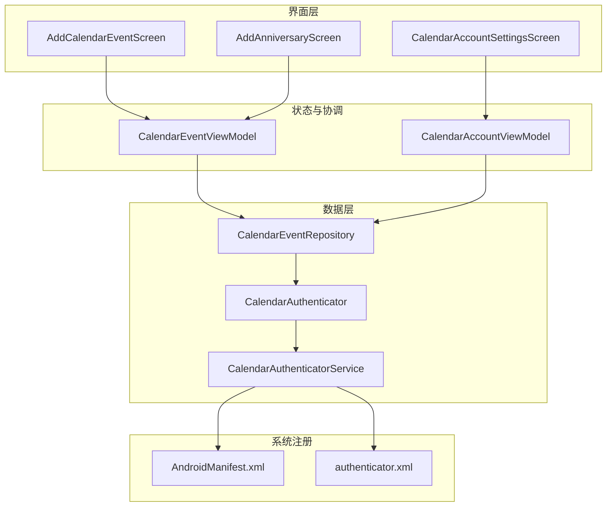
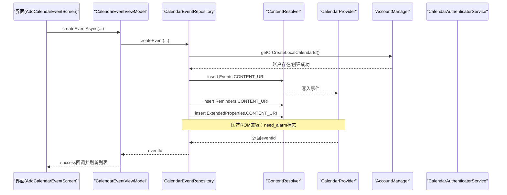
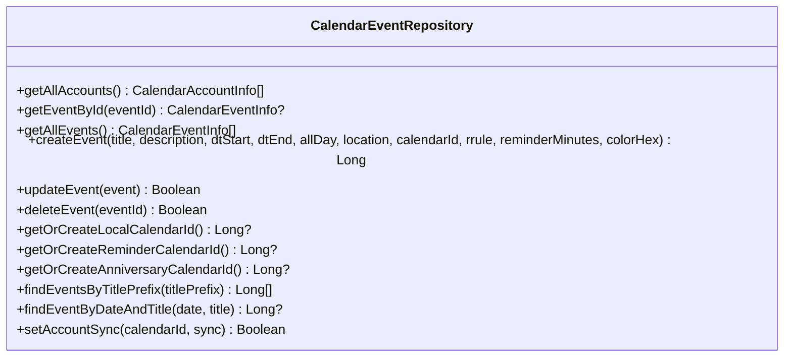
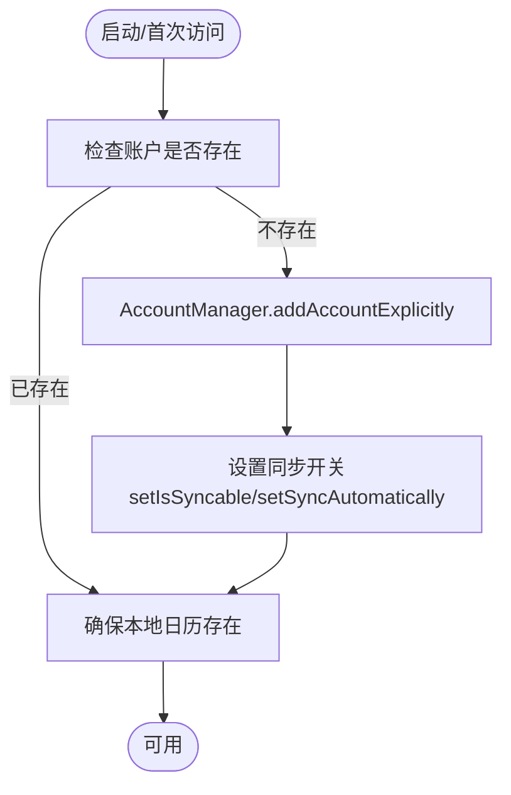
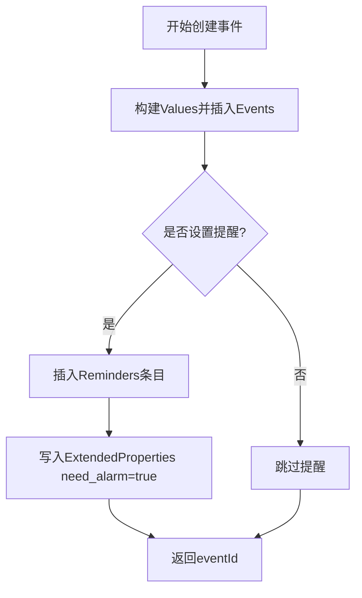
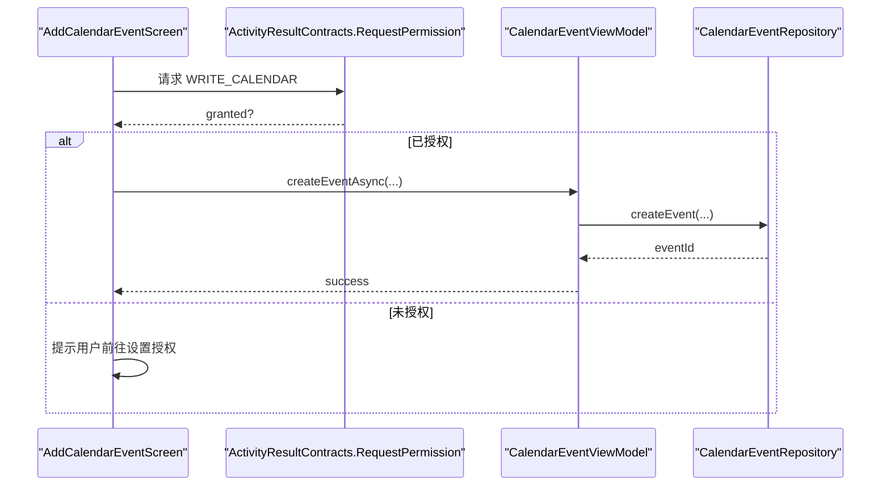
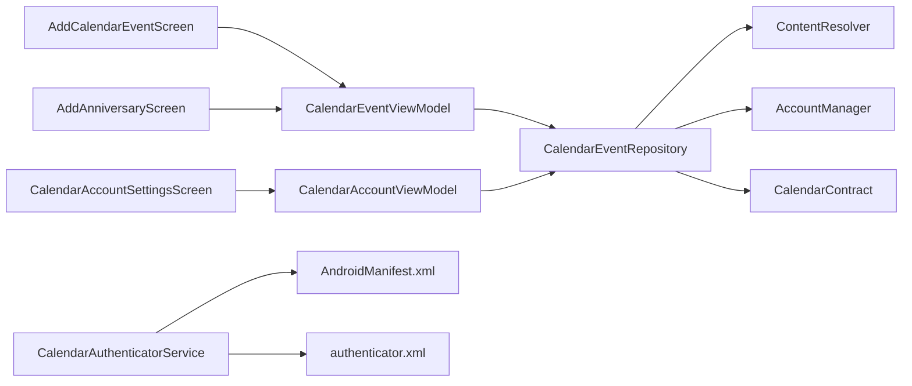

# 系统日历集成

<cite>
**本文引用的文件**   
- [CalendarEventRepository.kt](file://app/src/main/java/com/schedulecalendar/app/data/calendar/CalendarEventRepository.kt)
- [CalendarAuthenticator.kt](file://app/src/main/java/com/schedulecalendar/app/data/calendar/CalendarAuthenticator.kt)
- [CalendarAuthenticatorService.kt](file://app/src/main/java/com/schedulecalendar/app/data/calendar/CalendarAuthenticatorService.kt)
- [AddCalendarEventScreen.kt](file://app/src/main/java/com/schedulecalendar/app/ui/todo/AddCalendarEventScreen.kt)
- [AddAnniversaryScreen.kt](file://app/src/main/java/com/schedulecalendar/app/ui/todo/AddAnniversaryScreen.kt)
- [CalendarEventViewModel.kt](file://app/src/main/java/com/schedulecalendar/app/ui/todo/CalendarEventViewModel.kt)
- [CalendarAccountSettingsScreen.kt](file://app/src/main/java/com/schedulecalendar/app/ui/settings/CalendarAccountSettingsScreen.kt)
- [CalendarAccountViewModel.kt](file://app/src/main/java/com/schedulecalendar/app/ui/settings/CalendarAccountViewModel.kt)
- [AndroidManifest.xml](file://app/src/main/AndroidManifest.xml)
- [authenticator.xml](file://app/src/main/res/xml/authenticator.xml)
</cite>

## 目录
1. [简介](#简介)
2. [项目结构](#项目结构)
3. [核心组件](#核心组件)
4. [架构总览](#架构总览)
5. [详细组件分析](#详细组件分析)
6. [依赖关系分析](#依赖关系分析)
7. [性能考量](#性能考量)
8. [故障排查指南](#故障排查指南)
9. [结论](#结论)
10. [附录：API使用示例与常见问题](#附录api使用示例与常见问题)

## 简介
本文件面向“系统日历集成”的完整实现，围绕 CalendarEventRepository 展开，覆盖事件 CRUD、账户管理、权限处理与同步机制；详细说明自定义账户类型的注册与管理，以及日程、纪念日、提醒三类日历的创建与维护；解释事件创建时的提醒设置、重复规则配置与颜色定制；阐述国产 ROM 兼容性（ExtendedProperties 与闹钟提醒特殊处理）；并提供权限请求流程、错误处理与性能优化策略。文末给出完整的 API 使用示例与常见问题解决方案。

## 项目结构
与系统日历集成相关的代码主要分布在 data.calendar、ui.todo、ui.settings 三个模块中，并通过 Manifest 与 authenticator.xml 完成系统级注册。

图表来源
- [CalendarEventRepository.kt:1-120](file://app/src/main/java/com/schedulecalendar/app/data/calendar/CalendarEventRepository.kt#L1-L120)
- [CalendarAuthenticator.kt:1-75](file://app/src/main/java/com/schedulecalendar/app/data/calendar/CalendarAuthenticator.kt#L1-L75)
- [CalendarAuthenticatorService.kt:1-26](file://app/src/main/java/com/schedulecalendar/app/data/calendar/CalendarAuthenticatorService.kt#L1-L26)
- [AddCalendarEventScreen.kt:1-120](file://app/src/main/java/com/schedulecalendar/app/ui/todo/AddCalendarEventScreen.kt#L1-L120)
- [AddAnniversaryScreen.kt:1-120](file://app/src/main/java/com/schedulecalendar/app/ui/todo/AddAnniversaryScreen.kt#L1-L120)
- [CalendarEventViewModel.kt:1-120](file://app/src/main/java/com/schedulecalendar/app/ui/todo/CalendarEventViewModel.kt#L1-L120)
- [CalendarAccountSettingsScreen.kt:1-120](file://app/src/main/java/com/schedulecalendar/app/ui/settings/CalendarAccountSettingsScreen.kt#L1-L120)
- [CalendarAccountViewModel.kt:1-120](file://app/src/main/java/com/schedulecalendar/app/ui/settings/CalendarAccountViewModel.kt#L1-L120)
- [AndroidManifest.xml:112-122](file://app/src/main/AndroidManifest.xml#L112-L122)
- [authenticator.xml:1-7](file://app/src/main/res/xml/authenticator.xml#L1-L7)

章节来源
- [CalendarEventRepository.kt:1-120](file://app/src/main/java/com/schedulecalendar/app/data/calendar/CalendarEventRepository.kt#L1-L120)
- [AndroidManifest.xml:112-122](file://app/src/main/AndroidManifest.xml#L112-L122)
- [authenticator.xml:1-7](file://app/src/main/res/xml/authenticator.xml#L1-L7)

## 核心组件
- CalendarEventRepository：封装对 Android Calendar Provider 的读写操作，提供事件 CRUD、账户与日历管理、提醒与扩展属性写入、批量查询与过滤等能力。
- CalendarAuthenticator / CalendarAuthenticatorService：实现自定义账户类型（com.schedulecalendar.app），使应用创建的日历在系统账户管理中可见。
- UI 层：AddCalendarEventScreen（新建日程）、AddAnniversaryScreen（新建/编辑纪念日）、CalendarAccountSettingsScreen（账户启用/禁用与分类）。
- ViewModel：CalendarEventViewModel（事件加载、实时监听、分类过滤、异步创建/更新/删除）、CalendarAccountViewModel（账户列表、默认初始化、分类持久化）。

章节来源
- [CalendarEventRepository.kt:14-61](file://app/src/main/java/com/schedulecalendar/app/data/calendar/CalendarEventRepository.kt#L14-L61)
- [CalendarAuthenticator.kt:10-75](file://app/src/main/java/com/schedulecalendar/app/data/calendar/CalendarAuthenticator.kt#L10-L75)
- [CalendarAuthenticatorService.kt:8-26](file://app/src/main/java/com/schedulecalendar/app/data/calendar/CalendarAuthenticatorService.kt#L8-L26)
- [AddCalendarEventScreen.kt:26-120](file://app/src/main/java/com/schedulecalendar/app/ui/todo/AddCalendarEventScreen.kt#L26-L120)
- [AddAnniversaryScreen.kt:42-120](file://app/src/main/java/com/schedulecalendar/app/ui/todo/AddAnniversaryScreen.kt#L42-L120)
- [CalendarEventViewModel.kt:45-120](file://app/src/main/java/com/schedulecalendar/app/ui/todo/CalendarEventViewModel.kt#L45-L120)
- [CalendarAccountViewModel.kt:30-96](file://app/src/main/java/com/schedulecalendar/app/ui/settings/CalendarAccountViewModel.kt#L30-L96)

## 架构总览
下图展示从 UI 到 Repository 再到系统日历 Provider 的调用链，以及账户认证器服务在系统中的注册方式。

图表来源
- [AddCalendarEventScreen.kt:190-240](file://app/src/main/java/com/schedulecalendar/app/ui/todo/AddCalendarEventScreen.kt#L190-L240)
- [CalendarEventViewModel.kt:378-402](file://app/src/main/java/com/schedulecalendar/app/ui/todo/CalendarEventViewModel.kt#L378-L402)
- [CalendarEventRepository.kt:283-337](file://app/src/main/java/com/schedulecalendar/app/data/calendar/CalendarEventRepository.kt#L283-L337)
- [CalendarAuthenticatorService.kt:13-26](file://app/src/main/java/com/schedulecalendar/app/data/calendar/CalendarAuthenticatorService.kt#L13-L26)

## 详细组件分析

### CalendarEventRepository：事件CRUD、账户管理与同步
- 账户与日历
  - 自定义账户类型常量与应用名定义，确保与 authenticator.xml 一致。
  - getAllAccounts：读取所有可见日历并按固定顺序排序（日程 > 纪念日 > 提醒 > 外部账户）。
  - getFirstWritableCalendarId：优先使用本地应用日历，否则回退到任意可写日历。
  - getOrCreateLocalCalendarId：确保 AccountManager 账户存在，设置同步开关，查找或创建“日程”日历。
  - getOrCreateReminderCalendarId：创建“提醒”专用日历（绿色）。
  - getOrCreateAnniversaryCalendarId：创建“纪念日”专用日历（红色）。
- 事件CRUD
  - createEvent：支持标题、描述、起止时间、全天、地点、RRULE、提醒分钟数、颜色；自动设置 HAS_ALARM 并写入 Reminders；国产ROM通过 ExtendedProperties 写入 need_alarm。
  - updateEvent / deleteEvent：标准更新与删除。
  - findEventsByTitlePrefix / findEventByDateAndTitle：用于上下班提醒事件的查重与管理。
  - deleteEvents：批量删除。
  - setAccountSync：按日历ID开启/关闭同步。
- 查询优化
  - getAllEvents：先批量加载日历信息 Map，避免 N+1 查询。
  - getEventsForDate：支持年度重复纪念日匹配。

图表来源
- [CalendarEventRepository.kt:66-114](file://app/src/main/java/com/schedulecalendar/app/data/calendar/CalendarEventRepository.kt#L66-L114)
- [CalendarEventRepository.kt:119-157](file://app/src/main/java/com/schedulecalendar/app/data/calendar/CalendarEventRepository.kt#L119-L157)
- [CalendarEventRepository.kt:163-211](file://app/src/main/java/com/schedulecalendar/app/data/calendar/CalendarEventRepository.kt#L163-L211)
- [CalendarEventRepository.kt:283-337](file://app/src/main/java/com/schedulecalendar/app/data/calendar/CalendarEventRepository.kt#L283-L337)
- [CalendarEventRepository.kt:417-516](file://app/src/main/java/com/schedulecalendar/app/data/calendar/CalendarEventRepository.kt#L417-L516)
- [CalendarEventRepository.kt:525-581](file://app/src/main/java/com/schedulecalendar/app/data/calendar/CalendarEventRepository.kt#L525-L581)
- [CalendarEventRepository.kt:589-645](file://app/src/main/java/com/schedulecalendar/app/data/calendar/CalendarEventRepository.kt#L589-L645)
- [CalendarEventRepository.kt:650-684](file://app/src/main/java/com/schedulecalendar/app/data/calendar/CalendarEventRepository.kt#L650-L684)
- [CalendarEventRepository.kt:692-744](file://app/src/main/java/com/schedulecalendar/app/data/calendar/CalendarEventRepository.kt#L692-L744)
- [CalendarEventRepository.kt:749-762](file://app/src/main/java/com/schedulecalendar/app/data/calendar/CalendarEventRepository.kt#L749-L762)

章节来源
- [CalendarEventRepository.kt:66-114](file://app/src/main/java/com/schedulecalendar/app/data/calendar/CalendarEventRepository.kt#L66-L114)
- [CalendarEventRepository.kt:283-337](file://app/src/main/java/com/schedulecalendar/app/data/calendar/CalendarEventRepository.kt#L283-L337)
- [CalendarEventRepository.kt:417-516](file://app/src/main/java/com/schedulecalendar/app/data/calendar/CalendarEventRepository.kt#L417-L516)
- [CalendarEventRepository.kt:525-581](file://app/src/main/java/com/schedulecalendar/app/data/calendar/CalendarEventRepository.kt#L525-L581)
- [CalendarEventRepository.kt:589-645](file://app/src/main/java/com/schedulecalendar/app/data/calendar/CalendarEventRepository.kt#L589-L645)
- [CalendarEventRepository.kt:650-684](file://app/src/main/java/com/schedulecalendar/app/data/calendar/CalendarEventRepository.kt#L650-L684)
- [CalendarEventRepository.kt:692-744](file://app/src/main/java/com/schedulecalendar/app/data/calendar/CalendarEventRepository.kt#L692-L744)
- [CalendarEventRepository.kt:749-762](file://app/src/main/java/com/schedulecalendar/app/data/calendar/CalendarEventRepository.kt#L749-L762)

### 自定义账户类型注册与管理
- 账户类型与图标标签由 authenticator.xml 声明，accountType 为 com.schedulecalendar.app。
- CalendarAuthenticatorService 暴露 AccountAuthenticator binder，供系统识别。
- CalendarAuthenticator 实现最小必要接口，无需交互式添加账户。
- Repository 在 getOrCreateLocalCalendarId 中通过 AccountManager.addAccountExplicitly 创建账户，并设置同步开关。

图表来源
- [authenticator.xml:1-7](file://app/src/main/res/xml/authenticator.xml#L1-L7)
- [CalendarAuthenticatorService.kt:13-26](file://app/src/main/java/com/schedulecalendar/app/data/calendar/CalendarAuthenticatorService.kt#L13-L26)
- [CalendarAuthenticator.kt:15-74](file://app/src/main/java/com/schedulecalendar/app/data/calendar/CalendarAuthenticator.kt#L15-L74)
- [CalendarEventRepository.kt:417-445](file://app/src/main/java/com/schedulecalendar/app/data/calendar/CalendarEventRepository.kt#L417-L445)

章节来源
- [authenticator.xml:1-7](file://app/src/main/res/xml/authenticator.xml#L1-L7)
- [CalendarAuthenticatorService.kt:13-26](file://app/src/main/java/com/schedulecalendar/app/data/calendar/CalendarAuthenticatorService.kt#L13-L26)
- [CalendarAuthenticator.kt:15-74](file://app/src/main/java/com/schedulecalendar/app/data/calendar/CalendarAuthenticator.kt#L15-L74)
- [CalendarEventRepository.kt:417-445](file://app/src/main/java/com/schedulecalendar/app/data/calendar/CalendarEventRepository.kt#L417-L445)

### 三种日历的创建与维护
- 日程日历：名称后缀“-日程”，蓝色主题色，作为默认写入目标。
- 纪念日日历：名称后缀“-纪念日”，红色主题色，用于年度重复纪念日。
- 提醒日历：名称后缀“-提醒”，绿色主题色，用于上下班提醒事件。
- Repository 提供对应 getOrCreateXxxCalendarId 方法，保证唯一性与显示名一致性。

章节来源
- [CalendarEventRepository.kt:417-516](file://app/src/main/java/com/schedulecalendar/app/data/calendar/CalendarEventRepository.kt#L417-L516)
- [CalendarEventRepository.kt:525-581](file://app/src/main/java/com/schedulecalendar/app/data/calendar/CalendarEventRepository.kt#L525-L581)
- [CalendarEventRepository.kt:589-645](file://app/src/main/java/com/schedulecalendar/app/data/calendar/CalendarEventRepository.kt#L589-L645)

### 事件创建：提醒、重复规则与颜色
- 提醒：通过 Reminders.CONTENT_URI 插入提醒项，同时设置 Events.HAS_ALARM=1。
- 重复规则：支持 RRULE（如 FREQ=YEARLY），在纪念日场景中常用。
- 颜色：通过 EVENT_COLOR 设置十六进制颜色值。
- 国产ROM兼容：写入 ExtendedProperties 的 customAppData={"need_alarm":true}，以适配部分厂商对闹钟提醒的判断逻辑。

图表来源
- [CalendarEventRepository.kt:283-337](file://app/src/main/java/com/schedulecalendar/app/data/calendar/CalendarEventRepository.kt#L283-L337)
- [CalendarEventRepository.kt:342-386](file://app/src/main/java/com/schedulecalendar/app/data/calendar/CalendarEventRepository.kt#L342-L386)

章节来源
- [CalendarEventRepository.kt:283-337](file://app/src/main/java/com/schedulecalendar/app/data/calendar/CalendarEventRepository.kt#L283-L337)
- [CalendarEventRepository.kt:342-386](file://app/src/main/java/com/schedulecalendar/app/data/calendar/CalendarEventRepository.kt#L342-L386)

### 权限请求流程与错误处理
- 读权限：READ_CALENDAR，用于加载账户与事件列表。
- 写权限：WRITE_CALENDAR，用于创建/更新/删除事件。
- 精确闹钟权限：USE_EXACT_ALARM / SCHEDULE_EXACT_ALARM（如需精确提醒）。
- UI 层在进入页面时即发起权限申请，失败则提示用户授权。
- Repository 层对异常进行捕获，返回空结果或默认值，避免崩溃。

图表来源
- [AddCalendarEventScreen.kt:84-103](file://app/src/main/java/com/schedulecalendar/app/ui/todo/AddCalendarEventScreen.kt#L84-L103)
- [CalendarEventViewModel.kt:378-402](file://app/src/main/java/com/schedulecalendar/app/ui/todo/CalendarEventViewModel.kt#L378-L402)
- [CalendarEventRepository.kt:283-337](file://app/src/main/java/com/schedulecalendar/app/data/calendar/CalendarEventRepository.kt#L283-L337)

章节来源
- [AddCalendarEventScreen.kt:84-103](file://app/src/main/java/com/schedulecalendar/app/ui/todo/AddCalendarEventScreen.kt#L84-L103)
- [CalendarEventViewModel.kt:238-243](file://app/src/main/java/com/schedulecalendar/app/ui/todo/CalendarEventViewModel.kt#L238-L243)
- [AndroidManifest.xml:6-11](file://app/src/main/AndroidManifest.xml#L6-L11)

### 账户分类与禁用
- 账户分类：支持将某个账户的事件归类到“日程”或“纪念日”，影响视图显示。
- 禁用账户：禁用后该账户的所有事件不在应用中显示；首次加载会默认禁用非应用账户与提醒账户。
- 分类与禁用状态持久化至 AppPreferences。

章节来源
- [CalendarAccountViewModel.kt:48-96](file://app/src/main/java/com/schedulecalendar/app/ui/settings/CalendarAccountViewModel.kt#L48-L96)
- [CalendarAccountSettingsScreen.kt:110-147](file://app/src/main/java/com/schedulecalendar/app/ui/settings/CalendarAccountSettingsScreen.kt#L110-L147)
- [CalendarEventViewModel.kt:100-153](file://app/src/main/java/com/schedulecalendar/app/ui/todo/CalendarEventViewModel.kt#L100-L153)

### 纪念日与农历支持
- 纪念日支持公历/农历切换，农历日期转换为公历后写入系统日历。
- 每年重复通过 RRULE=FREQ=YEARLY 实现。
- 编辑模式可从描述中解析农历信息与备注内容。

章节来源
- [AddAnniversaryScreen.kt:97-176](file://app/src/main/java/com/schedulecalendar/app/ui/todo/AddAnniversaryScreen.kt#L97-L176)
- [AddAnniversaryScreen.kt:454-531](file://app/src/main/java/com/schedulecalendar/app/ui/todo/AddAnniversaryScreen.kt#L454-L531)

## 依赖关系分析
- UI 层依赖 ViewModel，ViewModel 依赖 Repository 与 Preferences。
- Repository 依赖系统 ContentResolver、AccountManager、CalendarContract。
- 账户认证器服务通过 Manifest 与 authenticator.xml 向系统注册。

图表来源
- [AddCalendarEventScreen.kt:1-120](file://app/src/main/java/com/schedulecalendar/app/ui/todo/AddCalendarEventScreen.kt#L1-L120)
- [AddAnniversaryScreen.kt:1-120](file://app/src/main/java/com/schedulecalendar/app/ui/todo/AddAnniversaryScreen.kt#L1-L120)
- [CalendarAccountSettingsScreen.kt:1-120](file://app/src/main/java/com/schedulecalendar/app/ui/settings/CalendarAccountSettingsScreen.kt#L1-L120)
- [CalendarEventViewModel.kt:1-120](file://app/src/main/java/com/schedulecalendar/app/ui/todo/CalendarEventViewModel.kt#L1-L120)
- [CalendarAccountViewModel.kt:1-96](file://app/src/main/java/com/schedulecalendar/app/ui/settings/CalendarAccountViewModel.kt#L1-L96)
- [CalendarEventRepository.kt:1-61](file://app/src/main/java/com/schedulecalendar/app/data/calendar/CalendarEventRepository.kt#L1-L61)
- [AndroidManifest.xml:112-122](file://app/src/main/AndroidManifest.xml#L112-L122)
- [authenticator.xml:1-7](file://app/src/main/res/xml/authenticator.xml#L1-L7)

章节来源
- [CalendarEventRepository.kt:1-61](file://app/src/main/java/com/schedulecalendar/app/data/calendar/CalendarEventRepository.kt#L1-L61)
- [AndroidManifest.xml:112-122](file://app/src/main/AndroidManifest.xml#L112-L122)
- [authenticator.xml:1-7](file://app/src/main/res/xml/authenticator.xml#L1-L7)

## 性能考量
- 批量加载日历信息：getAllEvents 先构建 calendarId -> CalendarInfo 映射，避免 N+1 查询。
- 主线程保护：所有 IO 操作通过 Dispatchers.IO 执行，避免阻塞 UI。
- 去重与缓存：scheduleCalendarId 与 anniversaryCalendarId 在 ViewModel 中缓存，减少重复查询。
- 观察者模式：通过 ContentObserver 监听系统日历变化，增量刷新列表。
- 条件查询：findEventByDateAndTitle 与 findEventsByTitlePrefix 精准定位，降低全量扫描开销。

章节来源
- [CalendarEventRepository.kt:163-211](file://app/src/main/java/com/schedulecalendar/app/data/calendar/CalendarEventRepository.kt#L163-L211)
- [CalendarEventViewModel.kt:281-300](file://app/src/main/java/com/schedulecalendar/app/ui/todo/CalendarEventViewModel.kt#L281-L300)
- [CalendarEventViewModel.kt:184-204](file://app/src/main/java/com/schedulecalendar/app/ui/todo/CalendarEventViewModel.kt#L184-L204)

## 故障排查指南
- 无法创建事件
  - 检查 WRITE_CALENDAR 权限是否授予。
  - 确认设备存在可写日历账户（getOrCreateLocalCalendarId 是否返回有效 ID）。
  - 查看日志中是否有 SecurityException 或插入失败的异常。
- 提醒不生效
  - 确认 Reminders 插入成功且 HAS_ALARM=1。
  - 国产ROM需检查 ExtendedProperties 是否写入成功（部分厂商不支持，忽略错误）。
  - 检查 USE_EXACT_ALARM / SCHEDULE_EXACT_ALARM 权限与系统设置。
- 纪念日不显示
  - 确认事件标题前缀与 RRULE 是否符合“纪念日”特征。
  - 检查账户分类与禁用状态是否正确。
- 账户不可见
  - 验证 authenticator.xml 与 Manifest 中的 Service 注册。
  - 确认 AccountManager 账户创建成功且同步开关已设置。

章节来源
- [CalendarEventRepository.kt:283-337](file://app/src/main/java/com/schedulecalendar/app/data/calendar/CalendarEventRepository.kt#L283-L337)
- [CalendarEventRepository.kt:342-386](file://app/src/main/java/com/schedulecalendar/app/data/calendar/CalendarEventRepository.kt#L342-L386)
- [CalendarEventViewModel.kt:238-243](file://app/src/main/java/com/schedulecalendar/app/ui/todo/CalendarEventViewModel.kt#L238-L243)
- [AndroidManifest.xml:6-11](file://app/src/main/AndroidManifest.xml#L6-L11)
- [authenticator.xml:1-7](file://app/src/main/res/xml/authenticator.xml#L1-L7)

## 结论
本项目通过 CalendarEventRepository 统一封装系统日历 Provider 的读写能力，结合自定义账户类型与三类专用日历，实现了日程、纪念日、提醒的统一管理与展示。UI 层采用 Compose 与 ViewModel 的状态驱动，配合权限请求与错误处理，保障用户体验与稳定性。针对国产ROM的兼容性通过 ExtendedProperties 与闹钟提醒特殊处理得到解决。整体架构清晰、性能优化到位，便于后续扩展与维护。

## 附录：API使用示例与常见问题

### 常用 API 概览
- 获取账户列表：getAllAccounts()
- 获取单个事件：getEventById(eventId)
- 获取全部事件：getAllEvents()
- 创建事件：createEvent(title, description, dtStart, dtEnd, allDay, location, calendarId, rrule, reminderMinutes, colorHex)
- 更新事件：updateEvent(event)
- 删除事件：deleteEvent(eventId)
- 获取本地日程日历ID：getOrCreateLocalCalendarId()
- 获取纪念日日历ID：getOrCreateAnniversaryCalendarId()
- 获取提醒日历ID：getOrCreateReminderCalendarId()
- 按标题前缀查找事件：findEventsByTitlePrefix(titlePrefix)
- 按日期与标题查找事件：findEventByDateAndTitle(date, title)
- 控制账户同步：setAccountSync(calendarId, sync)

章节来源
- [CalendarEventRepository.kt:66-114](file://app/src/main/java/com/schedulecalendar/app/data/calendar/CalendarEventRepository.kt#L66-L114)
- [CalendarEventRepository.kt:119-157](file://app/src/main/java/com/schedulecalendar/app/data/calendar/CalendarEventRepository.kt#L119-L157)
- [CalendarEventRepository.kt:163-211](file://app/src/main/java/com/schedulecalendar/app/data/calendar/CalendarEventRepository.kt#L163-L211)
- [CalendarEventRepository.kt:283-337](file://app/src/main/java/com/schedulecalendar/app/data/calendar/CalendarEventRepository.kt#L283-L337)
- [CalendarEventRepository.kt:417-516](file://app/src/main/java/com/schedulecalendar/app/data/calendar/CalendarEventRepository.kt#L417-L516)
- [CalendarEventRepository.kt:525-581](file://app/src/main/java/com/schedulecalendar/app/data/calendar/CalendarEventRepository.kt#L525-L581)
- [CalendarEventRepository.kt:589-645](file://app/src/main/java/com/schedulecalendar/app/data/calendar/CalendarEventRepository.kt#L589-L645)
- [CalendarEventRepository.kt:650-684](file://app/src/main/java/com/schedulecalendar/app/data/calendar/CalendarEventRepository.kt#L650-L684)
- [CalendarEventRepository.kt:692-744](file://app/src/main/java/com/schedulecalendar/app/data/calendar/CalendarEventRepository.kt#L692-L744)
- [CalendarEventRepository.kt:749-762](file://app/src/main/java/com/schedulecalendar/app/data/calendar/CalendarEventRepository.kt#L749-L762)

### 典型使用流程（创建日程）
- 进入 AddCalendarEventScreen，页面初始化时请求 WRITE_CALENDAR 权限。
- 用户填写标题、日期时间、重复规则、提醒时间与颜色，选择目标日历（默认日程日历）。
- 点击创建按钮，调用 CalendarEventViewModel.createEventAsync。
- ViewModel 调用 Repository.createEvent，内部完成账户校验、事件插入、提醒与扩展属性写入。
- 成功后刷新事件列表并返回 UI。

章节来源
- [AddCalendarEventScreen.kt:190-240](file://app/src/main/java/com/schedulecalendar/app/ui/todo/AddCalendarEventScreen.kt#L190-L240)
- [CalendarEventViewModel.kt:378-402](file://app/src/main/java/com/schedulecalendar/app/ui/todo/CalendarEventViewModel.kt#L378-L402)
- [CalendarEventRepository.kt:283-337](file://app/src/main/java/com/schedulecalendar/app/data/calendar/CalendarEventRepository.kt#L283-L337)

### 常见问题与解决方案
- 问题：创建事件后无提醒
  - 解决：确认 Reminders 插入成功；检查 ExtendedProperties 写入；核对精确闹钟权限与系统设置。
- 问题：纪念日未在纪念日页显示
  - 解决：确认标题前缀与 RRULE 符合纪念日特征；检查账户分类与禁用状态。
- 问题：账户不可见或无法选择
  - 解决：检查 authenticator.xml 与 Manifest 注册；确认账户创建与同步开关设置。
- 问题：权限被拒绝导致崩溃
  - 解决：在 UI 与 ViewModel 层增加权限检查与异常捕获；引导用户前往设置授权。

章节来源
- [CalendarEventRepository.kt:342-386](file://app/src/main/java/com/schedulecalendar/app/data/calendar/CalendarEventRepository.kt#L342-L386)
- [CalendarEventViewModel.kt:238-243](file://app/src/main/java/com/schedulecalendar/app/ui/todo/CalendarEventViewModel.kt#L238-L243)
- [CalendarAccountViewModel.kt:48-96](file://app/src/main/java/com/schedulecalendar/app/ui/settings/CalendarAccountViewModel.kt#L48-L96)
- [AndroidManifest.xml:6-11](file://app/src/main/AndroidManifest.xml#L6-L11)
- [authenticator.xml:1-7](file://app/src/main/res/xml/authenticator.xml#L1-L7)