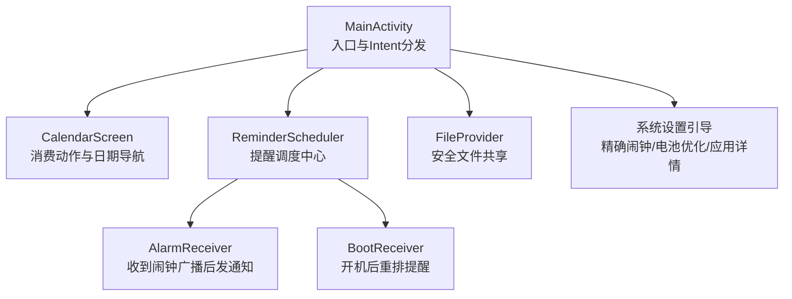
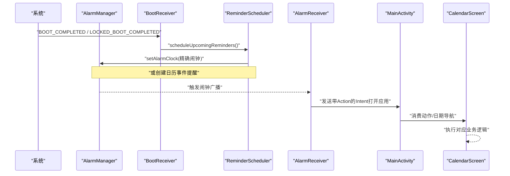
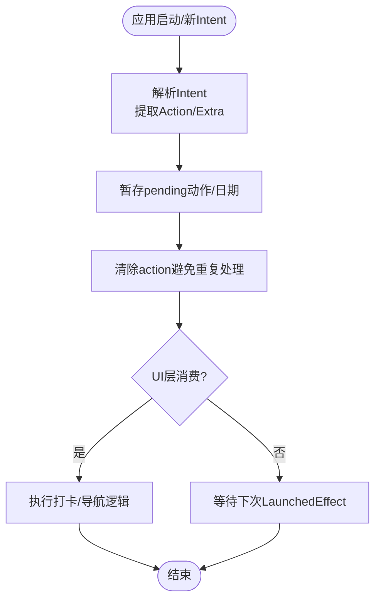
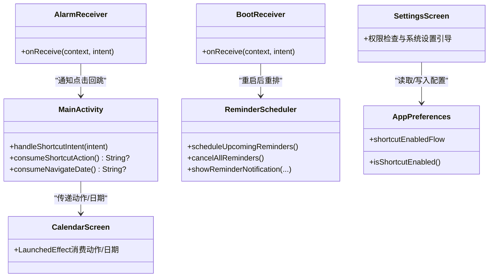

# 系统服务集成

<cite>
**本文引用的文件**
- [MainActivity.kt](file://app/src/main/java/com/schedulecalendar/app/MainActivity.kt)
- [AndroidManifest.xml](file://app/src/main/AndroidManifest.xml)
- [file_paths.xml](file://app/src/main/res/xml/file_paths.xml)
- [shortcuts.xml](file://app/src/main/res/xml/shortcuts.xml)
- [CalendarScreen.kt](file://app/src/main/java/com/schedulecalendar/app/ui/calendar/CalendarScreen.kt)
- [BootReceiver.kt](file://app/src/main/java/com/schedulecalendar/app/reminder/BootReceiver.kt)
- [AlarmReceiver.kt](file://app/src/main/java/com/schedulecalendar/app/reminder/AlarmReceiver.kt)
- [ReminderScheduler.kt](file://app/src/main/java/com/schedulecalendar/app/reminder/ReminderScheduler.kt)
- [SettingsScreen.kt](file://app/src/main/java/com/schedulecalendar/app/ui/settings/SettingsScreen.kt)
- [AppPreferences.kt](file://app/src/main/java/com/schedulecalendar/app/data/prefs/AppPreferences.kt)
</cite>

## 更新摘要
**变更内容**
- 更新了权限声明部分，反映最新的权限优化策略
- 新增了WAKE_LOCK和SCHEDULE_EXACT_ALARM权限说明
- 移除了不必要的存储权限和VIBRATE权限相关描述
- 增强了后台操作可靠性的技术说明

## 目录
1. [简介](#简介)
2. [项目结构](#项目结构)
3. [核心组件](#核心组件)
4. [架构总览](#架构总览)
5. [详细组件分析](#详细组件分析)
6. [依赖关系分析](#依赖关系分析)
7. [性能与可靠性考虑](#性能与可靠性考虑)
8. [故障排查指南](#故障排查指南)
9. [结论](#结论)
10. [附录](#附录)

## 简介
本文件面向"应用与 Android 系统服务深度集成"的实战方案，围绕以下主题展开：
- MainActivity 中的 Intent 处理：快捷方式操作、深链接跳转、外部应用调用
- 桌面快捷方式实现：动态生成与静态配置的管理策略
- 文件系统与安全共享：FileProvider 配置与路径白名单
- 清单文件与权限：组件注册、系统服务绑定、权限声明
- 系统广播接收器：监听开机等系统状态变化
- 系统 API 集成：通知栏、系统设置引导、精确闹钟、电池优化豁免
- 最佳实践与兼容性建议

## 项目结构
本项目采用模块化分层组织，系统服务相关能力主要分布在以下位置：
- 入口与路由：MainActivity 负责启动与 Intent 分发；导航由 Compose Navigation 管理
- 提醒调度：ReminderScheduler 统一编排提醒（AlarmManager 或日历事件）
- 广播接收器：BootReceiver 监听开机完成；AlarmReceiver 触发通知并回跳应用
- 清单与资源：AndroidManifest.xml 集中声明组件、权限、IntentFilter、Provider 等
- 安全文件共享：res/xml/file_paths.xml 定义 FileProvider 可访问路径
- 快捷方式：res/xml/shortcuts.xml 保留占位，实际使用动态快捷方式
- 设置与权限引导：SettingsScreen 提供用户侧权限与系统设置引导

**图表来源**
- [MainActivity.kt:1-223](file://app/src/main/java/com/schedulecalendar/app/MainActivity.kt#L1-L223)
- [CalendarScreen.kt:82-112](file://app/src/main/java/com/schedulecalendar/app/ui/calendar/CalendarScreen.kt#L82-L112)
- [ReminderScheduler.kt:1-421](file://app/src/main/java/com/schedulecalendar/app/reminder/ReminderScheduler.kt#L1-L421)
- [AlarmReceiver.kt:1-78](file://app/src/main/java/com/schedulecalendar/app/reminder/AlarmReceiver.kt#L1-L78)
- [BootReceiver.kt:1-46](file://app/src/main/java/com/schedulecalendar/app/reminder/BootReceiver.kt#L1-L46)
- [AndroidManifest.xml:1-126](file://app/src/main/AndroidManifest.xml#L1-L126)
- [SettingsScreen.kt:340-420](file://app/src/main/java/com/schedulecalendar/app/ui/settings/SettingsScreen.kt#L340-L420)

**章节来源**
- [AndroidManifest.xml:1-126](file://app/src/main/AndroidManifest.xml#L1-L126)
- [MainActivity.kt:1-223](file://app/src/main/java/com/schedulecalendar/app/MainActivity.kt#L1-L223)

## 核心组件
- MainActivity
  - 负责解析来自快捷方式、小组件点击、通知点击的 Intent，并将动作暂存供 UI 层消费
  - 在 onCreate/onNewIntent 中统一处理，避免重复消费
- CalendarScreen
  - 通过 LaunchedEffect 消费 MainActivity 的待处理动作与日期导航参数
- ReminderScheduler
  - 统一调度上下班提醒，支持两种模式：
    - AlarmManager.setAlarmClock 精确闹钟
    - 系统日历事件提醒（由系统日历应用触发通知）
- AlarmReceiver
  - 接收闹钟广播，创建高优先级通知，点击通知回跳应用并携带打卡动作
- BootReceiver
  - 监听开机完成，重新调度未来若干天的提醒
- SettingsScreen
  - 提供权限检查与系统设置引导（精确闹钟、电池优化豁免、应用详情）
- AppPreferences
  - 持久化开关与配置项（如是否启用动态快捷方式、提醒开关与提前分钟数等）

**章节来源**
- [MainActivity.kt:32-160](file://app/src/main/java/com/schedulecalendar/app/MainActivity.kt#L32-L160)
- [CalendarScreen.kt:82-112](file://app/src/main/java/com/schedulecalendar/app/ui/calendar/CalendarScreen.kt#L82-L112)
- [ReminderScheduler.kt:96-178](file://app/src/main/java/com/schedulecalendar/app/reminder/ReminderScheduler.kt#L96-L178)
- [AlarmReceiver.kt:17-78](file://app/src/main/java/com/schedulecalendar/app/reminder/AlarmReceiver.kt#L17-L78)
- [BootReceiver.kt:23-46](file://app/src/main/java/com/schedulecalendar/app/reminder/BootReceiver.kt#L23-L46)
- [SettingsScreen.kt:340-420](file://app/src/main/java/com/schedulecalendar/app/ui/settings/SettingsScreen.kt#L340-L420)
- [AppPreferences.kt:269-278](file://app/src/main/java/com/schedulecalendar/app/data/prefs/AppPreferences.kt#L269-L278)

## 架构总览
下图展示了从系统事件到应用内部处理的端到端流程。

**图表来源**
- [BootReceiver.kt:31-44](file://app/src/main/java/com/schedulecalendar/app/reminder/BootReceiver.kt#L31-L44)
- [ReminderScheduler.kt:221-275](file://app/src/main/java/com/schedulecalendar/app/reminder/ReminderScheduler.kt#L221-L275)
- [AlarmReceiver.kt:19-62](file://app/src/main/java/com/schedulecalendar/app/reminder/AlarmReceiver.kt#L19-L62)
- [MainActivity.kt:128-145](file://app/src/main/java/com/schedulecalendar/app/MainActivity.kt#L128-L145)
- [CalendarScreen.kt:82-112](file://app/src/main/java/com/schedulecalendar/app/ui/calendar/CalendarScreen.kt#L82-L112)

## 详细组件分析

### MainActivity 与 Intent 处理
- 支持的入口场景
  - 快捷方式动作：ACTION_CLOCK_IN / ACTION_CLOCK_OUT
  - 小组件点击导航：EXTRA_NAVIGATE_DATE
  - 通知点击：通过 PendingIntent 携带 Action 打开应用
- 处理策略
  - onCreate/onNewIntent 统一进入 handleShortcutIntent
  - 将动作与日期暂存为 pending 字段，避免重复消费
  - 提供 consumeShortcutAction/consumeNavigateDate 供 UI 层一次性消费
- 与 UI 协作
  - CalendarScreen 在 LaunchedEffect 中消费这些值并执行业务逻辑

**图表来源**
- [MainActivity.kt:128-145](file://app/src/main/java/com/schedulecalendar/app/MainActivity.kt#L128-L145)
- [CalendarScreen.kt:82-112](file://app/src/main/java/com/schedulecalendar/app/ui/calendar/CalendarScreen.kt#L82-L112)

**章节来源**
- [MainActivity.kt:32-160](file://app/src/main/java/com/schedulecalendar/app/MainActivity.kt#L32-L160)
- [CalendarScreen.kt:82-112](file://app/src/main/java/com/schedulecalendar/app/ui/calendar/CalendarScreen.kt#L82-L112)

### 桌面快捷方式：动态与静态
- 静态配置
  - res/xml/shortcuts.xml 已保留占位，注释说明已迁移至动态管理
- 动态生成
  - 应用启动时根据偏好设置决定是否恢复动态快捷方式
  - 通过 ViewModel 方法更新动态快捷方式（具体实现在对应 ViewModel 中）
- 与清单的关系
  - 清单中仍声明了 ACTION_CLOCK_IN/ACTION_CLOCK_OUT 的 IntentFilter，用于兼容直接通过 Action 启动的场景

**章节来源**
- [shortcuts.xml:1-5](file://app/src/main/res/xml/shortcuts.xml#L1-L5)
- [MainActivity.kt:54-62](file://app/src/main/java/com/schedulecalendar/app/MainActivity.kt#L54-L62)
- [AndroidManifest.xml:34-43](file://app/src/main/AndroidManifest.xml#L34-L43)
- [AppPreferences.kt:269-278](file://app/src/main/java/com/schedulecalendar/app/data/prefs/AppPreferences.kt#L269-L278)

### 文件系统与安全共享：FileProvider
- 配置要点
  - 在清单中声明 androidx.core.content.FileProvider，authorities 使用 ${applicationId}.fileprovider
  - 指定 meta-data 指向 res/xml/file_paths.xml
- 路径白名单
  - files-path、external-files-path、cache-path 暴露应用私有目录
  - root-path 覆盖 SAF 选择的自定义备份路径，便于跨存储位置共享
- 使用建议
  - 对外分享文件一律通过 FileProvider.getUriForFile + Content URI
  - 避免直接使用 file:// 路径，确保目标应用具备临时读取权限

**章节来源**
- [AndroidManifest.xml:45-54](file://app/src/main/AndroidManifest.xml#L45-L54)
- [file_paths.xml:1-9](file://app/src/main/res/xml/file_paths.xml#L1-L9)

### 应用清单与权限声明

**更新** 权限优化：移除了不必要的存储权限和VIBRATE权限，新增了WAKE_LOCK和SCHEDULE_EXACT_ALARM权限以改善后台操作可靠性

- 关键权限
  - 通知：POST_NOTIFICATIONS（Android 13+）
  - **新增** WAKE_LOCK：保持设备唤醒，确保后台任务正常执行
  - **新增** SCHEDULE_EXACT_ALARM：Android 12+ 精确闹钟调度权限
  - 精确闹钟：USE_EXACT_ALARM（安装时自动授予）
  - 日历读写：READ_CALENDAR/WRITE_CALENDAR
  - 开机自启：RECEIVE_BOOT_COMPLETED
  - 账户认证：AUTHENTICATE_ACCOUNTS
- 组件注册
  - Activity：MainActivity（exported=true）、WidgetConfigActivity
  - Receiver：ScheduleGlanceReceiver、CalendarGlanceReceiver、BootReceiver、AlarmReceiver、AnniversaryReminderReceiver
  - Service：CalendarAuthenticatorService
- 意图过滤
  - MAIN/LAUNCHER
  - 快捷方式 Action：ACTION_CLOCK_IN/ACTION_CLOCK_OUT
  - 小组件更新与配置
  - 开机完成

**章节来源**
- [AndroidManifest.xml:1-126](file://app/src/main/AndroidManifest.xml#L1-L126)

### 系统广播接收器与系统状态监听
- BootReceiver
  - 监听 BOOT_COMPLETED 与 LOCKED_BOOT_COMPLETED
  - 通过 Hilt EntryPoint 获取 ReminderScheduler，重新调度未来 7 天提醒
- AlarmReceiver
  - 接收闹钟广播，创建高优先级通知
  - 点击通知打开 MainActivity 并携带打卡 Action

**章节来源**
- [BootReceiver.kt:23-46](file://app/src/main/java/com/schedulecalendar/app/reminder/BootReceiver.kt#L23-L46)
- [AlarmReceiver.kt:17-78](file://app/src/main/java/com/schedulecalendar/app/reminder/AlarmReceiver.kt#L17-L78)

### 通知栏与系统设置集成
- 通知
  - 使用 NotificationChannel（IMPORTANCE_HIGH）
  - 通知内容包含类型、时间、班次名，点击回跳应用并触发打卡
- 系统设置引导
  - 精确闹钟：跳转到系统"允许精确闹钟"页面
  - 电池优化豁免：跳转到"忽略电池优化"页面
  - 国产 ROM 后台保障：跳转到应用详情页，提示开启自启动、无限制、后台弹出、锁屏显示等

**章节来源**
- [ReminderScheduler.kt:73-83](file://app/src/main/java/com/schedulecalendar/app/reminder/ReminderScheduler.kt#L73-L83)
- [AlarmReceiver.kt:64-76](file://app/src/main/java/com/schedulecalendar/app/reminder/AlarmReceiver.kt#L64-L76)
- [SettingsScreen.kt:340-420](file://app/src/main/java/com/schedulecalendar/app/ui/settings/SettingsScreen.kt#L340-L420)

### 剪贴板与深链接（通用方案）
- 剪贴板
  - 如需读取系统剪贴板内容，建议使用 ClipboardManager 配合运行时权限判断
  - 注意 Android 10+ 对剪贴板访问的限制与用户可见性要求
- 深链接
  - 若需支持网页/其他应用通过 URL 打开特定页面，可在清单中为 Activity 添加 <intent-filter> 匹配 scheme/host/pathPrefix
  - 在 Activity 中解析 Uri 参数并驱动导航

[本节为通用指导，不直接分析具体文件]

## 依赖关系分析
- 组件耦合
  - MainActivity 与 CalendarScreen 通过"待处理动作/日期"解耦
  - ReminderScheduler 依赖 Repository 与 Preferences，屏蔽底层数据源差异
  - AlarmReceiver/BootReceiver 仅依赖系统服务与 ReminderScheduler 接口
- 外部依赖
  - AlarmManager、NotificationManager、Account Authenticator Service、FileProvider

**图表来源**
- [MainActivity.kt:128-160](file://app/src/main/java/com/schedulecalendar/app/MainActivity.kt#L128-L160)
- [CalendarScreen.kt:82-112](file://app/src/main/java/com/schedulecalendar/app/ui/calendar/CalendarScreen.kt#L82-L112)
- [ReminderScheduler.kt:96-178](file://app/src/main/java/com/schedulecalendar/app/reminder/ReminderScheduler.kt#L96-L178)
- [AlarmReceiver.kt:19-62](file://app/src/main/java/com/schedulecalendar/app/reminder/AlarmReceiver.kt#L19-L62)
- [BootReceiver.kt:31-44](file://app/src/main/java/com/schedulecalendar/app/reminder/BootReceiver.kt#L31-L44)
- [SettingsScreen.kt:340-420](file://app/src/main/java/com/schedulecalendar/app/ui/settings/SettingsScreen.kt#L340-L420)
- [AppPreferences.kt:269-278](file://app/src/main/java/com/schedulecalendar/app/data/prefs/AppPreferences.kt#L269-L278)

## 性能与可靠性考虑

**更新** 后台操作可靠性增强：通过新增WAKE_LOCK和SCHEDULE_EXACT_ALARM权限提升系统服务集成的稳定性

- 精确闹钟优先
  - 使用 setAlarmClock 保证 Doze/省电模式下仍可准时触发
  - 需要精确闹钟权限，USE_EXACT_ALARM 在安装时自动授予
  - **新增** SCHEDULE_EXACT_ALARM 权限为 Android 12+ 提供额外的精确闹钟调度能力
- 批量调度
  - 按窗口（如未来 7 天）批量计算与注册，减少频繁 IO 与系统调用
- 幂等与去重
  - 日历提醒事件通过标题+日期去重，避免重复创建
  - 取消所有提醒后再重建，防止残留
- 资源释放
  - 切换提醒模式或关闭提醒时，清理旧事件与闹钟
- **新增** 后台唤醒管理
  - WAKE_LOCK 权限确保后台任务执行期间设备保持唤醒状态
  - 提高后台操作的可靠性和响应速度

**章节来源**
- [ReminderScheduler.kt:221-275](file://app/src/main/java/com/schedulecalendar/app/reminder/ReminderScheduler.kt#L221-L275)
- [ReminderScheduler.kt:307-353](file://app/src/main/java/com/schedulecalendar/app/reminder/ReminderScheduler.kt#L307-L353)
- [ReminderScheduler.kt:370-380](file://app/src/main/java/com/schedulecalendar/app/reminder/ReminderScheduler.kt#L370-L380)
- [AndroidManifest.xml:5-9](file://app/src/main/AndroidManifest.xml#L5-L9)

## 故障排查指南

**更新** 新增权限相关的故障排查指引

- 通知未显示
  - 检查 POST_NOTIFICATIONS 权限（Android 13+）
  - 确认 NotificationChannel 已创建且 IMPORTANCE 足够
- 闹钟不响
  - 检查 USE_EXACT_ALARM 是否生效（canScheduleExactAlarms）
  - **新增** 检查 SCHEDULE_EXACT_ALARM 权限（Android 12+）
  - 检查电池优化豁免与厂商后台限制（自启动、无限制、后台弹出、锁屏显示）
  - **新增** 确认 WAKE_LOCK 权限可用，确保后台任务能正常执行
- 开机后提醒丢失
  - 确认 BootReceiver 已注册且能接收到 BOOT_COMPLETED/LOCKED_BOOT_COMPLETED
  - 确认 scheduleUpcomingReminders 在 onReceive 中被调用
- 文件分享失败
  - 确认使用 FileProvider 的 content:// URI
  - 检查 file_paths.xml 是否包含所需路径

**章节来源**
- [SettingsScreen.kt:340-420](file://app/src/main/java/com/schedulecalendar/app/ui/settings/SettingsScreen.kt#L340-L420)
- [AlarmReceiver.kt:64-76](file://app/src/main/java/com/schedulecalendar/app/reminder/AlarmReceiver.kt#L64-L76)
- [BootReceiver.kt:31-44](file://app/src/main/java/com/schedulecalendar/app/reminder/BootReceiver.kt#L31-L44)
- [AndroidManifest.xml:45-54](file://app/src/main/AndroidManifest.xml#L45-L54)
- [file_paths.xml:1-9](file://app/src/main/res/xml/file_paths.xml#L1-L9)

## 结论
本项目通过统一的提醒调度器、严格的权限与系统设置引导、安全的文件共享机制以及健壮的 Intent 分发策略，实现了与 Android 系统服务的深度集成。**最新优化**通过移除不必要的权限声明和新增关键的系统权限（WAKE_LOCK、SCHEDULE_EXACT_ALARM），进一步提升了后台操作的可靠性和系统集成的稳定性。建议在后续迭代中继续强化：
- 更完善的错误日志与遥测
- 针对多账户/多日历场景的事件冲突处理
- 对厂商定制系统的适配与自动化检测
- 持续监控权限使用情况，遵循最小权限原则

## 附录
- 关键常量与键名
  - 动作常量：ACTION_CLOCK_IN、ACTION_CLOCK_OUT
  - 额外参数：EXTRA_NAVIGATE_DATE
  - 偏好键：KEY_SHORTCUT_ENABLED、KEY_REMINDER_* 系列
- 清单关键片段定位
  - Activity/Receiver/Service 注册与 IntentFilter
  - FileProvider authorities 与 meta-data
  - 权限声明与 maxSdkVersion 控制
- **新增** 权限优化说明
  - 移除了 READ_EXTERNAL_STORAGE/WRITE_EXTERNAL_STORAGE（maxSdkVersion=32）
  - 移除了 VIBRATE 权限（使用系统默认振动）
  - 新增 WAKE_LOCK 权限确保后台任务可靠性
  - 新增 SCHEDULE_EXACT_ALARM 权限提升精确闹钟调度能力

**章节来源**
- [MainActivity.kt:37-39](file://app/src/main/java/com/schedulecalendar/app/MainActivity.kt#L37-L39)
- [AppPreferences.kt:52-64](file://app/src/main/java/com/schedulecalendar/app/data/prefs/AppPreferences.kt#L52-L64)
- [AndroidManifest.xml:1-126](file://app/src/main/AndroidManifest.xml#L1-L126)