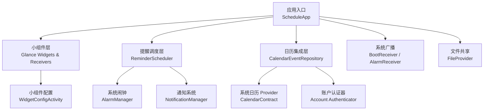
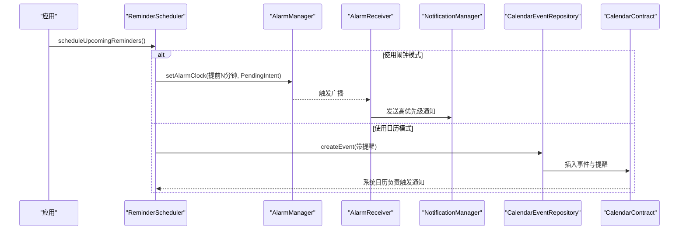
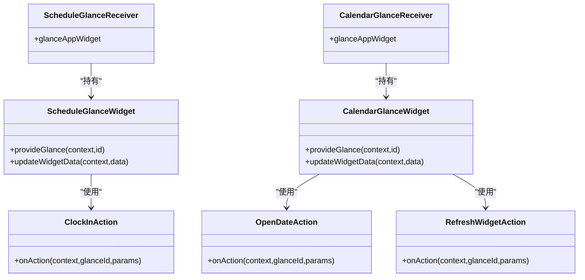
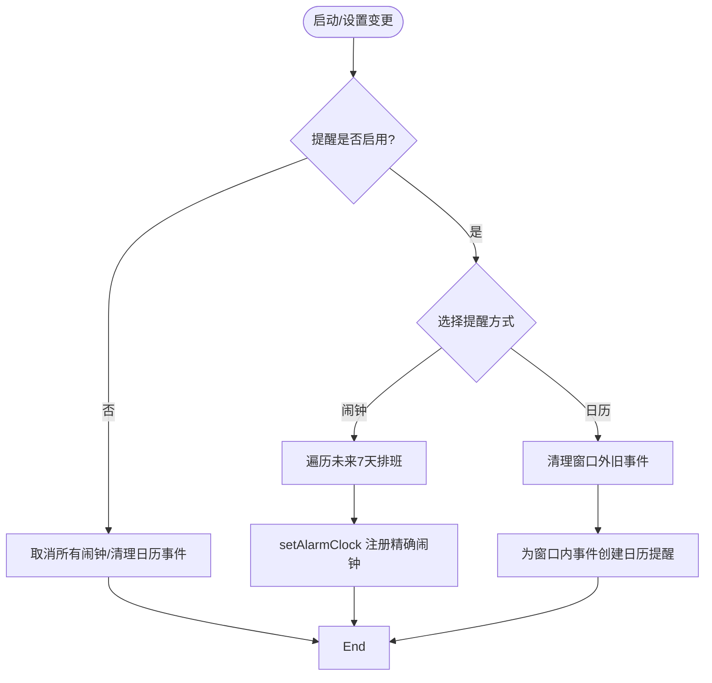
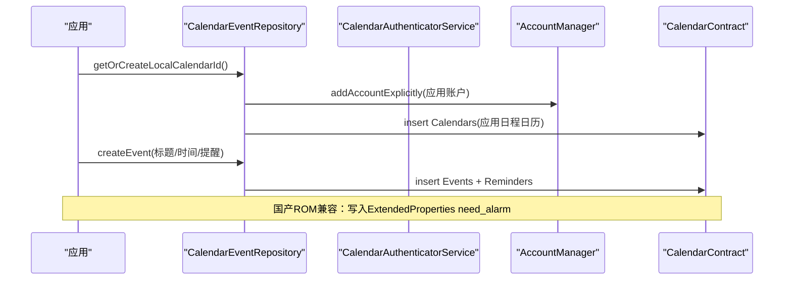
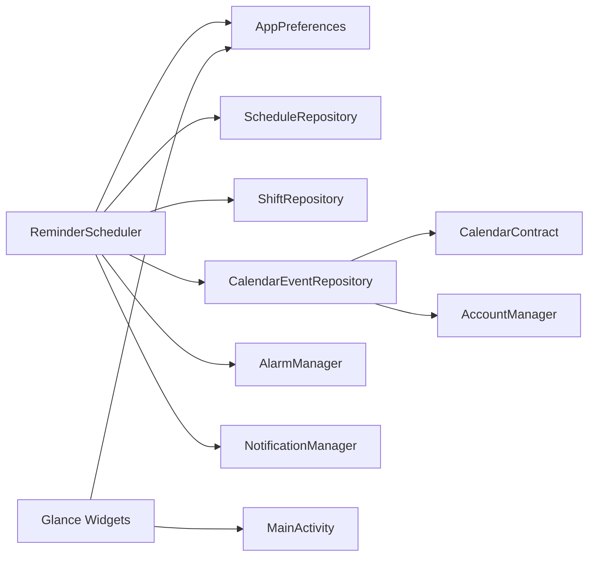

# 系统集成

<cite>
**本文引用的文件**   
- [AndroidManifest.xml](file://app/src/main/AndroidManifest.xml)
- [ScheduleApp.kt](file://app/src/main/java/com/schedulecalendar/app/ScheduleApp.kt)
- [CalendarGlanceWidget.kt](file://app/src/main/java/com/schedulecalendar/app/widget/CalendarGlanceWidget.kt)
- [ScheduleGlanceWidget.kt](file://app/src/main/java/com/schedulecalendar/app/widget/ScheduleGlanceWidget.kt)
- [CalendarGlanceReceiver.kt](file://app/src/main/java/com/schedulecalendar/app/widget/CalendarGlanceReceiver.kt)
- [ScheduleGlanceReceiver.kt](file://app/src/main/java/com/schedulecalendar/app/widget/ScheduleGlanceReceiver.kt)
- [ReminderScheduler.kt](file://app/src/main/java/com/schedulecalendar/app/reminder/ReminderScheduler.kt)
- [AlarmReceiver.kt](file://app/src/main/java/com/schedulecalendar/app/reminder/AlarmReceiver.kt)
- [AnniversaryReminderReceiver.kt](file://app/src/main/java/com/schedulecalendar/app/reminder/AnniversaryReminderReceiver.kt)
- [BootReceiver.kt](file://app/src/main/java/com/schedulecalendar/app/reminder/BootReceiver.kt)
- [CalendarEventRepository.kt](file://app/src/main/java/com/schedulecalendar/app/data/calendar/CalendarEventRepository.kt)
- [CalendarAuthenticatorService.kt](file://app/src/main/java/com/schedulecalendar/app/data/calendar/CalendarAuthenticatorService.kt)
- [CalendarAuthenticator.kt](file://app/src/main/java/com/schedulecalendar/app/data/calendar/CalendarAuthenticator.kt)
- [authenticator.xml](file://app/src/main/res/xml/authenticator.xml)
- [file_paths.xml](file://app/src/main/res/xml/file_paths.xml)
- [shortcuts.xml](file://app/src/main/res/xml/shortcuts.xml)
- [calendar_widget_info.xml](file://app/src/main/res/xml/calendar_widget_info.xml)
- [schedule_widget_info.xml](file://app/src/main/res/xml/schedule_widget_info.xml)
</cite>

## 目录
1. [简介](#简介)
2. [项目结构](#项目结构)
3. [核心组件](#核心组件)
4. [架构总览](#架构总览)
5. [详细组件分析](#详细组件分析)
6. [依赖关系分析](#依赖关系分析)
7. [性能与可靠性考虑](#性能与可靠性考虑)
8. [故障排查指南](#故障排查指南)
9. [结论](#结论)
10. [附录](#附录)

## 简介
本文件面向系统集成视角，全面阐述 Android 排班日历应用与系统服务的深度集成方案，重点覆盖：
- 桌面小组件（Jetpack Glance）开发实现、生命周期管理、数据更新机制
- 提醒通知系统：AlarmManager 精确闹钟、通知渠道、定时任务调度
- 系统日历服务集成：权限管理、事件同步、双向数据同步策略
- 快捷方式操作、文件存储（FileProvider）、系统广播接收器
- 集成注意事项与最佳实践

## 项目结构
应用采用模块化分层组织：
- 应用入口与依赖注入：Application 类启用 Hilt
- 小组件模块：基于 Glance 的 Compose-first 小组件与 Receiver
- 提醒模块：AlarmManager + BroadcastReceiver + NotificationChannel
- 日历集成：CalendarContract 读写、自定义账户认证器
- 资源声明：小组件描述、快捷方式、文件路径、认证器配置等

图表来源
- [ScheduleApp.kt:1-9](file://app/src/main/java/com/schedulecalendar/app/ScheduleApp.kt#L1-L9)
- [CalendarGlanceWidget.kt:1-272](file://app/src/main/java/com/schedulecalendar/app/widget/CalendarGlanceWidget.kt#L1-L272)
- [ScheduleGlanceWidget.kt:1-353](file://app/src/main/java/com/schedulecalendar/app/widget/ScheduleGlanceWidget.kt#L1-L353)
- [ReminderScheduler.kt:1-421](file://app/src/main/java/com/schedulecalendar/app/reminder/ReminderScheduler.kt#L1-L421)
- [CalendarEventRepository.kt:1-759](file://app/src/main/java/com/schedulecalendar/app/data/calendar/CalendarEventRepository.kt#L1-L759)
- [CalendarAuthenticatorService.kt:1-26](file://app/src/main/java/com/schedulecalendar/app/data/calendar/CalendarAuthenticatorService.kt#L1-L26)
- [CalendarAuthenticator.kt:1-75](file://app/src/main/java/com/schedulecalendar/app/data/calendar/CalendarAuthenticator.kt#L1-L75)
- [AndroidManifest.xml:1-128](file://app/src/main/AndroidManifest.xml#L1-L128)

章节来源
- [ScheduleApp.kt:1-9](file://app/src/main/java/com/schedulecalendar/app/ScheduleApp.kt#L1-L9)
- [AndroidManifest.xml:1-128](file://app/src/main/AndroidManifest.xml#L1-L128)

## 核心组件
- 小组件（Glance）
  - 打卡小组件：展示当日班次、上下班时间、节假日倒计时或明日班次；支持一键打卡并刷新状态
  - 日历网格小组件：3x3 网格显示当月日期、班次名称、状态、农历/节日信息；点击跳转主界面指定日期
  - 两者均使用 PreferencesGlanceStateDefinition 持久化状态，通过 GlanceAppWidgetManager 批量更新
- 提醒调度
  - ReminderScheduler 负责读取排班与设置，计算触发时间，注册 setAlarmClock 精确闹钟或创建系统日历事件作为提醒源
  - AlarmReceiver 接收闹钟广播，构建高优先级通知，点击可直达主界面执行对应动作
  - BootReceiver 在开机后重新调度未来 7 天提醒
- 日历集成
  - CalendarEventRepository 提供对 CalendarContract 的读写能力，包含本地日程与纪念日日历的创建与管理
  - CalendarAuthenticatorService + CalendarAuthenticator 注册自定义账户类型，使应用日历在系统账户管理中可见
- 系统级功能
  - FileProvider 暴露应用备份与缓存路径
  - 动态快捷方式（静态 shortcuts.xml 已迁移至动态管理）
  - 系统广播：BOOT_COMPLETED、LOCKED_BOOT_COMPLETED

章节来源
- [CalendarGlanceWidget.kt:1-272](file://app/src/main/java/com/schedulecalendar/app/widget/CalendarGlanceWidget.kt#L1-L272)
- [ScheduleGlanceWidget.kt:1-353](file://app/src/main/java/com/schedulecalendar/app/widget/ScheduleGlanceWidget.kt#L1-L353)
- [ReminderScheduler.kt:1-421](file://app/src/main/java/com/schedulecalendar/app/reminder/ReminderScheduler.kt#L1-L421)
- [AlarmReceiver.kt:1-78](file://app/src/main/java/com/schedulecalendar/app/reminder/AlarmReceiver.kt#L1-L78)
- [AnniversaryReminderReceiver.kt:1-57](file://app/src/main/java/com/schedulecalendar/app/reminder/AnniversaryReminderReceiver.kt#L1-L57)
- [BootReceiver.kt:1-46](file://app/src/main/java/com/schedulecalendar/app/reminder/BootReceiver.kt#L1-L46)
- [CalendarEventRepository.kt:1-759](file://app/src/main/java/com/schedulecalendar/app/data/calendar/CalendarEventRepository.kt#L1-L759)
- [CalendarAuthenticatorService.kt:1-26](file://app/src/main/java/com/schedulecalendar/app/data/calendar/CalendarAuthenticatorService.kt#L1-L26)
- [CalendarAuthenticator.kt:1-75](file://app/src/main/java/com/schedulecalendar/app/data/calendar/CalendarAuthenticator.kt#L1-L75)
- [file_paths.xml:1-9](file://app/src/main/res/xml/file_paths.xml#L1-L9)
- [shortcuts.xml:1-5](file://app/src/main/res/xml/shortcuts.xml#L1-L5)

## 架构总览
整体架构围绕“数据源 → 业务调度 → 系统服务”展开：
- 数据源：本地数据库（排班、班次、状态等），外部系统日历
- 业务调度：ReminderScheduler 聚合排班与设置，决定使用 AlarmManager 或系统日历事件
- 系统服务：AlarmManager、NotificationManager、CalendarContract、Account Authenticator、FileProvider

图表来源
- [ReminderScheduler.kt:96-178](file://app/src/main/java/com/schedulecalendar/app/reminder/ReminderScheduler.kt#L96-L178)
- [ReminderScheduler.kt:221-275](file://app/src/main/java/com/schedulecalendar/app/reminder/ReminderScheduler.kt#L221-L275)
- [ReminderScheduler.kt:307-353](file://app/src/main/java/com/schedulecalendar/app/reminder/ReminderScheduler.kt#L307-L353)
- [AlarmReceiver.kt:19-62](file://app/src/main/java/com/schedulecalendar/app/reminder/AlarmReceiver.kt#L19-L62)
- [CalendarEventRepository.kt:275-330](file://app/src/main/java/com/schedulecalendar/app/data/calendar/CalendarEventRepository.kt#L275-L330)

## 详细组件分析

### 桌面小组件（Glance）
- 生命周期与渲染
  - GlanceAppWidget 重写 provideGlance 返回 Composable UI
  - 通过 PreferencesGlanceStateDefinition 持久化 JSON 数据，避免每次渲染都查询数据库
  - GlanceAppWidgetManager.getGlanceIds 遍历所有实例进行批量更新
- 交互与导航
  - OpenDateAction：点击日期单元格跳转到 MainActivity 并携带目标日期参数
  - ClockInAction：记录当天上班/下班时间到 SharedPreferences，并刷新当前小组件
  - RefreshWidgetAction：强制刷新当前小组件
- 主题与尺寸适配
  - 根据 LocalSize 判断大屏/小屏，调整字体与间距
  - 从配置偏好中读取文本颜色、背景色及透明度，统一转换为 ColorProvider

图表来源
- [ScheduleGlanceWidget.kt:58-81](file://app/src/main/java/com/schedulecalendar/app/widget/ScheduleGlanceWidget.kt#L58-L81)
- [CalendarGlanceWidget.kt:52-71](file://app/src/main/java/com/schedulecalendar/app/widget/CalendarGlanceWidget.kt#L52-L71)
- [ScheduleGlanceReceiver.kt:11-13](file://app/src/main/java/com/schedulecalendar/app/widget/ScheduleGlanceReceiver.kt#L11-L13)
- [CalendarGlanceReceiver.kt:11-13](file://app/src/main/java/com/schedulecalendar/app/widget/CalendarGlanceReceiver.kt#L11-L13)
- [ScheduleGlanceWidget.kt:85-128](file://app/src/main/java/com/schedulecalendar/app/widget/ScheduleGlanceWidget.kt#L85-L128)
- [CalendarGlanceWidget.kt:73-91](file://app/src/main/java/com/schedulecalendar/app/widget/CalendarGlanceWidget.kt#L73-L91)

章节来源
- [ScheduleGlanceWidget.kt:1-353](file://app/src/main/java/com/schedulecalendar/app/widget/ScheduleGlanceWidget.kt#L1-L353)
- [CalendarGlanceWidget.kt:1-272](file://app/src/main/java/com/schedulecalendar/app/widget/CalendarGlanceWidget.kt#L1-L272)
- [schedule_widget_info.xml:1-16](file://app/src/main/res/xml/schedule_widget_info.xml#L1-L16)
- [calendar_widget_info.xml:1-18](file://app/src/main/res/xml/calendar_widget_info.xml#L1-L18)

### 提醒通知系统（AlarmManager + 通知渠道）
- 调度流程
  - scheduleUpcomingReminders 读取用户设置与未来排班，按方法选择“闹钟”或“日历”模式
  - 闹钟模式：setAlarmClock 注册精确闹钟，确保 Doze/省电模式下可靠触发
  - 日历模式：创建系统日历事件并设置提醒，由系统日历负责触发通知
- 通知呈现
  - AlarmReceiver 解析意图参数，构建高优先级通知，点击打开主界面并触发对应动作
  - 通知渠道在首次使用时创建，保证 Android 8.0+ 行为一致
- 开机恢复
  - BootReceiver 监听 BOOT_COMPLETED/LOCKED_BOOT_COMPLETED，通过 Hilt EntryPoint 获取 ReminderScheduler 并重新调度

图表来源
- [ReminderScheduler.kt:96-178](file://app/src/main/java/com/schedulecalendar/app/reminder/ReminderScheduler.kt#L96-L178)
- [ReminderScheduler.kt:221-275](file://app/src/main/java/com/schedulecalendar/app/reminder/ReminderScheduler.kt#L221-L275)
- [ReminderScheduler.kt:307-353](file://app/src/main/java/com/schedulecalendar/app/reminder/ReminderScheduler.kt#L307-L353)
- [BootReceiver.kt:31-44](file://app/src/main/java/com/schedulecalendar/app/reminder/BootReceiver.kt#L31-L44)

章节来源
- [ReminderScheduler.kt:1-421](file://app/src/main/java/com/schedulecalendar/app/reminder/ReminderScheduler.kt#L1-L421)
- [AlarmReceiver.kt:1-78](file://app/src/main/java/com/schedulecalendar/app/reminder/AlarmReceiver.kt#L1-L78)
- [AnniversaryReminderReceiver.kt:1-57](file://app/src/main/java/com/schedulecalendar/app/reminder/AnniversaryReminderReceiver.kt#L1-L57)
- [BootReceiver.kt:1-46](file://app/src/main/java/com/schedulecalendar/app/reminder/BootReceiver.kt#L1-L46)

### 系统日历服务集成（权限、事件同步、双向同步）
- 权限与账户
  - 清单声明 READ_CALENDAR/WRITE_CALENDAR、AUTHENTICATE_ACCOUNTS
  - CalendarAuthenticatorService 与 authenticator.xml 注册自定义账户类型，使应用日历在系统账户管理中可见
- 事件读写
  - getOrCreateLocalCalendarId/getOrCreateAnniversaryCalendarId 自动创建应用本地日历与纪念日日历
  - createEvent/updateEvent/deleteEvent 封装标准 CalendarContract 操作，支持 RRULE、提醒、扩展属性（国产 ROM 兼容）
  - getAllEvents/getEventsForDate 支持年度重复纪念日匹配与区间筛选
- 双向同步策略
  - 应用侧：以本地数据库为主数据源，将排班/纪念日写入系统日历（仅用于提醒与展示）
  - 系统侧：允许用户在系统日历编辑事件，应用侧定期拉取最新事件列表进行合并展示
  - 去重与清理：通过标题前缀与日期范围识别应用创建的提醒事件，避免污染系统日历

图表来源
- [CalendarEventRepository.kt:412-517](file://app/src/main/java/com/schedulecalendar/app/data/calendar/CalendarEventRepository.kt#L412-L517)
- [CalendarEventRepository.kt:275-330](file://app/src/main/java/com/schedulecalendar/app/data/calendar/CalendarEventRepository.kt#L275-L330)
- [CalendarAuthenticatorService.kt:13-25](file://app/src/main/java/com/schedulecalendar/app/data/calendar/CalendarAuthenticatorService.kt#L13-L25)
- [authenticator.xml:1-7](file://app/src/main/res/xml/authenticator.xml#L1-L7)

章节来源
- [CalendarEventRepository.kt:1-759](file://app/src/main/java/com/schedulecalendar/app/data/calendar/CalendarEventRepository.kt#L1-L759)
- [CalendarAuthenticatorService.kt:1-26](file://app/src/main/java/com/schedulecalendar/app/data/calendar/CalendarAuthenticatorService.kt#L1-L26)
- [CalendarAuthenticator.kt:1-75](file://app/src/main/java/com/schedulecalendar/app/data/calendar/CalendarAuthenticator.kt#L1-L75)
- [authenticator.xml:1-7](file://app/src/main/res/xml/authenticator.xml#L1-L7)

### 快捷方式与文件存储
- 快捷方式
  - 静态 shortcuts.xml 已迁移至动态管理，主界面通过 Intent Filters 处理 ACTION_CLOCK_IN/ACTION_CLOCK_OUT
- 文件存储
  - FileProvider 暴露 backups、external_backups、cache、root 路径，便于备份与分享

章节来源
- [AndroidManifest.xml:36-56](file://app/src/main/AndroidManifest.xml#L36-L56)
- [shortcuts.xml:1-5](file://app/src/main/res/xml/shortcuts.xml#L1-L5)
- [file_paths.xml:1-9](file://app/src/main/res/xml/file_paths.xml#L1-L9)

## 依赖关系分析
- 组件耦合
  - ReminderScheduler 依赖 AppPreferences、ScheduleRepository、ShiftRepository、CalendarEventRepository
  - 小组件通过 Glance 状态与 SharedPreferences 解耦数据源，降低直接依赖
  - 日历仓库独立封装 CalendarContract 与 AccountManager，对外暴露简洁 API
- 外部依赖
  - AlarmManager、NotificationManager、CalendarContract、Account Authenticator、FileProvider

图表来源
- [ReminderScheduler.kt:39-45](file://app/src/main/java/com/schedulecalendar/app/reminder/ReminderScheduler.kt#L39-L45)
- [CalendarEventRepository.kt:47-49](file://app/src/main/java/com/schedulecalendar/app/data/calendar/CalendarEventRepository.kt#L47-L49)
- [ScheduleGlanceWidget.kt:326-337](file://app/src/main/java/com/schedulecalendar/app/widget/ScheduleGlanceWidget.kt#L326-L337)
- [CalendarGlanceWidget.kt:73-83](file://app/src/main/java/com/schedulecalendar/app/widget/CalendarGlanceWidget.kt#L73-L83)

章节来源
- [ReminderScheduler.kt:1-421](file://app/src/main/java/com/schedulecalendar/app/reminder/ReminderScheduler.kt#L1-L421)
- [CalendarEventRepository.kt:1-759](file://app/src/main/java/com/schedulecalendar/app/data/calendar/CalendarEventRepository.kt#L1-L759)
- [ScheduleGlanceWidget.kt:1-353](file://app/src/main/java/com/schedulecalendar/app/widget/ScheduleGlanceWidget.kt#L1-L353)
- [CalendarGlanceWidget.kt:1-272](file://app/src/main/java/com/schedulecalendar/app/widget/CalendarGlanceWidget.kt#L1-L272)

## 性能与可靠性考虑
- 小组件
  - 使用 PreferencesGlanceStateDefinition 减少频繁 IO；批量更新所有实例避免遗漏
  - 大/小屏自适应布局，避免过度绘制
- 提醒调度
  - setAlarmClock 提高精确度与唤醒优先级，规避 Doze/省电限制
  - 日历模式利用系统提醒，降低应用常驻开销
  - 开机后统一重建提醒，避免遗漏
- 日历访问
  - 批量加载日历信息避免 N+1 查询
  - 通过标题前缀与日期范围去重，防止重复事件

[本节为通用指导，不直接分析具体文件]

## 故障排查指南
- 无法收到提醒
  - 检查是否授予精确闹钟权限（USE_EXACT_ALARM）与通知权限（POST_NOTIFICATIONS）
  - 确认 AlarmManager.canScheduleExactAlarms 返回 true
  - 查看是否处于闹钟模式还是日历模式，相应清理旧事件
- 日历事件未显示或未触发
  - 确认 WRITE_CALENDAR 权限已授权
  - 检查应用本地日历是否存在且可见
  - 验证 ExtendedProperties need_alarm 是否写入成功（部分 ROM 不支持则回退）
- 小组件不更新
  - 确认 updateWidgetData 被调用且 GlanceAppWidgetManager 获取到实例
  - 检查 PreferencesGlanceStateDefinition 键值是否正确序列化/反序列化
- 开机后提醒丢失
  - 确认 BootReceiver 已注册并监听到 BOOT_COMPLETED/LOCKED_BOOT_COMPLETED
  - 检查 Hilt EntryPoint 是否能正确获取 ReminderScheduler

章节来源
- [ReminderScheduler.kt:221-275](file://app/src/main/java/com/schedulecalendar/app/reminder/ReminderScheduler.kt#L221-L275)
- [CalendarEventRepository.kt:412-517](file://app/src/main/java/com/schedulecalendar/app/data/calendar/CalendarEventRepository.kt#L412-L517)
- [BootReceiver.kt:31-44](file://app/src/main/java/com/schedulecalendar/app/reminder/BootReceiver.kt#L31-L44)
- [AndroidManifest.xml:1-14](file://app/src/main/AndroidManifest.xml#L1-L14)

## 结论
本方案通过 Glance 小组件提升桌面体验，结合 AlarmManager 与系统日历双通道提醒保障可靠性，并以 CalendarContract 与自定义账户认证器实现与系统日历的深度集成。配合 FileProvider 与动态快捷方式，形成完整的系统集成闭环。建议在发布前充分测试不同 ROM 的行为差异，完善权限引导与错误提示。

[本节为总结性内容，不直接分析具体文件]

## 附录
- 清单关键权限与服务/接收器声明
  - 权限：READ_EXTERNAL_STORAGE、WRITE_EXTERNAL_STORAGE、MANAGE_EXTERNAL_STORAGE、POST_NOTIFICATIONS、VIBRATE、READ_CALENDAR、WRITE_CALENDAR、USE_EXACT_ALARM、RECEIVE_BOOT_COMPLETED、AUTHENTICATE_ACCOUNTS
  - 服务：CalendarAuthenticatorService
  - 接收器：ScheduleGlanceReceiver、CalendarGlanceReceiver、AlarmReceiver、AnniversaryReminderReceiver、BootReceiver
  - Activity：WidgetConfigActivity、MainActivity（含快捷方式 Intent Filters）
  - Provider：FileProvider（file_paths.xml）

章节来源
- [AndroidManifest.xml:1-128](file://app/src/main/AndroidManifest.xml#L1-L128)
- [file_paths.xml:1-9](file://app/src/main/res/xml/file_paths.xml#L1-L9)
- [shortcuts.xml:1-5](file://app/src/main/res/xml/shortcuts.xml#L1-L5)
- [authenticator.xml:1-7](file://app/src/main/res/xml/authenticator.xml#L1-L7)