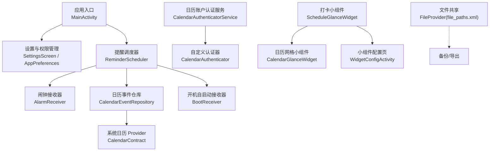
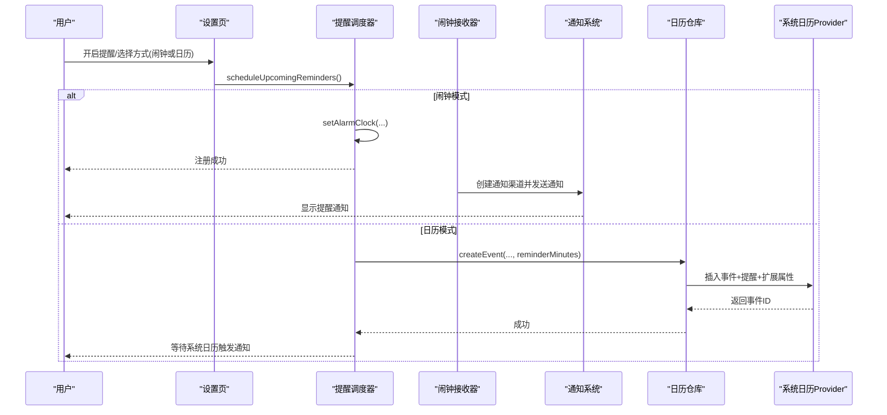
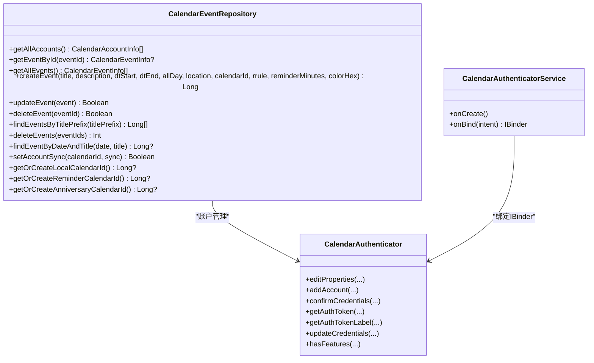
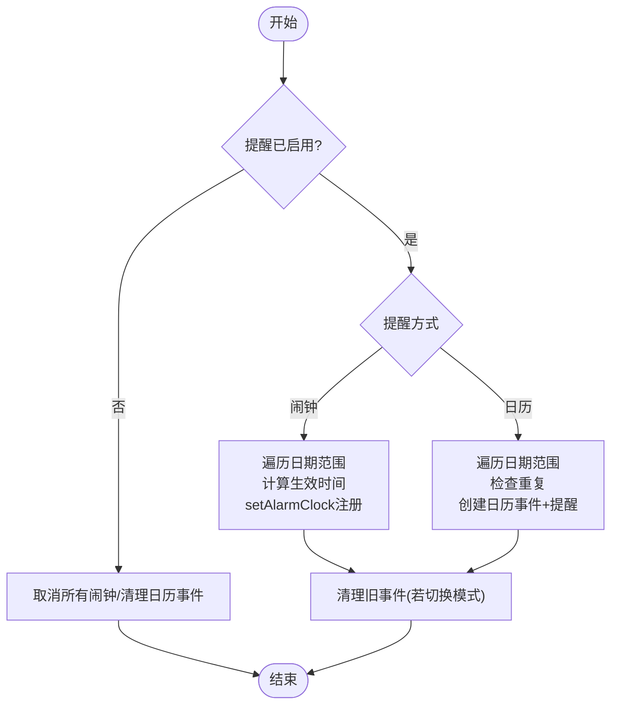
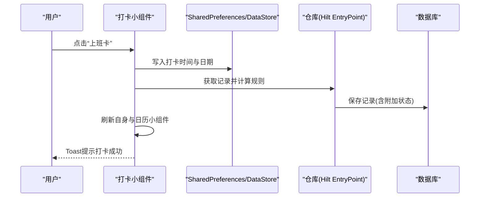
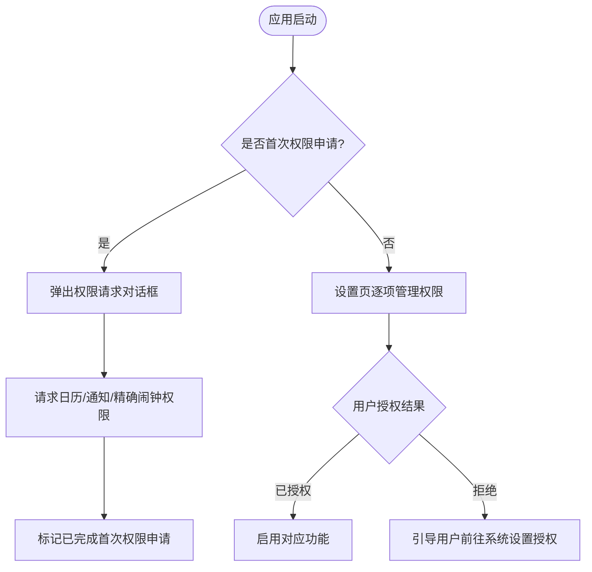
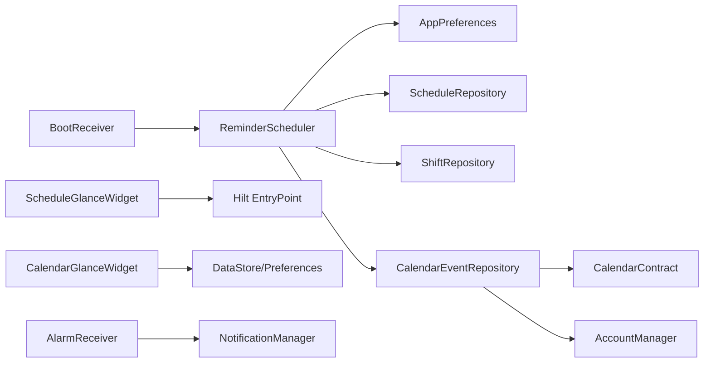

# 系统集成

<cite>
**本文引用的文件**   
- [AndroidManifest.xml](file://app/src/main/AndroidManifest.xml)
- [CalendarEventRepository.kt](file://app/src/main/java/com/schedulecalendar/app/data/calendar/CalendarEventRepository.kt)
- [CalendarAuthenticator.kt](file://app/src/main/java/com/schedulecalendar/app/data/calendar/CalendarAuthenticator.kt)
- [CalendarAuthenticatorService.kt](file://app/src/main/java/com/schedulecalendar/app/data/calendar/CalendarAuthenticatorService.kt)
- [ReminderScheduler.kt](file://app/src/main/java/com/schedulecalendar/app/reminder/ReminderScheduler.kt)
- [AlarmReceiver.kt](file://app/src/main/java/com/schedulecalendar/app/reminder/AlarmReceiver.kt)
- [BootReceiver.kt](file://app/src/main/java/com/schedulecalendar/app/reminder/BootReceiver.kt)
- [AnniversaryReminderReceiver.kt](file://app/src/main/java/com/schedulecalendar/app/reminder/AnniversaryReminderReceiver.kt)
- [CalendarGlanceWidget.kt](file://app/src/main/java/com/schedulecalendar/app/widget/CalendarGlanceWidget.kt)
- [ScheduleGlanceWidget.kt](file://app/src/main/java/com/schedulecalendar/app/widget/ScheduleGlanceWidget.kt)
- [WidgetConfigActivity.kt](file://app/src/main/java/com/schedulecalendar/app/widget/WidgetConfigActivity.kt)
- [AppPreferences.kt](file://app/src/main/java/com/schedulecalendar/app/data/prefs/AppPreferences.kt)
- [file_paths.xml](file://app/src/main/res/xml/file_paths.xml)
- [authenticator.xml](file://app/src/main/res/xml/authenticator.xml)
- [SettingsScreen.kt](file://app/src/main/java/com/schedulecalendar/app/ui/settings/SettingsScreen.kt)
- [MainActivity.kt](file://app/src/main/java/com/schedulecalendar/app/MainActivity.kt)
</cite>

## 目录
1. [简介](#简介)
2. [项目结构](#项目结构)
3. [核心组件](#核心组件)
4. [架构总览](#架构总览)
5. [详细组件分析](#详细组件分析)
6. [依赖关系分析](#依赖关系分析)
7. [性能考量](#性能考量)
8. [故障排查指南](#故障排查指南)
9. [结论](#结论)
10. [附录](#附录)

## 简介
本文件面向 Android 排班日历应用的系统集成，重点覆盖以下方面：
- 系统日历 API 集成：事件读写、账户与权限处理、同步机制
- 提醒调度系统：闹钟提醒、日历事件提醒、开机自启动恢复
- Glance 桌面小组件：开发与状态同步机制
- 通知系统与权限管理
- 文件系统操作（FileProvider）、快捷方式配置、与其他系统服务交互
- 最佳实践与常见问题解决方案

## 项目结构
应用采用模块化组织，围绕数据层（数据库、偏好、仓库）、业务层（提醒调度、日历仓库）、UI 层（Compose 界面）以及系统集成分层清晰。关键入口包括主 Activity、接收器（闹钟、开机）、服务（日历账户认证）、以及 Glance 小组件。

**图表来源** 
- [AndroidManifest.xml:1-126](file://app/src/main/AndroidManifest.xml#L1-L126)
- [CalendarEventRepository.kt:1-820](file://app/src/main/java/com/schedulecalendar/app/data/calendar/CalendarEventRepository.kt#L1-L820)
- [ReminderScheduler.kt:1-497](file://app/src/main/java/com/schedulecalendar/app/reminder/ReminderScheduler.kt#L1-L497)
- [AlarmReceiver.kt:1-78](file://app/src/main/java/com/schedulecalendar/app/reminder/AlarmReceiver.kt#L1-L78)
- [BootReceiver.kt:1-46](file://app/src/main/java/com/schedulecalendar/app/reminder/BootReceiver.kt#L1-L46)
- [CalendarGlanceWidget.kt:1-307](file://app/src/main/java/com/schedulecalendar/app/widget/CalendarGlanceWidget.kt#L1-L307)
- [ScheduleGlanceWidget.kt:1-633](file://app/src/main/java/com/schedulecalendar/app/widget/ScheduleGlanceWidget.kt#L1-L633)
- [WidgetConfigActivity.kt:1-400](file://app/src/main/java/com/schedulecalendar/app/widget/WidgetConfigActivity.kt#L1-L400)
- [AppPreferences.kt:1-313](file://app/src/main/java/com/schedulecalendar/app/data/prefs/AppPreferences.kt#L1-L313)
- [file_paths.xml:1-9](file://app/src/main/res/xml/file_paths.xml#L1-L9)
- [authenticator.xml:1-7](file://app/src/main/res/xml/authenticator.xml#L1-L7)

**章节来源**
- [AndroidManifest.xml:1-126](file://app/src/main/AndroidManifest.xml#L1-L126)

## 核心组件
- 系统日历仓库：封装 CalendarContract 的账户、日历、事件 CRUD，支持国产 ROM 兼容扩展属性
- 提醒调度器：基于 AlarmManager.setAlarmClock 或系统日历事件实现上下班提醒，支持跨午夜与请假/调休调整
- 接收器：闹钟触发通知、纪念日到期通知、开机后重新调度提醒
- Glance 小组件：打卡与日历网格两个小组件，使用 PreferencesGlanceStateDefinition 持久化状态并支持刷新
- 偏好存储：DataStore + SharedPreferences 混合，集中管理提醒、小组件、权限等配置
- 文件共享：FileProvider 暴露备份路径，支持 SAF 自定义路径

**章节来源**
- [CalendarEventRepository.kt:1-820](file://app/src/main/java/com/schedulecalendar/app/data/calendar/CalendarEventRepository.kt#L1-L820)
- [ReminderScheduler.kt:1-497](file://app/src/main/java/com/schedulecalendar/app/reminder/ReminderScheduler.kt#L1-L497)
- [AlarmReceiver.kt:1-78](file://app/src/main/java/com/schedulecalendar/app/reminder/AlarmReceiver.kt#L1-L78)
- [BootReceiver.kt:1-46](file://app/src/main/java/com/schedulecalendar/app/reminder/BootReceiver.kt#L1-L46)
- [CalendarGlanceWidget.kt:1-307](file://app/src/main/java/com/schedulecalendar/app/widget/CalendarGlanceWidget.kt#L1-L307)
- [ScheduleGlanceWidget.kt:1-633](file://app/src/main/java/com/schedulecalendar/app/widget/ScheduleGlanceWidget.kt#L1-L633)
- [AppPreferences.kt:1-313](file://app/src/main/java/com/schedulecalendar/app/data/prefs/AppPreferences.kt#L1-L313)
- [file_paths.xml:1-9](file://app/src/main/res/xml/file_paths.xml#L1-L9)

## 架构总览
系统通过“调度器 + 接收器 + 仓库”的模式完成提醒与日历集成；小组件通过 Glance 与 DataStore/SharedPreferences 进行状态同步；权限由设置页统一管理与申请。

**图表来源** 
- [ReminderScheduler.kt:101-203](file://app/src/main/java/com/schedulecalendar/app/reminder/ReminderScheduler.kt#L101-L203)
- [ReminderScheduler.kt:301-353](file://app/src/main/java/com/schedulecalendar/app/reminder/ReminderScheduler.kt#L301-L353)
- [ReminderScheduler.kt:385-430](file://app/src/main/java/com/schedulecalendar/app/reminder/ReminderScheduler.kt#L385-L430)
- [CalendarEventRepository.kt:283-337](file://app/src/main/java/com/schedulecalendar/app/data/calendar/CalendarEventRepository.kt#L283-L337)
- [AlarmReceiver.kt:19-62](file://app/src/main/java/com/schedulecalendar/app/reminder/AlarmReceiver.kt#L19-L62)

## 详细组件分析

### 系统日历 API 集成（事件读写、权限与同步）
- 账户与日历
  - 自定义账户类型与应用包名一致，通过 AccountAuthenticator 在系统账户管理中可见
  - 自动创建“日程”、“纪念日”、“提醒”三类本地日历，颜色区分，支持名称更新
- 事件读写
  - 批量加载日历信息避免 N+1 查询
  - 创建事件时设置 HAS_ALARM 与 Reminders，同时写入 ExtendedProperties 以兼容国产 ROM
  - 提供按标题前缀查找、去重、批量删除等方法
- 权限与同步
  - 需要 READ_CALENDAR/WRITE_CALENDAR 权限
  - 首次创建账户时启用 ContentResolver 同步标志

**图表来源** 
- [CalendarEventRepository.kt:1-820](file://app/src/main/java/com/schedulecalendar/app/data/calendar/CalendarEventRepository.kt#L1-L820)
- [CalendarAuthenticator.kt:1-75](file://app/src/main/java/com/schedulecalendar/app/data/calendar/CalendarAuthenticator.kt#L1-L75)
- [CalendarAuthenticatorService.kt:1-26](file://app/src/main/java/com/schedulecalendar/app/data/calendar/CalendarAuthenticatorService.kt#L1-L26)

**章节来源**
- [CalendarEventRepository.kt:66-114](file://app/src/main/java/com/schedulecalendar/app/data/calendar/CalendarEventRepository.kt#L66-L114)
- [CalendarEventRepository.kt:283-337](file://app/src/main/java/com/schedulecalendar/app/data/calendar/CalendarEventRepository.kt#L283-L337)
- [CalendarEventRepository.kt:417-516](file://app/src/main/java/com/schedulecalendar/app/data/calendar/CalendarEventRepository.kt#L417-L516)
- [CalendarEventRepository.kt:525-581](file://app/src/main/java/com/schedulecalendar/app/data/calendar/CalendarEventRepository.kt#L525-L581)
- [CalendarEventRepository.kt:589-645](file://app/src/main/java/com/schedulecalendar/app/data/calendar/CalendarEventRepository.kt#L589-L645)
- [authenticator.xml:1-7](file://app/src/main/res/xml/authenticator.xml#L1-L7)

### 提醒调度系统（闹钟、日历事件、开机自启动）
- 两种提醒模式
  - 闹钟模式：使用 AlarmManager.setAlarmClock 保证高可靠性，即使 Doze/省电模式也能触发
  - 日历模式：在系统日历中创建带提醒的事件，由系统日历应用负责通知
- 时间计算与边界处理
  - 支持跨午夜班次下班提醒推后一天
  - 内置请假/调休可排除时间段，取最长有效工作段作为提醒时间
- 清理策略
  - 窗口内（前3天到后5天）事件保留，超出窗口自动清理
  - 切换模式时强制清理另一模式的残留事件
- 开机自启动
  - BootReceiver 监听 BOOT_COMPLETED/LOCKED_BOOT_COMPLETED，重新调度未来7天提醒

**图表来源** 
- [ReminderScheduler.kt:101-203](file://app/src/main/java/com/schedulecalendar/app/reminder/ReminderScheduler.kt#L101-L203)
- [ReminderScheduler.kt:301-353](file://app/src/main/java/com/schedulecalendar/app/reminder/ReminderScheduler.kt#L301-L353)
- [ReminderScheduler.kt:385-430](file://app/src/main/java/com/schedulecalendar/app/reminder/ReminderScheduler.kt#L385-L430)
- [BootReceiver.kt:31-44](file://app/src/main/java/com/schedulecalendar/app/reminder/BootReceiver.kt#L31-L44)

**章节来源**
- [ReminderScheduler.kt:101-203](file://app/src/main/java/com/schedulecalendar/app/reminder/ReminderScheduler.kt#L101-L203)
- [ReminderScheduler.kt:244-287](file://app/src/main/java/com/schedulecalendar/app/reminder/ReminderScheduler.kt#L244-L287)
- [ReminderScheduler.kt:358-372](file://app/src/main/java/com/schedulecalendar/app/reminder/ReminderScheduler.kt#L358-L372)
- [BootReceiver.kt:31-44](file://app/src/main/java/com/schedulecalendar/app/reminder/BootReceiver.kt#L31-L44)

### Glance 桌面小组件（开发与状态同步）
- 打卡小组件（2x1）
  - 展示当天班次、上下班时间、明日班次或节假日倒计时
  - 点击按钮执行打卡逻辑，优先写入 SharedPreferences 即时刷新，再持久化到数据库
  - 支持内置班次+自定义附加状态的规则处理（迟到/早退自动填充附加状态）
- 日历网格小组件（3x3）
  - 显示当月日期、星期、农历/节假日、班次与附加状态
  - 支持深色模式、背景透明度、刷新按钮
- 状态同步
  - 使用 PreferencesGlanceStateDefinition 将 JSON 序列化数据写入 DataStore
  - WidgetConfigActivity 保存样式配置并同步刷新两个小组件

**图表来源** 
- [ScheduleGlanceWidget.kt:115-194](file://app/src/main/java/com/schedulecalendar/app/widget/ScheduleGlanceWidget.kt#L115-L194)
- [ScheduleGlanceWidget.kt:218-299](file://app/src/main/java/com/schedulecalendar/app/widget/ScheduleGlanceWidget.kt#L218-L299)
- [ScheduleGlanceWidget.kt:319-325](file://app/src/main/java/com/schedulecalendar/app/widget/ScheduleGlanceWidget.kt#L319-L325)
- [CalendarGlanceWidget.kt:61-73](file://app/src/main/java/com/schedulecalendar/app/widget/CalendarGlanceWidget.kt#L61-L73)
- [WidgetConfigActivity.kt:92-114](file://app/src/main/java/com/schedulecalendar/app/widget/WidgetConfigActivity.kt#L92-L114)

**章节来源**
- [ScheduleGlanceWidget.kt:1-633](file://app/src/main/java/com/schedulecalendar/app/widget/ScheduleGlanceWidget.kt#L1-L633)
- [CalendarGlanceWidget.kt:1-307](file://app/src/main/java/com/schedulecalendar/app/widget/CalendarGlanceWidget.kt#L1-L307)
- [WidgetConfigActivity.kt:1-400](file://app/src/main/java/com/schedulecalendar/app/widget/WidgetConfigActivity.kt#L1-L400)

### 通知系统与权限管理
- 通知渠道
  - 上下班提醒与纪念日提醒分别创建高优先级渠道
  - 接收器中确保渠道存在，避免崩溃
- 权限声明与申请
  - 清单声明 POST_NOTIFICATIONS、READ_CALENDAR、WRITE_CALENDAR、USE_EXACT_ALARM、SCHEDULE_EXACT_ALARM、RECEIVE_BOOT_COMPLETED、AUTHENTICATE_ACCOUNTS
  - 首次启动弹窗请求多项权限，设置页提供逐项授权入口
  - Android 12/13 精确闹钟权限差异处理

**图表来源** 
- [AndroidManifest.xml:4-11](file://app/src/main/AndroidManifest.xml#L4-L11)
- [MainActivity.kt:178-204](file://app/src/main/java/com/schedulecalendar/app/MainActivity.kt#L178-L204)
- [SettingsScreen.kt:199-336](file://app/src/main/java/com/schedulecalendar/app/ui/settings/SettingsScreen.kt#L199-L336)
- [AlarmReceiver.kt:64-76](file://app/src/main/java/com/schedulecalendar/app/reminder/AlarmReceiver.kt#L64-L76)
- [AnniversaryReminderReceiver.kt:38-56](file://app/src/main/java/com/schedulecalendar/app/reminder/AnniversaryReminderReceiver.kt#L38-L56)

**章节来源**
- [AndroidManifest.xml:4-11](file://app/src/main/AndroidManifest.xml#L4-L11)
- [MainActivity.kt:178-204](file://app/src/main/java/com/schedulecalendar/app/MainActivity.kt#L178-L204)
- [SettingsScreen.kt:199-336](file://app/src/main/java/com/schedulecalendar/app/ui/settings/SettingsScreen.kt#L199-L336)

### 文件系统操作、快捷方式与系统服务交互
- 文件共享
  - FileProvider 暴露 backups 与 cache 路径，支持 SAF 自定义备份路径
- 快捷方式
  - 主 Activity 声明 ACTION_CLOCK_IN/ACTION_CLOCK_OUT 的 IntentFilter，用于动态快捷方式跳转
- 系统服务
  - AlarmManager 精确闹钟
  - NotificationManager 通知渠道与通知
  - AccountManager 账户管理
  - ContentResolver 日历 Provider 访问

**章节来源**
- [file_paths.xml:1-9](file://app/src/main/res/xml/file_paths.xml#L1-L9)
- [AndroidManifest.xml:34-43](file://app/src/main/AndroidManifest.xml#L34-L43)
- [ReminderScheduler.kt:67-88](file://app/src/main/java/com/schedulecalendar/app/reminder/ReminderScheduler.kt#L67-L88)
- [CalendarEventRepository.kt:426-445](file://app/src/main/java/com/schedulecalendar/app/data/calendar/CalendarEventRepository.kt#L426-L445)

## 依赖关系分析
- 模块耦合
  - ReminderScheduler 依赖 AppPreferences、ScheduleRepository、ShiftRepository、CalendarEventRepository
  - Glance 小组件通过 Hilt EntryPoint 访问 Repository，避免直接耦合
  - 日历仓库依赖系统 CalendarContract 与 AccountManager
- 外部依赖
  - Android 系统服务：AlarmManager、NotificationManager、ContentResolver、AccountManager
  - Jetpack：Glance、DataStore、Hilt

**图表来源** 
- [ReminderScheduler.kt:43-49](file://app/src/main/java/com/schedulecalendar/app/reminder/ReminderScheduler.kt#L43-L49)
- [CalendarEventRepository.kt:47-49](file://app/src/main/java/com/schedulecalendar/app/data/calendar/CalendarEventRepository.kt#L47-L49)
- [ScheduleGlanceWidget.kt:626-632](file://app/src/main/java/com/schedulecalendar/app/widget/ScheduleGlanceWidget.kt#L626-L632)
- [CalendarGlanceWidget.kt:55-56](file://app/src/main/java/com/schedulecalendar/app/widget/CalendarGlanceWidget.kt#L55-L56)
- [AlarmReceiver.kt:17-18](file://app/src/main/java/com/schedulecalendar/app/reminder/AlarmReceiver.kt#L17-L18)
- [BootReceiver.kt:23-29](file://app/src/main/java/com/schedulecalendar/app/reminder/BootReceiver.kt#L23-L29)

**章节来源**
- [ReminderScheduler.kt:43-49](file://app/src/main/java/com/schedulecalendar/app/reminder/ReminderScheduler.kt#L43-L49)
- [CalendarEventRepository.kt:47-49](file://app/src/main/java/com/schedulecalendar/app/data/calendar/CalendarEventRepository.kt#L47-L49)
- [ScheduleGlanceWidget.kt:626-632](file://app/src/main/java/com/schedulecalendar/app/widget/ScheduleGlanceWidget.kt#L626-L632)
- [CalendarGlanceWidget.kt:55-56](file://app/src/main/java/com/schedulecalendar/app/widget/CalendarGlanceWidget.kt#L55-L56)

## 性能考量
- 批量加载日历信息避免 N+1 查询，提升 getAllEvents 性能
- 使用 setAlarmClock 提高闹钟可靠性，减少被系统优化影响
- 小组件状态序列化与增量更新，减少 UI 渲染开销
- 清理策略限制窗口范围，避免系统日历污染

[本节为通用指导，不直接分析具体文件]

## 故障排查指南
- 通知未显示
  - 检查通知渠道是否创建成功
  - 确认 POST_NOTIFICATIONS 权限已授予
- 闹钟未触发
  - 检查 USE_EXACT_ALARM/SCHEDULE_EXACT_ALARM 权限与 canScheduleExactAlarms
  - 确认设备未被严格省电策略拦截
- 日历事件未出现
  - 确认 READ/WRITE_CALENDAR 权限
  - 检查自定义账户与日历是否创建成功
  - 国产 ROM 需 ExtendedProperties need_alarm 标志
- 小组件不刷新
  - 检查 Glance 状态是否写入成功
  - 调用 update 方法触发重渲染
- 开机后提醒丢失
  - 确认 BootReceiver 已注册且收到 BOOT_COMPLETED
  - 检查 scheduleUpcomingReminders 是否执行

**章节来源**
- [AlarmReceiver.kt:64-76](file://app/src/main/java/com/schedulecalendar/app/reminder/AlarmReceiver.kt#L64-L76)
- [ReminderScheduler.kt:301-353](file://app/src/main/java/com/schedulecalendar/app/reminder/ReminderScheduler.kt#L301-L353)
- [CalendarEventRepository.kt:367-386](file://app/src/main/java/com/schedulecalendar/app/data/calendar/CalendarEventRepository.kt#L367-L386)
- [BootReceiver.kt:31-44](file://app/src/main/java/com/schedulecalendar/app/reminder/BootReceiver.kt#L31-L44)

## 结论
本系统集成方案通过清晰的职责划分与可靠的系统服务调用，实现了稳定的提醒与日历集成。Glance 小组件提供了便捷的桌面交互体验，配合完善的权限管理与清理策略，确保用户体验与系统兼容性。建议在生产环境中持续监控权限状态与系统行为差异，尤其是国产 ROM 的适配。

[本节为总结性内容，不直接分析具体文件]

## 附录
- 清单权限说明
  - POST_NOTIFICATIONS：通知权限（Android 13+）
  - READ_CALENDAR/WRITE_CALENDAR：日历读写
  - USE_EXACT_ALARM/SCHEDULE_EXACT_ALARM：精确闹钟
  - RECEIVE_BOOT_COMPLETED：开机广播
  - AUTHENTICATE_ACCOUNTS：账户认证服务
- 关键资源
  - authenticator.xml：自定义账户类型配置
  - file_paths.xml：文件共享路径配置

**章节来源**
- [AndroidManifest.xml:4-11](file://app/src/main/AndroidManifest.xml#L4-L11)
- [authenticator.xml:1-7](file://app/src/main/res/xml/authenticator.xml#L1-L7)
- [file_paths.xml:1-9](file://app/src/main/res/xml/file_paths.xml#L1-L9)