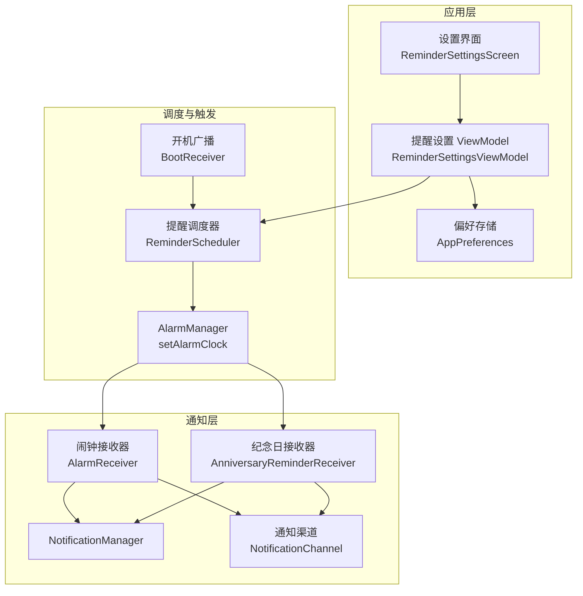
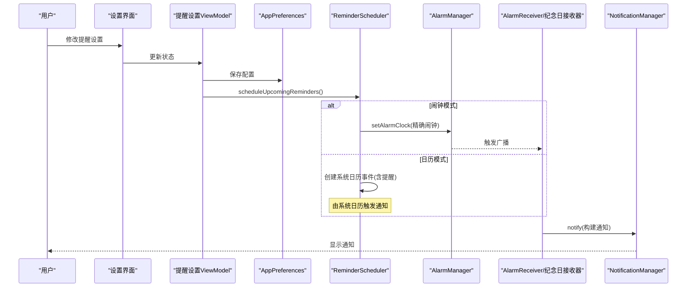
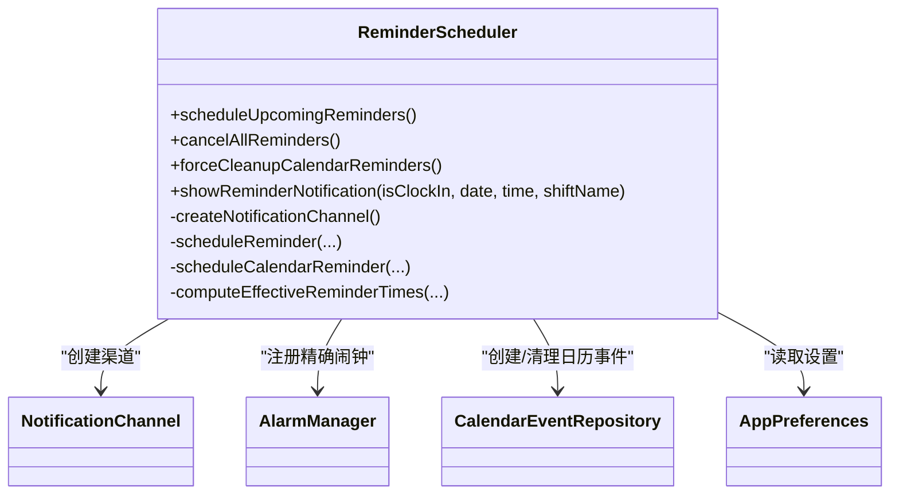
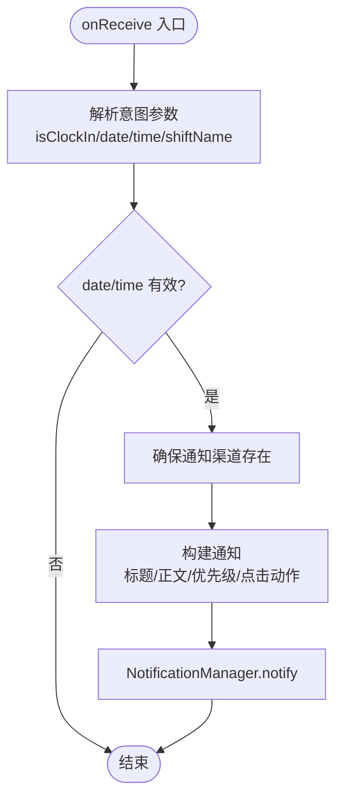
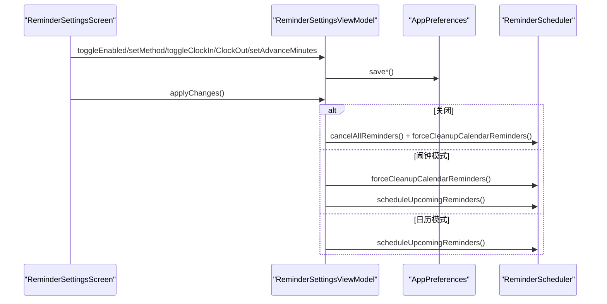
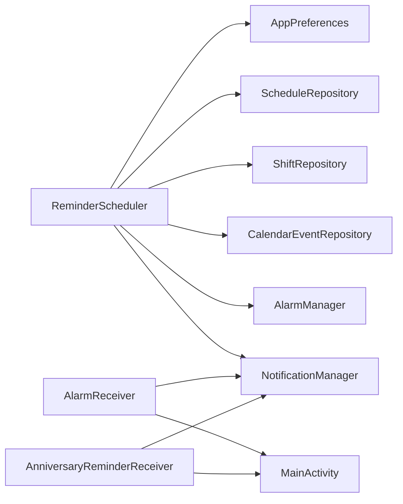

# 通知系统

<cite>
**本文引用的文件**   
- [AndroidManifest.xml](file://app/src/main/AndroidManifest.xml)
- [MainActivity.kt](file://app/src/main/java/com/schedulecalendar/app/MainActivity.kt)
- [ReminderScheduler.kt](file://app/src/main/java/com/schedulecalendar/app/reminder/ReminderScheduler.kt)
- [AlarmReceiver.kt](file://app/src/main/java/com/schedulecalendar/app/reminder/AlarmReceiver.kt)
- [AnniversaryReminderReceiver.kt](file://app/src/main/java/com/schedulecalendar/app/reminder/AnniversaryReminderReceiver.kt)
- [BootReceiver.kt](file://app/src/main/java/com/schedulecalendar/app/reminder/BootReceiver.kt)
- [ReminderSettingsScreen.kt](file://app/src/main/java/com/schedulecalendar/app/ui/settings/ReminderSettingsScreen.kt)
- [ReminderSettingsViewModel.kt](file://app/src/main/java/com/schedulecalendar/app/ui/settings/ReminderSettingsViewModel.kt)
- [AppPreferences.kt](file://app/src/main/java/com/schedulecalendar/app/data/prefs/AppPreferences.kt)
</cite>

## 目录
1. [简介](#简介)
2. [项目结构](#项目结构)
3. [核心组件](#核心组件)
4. [架构总览](#架构总览)
5. [详细组件分析](#详细组件分析)
6. [依赖关系分析](#依赖关系分析)
7. [性能与可靠性](#性能与可靠性)
8. [故障排查指南](#故障排查指南)
9. [结论](#结论)
10. [附录：最佳实践与兼容性清单](#附录最佳实践与兼容性清单)

## 简介
本文件系统性梳理应用的通知体系，覆盖 Android 通知渠道创建、通知样式配置、行为定制；详细说明打卡通知、提醒通知与系统日历通知的实现差异；阐述通知权限申请流程与用户授权处理；说明与系统设置集成（勿扰模式、电池优化）；并给出显示策略、声音振动配置、通知栏管理与最佳实践。

## 项目结构
通知相关代码集中在 reminder 包与设置界面中，配合 Manifest 声明接收器与权限，通过 AlarmManager 精确触发，再由 BroadcastReceiver 构建并发送通知。

**图表来源** 
- [ReminderSettingsScreen.kt:35-76](file://app/src/main/java/com/schedulecalendar/app/ui/settings/ReminderSettingsScreen.kt#L35-L76)
- [ReminderSettingsViewModel.kt:42-176](file://app/src/main/java/com/schedulecalendar/app/ui/settings/ReminderSettingsViewModel.kt#L42-L176)
- [ReminderScheduler.kt:71-88](file://app/src/main/java/com/schedulecalendar/app/reminder/ReminderScheduler.kt#L71-L88)
- [AlarmReceiver.kt:17-77](file://app/src/main/java/com/schedulecalendar/app/reminder/AlarmReceiver.kt#L17-L77)
- [AnniversaryReminderReceiver.kt:14-56](file://app/src/main/java/com/schedulecalendar/app/reminder/AnniversaryReminderReceiver.kt#L14-L56)
- [BootReceiver.kt:23-45](file://app/src/main/java/com/schedulecalendar/app/reminder/BootReceiver.kt#L23-L45)

**章节来源**
- [AndroidManifest.xml:92-110](file://app/src/main/AndroidManifest.xml#L92-L110)
- [ReminderSettingsScreen.kt:35-76](file://app/src/main/java/com/schedulecalendar/app/ui/settings/ReminderSettingsScreen.kt#L35-L76)
- [ReminderSettingsViewModel.kt:42-176](file://app/src/main/java/com/schedulecalendar/app/ui/settings/ReminderSettingsViewModel.kt#L42-L176)
- [ReminderScheduler.kt:71-88](file://app/src/main/java/com/schedulecalendar/app/reminder/ReminderScheduler.kt#L71-L88)

## 核心组件
- 提醒调度器 ReminderScheduler：负责读取排班与用户设置，计算触发时间，使用 AlarmManager.setAlarmClock 注册精确闹钟或创建系统日历事件；同时维护通知渠道。
- 闹钟接收器 AlarmReceiver：接收闹钟广播，构建并发送上下班打卡提醒通知。
- 纪念日接收器 AnniversaryReminderReceiver：接收纪念日闹钟广播，构建并发送纪念日提醒通知。
- 开机接收器 BootReceiver：设备重启后重新调度未来 N 天的提醒。
- 设置界面与 ViewModel：提供开关、方式选择（闹钟/日历）、内容勾选、提前分钟数设置，并在退出时统一应用变更。
- 偏好存储 AppPreferences：持久化提醒开关、方式、内容与提前分钟等配置。

**章节来源**
- [ReminderScheduler.kt:28-49](file://app/src/main/java/com/schedulecalendar/app/reminder/ReminderScheduler.kt#L28-L49)
- [AlarmReceiver.kt:17-77](file://app/src/main/java/com/schedulecalendar/app/reminder/AlarmReceiver.kt#L17-L77)
- [AnniversaryReminderReceiver.kt:14-56](file://app/src/main/java/com/schedulecalendar/app/reminder/AnniversaryReminderReceiver.kt#L14-L56)
- [BootReceiver.kt:23-45](file://app/src/main/java/com/schedulecalendar/app/reminder/BootReceiver.kt#L23-L45)
- [ReminderSettingsScreen.kt:35-76](file://app/src/main/java/com/schedulecalendar/app/ui/settings/ReminderSettingsScreen.kt#L35-L76)
- [ReminderSettingsViewModel.kt:42-176](file://app/src/main/java/com/schedulecalendar/app/ui/settings/ReminderSettingsViewModel.kt#L42-L176)
- [AppPreferences.kt:199-248](file://app/src/main/java/com/schedulecalendar/app/data/prefs/AppPreferences.kt#L199-L248)

## 架构总览
整体流程：用户在设置页调整提醒配置 → ViewModel 保存至 DataStore → ReminderScheduler 根据方法选择“闹钟”或“日历”路径 → 使用 AlarmManager.setAlarmClock 注册精确闹钟或写入系统日历事件 → 到点触发对应 Receiver → 构建并发送通知。

**图表来源** 
- [ReminderSettingsScreen.kt:35-76](file://app/src/main/java/com/schedulecalendar/app/ui/settings/ReminderSettingsScreen.kt#L35-L76)
- [ReminderSettingsViewModel.kt:161-176](file://app/src/main/java/com/schedulecalendar/app/ui/settings/ReminderSettingsViewModel.kt#L161-L176)
- [ReminderScheduler.kt:101-203](file://app/src/main/java/com/schedulecalendar/app/reminder/ReminderScheduler.kt#L101-L203)
- [AlarmReceiver.kt:19-62](file://app/src/main/java/com/schedulecalendar/app/reminder/AlarmReceiver.kt#L19-L62)

## 详细组件分析

### 提醒调度器 ReminderScheduler
- 职责
  - 初始化并创建通知渠道（Android 8.0+）。
  - 根据用户设置与排班数据，计算触发时间，支持跨午夜与请假/调休的生效时段计算。
  - 两种提醒方式：
    - 闹钟模式：使用 setAlarmClock 注册精确闹钟，保证在 Doze/省电模式下可靠触发。
    - 日历模式：创建系统日历事件并设置提醒，由系统日历应用触发通知。
  - 清理窗口外旧事件，避免污染系统日历。
  - 暴露 showReminderNotification 供接收器调用或直接构建通知。

- 关键实现要点
  - 精确闹钟权限检查：API 31+ 使用 canScheduleExactAlarms 防御性校验。
  - PendingIntent 使用 FLAG_IMMUTABLE 与 UPDATE_CURRENT 组合，确保兼容性与可替换性。
  - 通知 ID 区分上班/下班，便于独立管理。
  - 点击通知打开 MainActivity 并携带动作常量以执行打卡。

**图表来源** 
- [ReminderScheduler.kt:71-88](file://app/src/main/java/com/schedulecalendar/app/reminder/ReminderScheduler.kt#L71-L88)
- [ReminderScheduler.kt:101-203](file://app/src/main/java/com/schedulecalendar/app/reminder/ReminderScheduler.kt#L101-L203)
- [ReminderScheduler.kt:301-353](file://app/src/main/java/com/schedulecalendar/app/reminder/ReminderScheduler.kt#L301-L353)
- [ReminderScheduler.kt:385-430](file://app/src/main/java/com/schedulecalendar/app/reminder/ReminderScheduler.kt#L385-L430)
- [ReminderScheduler.kt:461-496](file://app/src/main/java/com/schedulecalendar/app/reminder/ReminderScheduler.kt#L461-L496)

**章节来源**
- [ReminderScheduler.kt:71-88](file://app/src/main/java/com/schedulecalendar/app/reminder/ReminderScheduler.kt#L71-L88)
- [ReminderScheduler.kt:101-203](file://app/src/main/java/com/schedulecalendar/app/reminder/ReminderScheduler.kt#L101-L203)
- [ReminderScheduler.kt:301-353](file://app/src/main/java/com/schedulecalendar/app/reminder/ReminderScheduler.kt#L301-L353)
- [ReminderScheduler.kt:385-430](file://app/src/main/java/com/schedulecalendar/app/reminder/ReminderScheduler.kt#L385-L430)
- [ReminderScheduler.kt:461-496](file://app/src/main/java/com/schedulecalendar/app/reminder/ReminderScheduler.kt#L461-L496)

### 闹钟接收器 AlarmReceiver
- 职责：接收闹钟广播，构造打卡提醒通知并发送。
- 关键点：
  - 动态创建通知渠道（若不存在），保障兼容性。
  - 根据 isClockIn 决定标题、正文与通知 ID。
  - 点击通知打开 MainActivity 并触发对应打卡动作。

**图表来源** 
- [AlarmReceiver.kt:19-62](file://app/src/main/java/com/schedulecalendar/app/reminder/AlarmReceiver.kt#L19-L62)
- [AlarmReceiver.kt:64-77](file://app/src/main/java/com/schedulecalendar/app/reminder/AlarmReceiver.kt#L64-L77)

**章节来源**
- [AlarmReceiver.kt:19-62](file://app/src/main/java/com/schedulecalendar/app/reminder/AlarmReceiver.kt#L19-L62)
- [AlarmReceiver.kt:64-77](file://app/src/main/java/com/schedulecalendar/app/reminder/AlarmReceiver.kt#L64-L77)

### 纪念日接收器 AnniversaryReminderReceiver
- 职责：接收纪念日闹钟广播，构建并发送纪念日提醒通知。
- 关键点：
  - 独立渠道 ID 与名称，避免与打卡提醒混淆。
  - 基于标题哈希生成稳定且分散的通知 ID，避免重复覆盖。

**章节来源**
- [AnniversaryReminderReceiver.kt:14-56](file://app/src/main/java/com/schedulecalendar/app/reminder/AnniversaryReminderReceiver.kt#L14-L56)

### 开机自启动 BootReceiver
- 职责：设备重启后重新调度未来 N 天的提醒，防止系统清除闹钟导致失效。
- 关键点：通过 Hilt EntryPoint 获取 ReminderScheduler 单例，在 IO 线程执行调度。

**章节来源**
- [BootReceiver.kt:23-45](file://app/src/main/java/com/schedulecalendar/app/reminder/BootReceiver.kt#L23-L45)

### 设置界面与 ViewModel
- 功能：
  - 总开关、提醒方式（闹钟/日历）、内容（上班/下班）、提前分钟数。
  - 切换日历模式前请求 READ/WRITE_CALENDAR 权限。
  - 退出页面时统一应用变更：关闭则取消所有提醒并清理日历事件；闹钟模式清理日历事件并重新调度；日历模式重新创建日历事件。

**图表来源** 
- [ReminderSettingsScreen.kt:35-76](file://app/src/main/java/com/schedulecalendar/app/ui/settings/ReminderSettingsScreen.kt#L35-L76)
- [ReminderSettingsViewModel.kt:161-176](file://app/src/main/java/com/schedulecalendar/app/ui/settings/ReminderSettingsViewModel.kt#L161-L176)

**章节来源**
- [ReminderSettingsScreen.kt:35-76](file://app/src/main/java/com/schedulecalendar/app/ui/settings/ReminderSettingsScreen.kt#L35-L76)
- [ReminderSettingsViewModel.kt:86-123](file://app/src/main/java/com/schedulecalendar/app/ui/settings/ReminderSettingsViewModel.kt#L86-L123)
- [ReminderSettingsViewModel.kt:161-176](file://app/src/main/java/com/schedulecalendar/app/ui/settings/ReminderSettingsViewModel.kt#L161-L176)

### 通知渠道与样式
- 渠道创建：
  - 上下班提醒渠道：ID 为 work_reminder，名称“上下班提醒”，重要性 HIGH。
  - 纪念日提醒渠道：ID 为 anniversary_reminder，名称“纪念日提醒”，重要性 HIGH。
- 通知样式：
  - 小图标使用系统默认图标。
  - 标题与正文按场景拼接（是否包含班次名、类型标签）。
  - 优先级设置为高，自动取消。
  - 点击通知打开 MainActivity 并携带 ACTION_CLOCK_IN/ACTION_CLOCK_OUT。

**章节来源**
- [ReminderScheduler.kt:71-88](file://app/src/main/java/com/schedulecalendar/app/reminder/ReminderScheduler.kt#L71-L88)
- [ReminderScheduler.kt:461-496](file://app/src/main/java/com/schedulecalendar/app/reminder/ReminderScheduler.kt#L461-L496)
- [AlarmReceiver.kt:51-62](file://app/src/main/java/com/schedulecalendar/app/reminder/AlarmReceiver.kt#L51-L62)
- [AnniversaryReminderReceiver.kt:30-41](file://app/src/main/java/com/schedulecalendar/app/reminder/AnniversaryReminderReceiver.kt#L30-L41)

### 权限与系统设置集成
- 权限声明（Manifest）：
  - POST_NOTIFICATIONS（Android 13+ 运行时请求）
  - WAKE_LOCK
  - READ_CALENDAR / WRITE_CALENDAR（日历模式需要）
  - USE_EXACT_ALARM / SCHEDULE_EXACT_ALARM（精确闹钟）
  - RECEIVE_BOOT_COMPLETED（开机重调度）
- 运行时权限：
  - 首次启动弹窗引导请求日历与通知权限。
  - 切换日历模式前检查并请求日历读写权限。
  - Android 12（API 31-32）需用户手动授权精确闹钟；Android 13+ 安装时自动授予。
- 电池优化豁免：
  - 检测并提示用户将应用加入白名单，提升后台稳定性。
- 勿扰模式：
  - 通知优先级设为高，尽量穿透；具体表现受系统策略影响。

**章节来源**
- [AndroidManifest.xml:4-11](file://app/src/main/AndroidManifest.xml#L4-L11)
- [MainActivity.kt:176-214](file://app/src/main/java/com/schedulecalendar/app/MainActivity.kt#L176-L214)
- [ReminderSettingsViewModel.kt:86-123](file://app/src/main/java/com/schedulecalendar/app/ui/settings/ReminderSettingsViewModel.kt#L86-L123)

## 依赖关系分析
- ReminderScheduler 依赖：
  - AppPreferences：读取提醒开关、方式、内容与提前分钟。
  - ScheduleRepository / ShiftRepository：获取排班与班次时间。
  - CalendarEventRepository：创建/查询/删除系统日历事件。
  - AlarmManager：注册精确闹钟。
  - NotificationManager：创建渠道与发送通知。
- 接收器依赖：
  - NotificationManager：发送通知。
  - MainActivity：点击跳转与动作分发。

**图表来源** 
- [ReminderScheduler.kt:28-49](file://app/src/main/java/com/schedulecalendar/app/reminder/ReminderScheduler.kt#L28-L49)
- [AlarmReceiver.kt:17-77](file://app/src/main/java/com/schedulecalendar/app/reminder/AlarmReceiver.kt#L17-L77)
- [AnniversaryReminderReceiver.kt:14-56](file://app/src/main/java/com/schedulecalendar/app/reminder/AnniversaryReminderReceiver.kt#L14-L56)

**章节来源**
- [ReminderScheduler.kt:28-49](file://app/src/main/java/com/schedulecalendar/app/reminder/ReminderScheduler.kt#L28-L49)
- [AlarmReceiver.kt:17-77](file://app/src/main/java/com/schedulecalendar/app/reminder/AlarmReceiver.kt#L17-L77)
- [AnniversaryReminderReceiver.kt:14-56](file://app/src/main/java/com/schedulecalendar/app/reminder/AnniversaryReminderReceiver.kt#L14-L56)

## 性能与可靠性
- 精确闹钟：使用 setAlarmClock 保证在 Doze/省电模式下仍可靠触发。
- 跨午夜处理：下班提醒可能延后至次日，避免误触。
- 请假/调休：排除无效时间段，取最长有效段作为提醒时间。
- 窗口清理：仅保留前 3 天至后 5 天的日历事件，减少系统日历污染。
- 开机恢复：BOOT_COMPLETED 后重新调度，保证重启后不丢失提醒。
- PendingIntent 标志：FLAG_IMMUTABLE 与 UPDATE_CURRENT 兼顾安全与可替换。

[本节为通用指导，无需引用具体文件]

## 故障排查指南
- 通知未显示
  - 检查 Android 13+ 是否已授予 POST_NOTIFICATIONS。
  - 确认通知渠道是否存在且未被用户静音/屏蔽。
- 闹钟未触发
  - 检查 API 31-32 是否已授予精确闹钟权限。
  - 检查电池优化白名单是否开启。
  - 查看是否被系统省电策略限制。
- 日历提醒异常
  - 确认 READ/WRITE_CALENDAR 权限已授予。
  - 检查是否创建了正确的日历账户与事件。
- 点击通知无响应
  - 检查 MainActivity 的 Intent Action 是否正确传递与处理。

**章节来源**
- [AndroidManifest.xml:4-11](file://app/src/main/AndroidManifest.xml#L4-L11)
- [MainActivity.kt:176-214](file://app/src/main/java/com/schedulecalendar/app/MainActivity.kt#L176-L214)
- [ReminderScheduler.kt:301-353](file://app/src/main/java/com/schedulecalendar/app/reminder/ReminderScheduler.kt#L301-L353)

## 结论
本通知系统通过“闹钟/日历双通道”保障提醒的可靠性与兼容性，结合精确闹钟、权限引导、电池优化白名单与开机恢复机制，形成完整的提醒闭环。设置界面清晰易用，支持灵活配置。建议在生产环境中持续监控权限状态与系统策略变化，确保用户体验稳定一致。

[本节为总结性内容，无需引用具体文件]

## 附录：最佳实践与兼容性清单
- 通知渠道
  - 每个业务类别使用独立渠道 ID 与名称，重要性合理设置。
  - 首次使用前确保渠道已创建。
- 通知样式
  - 标题简洁明确，正文包含关键信息（如班次名、时间）。
  - 设置高优先级与自动取消，提升可见性与易操作性。
- 行为定制
  - 点击通知应直达目标页面或执行快捷操作（如打卡）。
  - 使用稳定的 notificationId 区分不同业务。
- 权限与系统设置
  - 分阶段引导用户授予必要权限，解释原因。
  - 针对 Android 12/13 的差异进行适配。
  - 引导加入电池优化白名单以提升后台稳定性。
- 显示策略
  - 考虑勿扰模式与系统聚合策略，必要时提供“重要提醒”标识。
- 声音与振动
  - 依据渠道重要性配置声音与振动；对敏感场景提供静默选项。
- 通知栏管理
  - 合理使用 autoCancel、grouping、ongoing 等属性控制展示行为。
- 兼容性
  - PendingIntent 使用 FLAG_IMMUTABLE 与 UPDATE_CURRENT。
  - 对 API 级别分支处理权限与能力差异。

[本节为通用指导，无需引用具体文件]