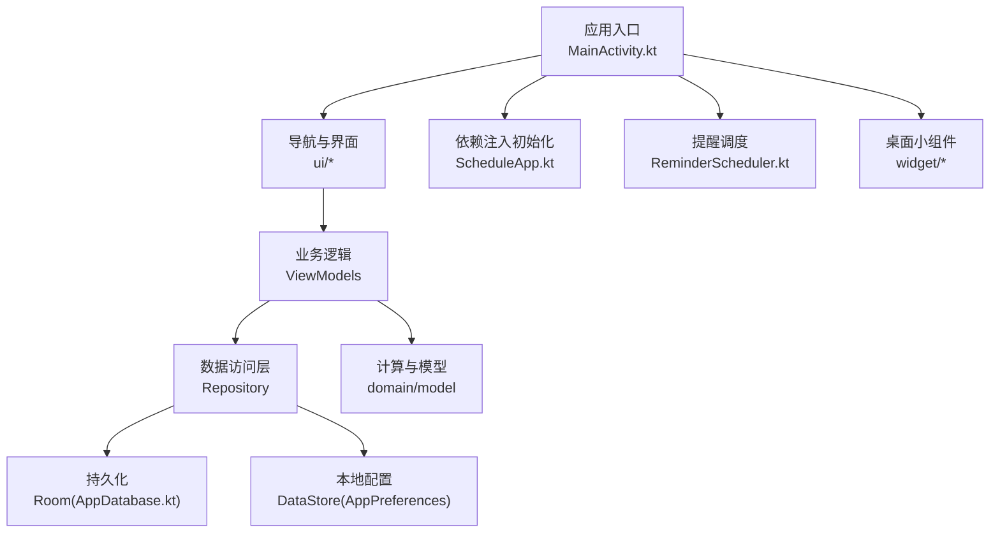
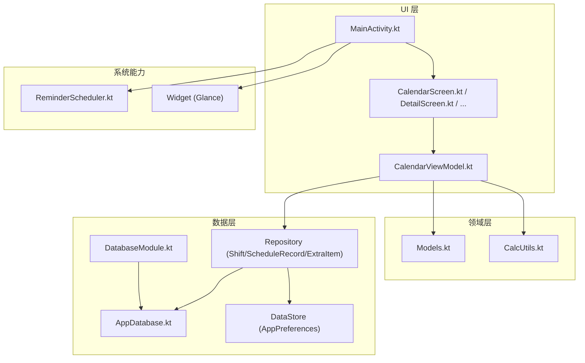
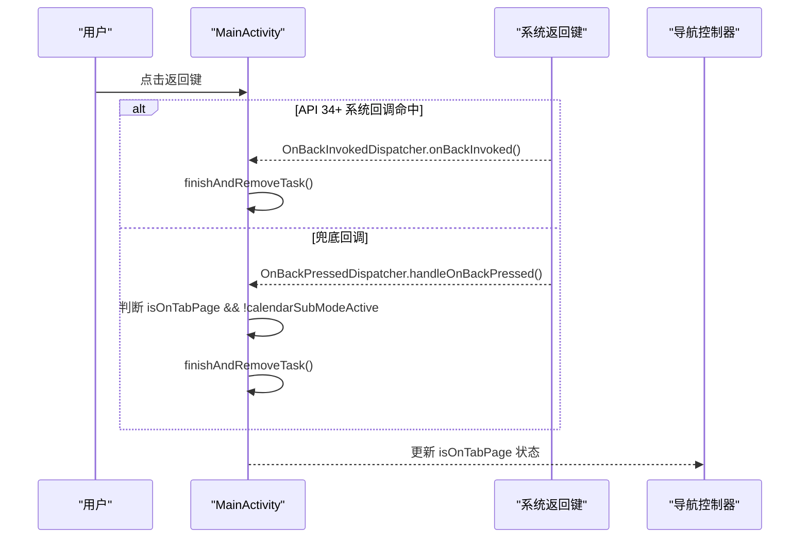
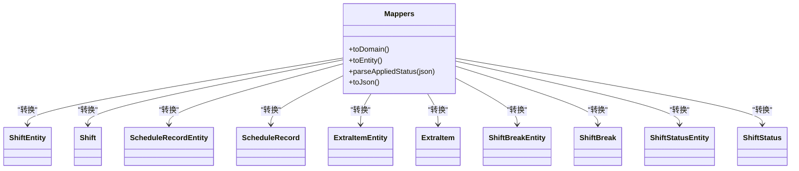
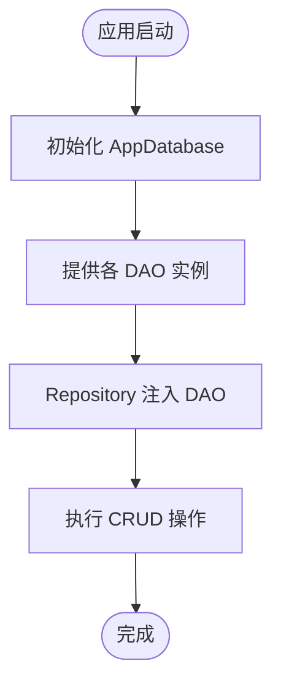
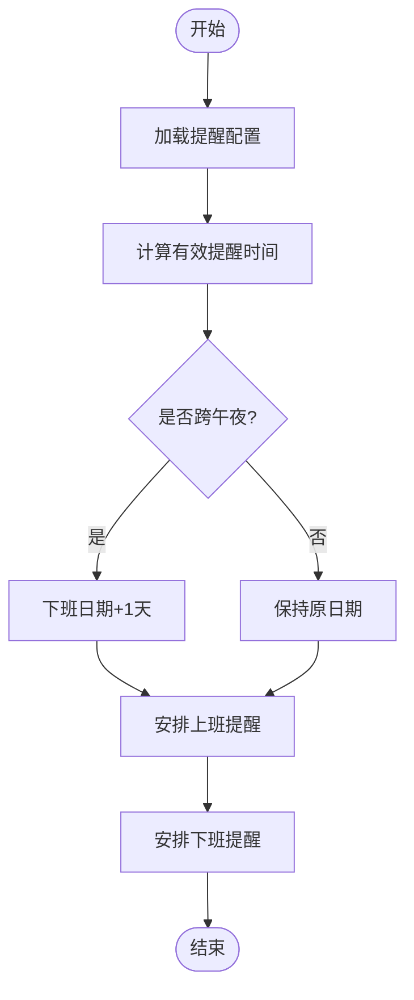
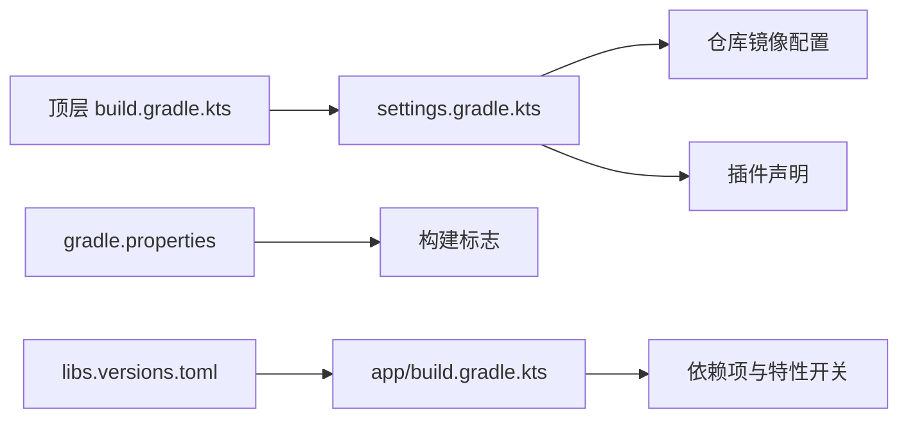

# 贡献指南

<cite>
**本文引用的文件**   
- [MainActivity.kt](file://app/src/main/java/com/schedulecalendar/app/MainActivity.kt)
- [ScheduleApp.kt](file://app/src/main/java/com/schedulecalendar/app/ScheduleApp.kt)
- [build.gradle.kts](file://build.gradle.kts)
- [settings.gradle.kts](file://settings.gradle.kts)
- [gradle.properties](file://gradle.properties)
- [app/build.gradle.kts](file://app/build.gradle.kts)
- [libs.versions.toml](file://gradle/libs.versions.toml)
- [Mappers.kt](file://app/src/main/java/com/schedulecalendar/app/data/repository/Mappers.kt)
- [Models.kt](file://app/src/main/java/com/schedulecalendar/app/domain/model/Models.kt)
- [AppDatabase.kt](file://app/src/main/java/com/schedulecalendar/app/data/db/AppDatabase.kt)
- [DatabaseModule.kt](file://app/src/main/java/com/schedulecalendar/app/di/DatabaseModule.kt)
- [CalendarViewModel.kt](file://app/src/main/java/com/schedulecalendar/app/ui/calendar/CalendarViewModel.kt)
- [ReminderScheduler.kt](file://app/src/main/java/com/schedulecalendar/app/reminder/ReminderScheduler.kt)
- [proguard-rules.pro](file://app/proguard-rules.pro)
</cite>

## 目录
1. [简介](#简介)
2. [项目结构](#项目结构)
3. [核心组件](#核心组件)
4. [架构总览](#架构总览)
5. [详细组件分析](#详细组件分析)
6. [依赖关系分析](#依赖关系分析)
7. [性能与构建优化](#性能与构建优化)
8. [问题排查与故障排除](#问题排查与故障排除)
9. [结论](#结论)
10. [附录：贡献流程与规范](#附录贡献流程与规范)

## 简介
本贡献指南面向希望参与“排班日历”Android应用开发与维护的开发者。文档涵盖代码规范与命名约定、Git工作流、新功能开发流程、测试与质量保证、文档编写规范、社区参与方式以及版本发布与维护策略。读者无需深入技术背景即可理解并遵循。

## 项目结构
本项目采用单模块 Android 应用结构，使用 Kotlin + Compose UI + Hilt 依赖注入 + Room 数据库 + DataStore 偏好存储。关键目录与职责如下：
- app/src/main/java/com/schedulecalendar/app
  - data：数据层（Room 实体/DAO、Repository、DataStore 配置）
  - di：Hilt 模块（数据库、偏好等）
  - domain：领域模型与计算工具
  - ui：UI 层（Compose Screen、ViewModel、导航、主题）
  - reminder：提醒调度与广播接收器
  - widget：桌面小组件（Glance）
  - MainActivity.kt：应用入口、权限申请、返回键处理、快捷方式处理
  - ScheduleApp.kt：Application 类，启用 Hilt
- gradle：版本目录与 Gradle 配置
- app/schemas：Room Schema 导出文件，用于迁移追踪

图表来源
- [MainActivity.kt:141-220](file://app/src/main/java/com/schedulecalendar/app/MainActivity.kt#L141-L220)
- [ScheduleApp.kt:7-9](file://app/src/main/java/com/schedulecalendar/app/ScheduleApp.kt#L7-L9)
- [AppDatabase.kt:17-34](file://app/src/main/java/com/schedulecalendar/app/data/db/AppDatabase.kt#L17-L34)
- [ReminderScheduler.kt:173-203](file://app/src/main/java/com/schedulecalendar/app/reminder/ReminderScheduler.kt#L173-L203)

章节来源
- [app/build.gradle.kts:10-79](file://app/build.gradle.kts#L10-L79)
- [settings.gradle.kts:19-36](file://settings.gradle.kts#L19-L36)
- [gradle.properties:1-8](file://gradle.properties#L1-L8)

## 核心组件
- 应用入口与生命周期管理
  - MainActivity 负责权限申请、返回键拦截（API 34+ 系统级回调兜底）、快捷方式动作处理、初始权限对话框展示。
  - ScheduleApp 作为 Application 类，启用 Hilt 依赖注入。
- 数据层
  - AppDatabase 定义 Room 数据库与 DAO；DatabaseModule 提供单例数据库实例与各 DAO。
  - Repository 封装数据源访问，Mappers 负责 Entity 与 Domain 模型之间的转换。
- 领域模型
  - Models.kt 定义了班次、状态、记录、薪资配置、显示方案等核心数据结构与常量。
- UI 层
  - Compose 页面与 ViewModel 分离，通过 Hilt Navigation 注入 ViewModel。
- 提醒与调度
  - ReminderScheduler 根据班次与实际打卡时间计算提醒触发时机，支持跨午夜场景。

章节来源
- [MainActivity.kt:34-262](file://app/src/main/java/com/schedulecalendar/app/MainActivity.kt#L34-L262)
- [ScheduleApp.kt:7-9](file://app/src/main/java/com/schedulecalendar/app/ScheduleApp.kt#L7-L9)
- [AppDatabase.kt:17-34](file://app/src/main/java/com/schedulecalendar/app/data/db/AppDatabase.kt#L17-L34)
- [DatabaseModule.kt:21-34](file://app/src/main/java/com/schedulecalendar/app/di/DatabaseModule.kt#L21-L34)
- [Mappers.kt:19-134](file://app/src/main/java/com/schedulecalendar/app/data/repository/Mappers.kt#L19-L134)
- [Models.kt:5-278](file://app/src/main/java/com/schedulecalendar/app/domain/model/Models.kt#L5-L278)
- [CalendarViewModel.kt:25-59](file://app/src/main/java/com/schedulecalendar/app/ui/calendar/CalendarViewModel.kt#L25-L59)
- [ReminderScheduler.kt:173-203](file://app/src/main/java/com/schedulecalendar/app/reminder/ReminderScheduler.kt#L173-L203)

## 架构总览
整体采用分层架构：UI → ViewModel → Repository → Room/DataStore。依赖注入由 Hilt 统一管理，Room Schema 导出便于迁移追踪。

图表来源
- [MainActivity.kt:141-220](file://app/src/main/java/com/schedulecalendar/app/MainActivity.kt#L141-L220)
- [CalendarViewModel.kt:25-59](file://app/src/main/java/com/schedulecalendar/app/ui/calendar/CalendarViewModel.kt#L25-L59)
- [Models.kt:5-278](file://app/src/main/java/com/schedulecalendar/app/domain/model/Models.kt#L5-L278)
- [AppDatabase.kt:17-34](file://app/src/main/java/com/schedulecalendar/app/data/db/AppDatabase.kt#L17-L34)
- [DatabaseModule.kt:21-34](file://app/src/main/java/com/schedulecalendar/app/di/DatabaseModule.kt#L21-L34)
- [ReminderScheduler.kt:173-203](file://app/src/main/java/com/schedulecalendar/app/reminder/ReminderScheduler.kt#L173-L203)

## 详细组件分析

### 应用入口与返回键处理（MainActivity）
- 功能要点
  - 权限申请与提示：首次启动引导用户授予日历与通知权限。
  - 返回键拦截：在 Tab 一级页且非批量模式下，按返回键直接退出任务栈；API 34+ 使用系统级 OnBackInvokedDispatcher 优先拦截，OnBackPressedDispatcher 作为兜底。
  - 快捷方式处理：支持“上班打卡”“下班打卡”快捷方式，解析 Action 并延迟消费。
- 实现模式
  - 使用 @AndroidEntryPoint 集成 Hilt。
  - 使用 rememberLauncherForActivityResult 请求多权限。
  - 使用 LaunchedEffect 控制权限弹窗显示。
  - 使用 OnBackPressedCallback 注册 lifecycle-aware 回调。

图表来源
- [MainActivity.kt:85-124](file://app/src/main/java/com/schedulecalendar/app/MainActivity.kt#L85-L124)
- [MainActivity.kt:137-157](file://app/src/main/java/com/schedulecalendar/app/MainActivity.kt#L137-L157)
- [MainActivity.kt:141-220](file://app/src/main/java/com/schedulecalendar/app/MainActivity.kt#L141-L220)

章节来源
- [MainActivity.kt:34-262](file://app/src/main/java/com/schedulecalendar/app/MainActivity.kt#L34-L262)

### 数据映射与领域模型（Mappers & Models）
- 功能要点
  - Mappers.kt 提供 Entity 与 Domain 模型的双向转换，包含 JSON 字段解析与兼容旧格式。
  - Models.kt 定义核心数据结构（班次、状态、记录、薪资配置、显示方案、统计汇总等）。
- 复杂度与优化
  - Gson 序列化/反序列化在映射中频繁使用，注意避免重复创建实例（已使用私有静态实例）。
  - 对历史数据兼容性（如 AppliedStatus 数组到对象）进行容错处理。

图表来源
- [Mappers.kt:19-134](file://app/src/main/java/com/schedulecalendar/app/data/repository/Mappers.kt#L19-L134)
- [Models.kt:5-278](file://app/src/main/java/com/schedulecalendar/app/domain/model/Models.kt#L5-L278)

章节来源
- [Mappers.kt:1-134](file://app/src/main/java/com/schedulecalendar/app/data/repository/Mappers.kt#L1-L134)
- [Models.kt:1-278](file://app/src/main/java/com/schedulecalendar/app/domain/model/Models.kt#L1-L278)

### 数据库与依赖注入（AppDatabase & DatabaseModule）
- 功能要点
  - AppDatabase 声明实体与版本，开启 schema 导出。
  - DatabaseModule 提供单例数据库与各 DAO，使用 fallbackToDestructiveMigration 简化迁移。
- 注意事项
  - 破坏性迁移会清空表，适用于开发阶段或可接受数据丢失的场景。
  - 生产环境建议实现自定义 Migration 以保留数据。

图表来源
- [AppDatabase.kt:17-34](file://app/src/main/java/com/schedulecalendar/app/data/db/AppDatabase.kt#L17-L34)
- [DatabaseModule.kt:21-34](file://app/src/main/java/com/schedulecalendar/app/di/DatabaseModule.kt#L21-L34)

章节来源
- [AppDatabase.kt:1-35](file://app/src/main/java/com/schedulecalendar/app/data/db/AppDatabase.kt#L1-L35)
- [DatabaseModule.kt:1-35](file://app/src/main/java/com/schedulecalendar/app/di/DatabaseModule.kt#L1-L35)

### 提醒调度（ReminderScheduler）
- 功能要点
  - 根据班次时间与打卡记录计算有效提醒时间，支持请假/调休调整。
  - 处理跨午夜下班场景，将下班提醒推迟至次日。
- 算法流程

图表来源
- [ReminderScheduler.kt:173-203](file://app/src/main/java/com/schedulecalendar/app/reminder/ReminderScheduler.kt#L173-L203)

章节来源
- [ReminderScheduler.kt:173-203](file://app/src/main/java/com/schedulecalendar/app/reminder/ReminderScheduler.kt#L173-L203)

## 依赖关系分析
- 构建与插件
  - 顶层 build.gradle.kts 仅声明插件，不应用到 root。
  - settings.gradle.kts 配置仓库镜像（阿里云、华为云、官方源），统一依赖解析。
  - gradle.properties 设置 JVM 参数、Kotlin 编码风格、AndroidX 开关等。
- 版本管理
  - libs.versions.toml 集中管理所有库版本与别名，便于升级与一致性。
- 应用构建
  - app/build.gradle.kts 配置命名空间、SDK 版本、签名、混淆、KSP、Compose、Hilt、Room、DataStore、Coroutines、Gson、Navigation、Glance、Tyme4j、DocumentFile 等。

图表来源
- [build.gradle.kts:1-10](file://build.gradle.kts#L1-L10)
- [settings.gradle.kts:1-36](file://settings.gradle.kts#L1-L36)
- [gradle.properties:1-8](file://gradle.properties#L1-L8)
- [libs.versions.toml:1-86](file://gradle/libs.versions.toml#L1-L86)
- [app/build.gradle.kts:10-79](file://app/build.gradle.kts#L10-L79)

章节来源
- [build.gradle.kts:1-10](file://build.gradle.kts#L1-L10)
- [settings.gradle.kts:1-36](file://settings.gradle.kts#L1-L36)
- [gradle.properties:1-8](file://gradle.properties#L1-L8)
- [libs.versions.toml:1-86](file://gradle/libs.versions.toml#L1-L86)
- [app/build.gradle.kts:10-79](file://app/build.gradle.kts#L10-L79)

## 性能与构建优化
- 构建缓存与并行
  - 启用 Gradle 配置缓存与构建缓存，提升增量构建速度。
  - 设置 JVM 堆大小与并行 GC，加速编译。
- 代码压缩与资源优化
  - Release 构建启用 minify 与 shrinkResources，减少包体。
  - ProGuard 规则保护关键类与方法，防止 R8 内联导致状态同步失效。
- KSP 与 Room
  - 使用 KSP 替代 kapt，提高编译性能。
  - 导出 Room Schema 便于迁移追踪。
- Compose
  - 使用独立 Compose Compiler 插件，避免旧版扩展配置。

章节来源
- [gradle.properties:1-8](file://gradle.properties#L1-L8)
- [app/build.gradle.kts:31-79](file://app/build.gradle.kts#L31-L79)
- [proguard-rules.pro:45-77](file://app/proguard-rules.pro#L45-L77)

## 问题排查与故障排除
- 返回键行为异常
  - 检查 MainActivity 中的 OnBackPressedCallback 与 API 34+ 系统回调注册顺序。
  - 确认 isOnTabPage 与 calendarSubModeActive 状态同步未被 R8 内联优化影响。
- 权限相关崩溃
  - 确保首次启动时正确弹出权限申请对话框，并在用户选择后标记已完成。
- 数据库迁移失败
  - 检查 AppDatabase 版本与 schemas 文件一致性。
  - 若使用破坏性迁移，确认数据可丢失或实现自定义 Migration。
- 提醒未触发
  - 核对 ReminderScheduler 的时间计算逻辑，尤其是跨午夜与请假/调休调整。

章节来源
- [MainActivity.kt:85-124](file://app/src/main/java/com/schedulecalendar/app/MainActivity.kt#L85-L124)
- [MainActivity.kt:137-157](file://app/src/main/java/com/schedulecalendar/app/MainActivity.kt#L137-L157)
- [AppDatabase.kt:17-34](file://app/src/main/java/com/schedulecalendar/app/data/db/AppDatabase.kt#L17-L34)
- [ReminderScheduler.kt:173-203](file://app/src/main/java/com/schedulecalendar/app/reminder/ReminderScheduler.kt#L173-L203)
- [proguard-rules.pro:45-77](file://app/proguard-rules.pro#L45-L77)

## 结论
本项目采用清晰的层次结构与现代化技术栈，具备良好的可维护性与扩展性。贡献者应遵循本文档的规范与流程，确保代码质量与团队协作效率。

## 附录：贡献流程与规范

### 代码规范与命名约定
- Kotlin 编码标准
  - 使用官方 Kotlin 编码风格（已在 gradle.properties 中启用）。
  - 变量与函数使用小驼峰，类与接口使用大驼峰，常量全大写加下划线。
  - 避免魔法数字与字符串，使用常量或枚举。
- 文件组织
  - 按功能域划分包：data、domain、ui、di、reminder、widget。
  - UI 层使用 Compose，页面与 ViewModel 分离，ViewModel 通过 Hilt 注入。
- 注释规范
  - 公共 API 与复杂逻辑需添加清晰注释，说明输入、输出与边界条件。
  - 对兼容旧数据格式的解析逻辑，务必注明兼容策略。

### Git 工作流程
- 分支管理策略
  - main：稳定分支，仅合并经过审查与测试的代码。
  - develop：开发主干，日常功能迭代在此分支进行。
  - feature/*：功能分支，从 develop 拉取，完成后提交 PR。
  - hotfix/*：紧急修复分支，从 main 拉取，修复后合并回 main 与 develop。
- 提交信息规范
  - 类型：feat、fix、docs、style、refactor、test、chore
  - 示例：feat(calendar): 新增批量排班模式
- 代码审查流程
  - 所有变更必须通过 Pull Request 审查，至少一名维护者批准。
  - CI 检查通过后才能合并，确保构建与基础测试通过。

### 新功能开发流程
- 需求分析与设计
  - 明确功能目标、用户故事与验收标准。
  - 设计数据模型与 UI 交互，必要时绘制流程图或状态图。
- 实现步骤
  - 在 feature/* 分支上实现，遵循代码规范与注释要求。
  - 编写单元测试与 UI 测试（如有必要）。
  - 更新相关文档与配置（如版本、依赖）。
- 提交与审查
  - 提交信息清晰描述变更内容。
  - 发起 PR，等待审查与 CI 检查。
- 合并与发布
  - 审查通过后合并至 develop，待稳定后合并至 main。
  - 打标签并发布新版本。

### 测试与质量保证
- 单元测试
  - 对领域逻辑与工具类编写单元测试，覆盖边界条件。
- UI 测试
  - 对关键用户流程编写 UI 测试，确保交互稳定性。
- 静态检查
  - 使用 Lint 与 Ktlint 检查代码风格与潜在问题。
- 构建验证
  - 确保 debug 与 release 构建均通过，无警告或错误。

### 文档编写规范
- 更新 README 与贡献指南，确保与代码同步。
- 对外部依赖与配置变更，需在变更日志中说明。
- 重要功能变更需提供用户手册更新。

### 社区参与指南
- 问题报告模板
  - 标题：简明描述问题
  - 环境：设备型号、系统版本、应用版本
  - 复现步骤：详细步骤与预期结果
  - 日志：相关日志或截图
- 贡献方式
  - Fork 仓库，创建功能分支，提交 PR。
  - 参与讨论与审查，帮助改进代码质量。

### 版本发布与维护策略
- 版本号规则
  - 使用日期格式版本号（如 2026080301），便于追踪与回滚。
- 发布流程
  - 在 main 分支打标签，生成签名 APK/AAB。
  - 更新应用商店描述与变更日志。
- 维护策略
  - 定期清理废弃依赖与代码。
  - 关注安全漏洞与兼容性更新，及时升级。