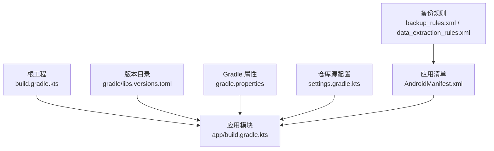
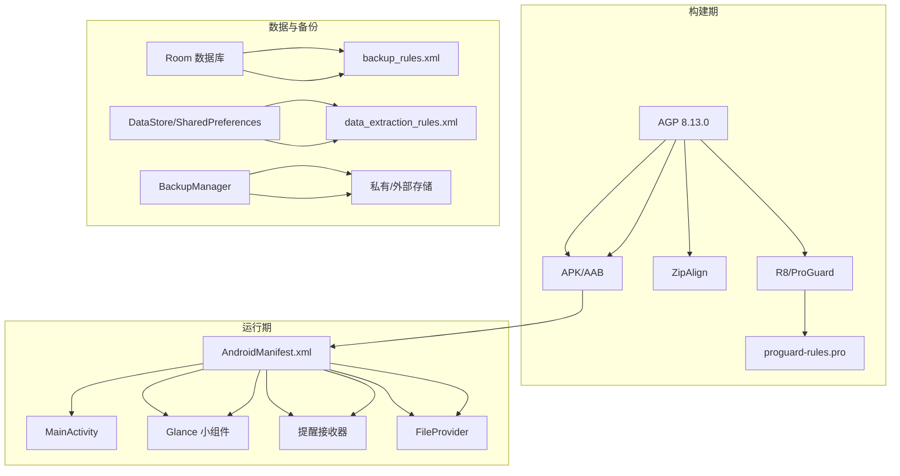
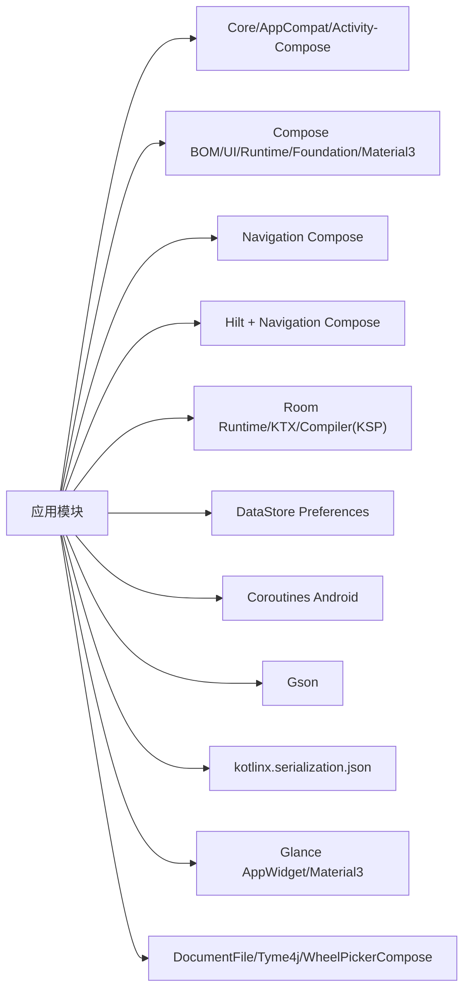
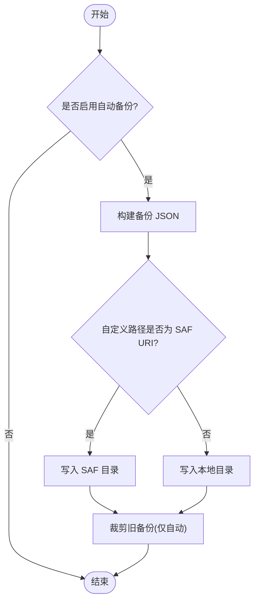
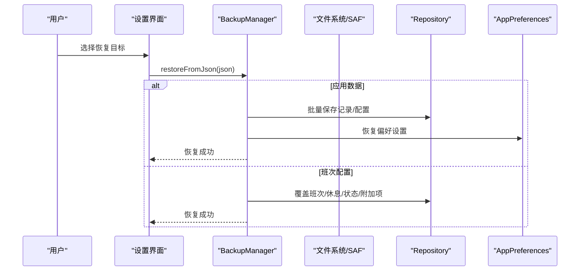

# 部署发布

<cite>
**本文引用的文件**   
- [app/build.gradle.kts](file://app/build.gradle.kts)
- [build.gradle.kts](file://build.gradle.kts)
- [gradle.properties](file://gradle.properties)
- [settings.gradle.kts](file://settings.gradle.kts)
- [gradle/libs.versions.toml](file://gradle/libs.versions.toml)
- [app/proguard-rules.pro](file://app/proguard-rules.pro)
- [app/src/main/AndroidManifest.xml](file://app/src/main/AndroidManifest.xml)
- [app/src/main/res/xml/backup_rules.xml](file://app/src/main/res/xml/backup_rules.xml)
- [app/src/main/res/xml/data_extraction_rules.xml](file://app/src/main/res/xml/data_extraction_rules.xml)
- [app/src/main/java/com/schedulecalendar/app/ui/settings/BackupManager.kt](file://app/src/main/java/com/schedulecalendar/app/ui/settings/BackupManager.kt)
</cite>

## 目录
1. [简介](#简介)
2. [项目结构](#项目结构)
3. [核心组件](#核心组件)
4. [架构总览](#架构总览)
5. [详细组件分析](#详细组件分析)
6. [依赖分析](#依赖分析)
7. [性能与构建优化](#性能与构建优化)
8. [多渠道打包与版本管理](#多渠道打包与版本管理)
9. [应用商店发布流程](#应用商店发布流程)
10. [CI/CD 流水线配置](#cicd-流水线配置)
11. [备份恢复与数据迁移](#备份恢复与数据迁移)
12. [发布前检查清单与质量保证](#发布前检查清单与质量保证)
13. [热更新与动态下发方案](#热更新与动态下发方案)
14. [故障排查指南](#故障排查指南)
15. [结论](#结论)

## 简介
本文件面向 Android 排班日历应用的部署与发布，覆盖构建配置、签名与混淆、资源压缩、多渠道打包、版本管理、应用商店发布（Google Play 与国内市场）、CI/CD 自动化、备份恢复与数据迁移、发布前检查清单与质量保证，以及热更新与动态下发的技术路线。文档基于仓库现有构建脚本、清单与备份实现进行说明，确保可落地执行。

## 项目结构
- 顶层仅声明插件，实际构建逻辑集中在 app 模块的 build.gradle.kts
- 依赖版本通过 gradle/libs.versions.toml 统一管理
- 构建缓存、JVM 参数、AndroidX 开关等由 gradle.properties 控制
- 仓库源镜像优先使用阿里云与华为云，兜底官方源
- 应用清单定义权限、组件、小组件、FileProvider、提醒接收器等
- 备份规则与数据提取规则在 res/xml 中声明

**图表来源**
- [build.gradle.kts:1-10](file://build.gradle.kts#L1-L10)
- [app/build.gradle.kts:1-79](file://app/build.gradle.kts#L1-L79)
- [gradle/libs.versions.toml:1-22](file://gradle/libs.versions.toml#L1-L22)
- [gradle.properties:1-8](file://gradle.properties#L1-L8)
- [settings.gradle.kts:1-37](file://settings.gradle.kts#L1-L37)
- [app/src/main/AndroidManifest.xml:1-126](file://app/src/main/AndroidManifest.xml#L1-L126)
- [app/src/main/res/xml/backup_rules.xml:1-7](file://app/src/main/res/xml/backup_rules.xml#L1-L7)
- [app/src/main/res/xml/data_extraction_rules.xml:1-14](file://app/src/main/res/xml/data_extraction_rules.xml#L1-L14)

**章节来源**
- [build.gradle.kts:1-10](file://build.gradle.kts#L1-L10)
- [app/build.gradle.kts:1-79](file://app/build.gradle.kts#L1-L79)
- [gradle/libs.versions.toml:1-22](file://gradle/libs.versions.toml#L1-L22)
- [gradle.properties:1-8](file://gradle.properties#L1-L8)
- [settings.gradle.kts:1-37](file://settings.gradle.kts#L1-L37)
- [app/src/main/AndroidManifest.xml:1-126](file://app/src/main/AndroidManifest.xml#L1-L126)
- [app/src/main/res/xml/backup_rules.xml:1-7](file://app/src/main/res/xml/backup_rules.xml#L1-L7)
- [app/src/main/res/xml/data_extraction_rules.xml:1-14](file://app/src/main/res/xml/data_extraction_rules.xml#L1-L14)

## 核心组件
- 构建与编译：AGP + Kotlin + Compose + KSP + Hilt
- 代码混淆与资源压缩：R8/ProGuard + 资源裁剪
- 签名：release 签名配置
- 依赖管理：libs.versions.toml 统一版本
- 仓库源：阿里云/华为云镜像加速
- 清单与权限：通知、闹钟、日历读写、开机自启、账户认证等
- 备份与数据提取：full-backup 与 device-transfer 规则

**章节来源**
- [app/build.gradle.kts:10-79](file://app/build.gradle.kts#L10-L79)
- [gradle/libs.versions.toml:1-86](file://gradle/libs.versions.toml#L1-L86)
- [settings.gradle.kts:1-37](file://settings.gradle.kts#L1-L37)
- [app/src/main/AndroidManifest.xml:1-126](file://app/src/main/AndroidManifest.xml#L1-L126)
- [app/src/main/res/xml/backup_rules.xml:1-7](file://app/src/main/res/xml/backup_rules.xml#L1-L7)
- [app/src/main/res/xml/data_extraction_rules.xml:1-14](file://app/src/main/res/xml/data_extraction_rules.xml#L1-L14)

## 架构总览
下图展示构建产物与关键配置的关系，以及运行时组件与备份策略的关联。

**图表来源**
- [app/build.gradle.kts:10-79](file://app/build.gradle.kts#L10-L79)
- [app/proguard-rules.pro:1-78](file://app/proguard-rules.pro#L1-L78)
- [app/src/main/AndroidManifest.xml:1-126](file://app/src/main/AndroidManifest.xml#L1-L126)
- [app/src/main/res/xml/backup_rules.xml:1-7](file://app/src/main/res/xml/backup_rules.xml#L1-L7)
- [app/src/main/res/xml/data_extraction_rules.xml:1-14](file://app/src/main/res/xml/data_extraction_rules.xml#L1-L14)
- [app/src/main/java/com/schedulecalendar/app/ui/settings/BackupManager.kt:1-579](file://app/src/main/java/com/schedulecalendar/app/ui/settings/BackupManager.kt#L1-L579)

## 详细组件分析

### 构建与签名配置
- 编译目标：Java/Kotlin 17
- 构建类型：debug 可调试；release 开启混淆与资源裁剪，并引用 release 签名
- 签名配置：定义了 release 签名（keystore 路径、密码、别名）
- Lint：禁用部分警告，避免 IDE 生成签名时的锁冲突问题

建议
- 将 keystore 与密码从源码中移除，改用环境变量或密钥管理服务注入
- 在 CI 中使用受保护的变量注入签名信息

**章节来源**
- [app/build.gradle.kts:22-41](file://app/build.gradle.kts#L22-L41)
- [app/build.gradle.kts:43-48](file://app/build.gradle.kts#L43-L48)
- [app/build.gradle.kts:69-78](file://app/build.gradle.kts#L69-L78)

### 代码混淆与资源压缩
- 启用 R8/ProGuard 与资源裁剪
- proguard-rules.pro 针对 Hilt、Room、Gson、Glance、协程、Navigation、kotlinx-serialization 等保留必要类与方法
- 对 MainActivity 返回键回调与状态字段做了特殊保留，防止内联导致状态不同步

注意
- 若新增反射/序列化/动态加载相关逻辑，需在 proguard-rules.pro 补充保留规则

**章节来源**
- [app/build.gradle.kts:35-40](file://app/build.gradle.kts#L35-L40)
- [app/proguard-rules.pro:1-78](file://app/proguard-rules.pro#L1-L78)

### 依赖管理与仓库源
- 所有第三方库版本集中于 libs.versions.toml
- 仓库源优先级：阿里云 > 华为云 > 官方 Google/MavenCentral/JetBrains
- 支持 JitPack（如 WheelPickerCompose）

**章节来源**
- [gradle/libs.versions.toml:1-86](file://gradle/libs.versions.toml#L1-L86)
- [settings.gradle.kts:1-37](file://settings.gradle.kts#L1-L37)

### 应用清单与权限
- 权限：通知、唤醒锁、日历读写、精确闹钟、开机自启动、账户认证
- 组件：主 Activity、Glance 小组件、提醒接收器、BootReceiver、CalendarAuthenticatorService、FileProvider
- 小组件配置与 FileProvider 路径均在清单中注册

**章节来源**
- [app/src/main/AndroidManifest.xml:1-126](file://app/src/main/AndroidManifest.xml#L1-L126)

### 备份与数据提取规则
- full-backup 包含 sharedpref、database、backups 目录
- data-extraction 包含 cloud-backup 与 device-transfer 两类，均包含上述三类域

**章节来源**
- [app/src/main/res/xml/backup_rules.xml:1-7](file://app/src/main/res/xml/backup_rules.xml#L1-L7)
- [app/src/main/res/xml/data_extraction_rules.xml:1-14](file://app/src/main/res/xml/data_extraction_rules.xml#L1-L14)

## 依赖分析
- 构建期依赖：AGP、Kotlin、Compose、Hilt、KSP、Room、DataStore、Coroutines、Gson、Glance、Navigation、Serialization
- 运行时依赖：清单中的系统服务与组件（通知、闹钟、日历、账户、Widget、FileProvider）

**图表来源**
- [gradle/libs.versions.toml:23-86](file://gradle/libs.versions.toml#L23-L86)
- [app/build.gradle.kts:81-141](file://app/build.gradle.kts#L81-L141)

**章节来源**
- [gradle/libs.versions.toml:23-86](file://gradle/libs.versions.toml#L23-L86)
- [app/build.gradle.kts:81-141](file://app/build.gradle.kts#L81-L141)

## 性能与构建优化
- Gradle 并行与缓存：已启用配置缓存与构建缓存
- JVM 参数：堆内存与并行 GC
- Java 工具链：通过 foojay-resolver 自动获取 JDK 21
- ProGuard/R8：已启用混淆与资源裁剪
- Lint：跳过 release 构建阶段的 lint 以避免 IDE 锁冲突

建议
- 在 CI 中启用 Gradle 守护进程与远程缓存
- 按需拆分任务，减少全量构建时间

**章节来源**
- [gradle.properties:1-8](file://gradle.properties#L1-L8)
- [settings.gradle.kts:15-17](file://settings.gradle.kts#L15-L17)
- [app/build.gradle.kts:69-78](file://app/build.gradle.kts#L69-L78)

## 多渠道打包与版本管理
现状
- 当前未配置 productFlavors 或 buildVariants，默认单一渠道
- versionCode/versionName 采用日期格式（如 2026080301），并在 lint 中禁用了 HighAppVersionCode 警告

建议
- 引入 productFlavors（如 google、xiaomi、huawei、oppo、vivo）以适配各市场要求
- 为每个 flavor 设置 applicationIdSuffix、versionNameSuffix 与独立图标/主题
- 使用 CI 自动生成递增 versionCode，保持唯一性

**章节来源**
- [app/build.gradle.kts:14-20](file://app/build.gradle.kts#L14-L20)
- [app/build.gradle.kts:69-78](file://app/build.gradle.kts#L69-L78)

## 应用商店发布流程

### Google Play Store
- 产物：推荐上传 AAB（Android App Bundle）
- 签名：使用 Google Play 管理的签名密钥或自有上传密钥
- 清单与权限：确保最小化权限，符合政策（通知、闹钟、日历等需说明用途）
- 隐私与安全：提供隐私政策链接，声明数据收集与使用
- 测试：先上传至内部/封闭/开放测试轨道，验证安装与功能

### 国内应用市场（华为、小米、OPPO、vivo 等）
- 产物：通常接受 APK 或 AAB（以各市场要求为准）
- 签名：需按市场要求签名（部分市场要求平台签名校验）
- 合规：符合工信部与网络安全要求，含隐私协议、权限说明
- 审核材料：准备应用截图、描述、分类、隐私政策、企业/开发者资质

通用步骤
- 本地构建 release 包并签名
- 执行静态扫描（lint/vulnerability scan）
- 人工回归测试（核心流程、权限弹窗、小组件、提醒）
- 提交到对应渠道后台，等待审核

**章节来源**
- [app/src/main/AndroidManifest.xml:1-126](file://app/src/main/AndroidManifest.xml#L1-L126)

## CI/CD 流水线配置
建议流水线阶段
- 拉取代码与依赖缓存
- 构建 debug/release 包（含签名）
- 运行单元测试与 UI 测试（可选）
- 生成制品（APK/AAB）与变更日志
- 上传到应用商店或分发平台

关键要点
- 使用 Gradle 缓存与配置缓存加速构建
- 通过环境变量注入签名信息与密钥
- 失败时发送告警（邮件/IM）

示例命令（概念性）
- 构建 release：./gradlew assembleRelease
- 构建 AAB：./gradlew bundleRelease
- 运行测试：./gradlew test

**章节来源**
- [gradle.properties:1-8](file://gradle.properties#L1-L8)
- [settings.gradle.kts:1-37](file://settings.gradle.kts#L1-L37)

## 备份恢复与数据迁移

### 备份机制
- 自动备份：应用数据每天只保留最新一条；班次配置每次修改生成新备份
- 手动备份：用户触发导出，生成带时间戳的 JSON
- 存储位置：私有目录与自定义路径（支持 SAF content URI）
- 列表合并：私有目录与自定义路径合并去重显示
- 裁剪策略：按 keepCount 裁剪自动备份，手动备份不删除

**图表来源**
- [app/src/main/java/com/schedulecalendar/app/ui/settings/BackupManager.kt:183-227](file://app/src/main/java/com/schedulecalendar/app/ui/settings/BackupManager.kt#L183-L227)
- [app/src/main/java/com/schedulecalendar/app/ui/settings/BackupManager.kt:246-274](file://app/src/main/java/com/schedulecalendar/app/ui/settings/BackupManager.kt#L246-L274)
- [app/src/main/java/com/schedulecalendar/app/ui/settings/BackupManager.kt:518-545](file://app/src/main/java/com/schedulecalendar/app/ui/settings/BackupManager.kt#L518-L545)

### 恢复机制
- 从私有目录恢复应用数据或班次配置
- 从外部 JSON 内容恢复（导入功能）
- 恢复过程会覆盖相应数据表与偏好设置

**图表来源**
- [app/src/main/java/com/schedulecalendar/app/ui/settings/BackupManager.kt:366-377](file://app/src/main/java/com/schedulecalendar/app/ui/settings/BackupManager.kt#L366-L377)
- [app/src/main/java/com/schedulecalendar/app/ui/settings/BackupManager.kt:448-499](file://app/src/main/java/com/schedulecalendar/app/ui/settings/BackupManager.kt#L448-L499)

### 数据迁移策略
- Room Schema 导出到 schemas 目录，便于追踪历史与迁移
- 升级时需保证向后兼容，必要时编写 Migration
- 备份 JSON 版本号用于兼容不同版本的导入/导出

**章节来源**
- [app/build.gradle.kts:53-57](file://app/build.gradle.kts#L53-L57)
- [app/src/main/java/com/schedulecalendar/app/ui/settings/BackupManager.kt:548-579](file://app/src/main/java/com/schedulecalendar/app/ui/settings/BackupManager.kt#L548-L579)

## 发布前检查清单与质量保证
- 构建与签名
  - 确认 release 构建成功且已签名
  - 检查混淆后无崩溃（重点：Hilt、Room、Gson、Glance、协程、Navigation）
- 清单与权限
  - 权限最小化，通知/闹钟/日历权限说明清晰
  - 组件 exported 属性正确，FileProvider 可用
- 功能验证
  - 主界面、日历、小时统计、薪资计算、详情编辑
  - 小组件显示与配置
  - 提醒与开机自启动
  - 备份/恢复/导出/导入
- 性能与体积
  - 资源裁剪生效，无用资源已剔除
  - 启动时间与内存占用合理
- 合规与上架
  - 隐私政策、权限说明、截图与描述完整
  - 各市场签名与产物格式符合要求

**章节来源**
- [app/build.gradle.kts:35-40](file://app/build.gradle.kts#L35-L40)
- [app/src/main/AndroidManifest.xml:1-126](file://app/src/main/AndroidManifest.xml#L1-L126)
- [app/proguard-rules.pro:1-78](file://app/proguard-rules.pro#L1-L78)

## 热更新与动态下发方案
现状
- 仓库未集成热修复或动态下发框架

可行方案（建议）
- 服务端下发配置：通过 DataStore/网络接口下发业务配置（如颜色、排序、开关），无需重启
- 动态资源：使用 RemoteConfig 或 CDN 下发图片/文案等资源
- 热修复：可选接入腾讯 Tinker、阿里 Sophon 或字节 Robust，需注意签名一致性与兼容性

实施要点
- 安全校验：对下发内容进行签名校验与版本比对
- 降级策略：网络不可用或校验失败回退到本地默认值
- 灰度发布：按渠道/版本灰度下发，快速回滚

**章节来源**
- [app/src/main/java/com/schedulecalendar/app/ui/settings/BackupManager.kt:1-579](file://app/src/main/java/com/schedulecalendar/app/ui/settings/BackupManager.kt#L1-L579)

## 故障排查指南
常见问题
- 混淆导致崩溃：检查 proguard-rules.pro 是否遗漏保留规则（反射、序列化、回调）
- 权限被拒：检查清单权限与运行时申请顺序（通知、闹钟、日历）
- 小组件不刷新：确认 Glance Receiver 与 Provider 配置正确
- 备份失败：检查 SAF 权限持久化与目录存在性
- 构建缓慢：启用 Gradle 缓存与并行，清理缓存重试

定位方法
- 查看 Logcat 与崩溃堆栈
- 使用 Android Studio Profiler 分析 CPU/内存
- 使用 apksigner 校验签名与对齐
- 使用 Bundle Explorer 检查 AAB/APK 内容

**章节来源**
- [app/proguard-rules.pro:1-78](file://app/proguard-rules.pro#L1-L78)
- [app/src/main/AndroidManifest.xml:1-126](file://app/src/main/AndroidManifest.xml#L1-L126)
- [app/src/main/java/com/schedulecalendar/app/ui/settings/BackupManager.kt:50-63](file://app/src/main/java/com/schedulecalendar/app/ui/settings/BackupManager.kt#L50-L63)

## 结论
本项目已具备完善的构建、混淆、签名与备份能力。建议在 CI 中完善自动化构建与发布流程，引入多渠道与版本自动化管理，并结合热更新方案提升迭代效率。发布前严格执行检查清单与质量保障流程，确保稳定性与合规性。