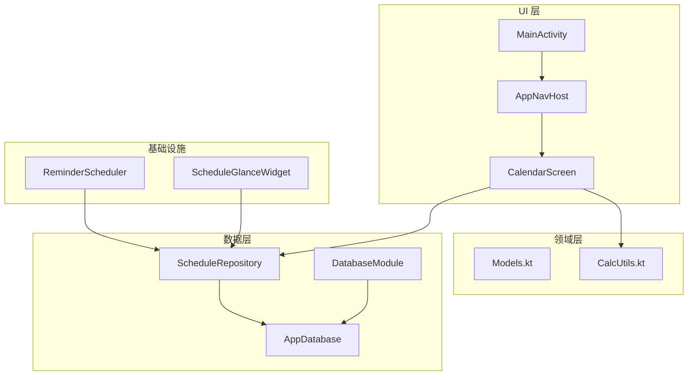
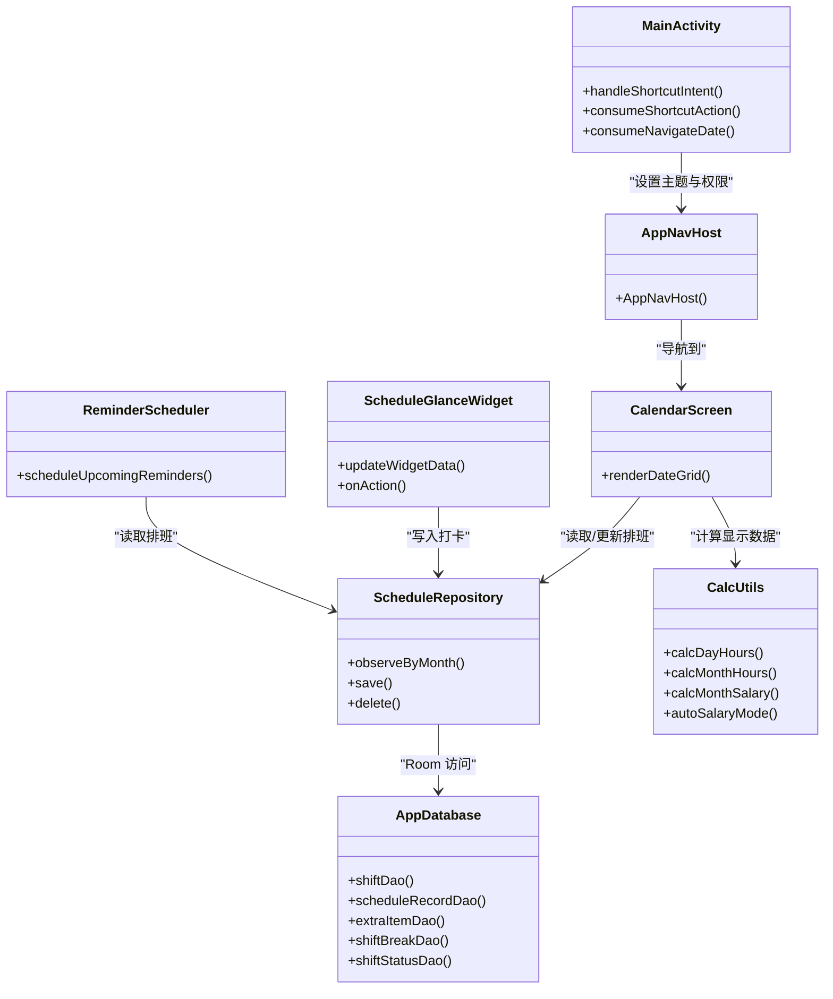
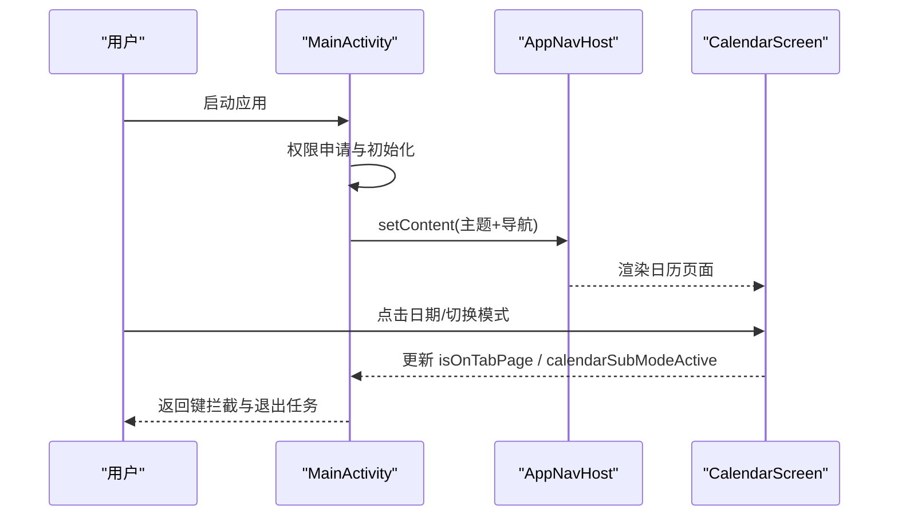
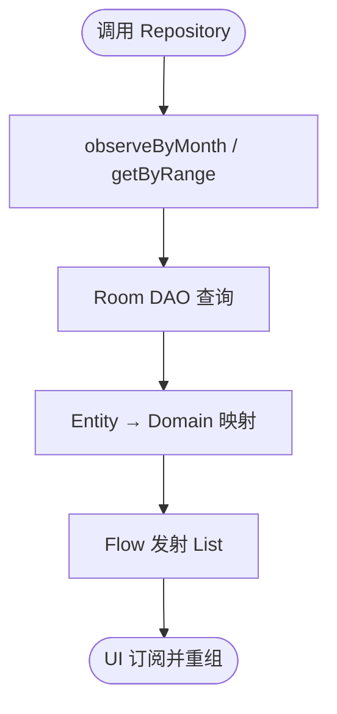
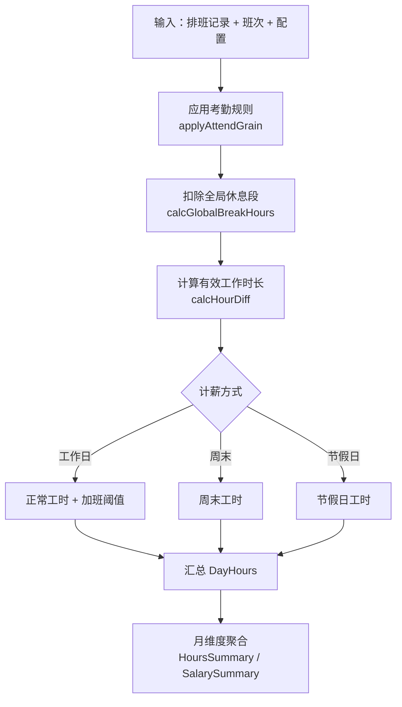
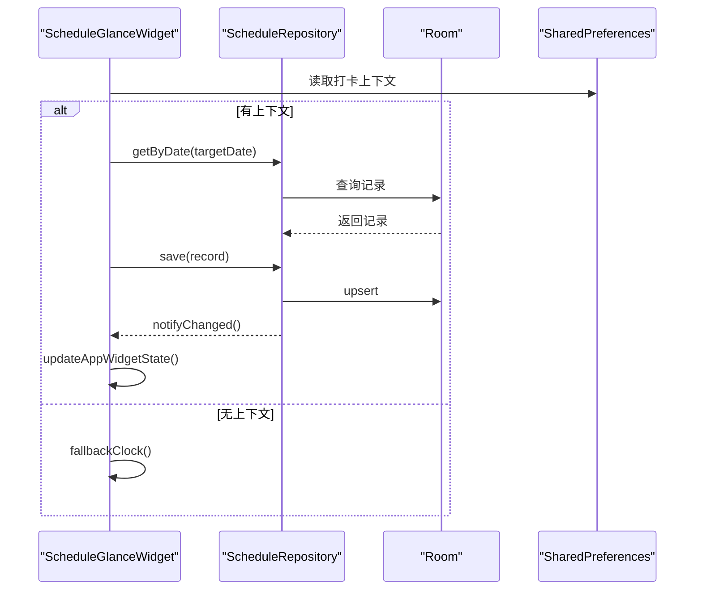
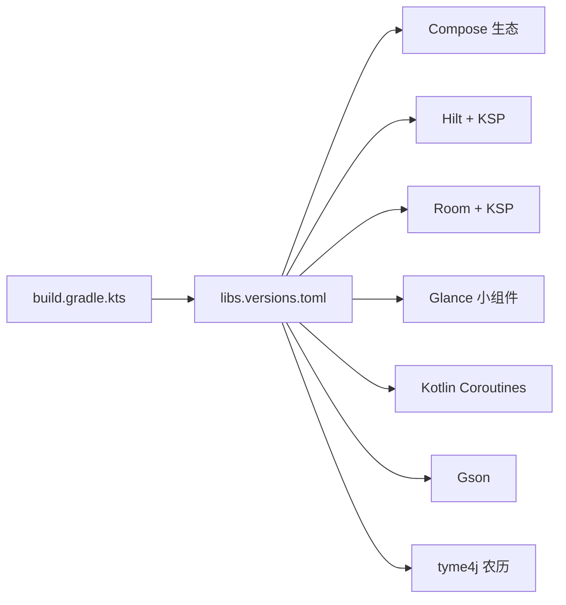

# 项目概述

<cite>
**本文引用的文件**   
- [MainActivity.kt](file://app/src/main/java/com/schedulecalendar/app/MainActivity.kt)
- [ScheduleApp.kt](file://app/src/main/java/com/schedulecalendar/app/ScheduleApp.kt)
- [build.gradle.kts（应用模块）](file://app/build.gradle.kts)
- [libs.versions.toml](file://gradle/libs.versions.toml)
- [AppNavHost.kt](file://app/src/main/java/com/schedulecalendar/app/ui/navigation/AppNavHost.kt)
- [AppDatabase.kt](file://app/src/main/java/com/schedulecalendar/app/data/db/AppDatabase.kt)
- [DatabaseModule.kt](file://app/src/main/java/com/schedulecalendar/app/di/DatabaseModule.kt)
- [Models.kt](file://app/src/main/java/com/schedulecalendar/app/domain/model/Models.kt)
- [CalcUtils.kt](file://app/src/main/java/com/schedulecalendar/app/domain/model/CalcUtils.kt)
- [ScheduleRepository.kt](file://app/src/main/java/com/schedulecalendar/app/data/repository/ScheduleRepository.kt)
- [CalendarScreen.kt](file://app/src/main/java/com/schedulecalendar/app/ui/calendar/CalendarScreen.kt)
- [ScheduleGlanceWidget.kt](file://app/src/main/java/com/schedulecalendar/app/widget/ScheduleGlanceWidget.kt)
- [ReminderScheduler.kt](file://app/src/main/java/com/schedulecalendar/app/reminder/ReminderScheduler.kt)
</cite>

## 目录
1. [简介](#简介)
2. [项目结构](#项目结构)
3. [核心组件](#核心组件)
4. [架构总览](#架构总览)
5. [详细组件分析](#详细组件分析)
6. [依赖关系分析](#依赖关系分析)
7. [性能考量](#性能考量)
8. [故障排查指南](#故障排查指南)
9. [结论](#结论)
10. [附录](#附录)

## 简介
本项目是一款面向排班制员工的 Android 日历与考勤薪资一体化应用。核心能力包括：
- 智能排班管理：支持循环排班、批量复制/删除、内置休息/调休/请假等类型，以及按日期自动判断计薪方式（工作日/周末/节假日）。
- 考勤打卡系统：提供桌面小组件快捷打卡、系统级精确闹钟提醒、迟到早退容忍与加班粒度控制。
- 薪资计算引擎：基于工时分类（正常/加班/周末/节假日）、补贴扣款项目、社保公积金等规则，输出月度薪资汇总与每日明细。
- 数据可视化：日历格子展示工时与收入、统计页聚合指标、显示方案自定义。
- 桌面小组件：Glance 驱动的 Compose-first 小组件，支持快速打卡与当日班次信息展示。

目标用户为轮班制员工与小型团队管理者；使用场景覆盖日常排班、打卡记录、月度工时与薪资核算、提醒与日历同步。应用通过 MVVM + Clean Architecture 分层组织代码，结合 Kotlin、Jetpack Compose、Hilt、Room、DataStore、Glance 等现代技术栈，确保可维护性与扩展性。

## 项目结构
应用采用模块化与分层设计：
- UI 层：Compose 界面与导航（Tab 主页面与子页面），状态由 ViewModel 驱动。
- 领域层：业务模型与计算工具（班次、排班记录、薪资配置、工时与薪资算法）。
- 数据层：Room 数据库、DAO、Repository、Preferences/DataStore 持久化。
- 基础设施：Hilt 依赖注入、AlarmManager 提醒调度、Glance 小组件。

图表来源 
- [MainActivity.kt](file://app/src/main/java/com/schedulecalendar/app/MainActivity.kt)
- [AppNavHost.kt](file://app/src/main/java/com/schedulecalendar/app/ui/navigation/AppNavHost.kt)
- [CalendarScreen.kt](file://app/src/main/java/com/schedulecalendar/app/ui/calendar/CalendarScreen.kt)
- [Models.kt](file://app/src/main/java/com/schedulecalendar/app/domain/model/Models.kt)
- [CalcUtils.kt](file://app/src/main/java/com/schedulecalendar/app/domain/model/CalcUtils.kt)
- [AppDatabase.kt](file://app/src/main/java/com/schedulecalendar/app/data/db/AppDatabase.kt)
- [ScheduleRepository.kt](file://app/src/main/java/com/schedulecalendar/app/data/repository/ScheduleRepository.kt)
- [DatabaseModule.kt](file://app/src/main/java/com/schedulecalendar/app/di/DatabaseModule.kt)
- [ReminderScheduler.kt](file://app/src/main/java/com/schedulecalendar/app/reminder/ReminderScheduler.kt)
- [ScheduleGlanceWidget.kt](file://app/src/main/java/com/schedulecalendar/app/widget/ScheduleGlanceWidget.kt)

章节来源
- [build.gradle.kts（应用模块）](file://app/build.gradle.kts)
- [libs.versions.toml](file://gradle/libs.versions.toml)

## 核心组件
- 应用入口与权限处理：Application 类启用 Hilt；Activity 负责权限申请、返回键拦截、快捷操作路由。
- 导航与 Tab：Compose Navigation 定义底部 Tab 与子页面路由，统一 BackHandler 行为。
- 数据模型与算法：领域模型集中定义班次、排班记录、薪资配置、显示方案；CalcUtils 实现工时与薪资计算。
- 数据访问：Room 数据库与 DAO，Repository 封装 Flow 与协程，暴露给 ViewModel。
- 提醒与小组件：AlarmManager 精确提醒；Glance 小组件提供快捷打卡与即时刷新。

章节来源
- [ScheduleApp.kt](file://app/src/main/java/com/schedulecalendar/app/ScheduleApp.kt)
- [MainActivity.kt](file://app/src/main/java/com/schedulecalendar/app/MainActivity.kt)
- [AppNavHost.kt](file://app/src/main/java/com/schedulecalendar/app/ui/navigation/AppNavHost.kt)
- [Models.kt](file://app/src/main/java/com/schedulecalendar/app/domain/model/Models.kt)
- [CalcUtils.kt](file://app/src/main/java/com/schedulecalendar/app/domain/model/CalcUtils.kt)
- [AppDatabase.kt](file://app/src/main/java/com/schedulecalendar/app/data/db/AppDatabase.kt)
- [ScheduleRepository.kt](file://app/src/main/java/com/schedulecalendar/app/data/repository/ScheduleRepository.kt)
- [ReminderScheduler.kt](file://app/src/main/java/com/schedulecalendar/app/reminder/ReminderScheduler.kt)
- [ScheduleGlanceWidget.kt](file://app/src/main/java/com/schedulecalendar/app/widget/ScheduleGlanceWidget.kt)

## 架构总览
应用遵循 MVVM + Clean Architecture：
- UI 层（Compose + Navigation）仅负责展示与交互，通过 ViewModel 订阅 Repository 的 Flow。
- 领域层（Models + CalcUtils）保持无 Android 依赖，便于测试与复用。
- 数据层（Room + DataStore + Repository）屏蔽存储细节，对外暴露响应式数据流。
- 基础设施（Hilt、AlarmManager、Glance）作为横切关注点，通过依赖注入与系统服务集成。

图表来源 
- [MainActivity.kt](file://app/src/main/java/com/schedulecalendar/app/MainActivity.kt)
- [AppNavHost.kt](file://app/src/main/java/com/schedulecalendar/app/ui/navigation/AppNavHost.kt)
- [CalendarScreen.kt](file://app/src/main/java/com/schedulecalendar/app/ui/calendar/CalendarScreen.kt)
- [ScheduleRepository.kt](file://app/src/main/java/com/schedulecalendar/app/data/repository/ScheduleRepository.kt)
- [AppDatabase.kt](file://app/src/main/java/com/schedulecalendar/app/data/db/AppDatabase.kt)
- [CalcUtils.kt](file://app/src/main/java/com/schedulecalendar/app/domain/model/CalcUtils.kt)
- [ReminderScheduler.kt](file://app/src/main/java/com/schedulecalendar/app/reminder/ReminderScheduler.kt)
- [ScheduleGlanceWidget.kt](file://app/src/main/java/com/schedulecalendar/app/widget/ScheduleGlanceWidget.kt)

## 详细组件分析

### 应用入口与导航
- Application 启用 Hilt，Activity 负责权限弹窗、返回键拦截、快捷动作解析与日期跳转。
- AppNavHost 定义底部 Tab（日历、事项、统计、班次、设置）与子页面路由，统一 BackHandler 行为，避免重复导航与状态丢失。

图表来源 
- [MainActivity.kt](file://app/src/main/java/com/schedulecalendar/app/MainActivity.kt)
- [AppNavHost.kt](file://app/src/main/java/com/schedulecalendar/app/ui/navigation/AppNavHost.kt)
- [CalendarScreen.kt](file://app/src/main/java/com/schedulecalendar/app/ui/calendar/CalendarScreen.kt)

章节来源
- [MainActivity.kt](file://app/src/main/java/com/schedulecalendar/app/MainActivity.kt)
- [AppNavHost.kt](file://app/src/main/java/com/schedulecalendar/app/ui/navigation/AppNavHost.kt)

### 数据层与 Room
- AppDatabase 声明实体与版本，导出 schema 便于迁移追踪。
- DatabaseModule 通过 Hilt 提供单例数据库与各 DAO。
- ScheduleRepository 封装 Flow 查询与写操作，内部发出刷新信号供 UI 响应。

图表来源 
- [AppDatabase.kt](file://app/src/main/java/com/schedulecalendar/app/data/db/AppDatabase.kt)
- [DatabaseModule.kt](file://app/src/main/java/com/schedulecalendar/app/di/DatabaseModule.kt)
- [ScheduleRepository.kt](file://app/src/main/java/com/schedulecalendar/app/data/repository/ScheduleRepository.kt)

章节来源
- [AppDatabase.kt](file://app/src/main/java/com/schedulecalendar/app/data/db/AppDatabase.kt)
- [DatabaseModule.kt](file://app/src/main/java/com/schedulecalendar/app/di/DatabaseModule.kt)
- [ScheduleRepository.kt](file://app/src/main/java/com/schedulecalendar/app/data/repository/ScheduleRepository.kt)

### 领域模型与薪资计算引擎
- Models.kt 定义班次、排班记录、附加状态、薪资配置、显示方案等核心数据结构。
- CalcUtils.kt 实现工时与薪资算法，包括：
  - 考勤粒度取整与容忍时长处理
  - 全局休息段扣减
  - 日工时分类（正常/加班/周末/节假日）
  - 月工时统计与月薪资汇总
  - 自动计薪方式推断（工作日/周末/节假日）

图表来源 
- [Models.kt](file://app/src/main/java/com/schedulecalendar/app/domain/model/Models.kt)
- [CalcUtils.kt](file://app/src/main/java/com/schedulecalendar/app/domain/model/CalcUtils.kt)

章节来源
- [Models.kt](file://app/src/main/java/com/schedulecalendar/app/domain/model/Models.kt)
- [CalcUtils.kt](file://app/src/main/java/com/schedulecalendar/app/domain/model/CalcUtils.kt)

### 考勤打卡与提醒调度
- ReminderScheduler 使用 AlarmManager.setAlarmClock 注册精确提醒，支持“闹钟”和“日历事件”两种模式，跨午夜下班提醒自动延后一天，内置请假/调休调整提醒时间。
- ScheduleGlanceWidget 提供桌面快捷打卡，根据规则写入实际上班时间或附加状态时间段，并即时刷新小组件。

图表来源 
- [ScheduleGlanceWidget.kt](file://app/src/main/java/com/schedulecalendar/app/widget/ScheduleGlanceWidget.kt)
- [ScheduleRepository.kt](file://app/src/main/java/com/schedulecalendar/app/data/repository/ScheduleRepository.kt)
- [AppDatabase.kt](file://app/src/main/java/com/schedulecalendar/app/data/db/AppDatabase.kt)

章节来源
- [ReminderScheduler.kt](file://app/src/main/java/com/schedulecalendar/app/reminder/ReminderScheduler.kt)
- [ScheduleGlanceWidget.kt](file://app/src/main/java/com/schedulecalendar/app/widget/ScheduleGlanceWidget.kt)

### 日历界面与显示方案
- CalendarScreen 渲染日期网格，支持批量选择、复制/删除模式、显示方案（每行两个数据项、左右背景色独立）。
- 显示项包含总工时、正班工时、加班时长、当日总收入等，颜色与标签由 DisplayItemType 控制。

章节来源
- [CalendarScreen.kt](file://app/src/main/java/com/schedulecalendar/app/ui/calendar/CalendarScreen.kt)
- [Models.kt](file://app/src/main/java/com/schedulecalendar/app/domain/model/Models.kt)

## 依赖关系分析
- 构建与版本：应用模块 build.gradle.kts 声明 Compose BOM、Navigation、Hilt、Room、DataStore、Glance、Coroutines、Gson、kotlinx-serialization、WheelPicker、tyme4j、documentfile 等依赖。
- 版本管理：libs.versions.toml 统一管理各库版本，便于升级与一致性。
- 依赖注入：Hilt 在 Application 启用，DatabaseModule 提供 Room 实例与 DAO。

图表来源 
- [build.gradle.kts（应用模块）](file://app/build.gradle.kts)
- [libs.versions.toml](file://gradle/libs.versions.toml)
- [DatabaseModule.kt](file://app/src/main/java/com/schedulecalendar/app/di/DatabaseModule.kt)

章节来源
- [build.gradle.kts（应用模块）](file://app/build.gradle.kts)
- [libs.versions.toml](file://gradle/libs.versions.toml)
- [DatabaseModule.kt](file://app/src/main/java/com/schedulecalendar/app/di/DatabaseModule.kt)

## 性能考量
- 导航防抖：底部 Tab 点击最小间隔限制，避免快速切换导致重组堆积。
- Flow 响应式：Repository 使用 SharedFlow 广播变更，减少不必要的数据拉取。
- Room Schema 导出：便于追踪迁移历史，降低升级风险。
- 精确提醒：AlarmManager.setAlarmClock 保证高可靠性触发，避免省电模式影响。
- 小组件状态：PreferenceGlanceStateDefinition 与 SharedPreferences 双写，提升交互即时性。

[本节为通用指导，不直接分析具体文件]

## 故障排查指南
- 权限问题：首次启动权限弹窗未正确处理可能导致日历读写失败；检查权限申请流程与结果回调。
- 返回键异常：Tab 页面返回键应结束任务而非 popBackStack；确认 isOnTabPage 与 calendarSubModeActive 状态更新。
- 提醒未触发：检查是否启用提醒、方法选择（闹钟/日历）、跨午夜逻辑与窗口清理。
- 小组件打卡无效：确认上下文数据（日期、班次、状态）是否正确写入与读取；查看 fallbackClock 分支。
- 数据不同步：Repository 刷新信号是否发出；UI 是否订阅 Flow 并重组。

章节来源
- [MainActivity.kt](file://app/src/main/java/com/schedulecalendar/app/MainActivity.kt)
- [ReminderScheduler.kt](file://app/src/main/java/com/schedulecalendar/app/reminder/ReminderScheduler.kt)
- [ScheduleGlanceWidget.kt](file://app/src/main/java/com/schedulecalendar/app/widget/ScheduleGlanceWidget.kt)
- [ScheduleRepository.kt](file://app/src/main/java/com/schedulecalendar/app/data/repository/ScheduleRepository.kt)

## 结论
本项目以现代 Android 技术栈与清晰的分层架构，实现了排班、考勤、薪资与可视化的完整闭环。通过 Hilt 依赖注入、Room 数据持久化、Compose 界面与 Glance 小组件，提供了稳定可靠的移动端体验。CalcUtils 将复杂业务逻辑集中于领域层，便于测试与维护。整体设计兼顾初学者易理解与资深开发者可扩展，适合持续迭代与功能增强。

[本节为总结，不直接分析具体文件]

## 附录
- 技术栈要点：
  - Kotlin 2.0 + Compose BOM：现代化 UI 与生命周期感知。
  - Hilt + KSP：编译期依赖注入，提升构建速度。
  - Room + KSP：类型安全数据库访问与 schema 导出。
  - DataStore Preferences：轻量配置存储。
  - Glance：Compose-first 小组件，简化桌面端开发。
  - tyme4j：农历与节假日计算，支撑自动计薪方式。
- 关键路径参考：
  - 应用入口与权限：[MainActivity.kt](file://app/src/main/java/com/schedulecalendar/app/MainActivity.kt)
  - 导航与 Tab：[AppNavHost.kt](file://app/src/main/java/com/schedulecalendar/app/ui/navigation/AppNavHost.kt)
  - 数据模型与算法：[Models.kt](file://app/src/main/java/com/schedulecalendar/app/domain/model/Models.kt)、[CalcUtils.kt](file://app/src/main/java/com/schedulecalendar/app/domain/model/CalcUtils.kt)
  - 数据访问：[AppDatabase.kt](file://app/src/main/java/com/schedulecalendar/app/data/db/AppDatabase.kt)、[ScheduleRepository.kt](file://app/src/main/java/com/schedulecalendar/app/data/repository/ScheduleRepository.kt)
  - 提醒与小组件：[ReminderScheduler.kt](file://app/src/main/java/com/schedulecalendar/app/reminder/ReminderScheduler.kt)、[ScheduleGlanceWidget.kt](file://app/src/main/java/com/schedulecalendar/app/widget/ScheduleGlanceWidget.kt)