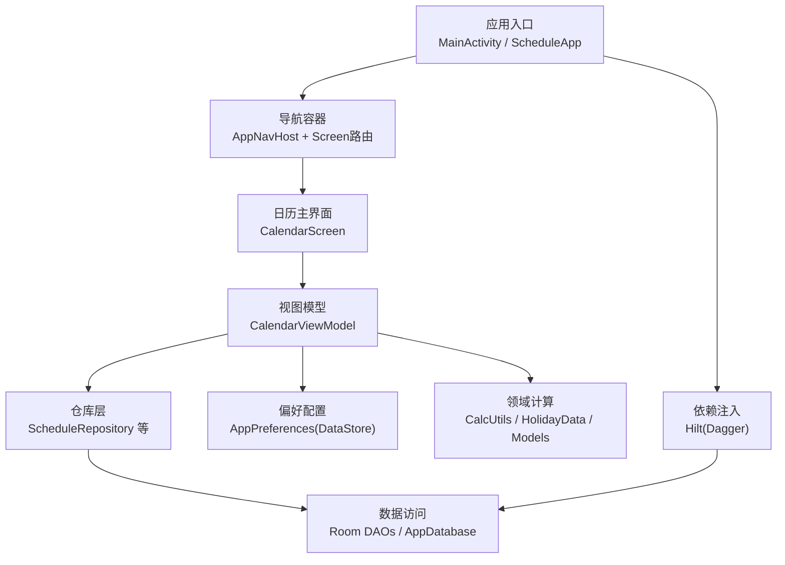
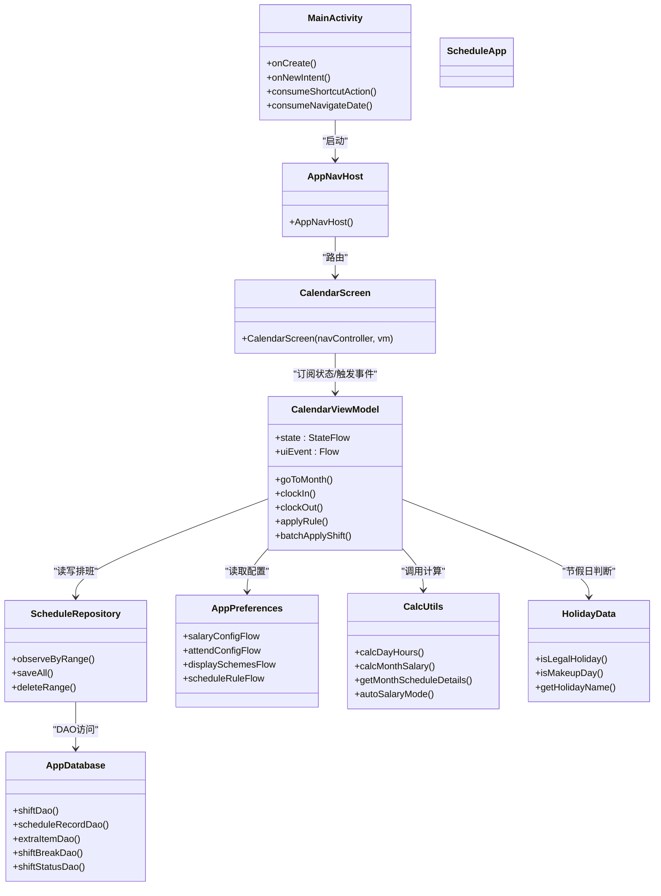
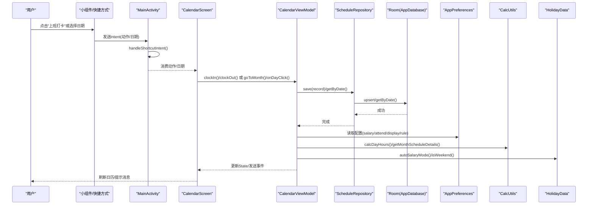
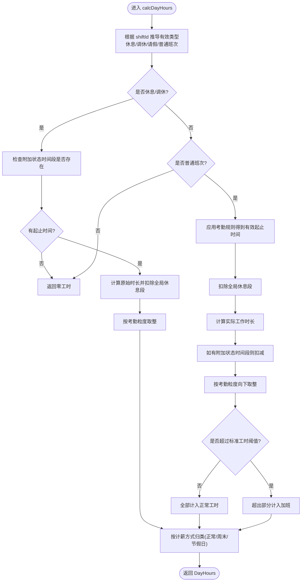
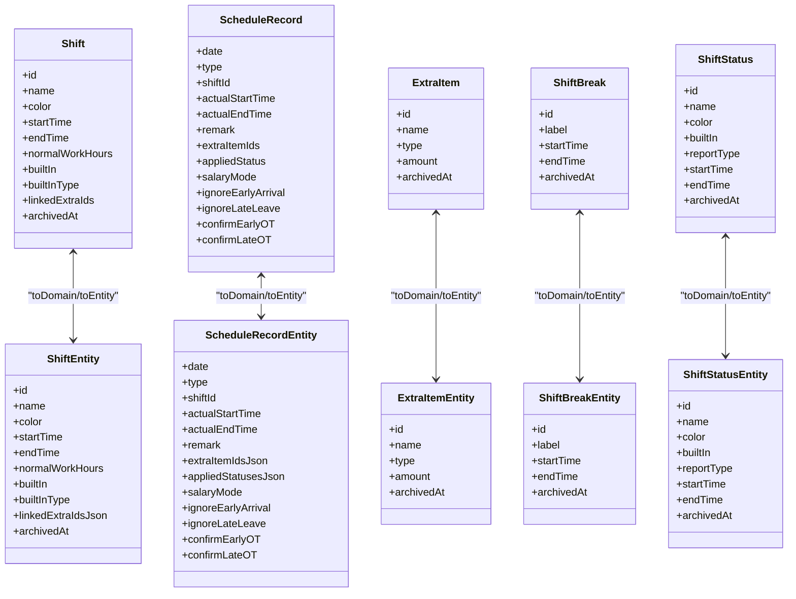
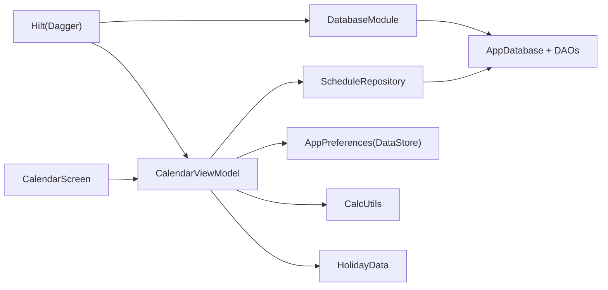

# 项目概述

<cite>
**本文引用的文件**   
- [MainActivity.kt](file://app/src/main/java/com/schedulecalendar/app/MainActivity.kt)
- [ScheduleApp.kt](file://app/src/main/java/com/schedulecalendar/app/ScheduleApp.kt)
- [AppDatabase.kt](file://app/src/main/java/com/schedulecalendar/app/data/db/AppDatabase.kt)
- [DatabaseModule.kt](file://app/src/main/java/com/schedulecalendar/app/di/DatabaseModule.kt)
- [AppPreferences.kt](file://app/src/main/java/com/schedulecalendar/app/data/prefs/AppPreferences.kt)
- [Mappers.kt](file://app/src/main/java/com/schedulecalendar/app/data/repository/Mappers.kt)
- [ScheduleRepository.kt](file://app/src/main/java/com/schedulecalendar/app/data/repository/ScheduleRepository.kt)
- [Models.kt](file://app/src/main/java/com/schedulecalendar/app/domain/model/Models.kt)
- [CalcUtils.kt](file://app/src/main/java/com/schedulecalendar/app/domain/model/CalcUtils.kt)
- [HolidayData.kt](file://app/src/main/java/com/schedulecalendar/app/domain/model/HolidayData.kt)
- [Screen.kt](file://app/src/main/java/com/schedulecalendar/app/ui/navigation/Screen.kt)
- [AppNavHost.kt](file://app/src/main/java/com/schedulecalendar/app/ui/navigation/AppNavHost.kt)
- [CalendarViewModel.kt](file://app/src/main/java/com/schedulecalendar/app/ui/calendar/CalendarViewModel.kt)
- [CalendarScreen.kt](file://app/src/main/java/com/schedulecalendar/app/ui/calendar/CalendarScreen.kt)
- [build.gradle.kts](file://app/build.gradle.kts)
- [settings.gradle.kts](file://settings.gradle.kts)
- [AndroidManifest.xml](file://app/src/main/AndroidManifest.xml)
</cite>

## 更新摘要
**变更内容**   
- 项目架构从多模块重构为单模块架构
- 模块描述从"排班日历多模块 Gradle 根工程"更新为"排班日历 Android 项目根（Gradle 编排）"
- 应用模块命名统一为":app"
- 简化了构建配置和依赖管理

## 目录
1. [简介](#简介)
2. [项目结构](#项目结构)
3. [核心组件](#核心组件)
4. [架构总览](#架构总览)
5. [详细组件分析](#详细组件分析)
6. [依赖关系分析](#依赖关系分析)
7. [性能考量](#性能考量)
8. [故障排查指南](#故障排查指南)
9. [结论](#结论)
10. [附录](#附录)

## 简介
本项目是一款面向排班与考勤场景的Android应用，提供智能排班管理、考勤打卡、薪资计算与数据可视化等核心能力。技术栈采用现代Android开发主流方案：Jetpack Compose构建UI、Room作为本地数据库、Hilt进行依赖注入、Navigation Compose实现类型安全路由，并通过DataStore持久化配置。整体遵循MVVM与Clean Architecture分层原则，将领域计算逻辑（工时/薪资）与UI解耦，便于扩展与维护。

**更新** 项目已重构为单模块架构，采用简化的Gradle编排方式，所有功能集中在单一应用中，提升了构建效率和可维护性。

目标用户群体包括需要轮班/倒班的员工与管理者，以及关注个人工时与薪资明细的个人用户。典型使用场景包括：
- 快速设置班次与循环规则，批量生成月度排班
- 快捷打卡（支持桌面小组件与动态快捷方式）
- 查看每日/每月工时与薪资明细，结合节假日自动分类
- 自定义显示方案与统计维度，直观掌握工作时长与收入

## 项目结构
项目采用单模块架构，按功能域与层次划分：
- 应用入口与主题：Activity、Application、Theme
- UI层（Compose）：导航、页面、组件
- 领域层（Domain）：模型、计算工具、节假日数据
- 数据层（Data）：Room数据库、DAO、实体、仓库、偏好存储
- 依赖注入（DI）：Hilt模块
- 小组件与提醒：Glance小组件、广播接收器

**图表来源**
- [MainActivity.kt:1-105](file://app/src/main/java/com/schedulecalendar/app/MainActivity.kt#L1-L105)
- [ScheduleApp.kt:1-9](file://app/src/main/java/com/schedulecalendar/app/ScheduleApp.kt#L1-L9)
- [AppNavHost.kt:1-133](file://app/src/main/java/com/schedulecalendar/app/ui/navigation/AppNavHost.kt#L1-L133)
- [Screen.kt:1-34](file://app/src/main/java/com/schedulecalendar/app/ui/navigation/Screen.kt#L1-L34)
- [CalendarScreen.kt:1-200](file://app/src/main/java/com/schedulecalendar/app/ui/calendar/CalendarScreen.kt#L1-L200)
- [CalendarViewModel.kt:1-800](file://app/src/main/java/com/schedulecalendar/app/ui/calendar/CalendarViewModel.kt#L1-L800)
- [AppDatabase.kt:1-35](file://app/src/main/java/com/schedulecalendar/app/data/db/AppDatabase.kt#L1-L35)
- [DatabaseModule.kt:1-35](file://app/src/main/java/com/schedulecalendar/app/di/DatabaseModule.kt#L1-L35)
- [AppPreferences.kt:1-303](file://app/src/main/java/com/schedulecalendar/app/data/prefs/AppPreferences.kt#L1-L303)
- [Models.kt:1-277](file://app/src/main/java/com/schedulecalendar/app/domain/model/Models.kt#L1-L277)
- [CalcUtils.kt:1-536](file://app/src/main/java/com/schedulecalendar/app/domain/model/CalcUtils.kt#L1-L536)
- [HolidayData.kt:1-636](file://app/src/main/java/com/schedulecalendar/app/domain/model/HolidayData.kt#L1-L636)

**章节来源**
- [MainActivity.kt:1-105](file://app/src/main/java/com/schedulecalendar/app/MainActivity.kt#L1-L105)
- [ScheduleApp.kt:1-9](file://app/src/main/java/com/schedulecalendar/app/ScheduleApp.kt#L1-L9)
- [AppNavHost.kt:1-133](file://app/src/main/java/com/schedulecalendar/app/ui/navigation/AppNavHost.kt#L1-L133)
- [Screen.kt:1-34](file://app/src/main/java/com/schedulecalendar/app/ui/navigation/Screen.kt#L1-L34)
- [CalendarScreen.kt:1-200](file://app/src/main/java/com/schedulecalendar/app/ui/calendar/CalendarScreen.kt#L1-L200)
- [CalendarViewModel.kt:1-800](file://app/src/main/java/com/schedulecalendar/app/ui/calendar/CalendarViewModel.kt#L1-L800)
- [AppDatabase.kt:1-35](file://app/src/main/java/com/schedulecalendar/app/data/db/AppDatabase.kt#L1-L35)
- [DatabaseModule.kt:1-35](file://app/src/main/java/com/schedulecalendar/app/di/DatabaseModule.kt#L1-L35)
- [AppPreferences.kt:1-303](file://app/src/main/java/com/schedulecalendar/app/data/prefs/AppPreferences.kt#L1-L303)
- [Models.kt:1-277](file://app/src/main/java/com/schedulecalendar/app/domain/model/Models.kt#L1-L277)
- [CalcUtils.kt:1-536](file://app/src/main/java/com/schedulecalendar/app/domain/model/CalcUtils.kt#L1-L536)
- [HolidayData.kt:1-636](file://app/src/main/java/com/schedulecalendar/app/domain/model/HolidayData.kt#L1-L636)

## 核心组件
- 应用入口与依赖注入
  - Application类启用Hilt，Activity通过@AndroidEntryPoint注入偏好配置并处理快捷方式与小组件跳转意图。
- 导航系统
  - 基于Navigation Compose的类型安全路由，Tab页包含"日历、事项、统计、班次、设置"，子页面以可序列化Route承载参数。
- 数据层
  - Room数据库集中声明实体与DAO；仓库封装CRUD与Flow响应式更新；偏好配置通过DataStore暴露Flow。
- 领域层
  - 模型定义涵盖班次、状态、记录、薪资配置、考勤规则、显示方案等；CalcUtils实现工时/薪资计算与日期分类；HolidayData内置法定假日与节气数据。
- 视图层
  - CalendarScreen负责日历交互与事件分发；CalendarViewModel聚合多源数据、执行业务操作并驱动UI状态。

**章节来源**
- [ScheduleApp.kt:1-9](file://app/src/main/java/com/schedulecalendar/app/ScheduleApp.kt#L1-L9)
- [MainActivity.kt:1-105](file://app/src/main/java/com/schedulecalendar/app/MainActivity.kt#L1-L105)
- [Screen.kt:1-34](file://app/src/main/java/com/schedulecalendar/app/ui/navigation/Screen.kt#L1-L34)
- [AppNavHost.kt:1-133](file://app/src/main/java/com/schedulecalendar/app/ui/navigation/AppNavHost.kt#L1-L133)
- [AppDatabase.kt:1-35](file://app/src/main/java/com/schedulecalendar/app/data/db/AppDatabase.kt#L1-L35)
- [DatabaseModule.kt:1-35](file://app/src/main/java/com/schedulecalendar/app/di/DatabaseModule.kt#L1-L35)
- [AppPreferences.kt:1-303](file://app/src/main/java/com/schedulecalendar/app/data/prefs/AppPreferences.kt#L1-L303)
- [Models.kt:1-277](file://app/src/main/java/com/schedulecalendar/app/domain/model/Models.kt#L1-L277)
- [CalcUtils.kt:1-536](file://app/src/main/java/com/schedulecalendar/app/domain/model/CalcUtils.kt#L1-L536)
- [HolidayData.kt:1-636](file://app/src/main/java/com/schedulecalendar/app/domain/model/HolidayData.kt#L1-L636)
- [CalendarScreen.kt:1-200](file://app/src/main/java/com/schedulecalendar/app/ui/calendar/CalendarScreen.kt#L1-L200)
- [CalendarViewModel.kt:1-800](file://app/src/main/java/com/schedulecalendar/app/ui/calendar/CalendarViewModel.kt#L1-L800)

## 架构总览
应用采用MVVM+Clean Architecture分层：
- UI层：Composable页面与导航，仅持有状态与事件回调
- ViewModel层：组合多仓库与配置，编排业务流，暴露State与事件
- 领域层：纯函数计算与常量模型，不依赖Android框架
- 数据层：Room+DAO、DataStore偏好、仓库抽象

**图表来源**
- [MainActivity.kt:1-105](file://app/src/main/java/com/schedulecalendar/app/MainActivity.kt#L1-L105)
- [AppNavHost.kt:1-133](file://app/src/main/java/com/schedulecalendar/app/ui/navigation/AppNavHost.kt#L1-L133)
- [CalendarScreen.kt:1-200](file://app/src/main/java/com/schedulecalendar/app/ui/calendar/CalendarScreen.kt#L1-L200)
- [CalendarViewModel.kt:1-800](file://app/src/main/java/com/schedulecalendar/app/ui/calendar/CalendarViewModel.kt#L1-L800)
- [ScheduleRepository.kt:1-40](file://app/src/main/java/com/schedulecalendar/app/data/repository/ScheduleRepository.kt#L1-L40)
- [AppDatabase.kt:1-35](file://app/src/main/java/com/schedulecalendar/app/data/db/AppDatabase.kt#L1-L35)
- [AppPreferences.kt:1-303](file://app/src/main/java/com/schedulecalendar/app/data/prefs/AppPreferences.kt#L1-L303)
- [CalcUtils.kt:1-536](file://app/src/main/java/com/schedulecalendar/app/domain/model/CalcUtils.kt#L1-L536)
- [HolidayData.kt:1-636](file://app/src/main/java/com/schedulecalendar/app/domain/model/HolidayData.kt#L1-L636)

## 详细组件分析

### 日历与排班流程（序列图）
展示从快捷方式/小组件到打卡与刷新显示的完整链路。

**图表来源**
- [MainActivity.kt:1-105](file://app/src/main/java/com/schedulecalendar/app/MainActivity.kt#L1-L105)
- [CalendarScreen.kt:1-200](file://app/src/main/java/com/schedulecalendar/app/ui/calendar/CalendarScreen.kt#L1-L200)
- [CalendarViewModel.kt:1-800](file://app/src/main/java/com/schedulecalendar/app/ui/calendar/CalendarViewModel.kt#L1-L800)
- [ScheduleRepository.kt:1-40](file://app/src/main/java/com/schedulecalendar/app/data/repository/ScheduleRepository.kt#L1-L40)
- [AppDatabase.kt:1-35](file://app/src/main/java/com/schedulecalendar/app/data/db/AppDatabase.kt#L1-L35)
- [AppPreferences.kt:1-303](file://app/src/main/java/com/schedulecalendar/app/data/prefs/AppPreferences.kt#L1-L303)
- [CalcUtils.kt:1-536](file://app/src/main/java/com/schedulecalendar/app/domain/model/CalcUtils.kt#L1-L536)
- [HolidayData.kt:1-636](file://app/src/main/java/com/schedulecalendar/app/domain/model/HolidayData.kt#L1-L636)

**章节来源**
- [MainActivity.kt:1-105](file://app/src/main/java/com/schedulecalendar/app/MainActivity.kt#L1-L105)
- [CalendarScreen.kt:1-200](file://app/src/main/java/com/schedulecalendar/app/ui/calendar/CalendarScreen.kt#L1-L200)
- [CalendarViewModel.kt:1-800](file://app/src/main/java/com/schedulecalendar/app/ui/calendar/CalendarViewModel.kt#L1-L800)
- [ScheduleRepository.kt:1-40](file://app/src/main/java/com/schedulecalendar/app/data/repository/ScheduleRepository.kt#L1-L40)
- [AppDatabase.kt:1-35](file://app/src/main/java/com/schedulecalendar/app/data/db/AppDatabase.kt#L1-L35)
- [AppPreferences.kt:1-303](file://app/src/main/java/com/schedulecalendar/app/data/prefs/AppPreferences.kt#L1-L303)
- [CalcUtils.kt:1-536](file://app/src/main/java/com/schedulecalendar/app/domain/model/CalcUtils.kt#L1-L536)
- [HolidayData.kt:1-636](file://app/src/main/java/com/schedulecalendar/app/domain/model/HolidayData.kt#L1-L636)

### 工时与薪资计算（流程图）
展示单日工时计算的关键分支与规则。

**图表来源**
- [CalcUtils.kt:149-230](file://app/src/main/java/com/schedulecalendar/app/domain/model/CalcUtils.kt#L149-L230)
- [Models.kt:14-100](file://app/src/main/java/com/schedulecalendar/app/domain/model/Models.kt#L14-L100)

**章节来源**
- [CalcUtils.kt:149-230](file://app/src/main/java/com/schedulecalendar/app/domain/model/CalcUtils.kt#L149-L230)
- [Models.kt:14-100](file://app/src/main/java/com/schedulecalendar/app/domain/model/Models.kt#L14-L100)

### 数据模型与映射（类图）
展示领域模型与数据库实体的对应关系及映射策略。

**图表来源**
- [Models.kt:14-100](file://app/src/main/java/com/schedulecalendar/app/domain/model/Models.kt#L14-L100)
- [Mappers.kt:1-134](file://app/src/main/java/com/schedulecalendar/app/data/repository/Mappers.kt#L1-L134)

**章节来源**
- [Models.kt:14-100](file://app/src/main/java/com/schedulecalendar/app/domain/model/Models.kt#L14-L100)
- [Mappers.kt:1-134](file://app/src/main/java/com/schedulecalendar/app/data/repository/Mappers.kt#L1-L134)

### 导航与页面组织
- 路由定义：Tab页与子页面均使用可序列化对象/数据类，保证类型安全与参数传递。
- 导航容器：统一底部Tab栏与动画过渡，非Tab页隐藏底部栏。
- 页面职责：CalendarScreen聚焦日历交互与事件派发，复杂逻辑下沉至ViewModel。

**章节来源**
- [Screen.kt:1-34](file://app/src/main/java/com/schedulecalendar/app/ui/navigation/Screen.kt#L1-L34)
- [AppNavHost.kt:1-133](file://app/src/main/java/com/schedulecalendar/app/ui/navigation/AppNavHost.kt#L1-L133)
- [CalendarScreen.kt:1-200](file://app/src/main/java/com/schedulecalendar/app/ui/calendar/CalendarScreen.kt#L1-L200)

## 依赖关系分析
- 依赖注入
  - Hilt在Application层启用，Activity与ViewModel通过注解注入依赖；DatabaseModule提供Room实例与各DAO。
- 数据依赖
  - Repository依赖DAO与Mapper，对上层暴露Flow与协程API；Preference通过DataStore暴露配置流。
- 领域依赖
  - ViewModel组合多个Repository与配置流，调用CalcUtils与HolidayData进行计算与日期分类。
- 外部库
  - Compose、Navigation、Room、DataStore、Glance、Coroutines、Gson、kotlinx-serialization、tyme4j等。

**更新** 项目采用单模块架构，所有依赖直接声明在app模块中，简化了依赖管理和构建过程。

**图表来源**
- [DatabaseModule.kt:1-35](file://app/src/main/java/com/schedulecalendar/app/di/DatabaseModule.kt#L1-L35)
- [AppDatabase.kt:1-35](file://app/src/main/java/com/schedulecalendar/app/data/db/AppDatabase.kt#L1-L35)
- [CalendarViewModel.kt:1-800](file://app/src/main/java/com/schedulecalendar/app/ui/calendar/CalendarViewModel.kt#L1-L800)
- [ScheduleRepository.kt:1-40](file://app/src/main/java/com/schedulecalendar/app/data/repository/ScheduleRepository.kt#L1-L40)
- [AppPreferences.kt:1-303](file://app/src/main/java/com/schedulecalendar/app/data/prefs/AppPreferences.kt#L1-L303)
- [CalcUtils.kt:1-536](file://app/src/main/java/com/schedulecalendar/app/domain/model/CalcUtils.kt#L1-L536)
- [HolidayData.kt:1-636](file://app/src/main/java/com/schedulecalendar/app/domain/model/HolidayData.kt#L1-L636)
- [CalendarScreen.kt:1-200](file://app/src/main/java/com/schedulecalendar/app/ui/calendar/CalendarScreen.kt#L1-L200)

**章节来源**
- [DatabaseModule.kt:1-35](file://app/src/main/java/com/schedulecalendar/app/di/DatabaseModule.kt#L1-L35)
- [AppDatabase.kt:1-35](file://app/src/main/java/com/schedulecalendar/app/data/db/AppDatabase.kt#L1-L35)
- [CalendarViewModel.kt:1-800](file://app/src/main/java/com/schedulecalendar/app/ui/calendar/CalendarViewModel.kt#L1-L800)
- [ScheduleRepository.kt:1-40](file://app/src/main/java/com/schedulecalendar/app/data/repository/ScheduleRepository.kt#L1-L40)
- [AppPreferences.kt:1-303](file://app/src/main/java/com/schedulecalendar/app/data/prefs/AppPreferences.kt#L1-L303)
- [CalcUtils.kt:1-536](file://app/src/main/java/com/schedulecalendar/app/domain/model/CalcUtils.kt#L1-L536)
- [HolidayData.kt:1-636](file://app/src/main/java/com/schedulecalendar/app/domain/model/HolidayData.kt#L1-L636)
- [CalendarScreen.kt:1-200](file://app/src/main/java/com/schedulecalendar/app/ui/calendar/CalendarScreen.kt#L1-L200)

## 性能考量
- 响应式数据流
  - Repository与Preference通过Flow暴露变更，避免频繁轮询；ViewModel在切月时取消旧收集Job，防止泄漏。
- 计算复杂度
  - 月级汇总遍历当月记录，时间复杂度O(N)，N为当月天数；跨月填充日期详情复用相同计算逻辑。
- 内存与渲染
  - 使用StateFlow与collectAsStateWithLifecycle减少不必要的重组；批量操作合并写入，降低IO次数。
- 迁移与兼容性
  - Room导出schema并配置破坏性迁移策略，简化版本升级成本。
- **新增** 单模块架构优势
  - 简化了构建配置，减少了模块间通信开销
  - 统一的依赖管理，避免了版本冲突问题
  - 更快的编译速度和更简单的调试体验

## 故障排查指南
- 打卡无响应
  - 检查Activity是否正确消费快捷方式动作与日期导航；确认ViewModel已收到事件并保存记录。
- 数据不同步
  - 确认Repository写操作后发出刷新信号；ViewModel是否正确监听并更新State。
- 薪资/工时异常
  - 核对考勤规则（粒度、容忍时长）、全局休息段、附加状态时间段与计薪方式；验证HolidayData节假日数据是否覆盖目标月份。
- 小组件/快捷方式失效
  - 检查动态快捷方式开关与权限；确认Intent action与额外字段传递正确。
- **新增** 构建问题
  - 单模块架构下，确保所有依赖都在app模块中正确声明
  - 检查Gradle配置中的镜像源和网络连接

**章节来源**
- [MainActivity.kt:1-105](file://app/src/main/java/com/schedulecalendar/app/MainActivity.kt#L1-L105)
- [CalendarViewModel.kt:1-800](file://app/src/main/java/com/schedulecalendar/app/ui/calendar/CalendarViewModel.kt#L1-L800)
- [ScheduleRepository.kt:1-40](file://app/src/main/java/com/schedulecalendar/app/data/repository/ScheduleRepository.kt#L1-L40)
- [CalcUtils.kt:1-536](file://app/src/main/java/com/schedulecalendar/app/domain/model/CalcUtils.kt#L1-L536)
- [HolidayData.kt:1-636](file://app/src/main/java/com/schedulecalendar/app/domain/model/HolidayData.kt#L1-L636)

## 结论
本项目以清晰的MVVM与Clean Architecture分层为基础，结合现代Android技术栈，实现了排班、打卡、薪资与可视化的完整闭环。**更新** 通过重构为单模块架构，项目获得了更好的构建性能和可维护性。领域计算与UI解耦，使业务规则易于测试与演进；响应式数据流与批量操作保障性能与体验。建议后续持续完善错误上报与单元测试覆盖，并对复杂计算路径引入更细粒度的性能监控。

## 附录
- 关键依赖与插件
  - Android Gradle/Kotlin/Compose/BOM、Navigation Compose、Hilt(KSP)、Room(KSP)、DataStore、Glance、Coroutines、Gson、kotlinx-serialization、tyme4j、DocumentFile等。
- **新增** 项目配置
  - 单模块架构，rootProject.name = "排班日历"
  - 应用包名：com.schedulecalendar.app
  - 最低SDK版本：26，目标SDK版本：36
  - 使用阿里云和华为云镜像加速依赖下载

**章节来源**
- [build.gradle.kts:1-116](file://app/build.gradle.kts#L1-L116)
- [settings.gradle.kts:1-37](file://settings.gradle.kts#L1-37)
- [AndroidManifest.xml:1-126](file://app/src/main/AndroidManifest.xml#L1-L126)