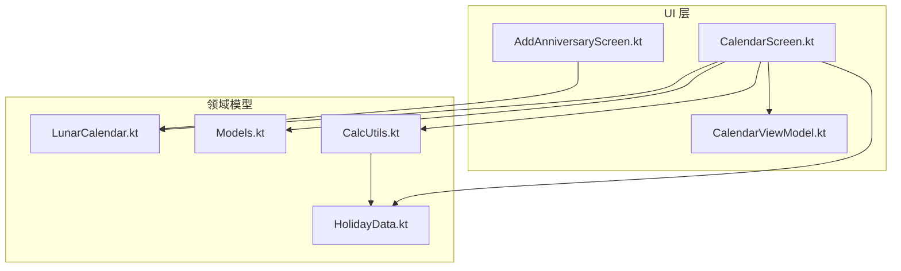
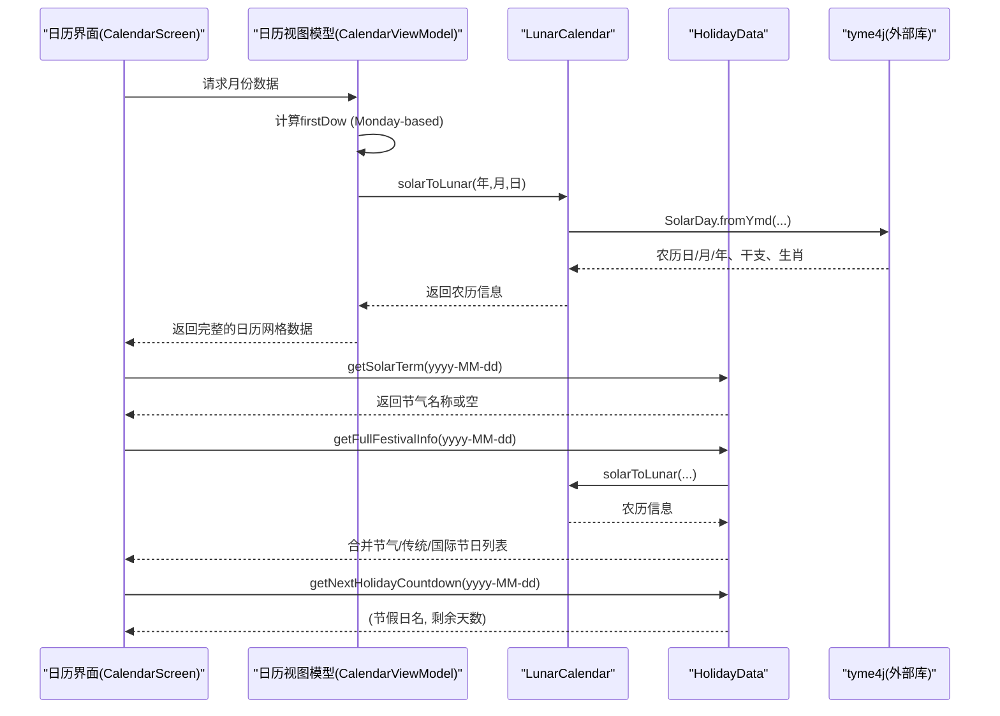
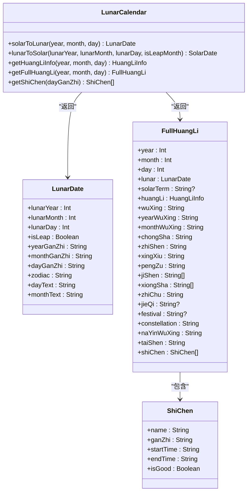
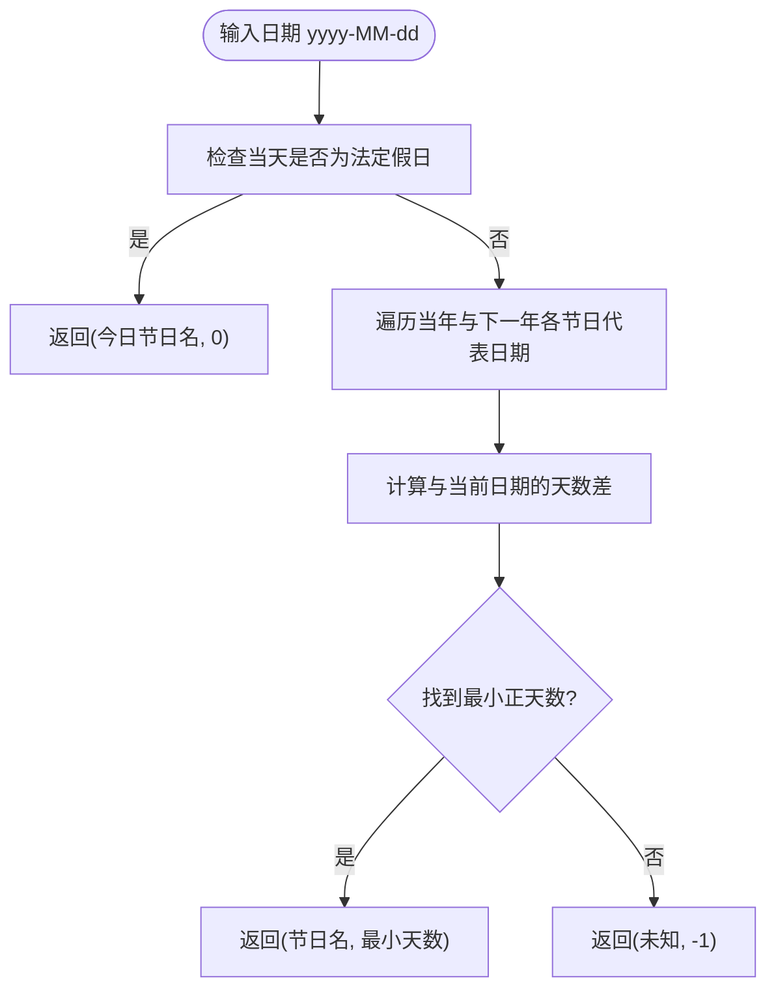
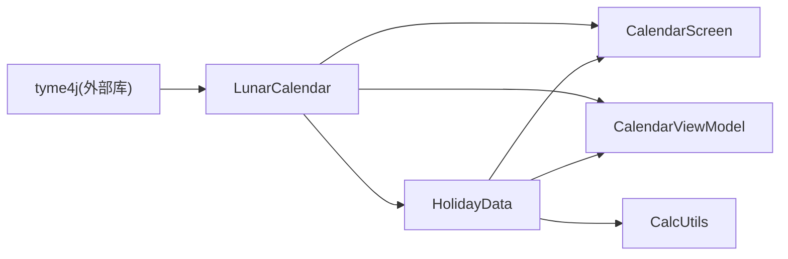

# 农历系统

<cite>
**本文引用的文件**   
- [LunarCalendar.kt](file://app/src/main/java/com/schedulecalendar/app/domain/model/LunarCalendar.kt)
- [HolidayData.kt](file://app/src/main/java/com/schedulecalendar/app/domain/model/HolidayData.kt)
- [Models.kt](file://app/src/main/java/com/schedulecalendar/app/domain/model/Models.kt)
- [CalcUtils.kt](file://app/src/main/java/com/schedulecalendar/app/domain/model/CalcUtils.kt)
- [CalendarScreen.kt](file://app/src/main/java/com/schedulecalendar/app/ui/calendar/CalendarScreen.kt)
- [CalendarViewModel.kt](file://app/src/main/java/com/schedulecalendar/app/ui/calendar/CalendarViewModel.kt)
- [AddAnniversaryScreen.kt](file://app/src/main/java/com/schedulecalendar/app/ui/todo/AddAnniversaryScreen.kt)
- [build.gradle.kts](file://app/build.gradle.kts)
</cite>

## 更新摘要
**所做更改**   
- 修复了日历星期偏移计算算法，从Sunday-based改为Monday-based对齐
- 更新了日历显示逻辑以确保星期位置正确性
- 统一了CalendarScreen和CalendarViewModel中的星期计算逻辑

## 目录
1. [简介](#简介)
2. [项目结构](#项目结构)
3. [核心组件](#核心组件)
4. [架构总览](#架构总览)
5. [详细组件分析](#详细组件分析)
6. [依赖关系分析](#依赖关系分析)
7. [性能与精度](#性能与精度)
8. [故障排查指南](#故障排查指南)
9. [结论](#结论)
10. [附录：使用示例与边界处理](#附录使用示例与边界处理)

## 简介
本文件系统化梳理本项目中"农历系统"的实现，覆盖公历与农历互转、闰月处理、干支纪年、节气与节日识别、黄历信息（宜忌、五行、冲煞、星宿等）、以及节假日倒计时与调休补班判定。同时给出数据源与更新机制说明、精度控制策略、性能优化建议，并提供实际使用示例与边界情况处理要点。

## 项目结构
与农历相关的代码主要位于领域模型层与 UI 展示层：
- 领域模型层
  - LunarCalendar.kt：封装公历/农历转换、干支、生肖、黄历信息、纳音五行、时辰吉凶等
  - HolidayData.kt：内置法定节假日、调休补班、二十四节气与传统节日数据及查询方法
  - Models.kt：通用数据模型（如日期节假日信息）
  - CalcUtils.kt：工时薪资计算工具，其中包含基于节假日/周末的自动计薪模式判断
- UI 层
  - CalendarScreen.kt：日历展示，集成农历、节气、节日、倒计时等信息，**已修复星期偏移计算**
  - CalendarViewModel.kt：日历状态管理，包含正确的Monday-based星期计算逻辑
  - AddAnniversaryScreen.kt：纪念日创建时支持公历/农历切换并双向转换



**图表来源**
- [LunarCalendar.kt:1-104](file://app/src/main/java/com/schedulecalendar/app/domain/model/LunarCalendar.kt#L1-L104)
- [HolidayData.kt:283-406](file://app/src/main/java/com/schedulecalendar/app/domain/model/HolidayData.kt#L283-L406)
- [Models.kt:271-277](file://app/src/main/java/com/schedulecalendar/app/domain/model/Models.kt#L271-L277)
- [CalcUtils.kt:499-522](file://app/src/main/java/com/schedulecalendar/app/domain/model/CalcUtils.kt#L499-L522)
- [CalendarScreen.kt:1773-1805](file://app/src/main/java/com/schedulecalendar/app/ui/calendar/CalendarScreen.kt#L1773-L1805)
- [CalendarViewModel.kt:140-150](file://app/src/main/java/com/schedulecalendar/app/ui/calendar/CalendarViewModel.kt#L140-L150)
- [AddAnniversaryScreen.kt:288-307](file://app/src/main/java/com/schedulecalendar/app/ui/todo/AddAnniversaryScreen.kt#L288-L307)

**章节来源**
- [LunarCalendar.kt:1-104](file://app/src/main/java/com/schedulecalendar/app/domain/model/LunarCalendar.kt#L1-L104)
- [HolidayData.kt:1-135](file://app/src/main/java/com/schedulecalendar/app/domain/model/HolidayData.kt#L1-L135)
- [Models.kt:271-277](file://app/src/main/java/com/schedulecalendar/app/domain/model/Models.kt#L271-L277)
- [CalcUtils.kt:499-522](file://app/src/main/java/com/schedulecalendar/app/domain/model/CalcUtils.kt#L499-L522)
- [CalendarScreen.kt:1773-1805](file://app/src/main/java/com/schedulecalendar/app/ui/calendar/CalendarScreen.kt#L1773-L1805)
- [CalendarViewModel.kt:140-150](file://app/src/main/java/com/schedulecalendar/app/ui/calendar/CalendarViewModel.kt#L140-L150)
- [AddAnniversaryScreen.kt:288-307](file://app/src/main/java/com/schedulecalendar/app/ui/todo/AddAnniversaryScreen.kt#L288-L307)

## 核心组件
- 农历转换与黄历（LunarCalendar）
  - 提供公历转农历、农历转公历、干支/生肖获取、黄历宜忌等级、完整黄历信息（含五行、冲煞、星宿、值神、建除、纳音、胎神、十二时辰吉凶等）
- 节假日与节气（HolidayData）
  - 内置 2024-2030 年法定节假日与调休补班数据；内置 2024-2030 年二十四节气日期；提供传统节日与国际节日识别；提供下一个法定节假日倒计时
- 自动计薪模式（CalcUtils）
  - 根据是否法定假日或周末（考虑调休补班）自动推断计薪模式（工作日/周末/节假日），用于工时分类与薪资计算
- UI 集成（CalendarScreen、CalendarViewModel、AddAnniversaryScreen）
  - **已修复**：在日历中展示农历、干支、节气、节日、倒计时，**确保星期位置正确性**
  - 在纪念日选择器中支持公历/农历双向切换

**章节来源**
- [LunarCalendar.kt:1-104](file://app/src/main/java/com/schedulecalendar/app/domain/model/LunarCalendar.kt#L1-L104)
- [HolidayData.kt:283-406](file://app/src/main/java/com/schedulecalendar/app/domain/model/HolidayData.kt#L283-L406)
- [CalcUtils.kt:499-522](file://app/src/main/java/com/schedulecalendar/app/domain/model/CalcUtils.kt#L499-L522)
- [CalendarScreen.kt:1773-1805](file://app/src/main/java/com/schedulecalendar/app/ui/calendar/CalendarScreen.kt#L1773-L1805)
- [CalendarViewModel.kt:140-150](file://app/src/main/java/com/schedulecalendar/app/ui/calendar/CalendarViewModel.kt#L140-L150)
- [AddAnniversaryScreen.kt:288-307](file://app/src/main/java/com/schedulecalendar/app/ui/todo/AddAnniversaryScreen.kt#L288-L307)

## 架构总览
下图展示了农历系统在应用中的调用关系与数据流向。



**图表来源**
- [CalendarScreen.kt:1773-1805](file://app/src/main/java/com/schedulecalendar/app/ui/calendar/CalendarScreen.kt#L1773-L1805)
- [CalendarViewModel.kt:140-150](file://app/src/main/java/com/schedulecalendar/app/ui/calendar/CalendarViewModel.kt#L140-L150)
- [LunarCalendar.kt:35-67](file://app/src/main/java/com/schedulecalendar/app/domain/model/LunarCalendar.kt#L35-L67)
- [HolidayData.kt:611-634](file://app/src/main/java/com/schedulecalendar/app/domain/model/HolidayData.kt#L611-L634)
- [HolidayData.kt:422-480](file://app/src/main/java/com/schedulecalendar/app/domain/model/HolidayData.kt#L422-L480)

## 详细组件分析

### 农历转换与黄历（LunarCalendar）
- 公历转农历
  - 通过 tyme4j 的 SolarDay 将公历转换为农历日对象，提取农历年、月、日、是否闰月、六十甲子（年/月/日干支）、生肖，并生成中文月份与日期文本
- 农历转公历
  - 通过 tyme4j 的 LunarDay 将农历转为公历，支持闰月（负月表示闰月）
- 黄历信息
  - 宜忌数量分级为大吉/吉/小吉/大凶/凶/平
  - 完整黄历聚合：五行（日/年/月）、冲煞、值神、建除、星宿、彭祖百忌、吉神/凶神、星座、纳音五行、胎神、十二时辰吉凶
- 关键数据结构
  - LunarDate：包含农历年月日、是否闰月、年/月/日干支、生肖、显示文本
  - FullHuangLi：聚合当日所有黄历相关字段



**图表来源**
- [LunarCalendar.kt:22-67](file://app/src/main/java/com/schedulecalendar/app/domain/model/LunarCalendar.kt#L22-L67)
- [LunarCalendar.kt:125-198](file://app/src/main/java/com/schedulecalendar/app/domain/model/LunarCalendar.kt#L125-L198)
- [LunarCalendar.kt:116-122](file://app/src/main/java/com/schedulecalendar/app/domain/model/LunarCalendar.kt#L116-L122)

**章节来源**
- [LunarCalendar.kt:35-67](file://app/src/main/java/com/schedulecalendar/app/domain/model/LunarCalendar.kt#L35-L67)
- [LunarCalendar.kt:94-104](file://app/src/main/java/com/schedulecalendar/app/domain/model/LunarCalendar.kt#L94-L104)
- [LunarCalendar.kt:148-169](file://app/src/main/java/com/schedulecalendar/app/domain/model/LunarCalendar.kt#L148-L169)
- [LunarCalendar.kt:172-198](file://app/src/main/java/com/schedulecalendar/app/domain/model/LunarCalendar.kt#L172-L198)
- [LunarCalendar.kt:301-327](file://app/src/main/java/com/schedulecalendar/app/domain/model/LunarCalendar.kt#L301-L327)

### 节假日与节气（HolidayData）
- 法定节假日与调休补班
  - 内置 2024-2030 年的法定假日与调休补班日期集合，提供 isLegalHoliday/isMakeupDay 等方法
- 二十四节气
  - 内置 2024-2030 年节气日期映射，提供 getSolarTerm 查询
- 传统节日与国际节日
  - 根据农历日期匹配传统节日（春节、元宵、端午、七夕、中秋、重阳、腊八、小年、除夕等）
  - 根据公历日期匹配国际节日（元旦、情人节、妇女节、劳动节、儿童节、教师节、国庆节、圣诞节等）
- 下一个法定节假日倒计时
  - 从当前日期起向前扫描当年与下一年的法定假日，返回最近的一个节假日及其剩余天数



**图表来源**
- [HolidayData.kt:422-480](file://app/src/main/java/com/schedulecalendar/app/domain/model/HolidayData.kt#L422-L480)
- [HolidayData.kt:16-135](file://app/src/main/java/com/schedulecalendar/app/domain/model/HolidayData.kt#L16-L135)
- [HolidayData.kt:142-169](file://app/src/main/java/com/schedulecalendar/app/domain/model/HolidayData.kt#L142-L169)
- [HolidayData.kt:301-399](file://app/src/main/java/com/schedulecalendar/app/domain/model/HolidayData.kt#L301-L399)
- [HolidayData.kt:542-576](file://app/src/main/java/com/schedulecalendar/app/domain/model/HolidayData.kt#L542-L576)
- [HolidayData.kt:583-604](file://app/src/main/java/com/schedulecalendar/app/domain/model/HolidayData.kt#L583-L604)
- [HolidayData.kt:611-634](file://app/src/main/java/com/schedulecalendar/app/domain/model/HolidayData.kt#L611-L634)

**章节来源**
- [HolidayData.kt:16-135](file://app/src/main/java/com/schedulecalendar/app/domain/model/HolidayData.kt#L16-L135)
- [HolidayData.kt:142-169](file://app/src/main/java/com/schedulecalendar/app/domain/model/HolidayData.kt#L142-L169)
- [HolidayData.kt:301-399](file://app/src/main/java/com/schedulecalendar/app/domain/model/HolidayData.kt#L301-L399)
- [HolidayData.kt:422-480](file://app/src/main/java/com/schedulecalendar/app/domain/model/HolidayData.kt#L422-L480)
- [HolidayData.kt:542-576](file://app/src/main/java/com/schedulecalendar/app/domain/model/HolidayData.kt#L542-L576)
- [HolidayData.kt:583-604](file://app/src/main/java/com/schedulecalendar/app/domain/model/HolidayData.kt#L583-L604)
- [HolidayData.kt:611-634](file://app/src/main/java/com/schedulecalendar/app/domain/model/HolidayData.kt#L611-L634)

### 自动计薪模式（CalcUtils）
- autoSalaryMode
  - 若日期为法定假日则计为"节假日"，否则若为周末且非调休补班则计为"周末"，其余为"工作日"
- isWeekend
  - 结合调休补班数据判断是否周末（调休补班视为工作日）

**章节来源**
- [CalcUtils.kt:499-522](file://app/src/main/java/com/schedulecalendar/app/domain/model/CalcUtils.kt#L499-L522)

### UI 集成（CalendarScreen、CalendarViewModel、AddAnniversaryScreen）
- **CalendarScreen**
  - **已修复**：展示农历月份与日期文本、干支与生肖、节气与传统/国际节日、法定节假日倒计时
  - **修复内容**：修正了星期偏移计算，确保日历显示的星期位置正确性
- **CalendarViewModel**
  - 使用统一的Monday-based星期计算逻辑 `(LocalDate.of(s.year, s.month, 1).dayOfWeek.value + 6) % 7`
  - 确保周起始日为周一，周日为索引6
- **AddAnniversaryScreen**
  - 支持公历/农历模式切换，并在切换时进行双向转换

**章节来源**
- [CalendarScreen.kt:1773-1805](file://app/src/main/java/com/schedulecalendar/app/ui/calendar/CalendarScreen.kt#L1773-L1805)
- [CalendarViewModel.kt:140-150](file://app/src/main/java/com/schedulecalendar/app/ui/calendar/CalendarViewModel.kt#L140-L150)
- [CalendarViewModel.kt:805-840](file://app/src/main/java/com/schedulecalendar/app/ui/calendar/CalendarViewModel.kt#L805-L840)
- [AddAnniversaryScreen.kt:288-307](file://app/src/main/java/com/schedulecalendar/app/ui/todo/AddAnniversaryScreen.kt#L288-L307)

### 日历星期偏移计算修复

**更新** 修复了日历显示的星期位置计算问题，从Sunday-based改为Monday-based对齐

#### 修复前的问题
原代码使用Sunday-based计算方式：
```kotlin
val firstDow = LocalDate.of(year, month, 1).dayOfWeek.let {
    if (it == DayOfWeek.SUNDAY) 6 else it.value - 1
}
```

这种方式导致：
- 周日被特殊处理为索引6
- 其他日期的索引计算不一致
- 与WEEK_LABELS ["一","二","三","四","五","六","日"] 的对应关系不正确

#### 修复后的方案
采用统一的Monday-based计算方式：
```kotlin
val firstDow = (LocalDate.of(year, month, 1).dayOfWeek.value + 6) % 7  // 周一=0..周日=6
```

这种方式的优点：
- 周一作为一周开始（索引0）
- 周日作为一周结束（索引6）
- 与WEEK_LABELS ["一","二","三","四","五","六","日"] 完美对应
- 与CalendarViewModel中的实现保持一致

#### 影响范围
- CalendarScreen.kt：主日历界面的星期偏移计算
- CalendarViewModel.kt：日历数据准备和小组件同步
- 确保所有日历显示场景的星期位置正确性

**章节来源**
- [CalendarScreen.kt:282-284](file://app/src/main/java/com/schedulecalendar/app/ui/calendar/CalendarScreen.kt#L282-L284)
- [CalendarViewModel.kt:141-142](file://app/src/main/java/com/schedulecalendar/app/ui/calendar/CalendarViewModel.kt#L141-L142)
- [CalendarViewModel.kt:809-810](file://app/src/main/java/com/schedulecalendar/app/ui/calendar/CalendarViewModel.kt#L809-L810)

## 依赖关系分析
- 外部依赖
  - tyme4j：农历与公历权威转换库，基于紫金山天文台标准
- 内部依赖
  - CalendarScreen 依赖 LunarCalendar 与 HolidayData
  - CalendarViewModel 协调 CalendarScreen 的数据需求
  - CalcUtils 依赖 HolidayData 以进行自动计薪模式判断
  - HolidayData 依赖 LunarCalendar 以进行传统节日识别



**图表来源**
- [build.gradle.kts:110-111](file://app/build.gradle.kts#L110-L111)
- [LunarCalendar.kt:1-12](file://app/src/main/java/com/schedulecalendar/app/domain/model/LunarCalendar.kt#L1-L12)
- [CalendarScreen.kt:1773-1805](file://app/src/main/java/com/schedulecalendar/app/ui/calendar/CalendarScreen.kt#L1773-L1805)
- [CalendarViewModel.kt:140-150](file://app/src/main/java/com/schedulecalendar/app/ui/calendar/CalendarViewModel.kt#L140-L150)
- [CalcUtils.kt:499-522](file://app/src/main/java/com/schedulecalendar/app/domain/model/CalcUtils.kt#L499-L522)

**章节来源**
- [build.gradle.kts:110-111](file://app/build.gradle.kts#L110-L111)
- [LunarCalendar.kt:1-12](file://app/src/main/java/com/schedulecalendar/app/domain/model/LunarCalendar.kt#L1-L12)
- [CalendarScreen.kt:1773-1805](file://app/src/main/java/com/schedulecalendar/app/ui/calendar/CalendarScreen.kt#L1773-L1805)
- [CalendarViewModel.kt:140-150](file://app/src/main/java/com/schedulecalendar/app/ui/calendar/CalendarViewModel.kt#L140-L150)
- [CalcUtils.kt:499-522](file://app/src/main/java/com/schedulecalendar/app/domain/model/CalcUtils.kt#L499-L522)

## 性能与精度
- 数据来源与准确性
  - 农历与节气数据采用 tyme4j 与内置数据表，确保权威性与一致性
- 精度控制
  - 时间粒度：考勤与加班按分钟粒度取整（可配置），避免浮点误差累积
  - 金额与工时：统一保留两位小数，减少显示与统计误差
- 性能优化
  - 节假日/节气查询使用 Map/Set 直接查找，O(1) 复杂度
  - 倒计时算法仅扫描当年与下一年固定数量的代表日期，开销可控
  - 大量日期渲染场景下，建议在 UI 层缓存已计算的农历/节气/节日结果，避免重复计算
  - **星期计算优化**：统一的Monday-based算法避免了条件分支判断，提升计算效率

[本节为通用指导，不直接分析具体文件]

## 故障排查指南
- 农历转换异常
  - 现象：农历转公历抛出异常或返回默认值
  - 排查：确认传入的农历年/月/日是否合法；闰月需设置 isLeapMonth=true；检查 tyme4j 版本兼容性
- 节假日/节气为空
  - 现象：指定日期未返回节气或节日
  - 排查：确认日期是否在内置范围（2024-2030）；检查日期格式是否正确（yyyy-MM-dd）
- 倒计时不准确
  - 现象：下一个节假日倒计时不正确
  - 排查：确认当前日期是否被误判为法定假日；检查 holidayNames 映射是否包含目标日期
- 调休补班影响周末判断
  - 现象：周末被当作工作日
  - 排查：检查 isMakeupDay 是否命中；确认 HolidayData 中 transferWorkdays 是否包含该日期
- **日历星期位置错误**
  - 现象：日历中日期显示的星期位置不正确
  - 排查：确认使用的是Monday-based计算逻辑 `(LocalDate.of(year, month, 1).dayOfWeek.value + 6) % 7`
  - 检查 WEEK_LABELS 是否与计算逻辑一致：["一","二","三","四","五","六","日"]
  - 验证 CalendarScreen 和 CalendarViewModel 中的 firstDow 计算是否统一

**章节来源**
- [LunarCalendar.kt:94-104](file://app/src/main/java/com/schedulecalendar/app/domain/model/LunarCalendar.kt#L94-L104)
- [HolidayData.kt:16-135](file://app/src/main/java/com/schedulecalendar/app/domain/model/HolidayData.kt#L16-L135)
- [HolidayData.kt:142-169](file://app/src/main/java/com/schedulecalendar/app/domain/model/HolidayData.kt#L142-L169)
- [HolidayData.kt:422-480](file://app/src/main/java/com/schedulecalendar/app/domain/model/HolidayData.kt#L422-L480)
- [CalcUtils.kt:515-522](file://app/src/main/java/com/schedulecalendar/app/domain/model/CalcUtils.kt#L515-L522)
- [CalendarScreen.kt:282-284](file://app/src/main/java/com/schedulecalendar/app/ui/calendar/CalendarScreen.kt#L282-L284)
- [CalendarViewModel.kt:141-142](file://app/src/main/java/com/schedulecalendar/app/ui/calendar/CalendarViewModel.kt#L141-L142)

## 结论
本项目农历系统以 tyme4j 为核心，结合内置节假日与节气数据，实现了高准确性的公历/农历转换、干支与生肖、黄历信息、节气与传统节日识别，以及与 UI 的深度集成。**最新修复确保了日历显示的星期位置正确性**，通过统一的Monday-based计算逻辑解决了Sunday-based导致的显示问题。通过合理的精度控制与 O(1) 查询策略，在保证准确性的前提下具备良好的性能表现。未来可按需扩展数据范围与更多黄历细节。

[本节为总结性内容，不直接分析具体文件]

## 附录：使用示例与边界处理

### 使用示例
- 公历转农历
  - 调用路径：CalendarScreen 中通过 LunarCalendar.solarToLunar 获取农历信息与干支
  - 参考路径：[CalendarScreen.kt:1773-1783](file://app/src/main/java/com/schedulecalendar/app/ui/calendar/CalendarScreen.kt#L1773-L1783)
- 农历转公历
  - 调用路径：AddAnniversaryScreen 在农历模式下使用 LunarCalendar.lunarToSolar 转换
  - 参考路径：[AddAnniversaryScreen.kt:298-304](file://app/src/main/java/com/schedulecalendar/app/ui/todo/AddAnniversaryScreen.kt#L298-L304)
- 获取节气与节日
  - 调用路径：CalendarScreen 中通过 HolidayData.getSolarTerm 与 getFullFestivalInfo 获取
  - 参考路径：[CalendarScreen.kt:1785-1799](file://app/src/main/java/com/schedulecalendar/app/ui/calendar/CalendarScreen.kt#L1785-L1799)
- 下一个法定节假日倒计时
  - 调用路径：CalendarScreen 中通过 HolidayData.getNextHolidayCountdown 获取
  - 参考路径：[CalendarScreen.kt:1801-1805](file://app/src/main/java/com/schedulecalendar/app/ui/calendar/CalendarScreen.kt#L1801-L1805)
- **日历星期偏移计算**
  - 调用路径：CalendarScreen 和 CalendarViewModel 中使用统一的Monday-based算法
  - 参考路径：[CalendarScreen.kt:282-284](file://app/src/main/java/com/schedulecalendar/app/ui/calendar/CalendarScreen.kt#L282-L284)、[CalendarViewModel.kt:141-142](file://app/src/main/java/com/schedulecalendar/app/ui/calendar/CalendarViewModel.kt#L141-L142)

**章节来源**
- [CalendarScreen.kt:1773-1805](file://app/src/main/java/com/schedulecalendar/app/ui/calendar/CalendarScreen.kt#L1773-L1805)
- [CalendarViewModel.kt:141-142](file://app/src/main/java/com/schedulecalendar/app/ui/calendar/CalendarViewModel.kt#L141-L142)
- [AddAnniversaryScreen.kt:288-307](file://app/src/main/java/com/schedulecalendar/app/ui/todo/AddAnniversaryScreen.kt#L288-L307)

### 边界情况处理
- 闰月处理
  - 农历转公历时，闰月需传入 isLeapMonth=true，内部以负月索引处理
  - 参考路径：[LunarCalendar.kt:94-104](file://app/src/main/java/com/schedulecalendar/app/domain/model/LunarCalendar.kt#L94-L104)
- 除夕判定
  - 当腊月为小月（29天）时，除夕可能落在腊月二十九，逻辑会检查次日是否为正月初一
  - 参考路径：[HolidayData.kt:568-573](file://app/src/main/java/com/schedulecalendar/app/domain/model/HolidayData.kt#L568-L573)
- 调休补班对周末的影响
  - 周末判断需排除调休补班日期，确保计薪模式正确
  - 参考路径：[CalcUtils.kt:515-522](file://app/src/main/java/com/schedulecalendar/app/domain/model/CalcUtils.kt#L515-L522)
- 数据范围限制
  - 内置节假日与节气数据范围为 2024-2030，超出范围需扩展数据或接入动态数据源
  - 参考路径：[HolidayData.kt:16-135](file://app/src/main/java/com/schedulecalendar/app/domain/model/HolidayData.kt#L16-L135)、[HolidayData.kt:301-399](file://app/src/main/java/com/schedulecalendar/app/domain/model/HolidayData.kt#L301-L399)
- **星期偏移计算边界**
  - Monday-based算法确保所有日期都能正确映射到对应的星期索引
  - 公式 `(dayOfWeek.value + 6) % 7` 正确处理了周日（value=7）的情况，得到索引6
  - 参考路径：[CalendarScreen.kt:282-284](file://app/src/main/java/com/schedulecalendar/app/ui/calendar/CalendarScreen.kt#L282-L284)、[CalendarViewModel.kt:141-142](file://app/src/main/java/com/schedulecalendar/app/ui/calendar/CalendarViewModel.kt#L141-L142)

**章节来源**
- [LunarCalendar.kt:94-104](file://app/src/main/java/com/schedulecalendar/app/domain/model/LunarCalendar.kt#L94-L104)
- [HolidayData.kt:568-573](file://app/src/main/java/com/schedulecalendar/app/domain/model/HolidayData.kt#L568-L573)
- [CalcUtils.kt:515-522](file://app/src/main/java/com/schedulecalendar/app/domain/model/CalcUtils.kt#L515-L522)
- [HolidayData.kt:16-135](file://app/src/main/java/com/schedulecalendar/app/domain/model/HolidayData.kt#L16-L135)
- [HolidayData.kt:301-399](file://app/src/main/java/com/schedulecalendar/app/domain/model/HolidayData.kt#L301-L399)
- [CalendarScreen.kt:282-284](file://app/src/main/java/com/schedulecalendar/app/ui/calendar/CalendarScreen.kt#L282-L284)
- [CalendarViewModel.kt:141-142](file://app/src/main/java/com/schedulecalendar/app/ui/calendar/CalendarViewModel.kt#L141-L142)