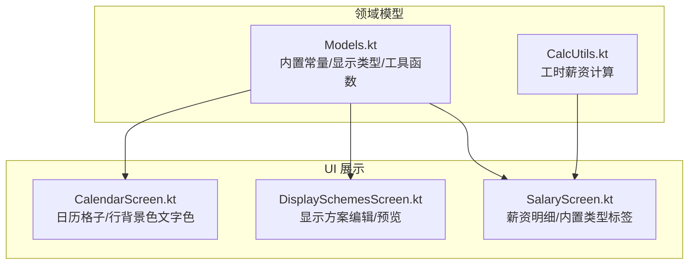
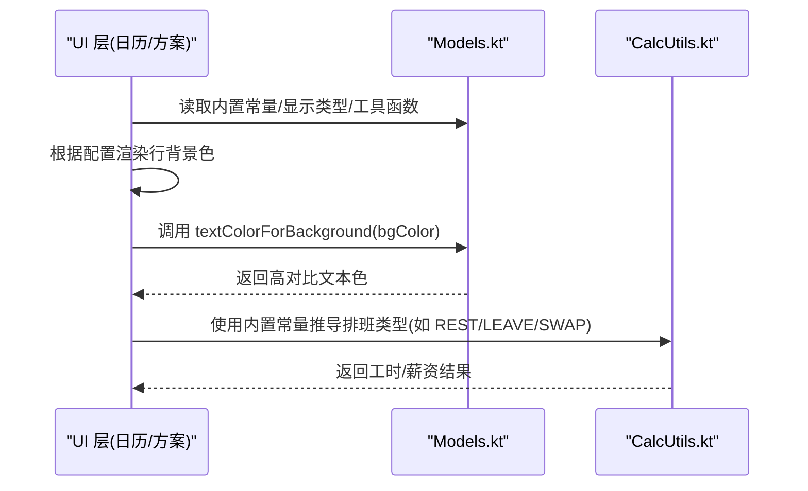
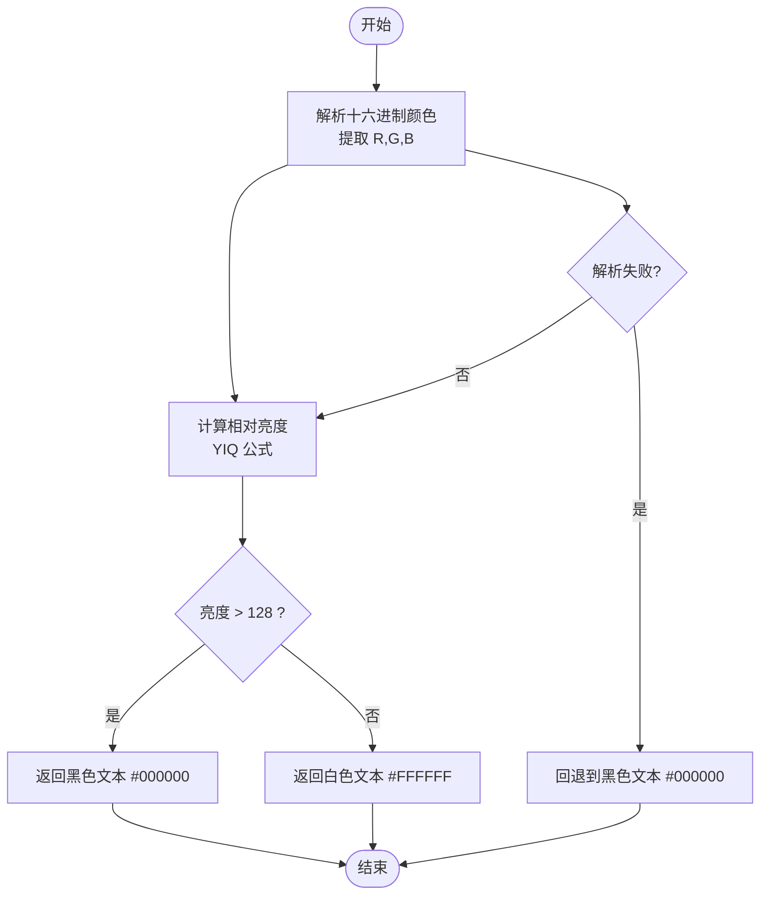
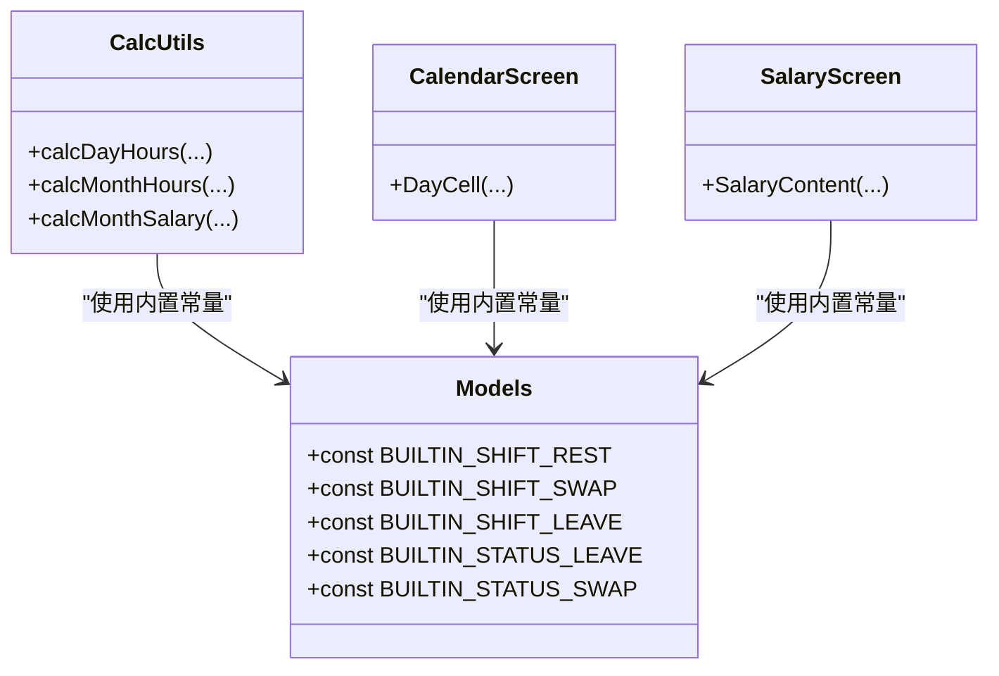
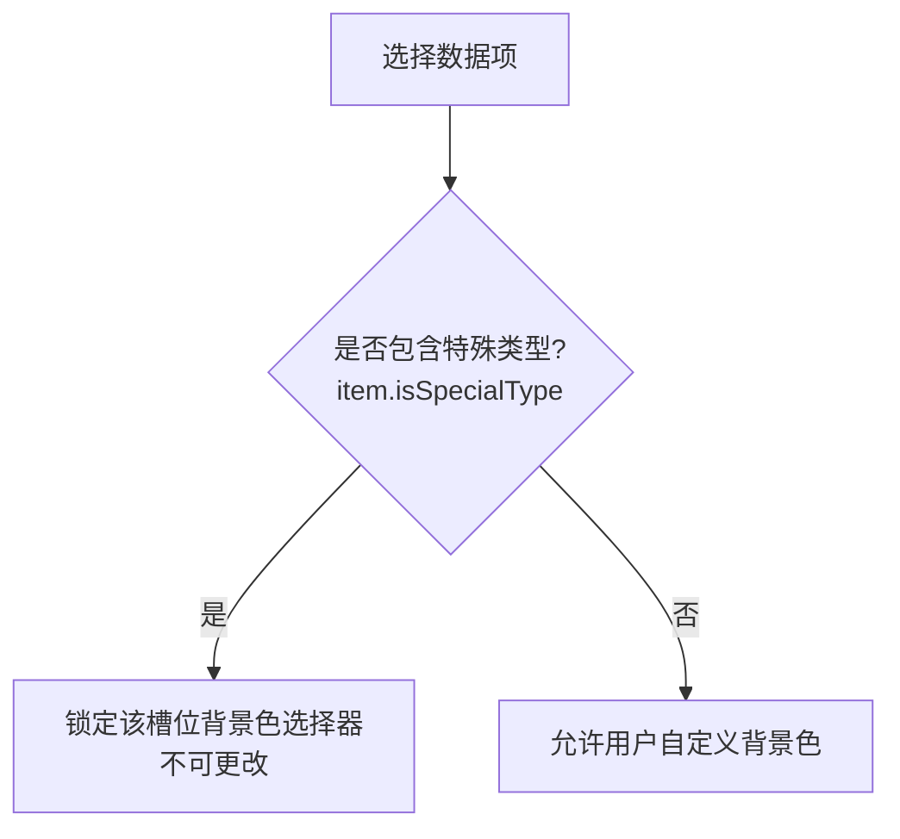
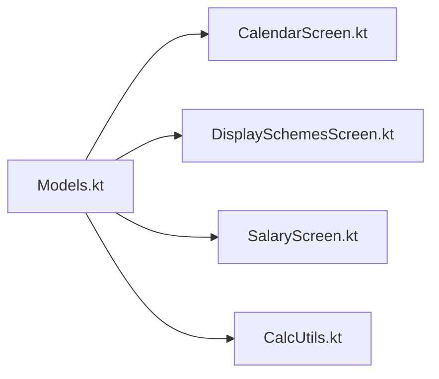

# 工具模型

<cite>
**本文引用的文件**
- [Models.kt](file://app/src/main/java/com/schedulecalendar/app/domain/model/Models.kt)
- [CalcUtils.kt](file://app/src/main/java/com/schedulecalendar/app/domain/model/CalcUtils.kt)
- [CalendarScreen.kt](file://app/src/main/java/com/schedulecalendar/app/ui/calendar/CalendarScreen.kt)
- [DisplaySchemesScreen.kt](file://app/src/main/java/com/schedulecalendar/app/ui/detail/DisplaySchemesScreen.kt)
- [SalaryScreen.kt](file://app/src/main/java/com/schedulecalendar/app/ui/salary/SalaryScreen.kt)
</cite>

## 目录
1. [简介](#简介)
2. [项目结构](#项目结构)
3. [核心组件](#核心组件)
4. [架构总览](#架构总览)
5. [详细组件分析](#详细组件分析)
6. [依赖关系分析](#依赖关系分析)
7. [性能考量](#性能考量)
8. [故障排查指南](#故障排查指南)
9. [结论](#结论)
10. [附录](#附录)

## 简介
本文件聚焦于“工具模型”，系统梳理项目中用于辅助显示与计算的通用能力，包括：
- 颜色适配算法与亮度计算公式（文本色自动对比）
- 内置常量（如 BUILTIN_SHIFT_REST、BUILTIN_STATUS_LEAVE）的用途与命名规范
- isSpecialType 扩展属性的作用与特殊类型判断逻辑
- 这些工具方法在业务中的使用场景与调用示例
- 工具的扩展点与自定义方法开发指南

## 项目结构
围绕工具模型的相关代码主要分布在领域模型与 UI 展示层：
- 领域模型集中定义内置常量、数据项类型、显示方案以及通用工具函数
- UI 层在日历格子、显示方案编辑器等场景中复用这些工具

图表来源
- [Models.kt:1-12](file://app/src/main/java/com/schedulecalendar/app/domain/model/Models.kt#L1-L12)
- [Models.kt:144-180](file://app/src/main/java/com/schedulecalendar/app/domain/model/Models.kt#L144-L180)
- [Models.kt:209-222](file://app/src/main/java/com/schedulecalendar/app/domain/model/Models.kt#L209-L222)
- [CalendarScreen.kt:743-752](file://app/src/main/java/com/schedulecalendar/app/ui/calendar/CalendarScreen.kt#L743-L752)
- [DisplaySchemesScreen.kt:40-44](file://app/src/main/java/com/schedulecalendar/app/ui/detail/DisplaySchemesScreen.kt#L40-L44)
- [SalaryScreen.kt:443-456](file://app/src/main/java/com/schedulecalendar/app/ui/salary/SalaryScreen.kt#L443-L456)

章节来源
- [Models.kt:1-12](file://app/src/main/java/com/schedulecalendar/app/domain/model/Models.kt#L1-L12)
- [Models.kt:144-180](file://app/src/main/java/com/schedulecalendar/app/domain/model/Models.kt#L144-L180)
- [Models.kt:209-222](file://app/src/main/java/com/schedulecalendar/app/domain/model/Models.kt#L209-L222)
- [CalendarScreen.kt:743-752](file://app/src/main/java/com/schedulecalendar/app/ui/calendar/CalendarScreen.kt#L743-L752)
- [DisplaySchemesScreen.kt:40-44](file://app/src/main/java/com/schedulecalendar/app/ui/detail/DisplaySchemesScreen.kt#L40-L44)
- [SalaryScreen.kt:443-456](file://app/src/main/java/com/schedulecalendar/app/ui/salary/SalaryScreen.kt#L443-L456)

## 核心组件
本节对工具模型的关键点进行说明：
- 内置常量：统一标识内置班次与状态，避免硬编码字符串散落各处
- DisplayItemType 与 isSpecialType：为数据项提供预设标签与颜色锁定机制
- textColorForBackground：基于 YIQ 相对亮度的文本色自适应算法
- 在 UI 中的实际调用：日历格子行背景色与文本色的联动、显示方案编辑器的颜色选择器

章节来源
- [Models.kt:4-11](file://app/src/main/java/com/schedulecalendar/app/domain/model/Models.kt#L4-L11)
- [Models.kt:144-156](file://app/src/main/java/com/schedulecalendar/app/domain/model/Models.kt#L144-L156)
- [Models.kt:209-222](file://app/src/main/java/com/schedulecalendar/app/domain/model/Models.kt#L209-L222)
- [CalendarScreen.kt:904-940](file://app/src/main/java/com/schedulecalendar/app/ui/calendar/CalendarScreen.kt#L904-L940)
- [DisplaySchemesScreen.kt:647-649](file://app/src/main/java/com/schedulecalendar/app/ui/detail/DisplaySchemesScreen.kt#L647-L649)

## 架构总览
工具模型在系统中的角色如下：
- 领域模型提供“可复用的规则与常量”
- UI 层消费这些规则进行渲染与交互
- 计算模块（CalcUtils）也依赖内置常量以保持一致的业务语义

图表来源
- [Models.kt:4-11](file://app/src/main/java/com/schedulecalendar/app/domain/model/Models.kt#L4-L11)
- [Models.kt:209-222](file://app/src/main/java/com/schedulecalendar/app/domain/model/Models.kt#L209-L222)
- [CalcUtils.kt:158-162](file://app/src/main/java/com/schedulecalendar/app/domain/model/CalcUtils.kt#L158-L162)
- [CalendarScreen.kt:904-940](file://app/src/main/java/com/schedulecalendar/app/ui/calendar/CalendarScreen.kt#L904-L940)

## 详细组件分析

### 颜色适配算法：textColorForBackground
- 输入：十六进制背景色字符串（如 "#RRGGBB"）
- 处理：
  - 解析 R/G/B 分量
  - 使用 YIQ 相对亮度公式：brightness = (R*299 + G*587 + B*114) / 1000
  - 阈值比较：brightness > 128 则返回黑色文本，否则返回白色文本
- 输出："#000000" 或 "#FFFFFF"
- 异常处理：解析失败时回退到默认黑色文本

图表来源
- [Models.kt:209-222](file://app/src/main/java/com/schedulecalendar/app/domain/model/Models.kt#L209-L222)

章节来源
- [Models.kt:209-222](file://app/src/main/java/com/schedulecalendar/app/domain/model/Models.kt#L209-L222)

### 内置常量：BUILTIN_SHIFT_REST、BUILTIN_STATUS_LEAVE 等
- 用途：
  - 统一标识内置班次与状态，避免散落的魔法字符串
  - 在计算与 UI 中一致地识别“休息/调休/请假”等内置类型
- 命名规范：
  - 前缀 BUILTIN_ 表示内置
  - SHIFT_/STATUS_ 区分实体类别
  - 后缀使用下划线分隔的英文小写语义词（rest/swap/leave）
- 典型使用：
  - 计算模块依据 shiftId 映射到 ScheduleType（REST/LEAVE/SWAP）
  - UI 层根据内置类型渲染标签与颜色

图表来源
- [Models.kt:4-11](file://app/src/main/java/com/schedulecalendar/app/domain/model/Models.kt#L4-L11)
- [CalcUtils.kt:158-162](file://app/src/main/java/com/schedulecalendar/app/domain/model/CalcUtils.kt#L158-L162)
- [CalendarScreen.kt:639-642](file://app/src/main/java/com/schedulecalendar/app/ui/calendar/CalendarScreen.kt#L639-L642)
- [SalaryScreen.kt:443-456](file://app/src/main/java/com/schedulecalendar/app/ui/salary/SalaryScreen.kt#L443-L456)

章节来源
- [Models.kt:4-11](file://app/src/main/java/com/schedulecalendar/app/domain/model/Models.kt#L4-L11)
- [CalcUtils.kt:158-162](file://app/src/main/java/com/schedulecalendar/app/domain/model/CalcUtils.kt#L158-L162)
- [CalendarScreen.kt:639-642](file://app/src/main/java/com/schedulecalendar/app/ui/calendar/CalendarScreen.kt#L639-L642)
- [SalaryScreen.kt:443-456](file://app/src/main/java/com/schedulecalendar/app/ui/salary/SalaryScreen.kt#L443-L456)

### 扩展属性：isSpecialType
- 作用：
  - 标记 DisplayItemType 是否为“特殊类型”（具有预设标签与颜色）
  - 在显示方案编辑器中，若某行包含特殊类型，则锁定该行槽位的背景色选择器，禁止用户自定义颜色
- 判断逻辑：
  - 当 DisplayItemType.defaultColor != null 时，视为特殊类型
- 使用场景：
  - 显示方案编辑器的颜色选择器网格中，检测 hasLockedItem 并禁用对应槽位

图表来源
- [Models.kt:144-156](file://app/src/main/java/com/schedulecalendar/app/domain/model/Models.kt#L144-L156)
- [DisplaySchemesScreen.kt:647-649](file://app/src/main/java/com/schedulecalendar/app/ui/detail/DisplaySchemesScreen.kt#L647-L649)

章节来源
- [Models.kt:144-156](file://app/src/main/java/com/schedulecalendar/app/domain/model/Models.kt#L144-L156)
- [DisplaySchemesScreen.kt:647-649](file://app/src/main/java/com/schedulecalendar/app/ui/detail/DisplaySchemesScreen.kt#L647-L649)

### 在业务中的使用场景与调用示例
- 日历格子行背景色与文本色联动
  - 从 DataRowConfig 读取左右槽位背景色
  - 调用文本色适配函数生成高对比文本色
  - 将文本色应用到 Text 组件
- 显示方案编辑器
  - 使用 textColorForBackground 在预览区域与颜色按钮上保证可读性
  - 通过 isSpecialType 锁定特殊类型的槽位颜色
- 薪资明细页
  - 使用内置常量识别内置类型（请假/调休/休息），渲染对应标签与颜色

章节来源
- [CalendarScreen.kt:904-940](file://app/src/main/java/com/schedulecalendar/app/ui/calendar/CalendarScreen.kt#L904-L940)
- [DisplaySchemesScreen.kt:604-613](file://app/src/main/java/com/schedulecalendar/app/ui/detail/DisplaySchemesScreen.kt#L604-L613)
- [SalaryScreen.kt:443-456](file://app/src/main/java/com/schedulecalendar/app/ui/salary/SalaryScreen.kt#L443-L456)

## 依赖关系分析
- 低耦合：工具函数与常量集中在 Models.kt，UI 与计算模块仅依赖其公开接口
- 一致性：CalcUtils 与 UI 均使用同一组内置常量，确保业务语义一致
- 可扩展：新增显示类型或内置类型只需在 Models.kt 扩展，UI 与计算层无需改动大量逻辑

图表来源
- [Models.kt:4-11](file://app/src/main/java/com/schedulecalendar/app/domain/model/Models.kt#L4-L11)
- [Models.kt:144-156](file://app/src/main/java/com/schedulecalendar/app/domain/model/Models.kt#L144-L156)
- [Models.kt:209-222](file://app/src/main/java/com/schedulecalendar/app/domain/model/Models.kt#L209-L222)
- [CalendarScreen.kt:904-940](file://app/src/main/java/com/schedulecalendar/app/ui/calendar/CalendarScreen.kt#L904-L940)
- [DisplaySchemesScreen.kt:604-613](file://app/src/main/java/com/schedulecalendar/app/ui/detail/DisplaySchemesScreen.kt#L604-L613)
- [SalaryScreen.kt:443-456](file://app/src/main/java/com/schedulecalendar/app/ui/salary/SalaryScreen.kt#L443-L456)
- [CalcUtils.kt:158-162](file://app/src/main/java/com/schedulecalendar/app/domain/model/CalcUtils.kt#L158-L162)

## 性能考量
- 文本色计算为 O(1)，开销极小，适合在高频渲染路径中使用
- 建议在 Compose 中缓存已计算的颜色值，避免重复计算
- 对于大数据量列表（如多行多列），可将常用颜色与文本色组合预计算并复用

[本节为通用指导，不直接分析具体文件]

## 故障排查指南
- 颜色解析异常
  - 现象：背景色字符串格式不正确导致解析失败
  - 处理：工具函数捕获异常并回退到默认文本色；建议在上层校验输入格式
- 特殊类型锁定冲突
  - 现象：用户无法修改特定槽位背景色
  - 原因：该行包含特殊类型（isSpecialType=true）
  - 处理：移除特殊类型或调整显示方案配置
- 内置类型不一致
  - 现象：计算与 UI 显示不一致
  - 原因：使用了不同的常量或硬编码字符串
  - 处理：统一引用 Models.kt 中的内置常量

章节来源
- [Models.kt:209-222](file://app/src/main/java/com/schedulecalendar/app/domain/model/Models.kt#L209-L222)
- [DisplaySchemesScreen.kt:647-649](file://app/src/main/java/com/schedulecalendar/app/ui/detail/DisplaySchemesScreen.kt#L647-L649)

## 结论
工具模型通过集中化的常量、扩展属性与工具函数，实现了：
- 一致的内置类型语义与命名规范
- 可靠的文本色自适应算法，提升可读性与无障碍体验
- 清晰的扩展点，便于后续新增显示类型或内置类型
- 良好的解耦与复用，降低维护成本

[本节为总结，不直接分析具体文件]

## 附录

### 扩展点与自定义方法开发指南
- 新增显示类型
  - 在 DisplayItemType 中添加新枚举项，并为需要预设颜色的类型设置 defaultColor
  - 在相关 UI 处补充文本计算与样式逻辑
- 新增内置类型
  - 在 Models.kt 中新增常量与对应的 Shift/ShiftStatus 条目
  - 在 CalcUtils 中完善 effectiveType 的映射与计算分支
- 自定义文本色算法
  - 可在 Models.kt 中扩展新的文本色计算函数，并在 UI 层替换调用点
  - 注意保持异常处理与回退策略，确保鲁棒性

章节来源
- [Models.kt:144-156](file://app/src/main/java/com/schedulecalendar/app/domain/model/Models.kt#L144-L156)
- [Models.kt:209-222](file://app/src/main/java/com/schedulecalendar/app/domain/model/Models.kt#L209-L222)
- [CalcUtils.kt:158-162](file://app/src/main/java/com/schedulecalendar/app/domain/model/CalcUtils.kt#L158-L162)