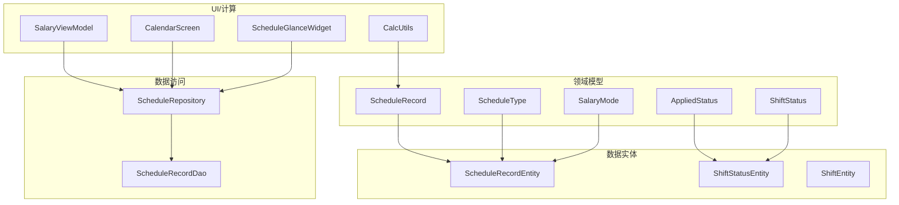
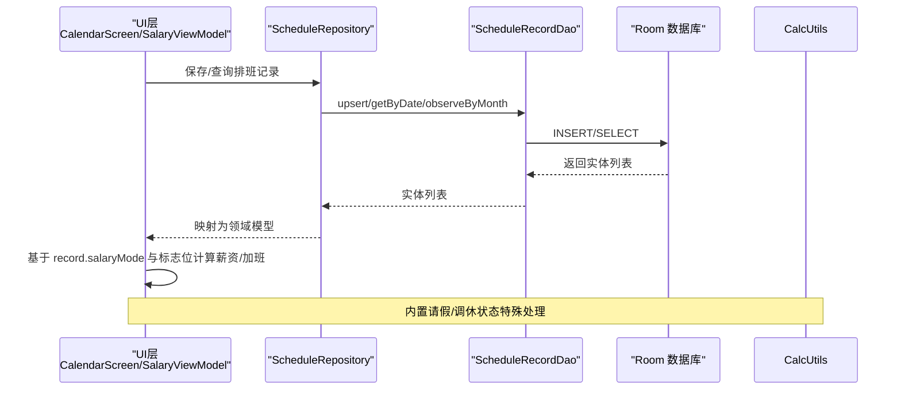
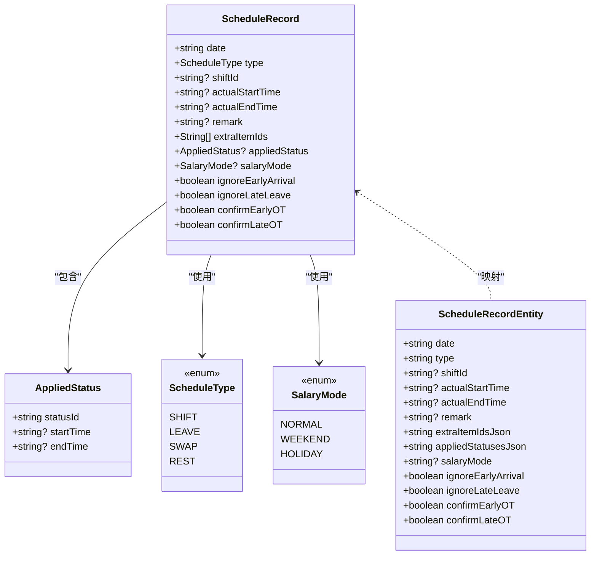
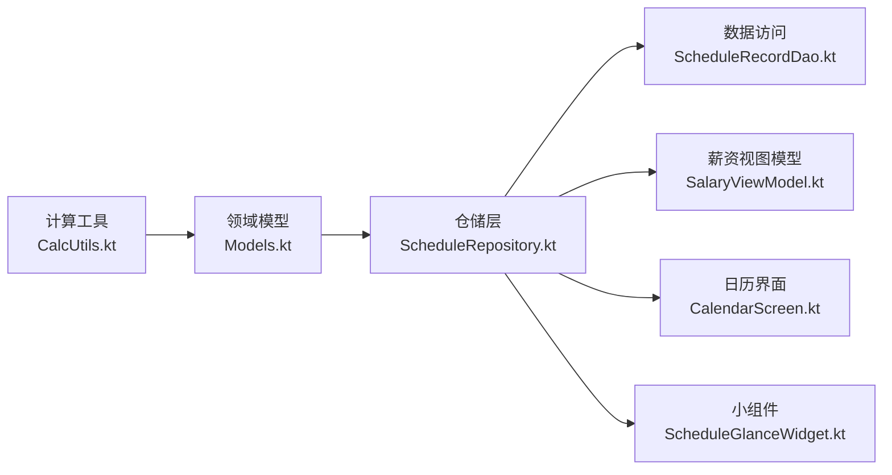

# 排班记录模型

<cite>
**本文引用的文件**   
- [Models.kt](file://app/src/main/java/com/schedulecalendar/app/domain/model/Models.kt)
- [ScheduleRecordEntity.kt](file://app/src/main/java/com/schedulecalendar/app/data/db/entity/ScheduleRecordEntity.kt)
- [ShiftStatusEntity.kt](file://app/src/main/java/com/schedulecalendar/app/data/db/entity/ShiftStatusEntity.kt)
- [ShiftEntity.kt](file://app/src/main/java/com/schedulecalendar/app/data/db/entity/ShiftEntity.kt)
- [ScheduleRecordDao.kt](file://app/src/main/java/com/schedulecalendar/app/data/db/dao/ScheduleRecordDao.kt)
- [ScheduleRepository.kt](file://app/src/main/java/com/schedulecalendar/app/data/repository/ScheduleRepository.kt)
- [CalcUtils.kt](file://app/src/main/java/com/schedulecalendar/app/domain/model/CalcUtils.kt)
- [CalendarViewModel.kt](file://app/src/main/java/com/schedulecalendar/app/ui/calendar/CalendarViewModel.kt)
- [ScheduleGlanceWidget.kt](file://app/src/main/java/com/schedulecalendar/app/widget/ScheduleGlanceWidget.kt)
- [Mappers.kt](file://app/src/main/java/com/schedulecalendar/app/data/repository/Mappers.kt)
</cite>

## 更新摘要
**所做更改**   
- 增强了内置请假/调休状态的处理逻辑，支持 `BUILTIN_STATUS_LEAVE` 和 `BUILTIN_STATUS_SWAP`
- 改进了REST和SWAP内置班次对空时间段的处理机制
- 完善了AppliedStatus的时间段配置与工时扣除逻辑
- 更新了打卡按钮显示规则和异常检测逻辑

## 目录
1. [简介](#简介)
2. [项目结构](#项目结构)
3. [核心组件](#核心组件)
4. [架构总览](#架构总览)
5. [详细组件分析](#详细组件分析)
6. [依赖关系分析](#依赖关系分析)
7. [性能考量](#性能考量)
8. [故障排查指南](#故障排查指南)
9. [结论](#结论)
10. [附录：字段与枚举说明](#附录字段与枚举说明)

## 简介
本文件围绕"排班记录模型"进行系统化文档化，重点覆盖以下实体与概念：
- 每日排班记录 ScheduleRecord 的完整结构与业务含义
- 附加状态 AppliedStatus 的时间段配置与工时扣除规则
- 排班类型枚举 ScheduleType 的业务场景
- 薪资计算相关标志位（如 ignoreEarlyArrival、confirmLateOT 等）的控制逻辑
- 排班记录的创建、更新与查询的实际使用示例（以仓库层与 DAO 接口为准）

**更新** 本次更新重点增强了内置请假/调休状态的处理能力，支持REST和SWAP内置班次的空时间段配置，改进了AppliedStatus的时间段与工时扣除逻辑。

## 项目结构
排班记录模型涉及领域模型、数据持久化实体、DAO 访问层以及仓储层。关键位置如下：
- 领域模型：定义 ScheduleRecord、AppliedStatus、ScheduleType、SalaryMode 等
- 数据库实体：定义 ScheduleRecordEntity、ShiftStatusEntity、ShiftEntity
- 数据访问：定义 ScheduleRecordDao 的增删改查方法
- 仓储层：封装对 DAO 的调用并负责领域模型与实体的转换
- UI 与计算：在薪资视图模型中读取排班数据参与薪资计算；日历界面展示排班详情



**图表来源**
- [Models.kt:81-100](file://app/src/main/java/com/schedulecalendar/app/domain/model/Models.kt#L81-L100)
- [ScheduleRecordEntity.kt:8-25](file://app/src/main/java/com/schedulecalendar/app/data/db/entity/ScheduleRecordEntity.kt#L8-L25)
- [ScheduleRecordDao.kt:8-39](file://app/src/main/java/com/schedulecalendar/app/data/db/dao/ScheduleRecordDao.kt#L8-L39)
- [ScheduleRepository.kt:13-39](file://app/src/main/java/com/schedulecalendar/app/data/repository/ScheduleRepository.kt#L13-L39)

## 核心组件
本节聚焦排班记录模型的核心实体及其设计要点。

- 每日排班记录 ScheduleRecord
  - 日期 date：yyyy-MM-dd
  - 类型 type：ScheduleType（SHIFT/LEAVE/SWAP/REST）
  - 班次ID shiftId：关联 Shift 表
  - 实际上下班 actualStartTime/actualEndTime：HH:mm，用于加班判定与工时统计
  - 备注 remark：自由文本
  - 附加项 extraItemIds：补贴/扣款项目 ID 列表
  - 附加状态 appliedStatus：AppliedStatus（可选），支持时间段配置
  - 计薪方式 salaryMode：SalaryMode（NORMAL/WEEKEND/HOLIDAY），null 表示按日期自动推断
  - 薪资控制标志位：
    - ignoreEarlyArrival：忽略早到产生的加班
    - ignoreLateLeave：忽略晚退产生的加班
    - confirmEarlyOT：确认早到加班计入薪资
    - confirmLateOT：确认晚退加班计入薪资

- 附加状态 AppliedStatus
  - statusId：引用 ShiftStatus 的类型
  - startTime/endTime：可选 HH:mm，若为空则仅标记状态不扣除工时；若提供则按时间段扣除对应工时
  - **新增** 支持内置请假/调休状态的空时间段处理

- 排班类型 ScheduleType
  - SHIFT：正常班次
  - LEAVE：请假
  - SWAP：调休
  - REST：休息

- 薪资模式 SalaryMode
  - NORMAL：正常计薪
  - WEEKEND：周末计薪
  - HOLIDAY：节假日计薪

**章节来源**
- [Models.kt:38-49](file://app/src/main/java/com/schedulecalendar/app/domain/model/Models.kt#L38-L49)
- [Models.kt:81-100](file://app/src/main/java/com/schedulecalendar/app/domain/model/Models.kt#L81-L100)

## 架构总览
从领域模型到数据库再到 UI 的计算流程如下：



**图表来源**
- [ScheduleRepository.kt:22-39](file://app/src/main/java/com/schedulecalendar/app/data/repository/ScheduleRepository.kt#L22-L39)
- [ScheduleRecordDao.kt:10-39](file://app/src/main/java/com/schedulecalendar/app/data/db/dao/ScheduleRecordDao.kt#L10-L39)

## 详细组件分析

### 领域模型 vs 数据实体映射
- ScheduleRecord 与 ScheduleRecordEntity 一一对应，后者将复杂集合以 JSON 字符串形式存储（extraItemIdsJson、appliedStatusesJson）。
- AppliedStatus 在实体中以 JSON 数组形式持久化，包含 statusId 及可选的 startTime/endTime。
- ScheduleType 与 SalaryMode 在实体中以名称字符串存储，便于可读性与扩展。



**图表来源**
- [Models.kt:38-49](file://app/src/main/java/com/schedulecalendar/app/domain/model/Models.kt#L38-L49)
- [Models.kt:81-100](file://app/src/main/java/com/schedulecalendar/app/domain/model/Models.kt#L81-L100)
- [ScheduleRecordEntity.kt:8-25](file://app/src/main/java/com/schedulecalendar/app/data/db/entity/ScheduleRecordEntity.kt#L8-L25)

### 内置请假/调休状态处理增强

**更新** 系统现在支持两种内置状态类型：`BUILTIN_STATUS_LEAVE`（请假）和 `BUILTIN_STATUS_SWAP`（调休），并提供更灵活的时间段处理机制。

#### 内置状态常量定义
- `BUILTIN_STATUS_LEAVE = "__builtin_status_leave__"`：内置请假状态
- `BUILTIN_STATUS_SWAP = "__builtin_status_swap__"`：内置调休状态

#### 内置状态特性
- 通过 `reportType` 字段区分状态类型："leave" 表示请假，"swap" 表示调休
- 支持可选的时间段配置（startTime/endTime），为空时表示全天状态
- 与用户自定义状态类型共存，互不影响

#### 状态类型识别逻辑
系统通过以下方式识别内置状态：
```kotlin
val isBuiltIn = applied != null && (applied.statusId == BUILTIN_STATUS_LEAVE || applied.statusId == BUILTIN_STATUS_SWAP)
```

**章节来源**
- [Models.kt:76-79](file://app/src/main/java/com/schedulecalendar/app/domain/model/Models.kt#L76-L79)
- [CalendarViewModel.kt:294-298](file://app/src/main/java/com/schedulecalendar/app/ui/calendar/CalendarViewModel.kt#L294-L298)

### REST和SWAP内置班次的空时间段处理

**更新** REST和SWAP内置班次现在支持空时间段配置，提供更灵活的排班管理。

#### 空时间段处理规则
当AppliedStatus的startTime和endTime都为null时：
- **REST内置班次**：表示全天休息，工时直接为0
- **SWAP内置班次**：表示全天调休，工时直接为0
- **普通班次**：仅标记状态，不扣除具体时段工时

#### 时间段存在性检查
```kotlin
if (isBuiltinLeaveSwap && ast.startTime == null && ast.endTime == null) {
    // 内置请假/调休全天（无时间段）：工时直接为0
    worked = 0.0
} else if (ast.startTime != null && ast.endTime != null) {
    // 有明确时间段：按时间段扣除工时
    worked = max(0.0, worked - calcHourDiff(ast.startTime, ast.endTime))
}
```

#### 打卡按钮显示规则
系统根据以下规则智能显示打卡按钮：
1. **内置班次 + 无自定义附加状态**：不显示打卡按钮
2. **内置班次 + 自定义附加状态**：写入附加状态的时间字段
3. **普通班次**：写入实际上班/下班时间

**章节来源**
- [CalcUtils.kt:205-213](file://app/src/main/java/com/schedulecalendar/app/domain/model/CalcUtils.kt#L205-L213)
- [ScheduleGlanceWidget.kt:257-292](file://app/src/main/java/com/schedulecalendar/app/widget/ScheduleGlanceWidget.kt#L257-L292)

### 附加状态 AppliedStatus 的时间段与工时扣除

**更新** 改进了AppliedStatus的时间段配置与工时扣除逻辑，支持更精确的工时计算。

#### 时间段处理逻辑
- **空时间段**（startTime/endTime均为null）：仅标记状态，不扣除工时
- **部分时间段**（仅提供开始或结束时间）：按提供的部分计算
- **完整时间段**（同时提供开始和结束时间）：按完整时间段扣除工时

#### 内置状态的特殊处理
对于内置请假/调休状态：
- **全天状态**（空时间段）：按日标准工时计入请假/调休小时数
- **部分时段**：按实际时间段扣除，考虑全局休息时间

#### 工时计算公式
```kotlin
val rawH = calcHourDiff(ast.startTime, ast.endTime)
val breakH = calcGlobalBreakHours(ast.startTime, ast.endTime, breaks)
h = roundD2(max(0.0, rawH - breakH) * 60 / 60.0)
```

**章节来源**
- [Models.kt:38-42](file://app/src/main/java/com/schedulecalendar/app/domain/model/Models.kt#L38-L42)
- [CalcUtils.kt:310-328](file://app/src/main/java/com/schedulecalendar/app/domain/model/CalcUtils.kt#L310-L328)

### 排班类型 ScheduleType 的业务场景
- SHIFT：常规上班，结合 Shift 的 startTime/endTime 与 actualStartTime/actualEndTime 计算正常工时与加班。
- LEAVE：请假，通常不计入正常工时，可能影响出勤统计与薪资。
- SWAP：调休，用于平衡加班与调休天数，影响报表中的调休工时。
- REST：休息，不计入工时，常用于内置休息日。

**章节来源**
- [Models.kt:45-45](file://app/src/main/java/com/schedulecalendar/app/domain/model/Models.kt#L45-L45)

### 薪资计算相关标志位与控制逻辑
- ignoreEarlyArrival：忽略早到产生的加班，避免将早到时间计入加班。
- ignoreLateLeave：忽略晚退产生的加班，避免将晚退时间计入加班。
- confirmEarlyOT：确认早到加班计入薪资，开启后将早到时间纳入加班计算。
- confirmLateOT：确认晚退加班计入薪资，开启后将晚退时间纳入加班计算。

这些标志位直接影响加班判定与最终薪资计算结果。UI 层在展示时会显示当前记录的计薪方式与相关提示。

**章节来源**
- [Models.kt:81-100](file://app/src/main/java/com/schedulecalendar/app/domain/model/Models.kt#L81-L100)

### 排班记录的创建、更新与查询示例
以下为基于仓库层与 DAO 接口的标准用法示例（以路径引用代替代码片段）：

- 创建或更新单条记录
  - 使用仓储层的 save(record) 完成 upsert 操作
  - 参考路径：[ScheduleRepository.kt:32](file://app/src/main/java/com/schedulecalendar/app/data/repository/ScheduleRepository.kt#L32)

- 批量创建或更新记录
  - 使用仓储层的 saveAll(records) 完成批量 upsert
  - 参考路径：[ScheduleRepository.kt:33](file://app/src/main/java/com/schedulecalendar/app/data/repository/ScheduleRepository.kt#L33)

- 按日期查询
  - 使用仓储层的 getByDate(date) 获取指定日期的记录
  - 参考路径：[ScheduleRepository.kt:31](file://app/src/main/java/com/schedulecalendar/app/data/repository/ScheduleRepository.kt#L31)

- 按月观察与查询
  - 使用 observeByMonth(yearMonth) 获取 Flow<List<ScheduleRecord>> 实现响应式刷新
  - 使用 getByMonth(yearMonth) 一次性获取当月记录
  - 参考路径：[ScheduleRepository.kt:22-26](file://app/src/main/java/com/schedulecalendar/app/data/repository/ScheduleRepository.kt#L22-L26)

- 删除操作
  - 删除单日：delete(date)
  - 删除范围：deleteRange(from, to)
  - 清空全部：deleteAll()
  - 参考路径：[ScheduleRepository.kt:34-36](file://app/src/main/java/com/schedulecalendar/app/data/repository/ScheduleRepository.kt#L34-L36)

- DAO 层接口概览
  - 月度查询与观察：observeByMonth / getByMonth
  - 区间查询：observeByRange
  - 单条查询：getByDate
  - 写入：upsert / upsertAll
  - 删除：deleteByDate / deleteByRange / deleteAll
  - 参考路径：[ScheduleRecordDao.kt:10-39](file://app/src/main/java/com/schedulecalendar/app/data/db/dao/ScheduleRecordDao.kt#L10-L39)

**章节来源**
- [ScheduleRepository.kt:22-39](file://app/src/main/java/com/schedulecalendar/app/data/repository/ScheduleRepository.kt#L22-L39)
- [ScheduleRecordDao.kt:10-39](file://app/src/main/java/com/schedulecalendar/app/data/db/dao/ScheduleRecordDao.kt#L10-L39)

## 依赖关系分析
- 领域模型与实体解耦：通过仓储层进行映射，避免 UI 直接依赖 Room 实体。
- DAO 暴露最小必要接口，仓储层统一处理变更信号（refreshSignal）以便 ViewModel 自动刷新。
- UI 层通过仓储层订阅数据变化，并在薪资计算中使用排班记录与相关配置。



**图表来源**
- [Models.kt:81-100](file://app/src/main/java/com/schedulecalendar/app/domain/model/Models.kt#L81-L100)
- [ScheduleRepository.kt:13-39](file://app/src/main/java/com/schedulecalendar/app/data/repository/ScheduleRepository.kt#L13-L39)
- [ScheduleRecordDao.kt:8-39](file://app/src/main/java/com/schedulecalendar/app/data/db/dao/ScheduleRecordDao.kt#L8-L39)

## 性能考量
- 使用 Flow 进行响应式数据流（observeByMonth/observeByRange），可减少重复查询与手动刷新成本。
- 仓储层在写操作后发出 refreshSignal，使 ViewModel 能按需刷新，避免全量重算。
- 对于大数据量的月度加载，建议分页或增量更新策略（当前实现为整月加载，适用于移动端常见数据规模）。

## 故障排查指南
- 若薪资计算异常，优先检查：
  - 记录的 salaryMode 是否与预期一致（自动推断或手动指定）
  - ignoreEarlyArrival/ignoreLateLeave 与 confirmEarlyOT/confirmLateOT 的组合是否导致加班被忽略或确认
  - appliedStatus 的时间段是否正确设置，避免误扣或漏扣工时
  - **新增** 检查内置状态（BUILTIN_STATUS_LEAVE/BUILTIN_STATUS_SWAP）的时间段配置是否符合预期
- 若数据未刷新：
  - 确认仓储层 save/saveAll/delete 是否成功触发 refreshSignal
  - 检查 ViewModel 是否正确收集 refreshSignal 并调用 reload
- **新增** 若内置状态显示异常：
  - 验证状态ID是否为内置常量值
  - 检查时间段配置（空时间段表示全天状态）
  - 确认REST/SWAP内置班次的处理逻辑

**章节来源**
- [CalcUtils.kt:205-213](file://app/src/main/java/com/schedulecalendar/app/domain/model/CalcUtils.kt#L205-L213)
- [CalendarViewModel.kt:294-309](file://app/src/main/java/com/schedulecalendar/app/ui/calendar/CalendarViewModel.kt#L294-L309)

## 结论
排班记录模型以清晰的领域模型为核心，配合 Room 实体与 DAO 接口，形成高内聚低耦合的数据层。本次更新增强了内置请假/调休状态的处理能力，支持REST和SWAP内置班次的空时间段配置，改进了AppliedStatus的时间段与工时扣除逻辑。通过仓储层与 Flow 机制，UI 层可高效地消费数据并进行实时计算与展示。

## 附录：字段与枚举说明
- ScheduleRecord 关键字段
  - date：yyyy-MM-dd
  - type：ScheduleType（SHIFT/LEAVE/SWAP/REST）
  - shiftId：关联班次
  - actualStartTime/actualEndTime：HH:mm
  - remark：备注
  - extraItemIds：补贴/扣款 ID 列表
  - appliedStatus：AppliedStatus（statusId + 可选时间段）
  - salaryMode：SalaryMode（NORMAL/WEEKEND/HOLIDAY）
  - ignoreEarlyArrival/ignoreLateLeave/confirmEarlyOT/confirmLateOT：加班控制标志位

- AppliedStatus
  - statusId：状态类型 ID（支持内置状态：BUILTIN_STATUS_LEAVE、BUILTIN_STATUS_SWAP）
  - startTime/endTime：可选 HH:mm，决定工时扣除范围
  - **新增** 空时间段表示全天状态，用于REST/SWAP内置班次

- ScheduleType
  - SHIFT：正常班次
  - LEAVE：请假
  - SWAP：调休
  - REST：休息

- SalaryMode
  - NORMAL：正常计薪
  - WEEKEND：周末计薪
  - HOLIDAY：节假日计薪

**章节来源**
- [Models.kt:38-49](file://app/src/main/java/com/schedulecalendar/app/domain/model/Models.kt#L38-L49)
- [Models.kt:81-100](file://app/src/main/java/com/schedulecalendar/app/domain/model/Models.kt#L81-L100)
- [Models.kt:76-79](file://app/src/main/java/com/schedulecalendar/app/domain/model/Models.kt#L76-L79)