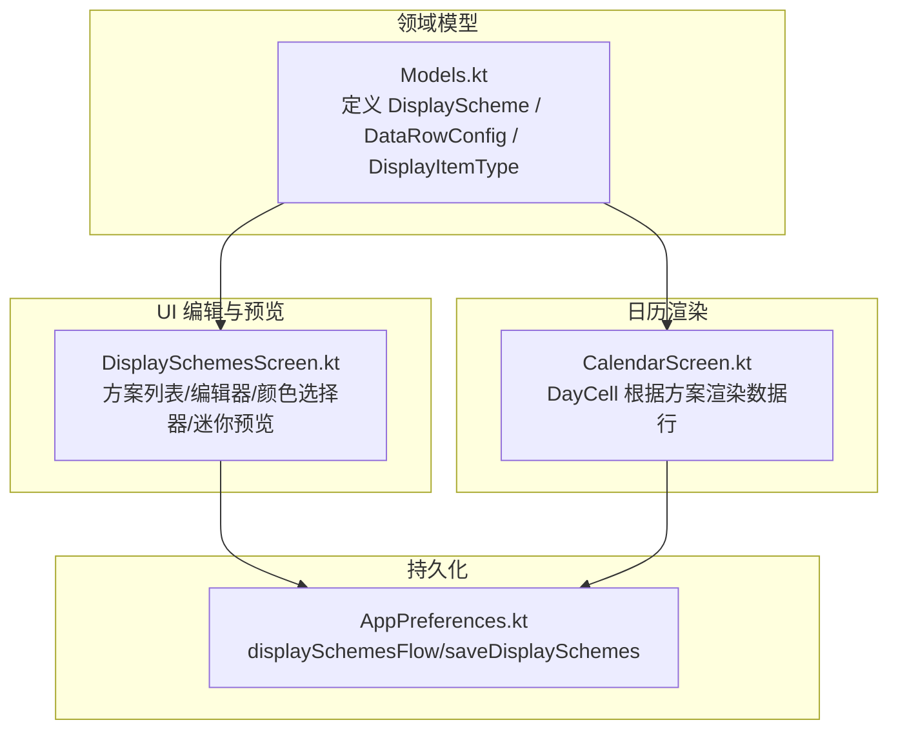
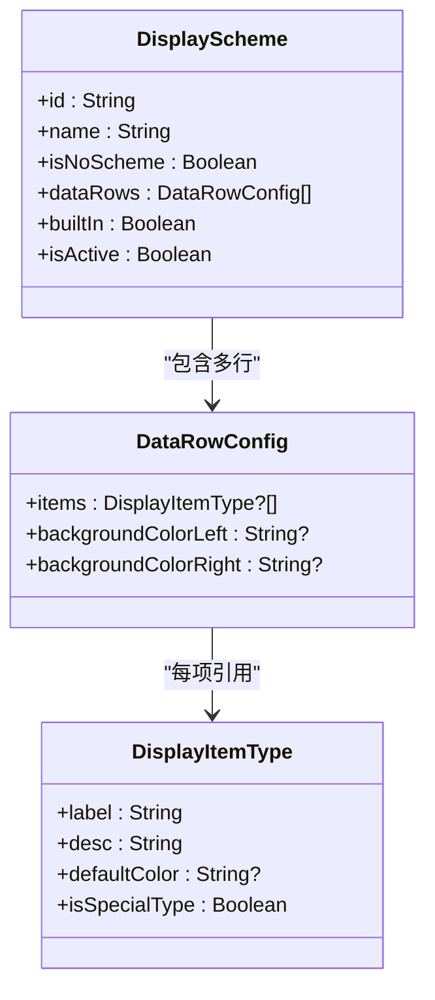
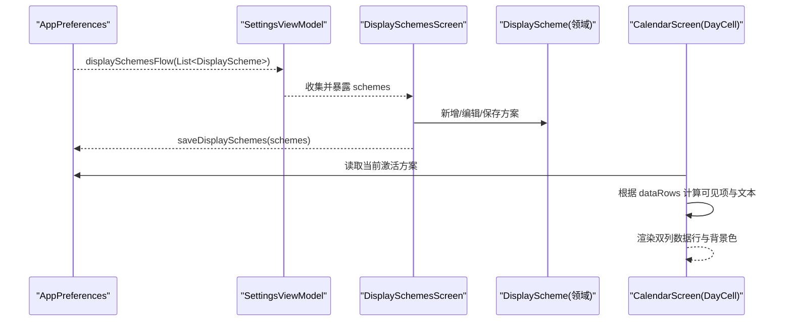
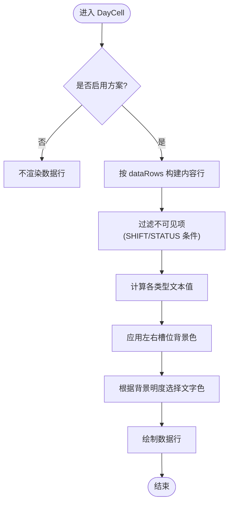
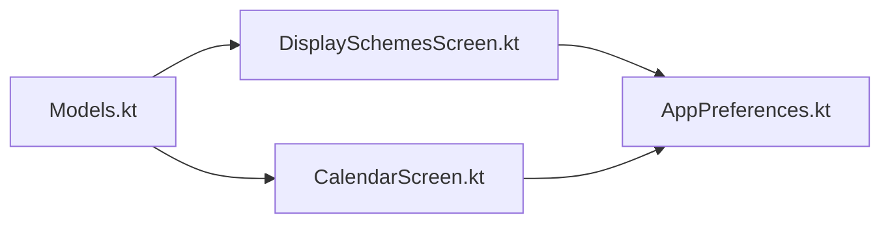

# 显示方案模型

<cite>
**本文引用的文件**
- [Models.kt](file://app/src/main/java/com/schedulecalendar/app/domain/model/Models.kt)
- [DisplaySchemesScreen.kt](file://app/src/main/java/com/schedulecalendar/app/ui/detail/DisplaySchemesScreen.kt)
- [CalendarScreen.kt](file://app/src/main/java/com/schedulecalendar/app/ui/calendar/CalendarScreen.kt)
- [AppPreferences.kt](file://app/src/main/java/com/schedulecalendar/app/data/prefs/AppPreferences.kt)
</cite>

## 目录
1. [简介](#简介)
2. [项目结构](#项目结构)
3. [核心组件](#核心组件)
4. [架构总览](#架构总览)
5. [详细组件分析](#详细组件分析)
6. [依赖关系分析](#依赖关系分析)
7. [性能与可用性考虑](#性能与可用性考虑)
8. [故障排查指南](#故障排查指南)
9. [结论](#结论)
10. [附录：配置示例与最佳实践](#附录配置示例与最佳实践)

## 简介
本文件围绕“显示方案模型”展开，系统性说明 DisplayScheme、DataRowConfig、DisplayItemType 等 UI 展示相关实体的设计模式与组合方式。重点覆盖：
- 日历显示方案的配置结构与渲染流程
- 数据行配置（双列布局）与背景色设置
- 数据项类型（如总工作时长、正班工时、加班时长、收入统计、班次、状态）的可视化语义
- 内置显示方案 BUILTIN_DISPLAY_SCHEME 的使用方法与自定义显示方案的创建流程
- 实际应用示例与最佳实践

## 项目结构
显示方案模型位于领域模型层，UI 编辑与预览在详情页面实现，实际渲染在日历界面完成，持久化通过偏好存储管理。

图表来源
- [Models.kt:144-207](file://app/src/main/java/com/schedulecalendar/app/domain/model/Models.kt#L144-L207)
- [DisplaySchemesScreen.kt:1-114](file://app/src/main/java/com/schedulecalendar/app/ui/detail/DisplaySchemesScreen.kt#L1-L114)
- [CalendarScreen.kt:709-904](file://app/src/main/java/com/schedulecalendar/app/ui/calendar/CalendarScreen.kt#L709-L904)
- [AppPreferences.kt:90-101](file://app/src/main/java/com/schedulecalendar/app/data/prefs/AppPreferences.kt#L90-L101)

章节来源
- [Models.kt:144-207](file://app/src/main/java/com/schedulecalendar/app/domain/model/Models.kt#L144-L207)
- [DisplaySchemesScreen.kt:1-114](file://app/src/main/java/com/schedulecalendar/app/ui/detail/DisplaySchemesScreen.kt#L1-L114)
- [CalendarScreen.kt:709-904](file://app/src/main/java/com/schedulecalendar/app/ui/calendar/CalendarScreen.kt#L709-L904)
- [AppPreferences.kt:90-101](file://app/src/main/java/com/schedulecalendar/app/data/prefs/AppPreferences.kt#L90-L101)

## 核心组件
本节聚焦三个核心实体及其关系：
- DisplayItemType：枚举，描述可展示的“数据项类型”，包含标签、说明与可选默认颜色
- DataRowConfig：数据行配置，支持每行最多两个数据项，左右槽位独立背景色
- DisplayScheme：显示方案，由若干 DataRowConfig 组成，标识是否内置、是否激活等

图表来源
- [Models.kt:144-180](file://app/src/main/java/com/schedulecalendar/app/domain/model/Models.kt#L144-L180)

章节来源
- [Models.kt:144-180](file://app/src/main/java/com/schedulecalendar/app/domain/model/Models.kt#L144-L180)

## 架构总览
显示方案从持久化读取，进入 UI 编辑与预览，最终在日历 DayCell 中按配置渲染。

图表来源
- [AppPreferences.kt:90-101](file://app/src/main/java/com/schedulecalendar/app/data/prefs/AppPreferences.kt#L90-L101)
- [DisplaySchemesScreen.kt:101-114](file://app/src/main/java/com/schedulecalendar/app/ui/detail/DisplaySchemesScreen.kt#L101-L114)
- [CalendarScreen.kt:709-904](file://app/src/main/java/com/schedulecalendar/app/ui/calendar/CalendarScreen.kt#L709-L904)

## 详细组件分析

### 数据项类型 DisplayItemType
- 语义与用途
  - 总工作时长：当天正常工时+加班合计
  - 正班工时：不含加班的正常工时
  - 加班时长：加班工时
  - 当日总收入：含补贴/扣款
  - 正班收入：正常工时薪资
  - 加班收入：加班工时薪资
  - 班次：当前日期的班次名称
  - 附加状态：请假/调休等状态名称
- 特殊类型
  - SHIFT 与 STATUS 为“特殊类型”，具有预设标签颜色；在编辑器中会锁定颜色选择器，避免用户更改
- 复杂度
  - 枚举遍历与过滤用于下拉选项去重与互斥，时间复杂度 O(n)，n 为枚举数量（固定且较小）

章节来源
- [Models.kt:144-156](file://app/src/main/java/com/schedulecalendar/app/domain/model/Models.kt#L144-L156)
- [DisplaySchemesScreen.kt:310-340](file://app/src/main/java/com/schedulecalendar/app/ui/detail/DisplaySchemesScreen.kt#L310-L340)

### 数据行配置 DataRowConfig
- 双列布局
  - items 为长度不超过 2 的列表，分别对应左、右槽位
  - 当仅有一个数据项时，右侧槽位为空
- 背景色
  - backgroundColorLeft/right 为十六进制字符串，可为空表示使用主题默认
  - 若该行存在“特殊类型”（SHIFT/STATUS），则整行禁用颜色选择器，颜色由绑定数据决定
- 渲染逻辑
  - 日历渲染时，按行顺序构建内容行，过滤不可见项（如无班次或无状态时隐藏对应项）
  - 每个槽位的背景色优先取用户配置，否则回退到主题色
  - 文字颜色根据背景明度自动选择黑/白，保证可读性

章节来源
- [Models.kt:159-165](file://app/src/main/java/com/schedulecalendar/app/domain/model/Models.kt#L159-L165)
- [CalendarScreen.kt:830-904](file://app/src/main/java/com/schedulecalendar/app/ui/calendar/CalendarScreen.kt#L830-L904)
- [DisplaySchemesScreen.kt:646-710](file://app/src/main/java/com/schedulecalendar/app/ui/detail/DisplaySchemesScreen.kt#L646-L710)

### 显示方案 DisplayScheme
- 字段含义
  - id/name：唯一标识与显示名
  - isNoScheme：是否为“无方案”占位（用于 UI 层处理默认行为）
  - dataRows：数据行配置集合（通常保留前 3 行用于渲染）
  - builtIn/isActive：是否内置、是否当前激活
- 内置方案
  - BUILTIN_DISPLAY_SCHEME 提供默认数据行：第一行显示“正班工时+加班时长”，其余行为空
- 交互与持久化
  - 列表页点击切换激活方案
  - 编辑器支持新增/编辑、颜色选择、实时预览
  - 持久化通过 DataStore 以 JSON 形式保存

章节来源
- [Models.kt:168-207](file://app/src/main/java/com/schedulecalendar/app/domain/model/Models.kt#L168-L207)
- [DisplaySchemesScreen.kt:50-114](file://app/src/main/java/com/schedulecalendar/app/ui/detail/DisplaySchemesScreen.kt#L50-L114)
- [AppPreferences.kt:90-101](file://app/src/main/java/com/schedulecalendar/app/data/prefs/AppPreferences.kt#L90-L101)

### 日历渲染流程（DayCell）
- 可见性判断
  - 若方案未启用（isNoScheme=true），则不渲染数据行区域
  - SHIFT/STATUS 仅在存在对应数据时显示
- 文本计算
  - 根据日期明细计算各项数值并格式化输出
- 布局与样式
  - 三行数据区，行间距固定；每行内左右槽位等宽分布
  - 背景色与文字色遵循上述规则

图表来源
- [CalendarScreen.kt:709-904](file://app/src/main/java/com/schedulecalendar/app/ui/calendar/CalendarScreen.kt#L709-L904)

章节来源
- [CalendarScreen.kt:709-904](file://app/src/main/java/com/schedulecalendar/app/ui/calendar/CalendarScreen.kt#L709-L904)

## 依赖关系分析
- 领域模型被 UI 层直接消费，保持低耦合
- 编辑器与预览组件依赖模型进行双向绑定与校验
- 日历渲染依赖模型与运行时数据（班次、状态、工时明细）
- 持久化层提供 Flow 与保存接口，确保跨进程/重启一致性

图表来源
- [Models.kt:144-207](file://app/src/main/java/com/schedulecalendar/app/domain/model/Models.kt#L144-L207)
- [DisplaySchemesScreen.kt:1-114](file://app/src/main/java/com/schedulecalendar/app/ui/detail/DisplaySchemesScreen.kt#L1-L114)
- [CalendarScreen.kt:709-904](file://app/src/main/java/com/schedulecalendar/app/ui/calendar/CalendarScreen.kt#L709-L904)
- [AppPreferences.kt:90-101](file://app/src/main/java/com/schedulecalendar/app/data/prefs/AppPreferences.kt#L90-L101)

章节来源
- [Models.kt:144-207](file://app/src/main/java/com/schedulecalendar/app/domain/model/Models.kt#L144-L207)
- [DisplaySchemesScreen.kt:1-114](file://app/src/main/java/com/schedulecalendar/app/ui/detail/DisplaySchemesScreen.kt#L1-L114)
- [CalendarScreen.kt:709-904](file://app/src/main/java/com/schedulecalendar/app/ui/calendar/CalendarScreen.kt#L709-L904)
- [AppPreferences.kt:90-101](file://app/src/main/java/com/schedulecalendar/app/data/prefs/AppPreferences.kt#L90-L101)

## 性能与可用性考虑
- 渲染性能
  - 数据行数量固定（最多 3 行），每项计算轻量，整体开销小
  - 文本格式化与颜色计算均为常数级操作
- 交互体验
  - 编辑器提供实时预览与颜色网格，降低试错成本
  - 特殊类型自动锁定颜色，减少误操作
- 建议
  - 保持 dataRows 简洁，避免过多复杂计算
  - 合理选择背景色，确保对比度满足可读性要求

[本节为通用指导，无需列出具体文件来源]

## 故障排查指南
- 问题：数据行不显示
  - 检查 isNoScheme 是否为 true；若是，将不会渲染数据行
  - 确认 SHIFT/STATUS 是否存在对应数据
- 问题：颜色无法修改
  - 若行中包含 SHIFT/STATUS，颜色将被锁定，需移除这些类型后再修改
- 问题：文字不可读
  - 调整背景色或使用工具函数自动选择高对比度文字色
- 问题：方案未生效
  - 确认已保存并设置为激活方案；检查持久化是否正确写入

章节来源
- [CalendarScreen.kt:709-904](file://app/src/main/java/com/schedulecalendar/app/ui/calendar/CalendarScreen.kt#L709-L904)
- [DisplaySchemesScreen.kt:646-710](file://app/src/main/java/com/schedulecalendar/app/ui/detail/DisplaySchemesScreen.kt#L646-L710)
- [AppPreferences.kt:90-101](file://app/src/main/java/com/schedulecalendar/app/data/prefs/AppPreferences.kt#L90-L101)

## 结论
显示方案模型通过清晰的领域对象与 UI 组件协作，实现了高度可配置的日历数据行展示。其设计兼顾了易用性与扩展性：
- 以 DisplayItemType 抽象数据项语义
- 以 DataRowConfig 组织双列布局与配色
- 以 DisplayScheme 聚合多行配置并提供内置与自定义能力
配合实时预览与持久化机制，用户可快速构建符合自身需求的显示方案。

[本节为总结性内容，无需列出具体文件来源]

## 附录：配置示例与最佳实践

### 使用内置显示方案 BUILTIN_DISPLAY_SCHEME
- 场景：希望采用系统默认的第一行“正班工时+加班时长”展示
- 步骤：
  - 在列表中选中“预设方案”（内置）
  - 如需恢复默认，可在编辑器中将 dataRows 重置为默认值
- 参考路径
  - [Models.kt:196-207](file://app/src/main/java/com/schedulecalendar/app/domain/model/Models.kt#L196-L207)

章节来源
- [Models.kt:196-207](file://app/src/main/java/com/schedulecalendar/app/domain/model/Models.kt#L196-L207)

### 创建自定义显示方案
- 目标：在第一行显示“总工作时长+当日总收入”，第二行显示“正班收入+加班收入”
- 步骤：
  - 打开显示方案页面，点击新增
  - 在“第1行”左侧选择“当天总工作时长”，右侧选择“当日总收入”
  - 在“第2行”左侧选择“正班收入”，右侧选择“加班收入”
  - 根据需要为左右槽位设置背景色（注意：若包含 SHIFT/STATUS，颜色将被锁定）
  - 保存并设为激活方案
- 参考路径
  - [DisplaySchemesScreen.kt:188-306](file://app/src/main/java/com/schedulecalendar/app/ui/detail/DisplaySchemesScreen.kt#L188-L306)
  - [DisplaySchemesScreen.kt:310-492](file://app/src/main/java/com/schedulecalendar/app/ui/detail/DisplaySchemesScreen.kt#L310-L492)

章节来源
- [DisplaySchemesScreen.kt:188-306](file://app/src/main/java/com/schedulecalendar/app/ui/detail/DisplaySchemesScreen.kt#L188-L306)
- [DisplaySchemesScreen.kt:310-492](file://app/src/main/java/com/schedulecalendar/app/ui/detail/DisplaySchemesScreen.kt#L310-L492)

### 双列布局与背景色设置要点
- 每行最多两项，左右槽位独立背景色
- 若某行包含 SHIFT/STATUS，整行颜色锁定，由绑定数据决定
- 文字颜色依据背景明度自动选择，确保可读性
- 参考路径
  - [DisplaySchemesScreen.kt:630-776](file://app/src/main/java/com/schedulecalendar/app/ui/detail/DisplaySchemesScreen.kt#L630-L776)
  - [CalendarScreen.kt:886-904](file://app/src/main/java/com/schedulecalendar/app/ui/calendar/CalendarScreen.kt#L886-L904)

章节来源
- [DisplaySchemesScreen.kt:630-776](file://app/src/main/java/com/schedulecalendar/app/ui/detail/DisplaySchemesScreen.kt#L630-L776)
- [CalendarScreen.kt:886-904](file://app/src/main/java/com/schedulecalendar/app/ui/calendar/CalendarScreen.kt#L886-L904)

### 数据项类型一览与适用场景
- 总工作时长：适合概览每日工作量
- 正班工时/加班时长：适合考勤与合规审计
- 当日总收入/正班收入/加班收入：适合薪资核对与预算规划
- 班次/附加状态：适合排班管理与异常标注
- 参考路径
  - [Models.kt:144-153](file://app/src/main/java/com/schedulecalendar/app/domain/model/Models.kt#L144-L153)

章节来源
- [Models.kt:144-153](file://app/src/main/java/com/schedulecalendar/app/domain/model/Models.kt#L144-L153)