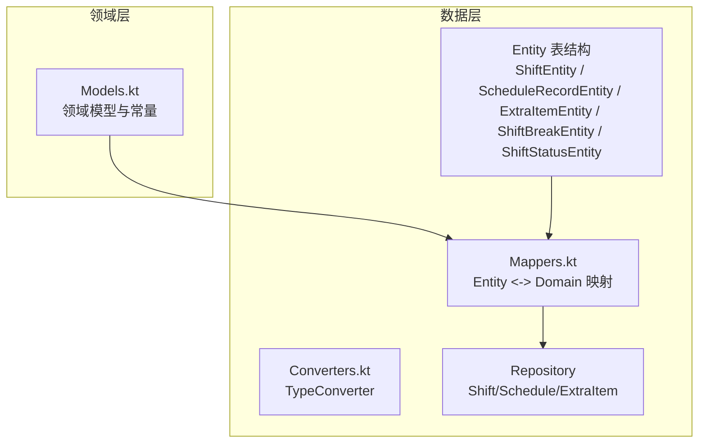
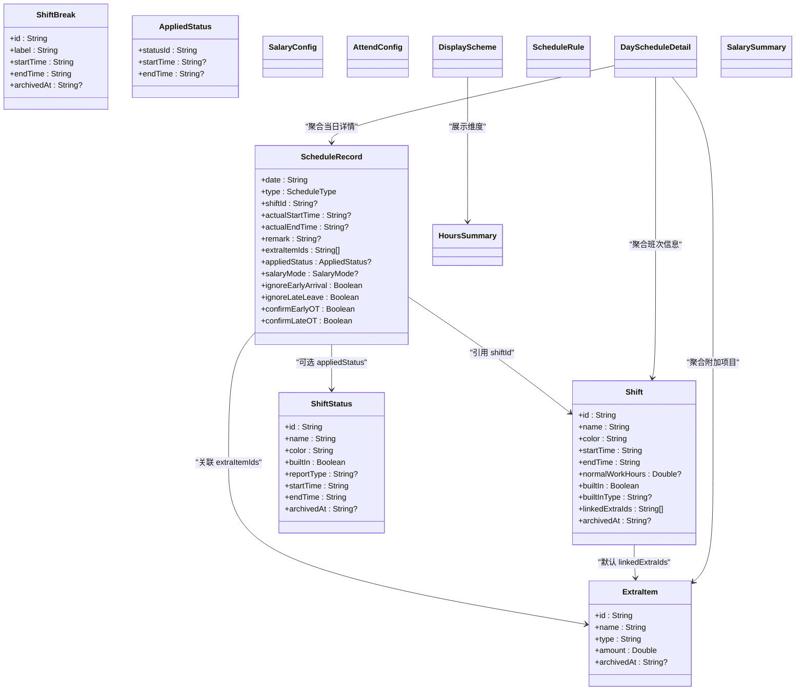
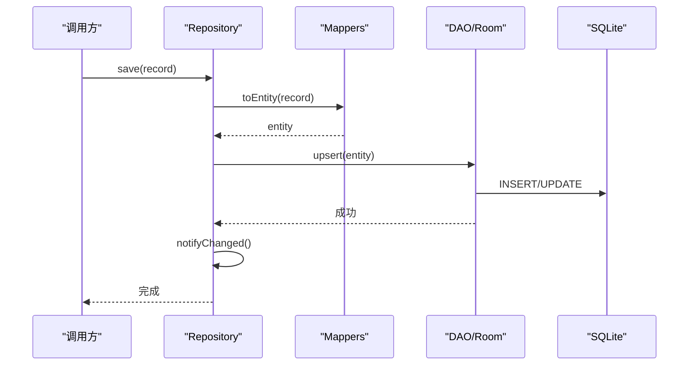

# 核心领域模型

<cite>
**本文引用的文件**   
- [Models.kt](file://app/src/main/java/com/schedulecalendar/app/domain/model/Models.kt)
- [ShiftEntity.kt](file://app/src/main/java/com/schedulecalendar/app/data/db/entity/ShiftEntity.kt)
- [ScheduleRecordEntity.kt](file://app/src/main/java/com/schedulecalendar/app/data/db/entity/ScheduleRecordEntity.kt)
- [ExtraItemEntity.kt](file://app/src/main/java/com/schedulecalendar/app/data/db/entity/ExtraItemEntity.kt)
- [ShiftBreakEntity.kt](file://app/src/main/java/com/schedulecalendar/app/data/db/entity/ShiftBreakEntity.kt)
- [ShiftStatusEntity.kt](file://app/src/main/java/com/schedulecalendar/app/data/db/entity/ShiftStatusEntity.kt)
- [Converters.kt](file://app/src/main/java/com/schedulecalendar/app/data/db/Converters.kt)
- [Mappers.kt](file://app/src/main/java/com/schedulecalendar/app/data/repository/Mappers.kt)
- [ShiftRepository.kt](file://app/src/main/java/com/schedulecalendar/app/data/repository/ShiftRepository.kt)
- [ScheduleRepository.kt](file://app/src/main/java/com/schedulecalendar/app/data/repository/ScheduleRepository.kt)
- [ExtraItemRepository.kt](file://app/src/main/java/com/schedulecalendar/app/data/repository/ExtraItemRepository.kt)
</cite>

## 更新摘要
**所做更改**   
- 更新了内置休息和调休班次的模型定义，支持空时间段用于REST和SWAP内置班次
- 增强了用户选择内置状态时的灵活性，允许不强制指定开始和结束时间
- 完善了AppliedStatus数据结构的可选时间字段设计
- 优化了内置班次的业务规则和数据持久化逻辑

## 目录
1. [引言](#引言)
2. [项目结构](#项目结构)
3. [核心组件](#核心组件)
4. [架构总览](#架构总览)
5. [详细组件分析](#详细组件分析)
6. [依赖关系分析](#依赖关系分析)
7. [性能与扩展性](#性能与扩展性)
8. [故障排查指南](#故障排查指南)
9. [结论](#结论)
10. [附录：使用示例与最佳实践](#附录使用示例与最佳实践)

## 引言
本文件聚焦于 Android 排班日历应用的核心领域模型，围绕班次(Shift)、排班记录(ScheduleRecord)、附加项目(ExtraItem)等关键实体展开，系统阐述其定义、字段含义、业务规则、内置常量与枚举、配置对象设计模式、数据验证与约束、状态管理机制、实体间关系映射、数据流转模式以及扩展点。文档同时提供领域驱动设计的最佳实践与实际使用示例，帮助读者快速理解并正确扩展该领域模型。

**最新更新**：内置休息和调休班次现已支持空时间段设置，用户可以选择这些状态而不必强制指定开始和结束时间，提供了更灵活的状态管理体验。

## 项目结构
领域模型位于 domain.model 包中，持久化实体位于 data.db.entity 包，数据层转换与仓库在 data.repository 和 data.db 下。整体采用分层架构：UI/ViewModel 通过 Repository 访问 DAO，DAO 基于 Room 操作 SQLite；领域模型与数据库实体之间通过 Mappers 进行双向映射，复杂类型通过 TypeConverter 或 Gson 序列化存储。

**图表来源**
- [Models.kt:1-278](file://app/src/main/java/com/schedulecalendar/app/domain/model/Models.kt#L1-L278)
- [ShiftEntity.kt:1-24](file://app/src/main/java/com/schedulecalendar/app/data/db/entity/ShiftEntity.kt#L1-L24)
- [ScheduleRecordEntity.kt:1-26](file://app/src/main/java/com/schedulecalendar/app/data/db/entity/ScheduleRecordEntity.kt#L1-L26)
- [ExtraItemEntity.kt:1-16](file://app/src/main/java/com/schedulecalendar/app/data/db/entity/ExtraItemEntity.kt#L1-L16)
- [ShiftBreakEntity.kt:1-16](file://app/src/main/java/com/schedulecalendar/app/data/db/entity/ShiftBreakEntity.kt#L1-L16)
- [ShiftStatusEntity.kt:1-19](file://app/src/main/java/com/schedulecalendar/app/data/db/entity/ShiftStatusEntity.kt#L1-L19)
- [Converters.kt:1-17](file://app/src/main/java/com/schedulecalendar/app/data/db/Converters.kt#L1-L17)
- [Mappers.kt:1-134](file://app/src/main/java/com/schedulecalendar/app/data/repository/Mappers.kt#L1-L134)

## 核心组件
本节概述核心领域模型及其职责边界：
- 内置常量与枚举：统一标识内置班次、状态、薪资计算方式、显示项类型等，确保跨层一致性。
- 核心实体：Shift（班次）、ScheduleRecord（每日排班记录）、ExtraItem（附加补贴/扣款）、ShiftBreak（全局不计工时时段）、ShiftStatus（自定义状态类型）。
- 配置对象：SalaryConfig（薪资制度）、AttendConfig（考勤规则）、DisplayScheme（日历显示方案）、ScheduleRule（循环排班规则）。
- 统计与展示模型：HoursSummary、DayScheduleDetail、SalarySummary 等用于报表与 UI 展示。

**最新更新**：内置休息和调休班次现在支持空时间段，为用户提供了更灵活的状态选择体验。

## 架构总览
领域模型与数据层的交互遵循"领域不可变 + 数据层可持久化"的原则。Domain 模型以 data class 表达不变语义；Entity 描述持久化结构；Mappers 负责两者之间的转换；Repository 封装 CRUD 与组合逻辑（如合并内置数据），并通过 Flow 暴露变更信号。

**图表来源**
- [Models.kt:1-278](file://app/src/main/java/com/schedulecalendar/app/domain/model/Models.kt#L1-L278)

## 详细组件分析

### 内置常量与枚举
- 内置标识常量：用于区分内置休息、调休、请假及对应状态、预设显示方案等，避免与用户自定义数据冲突。
- 枚举类型：
  - ScheduleType：SHIFT、LEAVE、SWAP、REST，表示每日排班的类型。
  - SalaryMode：NORMAL、WEEKEND、HOLIDAY，表示计薪方式。
  - DisplayItemType：定义日历格子可展示的数据项类型（如总工时、正班工时、加班时长、收入等）及其默认颜色。
- 内置列表：BUILTIN_SHIFTS、BUILTIN_STATUSES、BUILTIN_DISPLAY_SCHEME，提供开箱即用的基础能力。

**最新更新**：BUILTIN_SHIFTS 中的休息和调休班次现在使用空字符串作为 startTime 和 endTime，允许用户选择这些状态而不强制指定时间。

**章节来源**
- [Models.kt:1-278](file://app/src/main/java/com/schedulecalendar/app/domain/model/Models.kt#L1-L278)

### 核心实体：Shift（班次）
- 字段说明：
  - id/name/color：唯一标识、名称、颜色。
  - startTime/endTime：计划上下班时间（HH:mm）。
  - normalWorkHours：正常班时长（小时），超出部分计为加班；null 表示不限制分界。
  - builtIn/builtInType：是否内置及内置类型（rest/swap/leave）。
  - linkedExtraIds：默认关联的附加项目 ID 列表（最多3个），创建排班时自动预选。
  - archivedAt：归档时间戳，null 表示有效，非 null 表示已归档。
- 业务规则：
  - 内置班次不参与持久化保存（Repository 层过滤）。
  - 支持按日期自动判断薪资模式或通过 salaryMode 手动覆盖。
  - **新增**：内置休息和调休班次支持空时间段，提供更灵活的状态选择。
- 与数据层映射：
  - linkedExtraIds 通过 JSON 字符串存储，由 Mappers 解析/序列化。

**章节来源**
- [Models.kt:51-78](file://app/src/main/java/com/schedulecalendar/app/domain/model/Models.kt#L51-L78)
- [ShiftEntity.kt:1-24](file://app/src/main/java/com/schedulecalendar/app/data/db/entity/ShiftEntity.kt#L1-L24)
- [Mappers.kt:17-48](file://app/src/main/java/com/schedulecalendar/app/data/repository/Mappers.kt#L17-L48)
- [ShiftRepository.kt:1-45](file://app/src/main/java/com/schedulecalendar/app/data/repository/ShiftRepository.kt#L1-L45)

### 核心实体：ScheduleRecord（每日排班记录）
- 字段说明：
  - date/type/shiftId：日期、类型、关联班次。
  - actualStartTime/actualEndTime：实际打卡时间（HH:mm）。
  - remark：备注。
  - extraItemIds：附加项目 ID 列表。
  - appliedStatus：已应用的附加状态（可选时间段）。
  - salaryMode：手动指定计薪方式（覆盖日期自动判断）。
  - ignoreEarlyArrival/ignoreLateLeave：忽略早到/晚退产生的加班。
  - confirmEarlyOT/confirmLateOT：确认早到/晚退加班计入薪资。
- 业务规则：
  - type 决定计算策略（如 REST 不计薪，LEAVE/SWAP 影响报表类型）。
  - appliedStatus 支持带时间段的扣减或标记，为空则仅标记状态不扣除工时。
  - 与 Shift 的 normalWorkHours 共同决定正常/加班工时划分。
- 与数据层映射：
  - extraItemIds 与 appliedStatusesJson 通过 JSON 存储，Mappers 兼容旧版数组格式与新单对象格式。

**章节来源**
- [Models.kt:80-100](file://app/src/main/java/com/schedulecalendar/app/domain/model/Models.kt#L80-L100)
- [ScheduleRecordEntity.kt:1-26](file://app/src/main/java/com/schedulecalendar/app/data/db/entity/ScheduleRecordEntity.kt#L1-L26)
- [Mappers.kt:60-128](file://app/src/main/java/com/schedulecalendar/app/data/repository/Mappers.kt#L60-L128)
- [ScheduleRepository.kt:1-40](file://app/src/main/java/com/schedulecalendar/app/data/repository/ScheduleRepository.kt#L1-L40)

### 核心实体：ExtraItem（附加补贴/扣款项目）
- 字段说明：
  - id/name/type/amount：唯一标识、名称、类型（allowance/deduction）、金额。
  - archivedAt：归档时间戳。
- 业务规则：
  - 支持历史金额保留（归档后仍可用于薪资计算回溯）。
  - 可与 Shift 默认关联，简化排班录入。
- 与数据层映射：
  - 直接映射，无复杂类型。

**章节来源**
- [Models.kt:102-109](file://app/src/main/java/com/schedulecalendar/app/domain/model/Models.kt#L102-L109)
- [ExtraItemEntity.kt:1-16](file://app/src/main/java/com/schedulecalendar/app/data/db/entity/ExtraItemEntity.kt#L1-L16)
- [Mappers.kt:130-134](file://app/src/main/java/com/schedulecalendar/app/data/repository/Mappers.kt#L130-L134)
- [ExtraItemRepository.kt:1-31](file://app/src/main/java/com/schedulecalendar/app/data/repository/ExtraItemRepository.kt#L1-L31)

### 辅助实体：ShiftBreak（全局不计入工时时段）
- 字段说明：
  - id/label/startTime/endTime/archivedAt：午休、用餐等不计工时的全局时段。
- 业务规则：
  - 对所有班次生效，计算工时时需扣除这些时段。
- 与数据层映射：
  - 直接映射。

**章节来源**
- [Models.kt:13-20](file://app/src/main/java/com/schedulecalendar/app/domain/model/Models.kt#L13-L20)
- [ShiftBreakEntity.kt:1-16](file://app/src/main/java/com/schedulecalendar/app/data/db/entity/ShiftBreakEntity.kt#L1-L16)
- [Mappers.kt:50-54](file://app/src/main/java/com/schedulecalendar/app/data/repository/Mappers.kt#L50-54)

### 辅助实体：ShiftStatus（自定义状态类型）
- 字段说明：
  - id/name/color/builtIn/reportType/startTime/endTime/archivedAt。
  - reportType 映射到报表类型（leave=请假工时，swap=调休工时）。
- 业务规则：
  - 可在 ScheduleRecord.appliedStatus 中应用，支持可选时间段。
  - **新增**：startTime 和 endTime 字段默认为空字符串，允许不限制时间范围。
- 与数据层映射：
  - 直接映射。

**章节来源**
- [Models.kt:22-35](file://app/src/main/java/com/schedulecalendar/app/domain/model/Models.kt#L22-L35)
- [ShiftStatusEntity.kt:1-19](file://app/src/main/java/com/schedulecalendar/app/data/db/entity/ShiftStatusEntity.kt#L1-L19)
- [Mappers.kt:55-58](file://app/src/main/java/com/schedulecalendar/app/data/repository/Mappers.kt#L55-L58)

### 配置对象与展示模型
- SalaryConfig：统一薪资制度（底薪、绩效、各类时薪、社保/公积金扣款）。
- AttendConfig：考勤规则（加班粒度、迟到/早退容忍度、扣款标准、正常班标准时长）。
- DisplayScheme/DataRowConfig/DisplayItemType：日历显示方案，控制每行数据项与背景色。
- ScheduleRule：循环排班规则（起点、顺序、偏移、独立月度循环）。
- HoursSummary/DayScheduleDetail/SalarySummary：统计与展示模型。

**章节来源**
- [Models.kt:111-278](file://app/src/main/java/com/schedulecalendar/app/domain/model/Models.kt#L111-L278)

### 内置班次增强功能
**最新更新**：内置休息和调休班次现在支持空时间段设置，这是本次变更的核心改进。

#### 空时间段支持的设计决策
- **用户体验优化**：用户在选择休息或调休状态时，不再需要强制指定开始和结束时间，简化了操作流程。
- **业务逻辑适配**：空时间段表示全天状态，适用于不需要精确时间记录的休息和调休场景。
- **向后兼容性**：保持与现有时间处理逻辑的兼容性，空字符串会被正确处理为"不限制时间"。

#### 实现细节
- BUILTIN_SHIFTS 中的休息和调休班次使用空字符串作为 startTime 和 endTime
- AppliedStatus 的 startTime 和 endTime 字段现在是可选的（String?），支持 null 值
- 数据层映射器能够正确处理空时间段的序列化和反序列化

**章节来源**
- [Models.kt:68-73](file://app/src/main/java/com/schedulecalendar/app/domain/model/Models.kt#L68-L73)
- [Models.kt:38-42](file://app/src/main/java/com/schedulecalendar/app/domain/model/Models.kt#L38-L42)

## 依赖关系分析
- 领域模型与数据层解耦：Domain 不依赖 Room/Gson，Entity 不依赖业务规则。
- 映射集中管理：Mappers 统一处理复杂类型序列化与兼容性（如 appliedStatus 新旧格式兼容）。
- 仓库层组合逻辑：ShiftRepository 合并内置数据，ScheduleRepository 暴露刷新信号，ExtraItemRepository 支持归档查询。

**图表来源**
- [ScheduleRepository.kt:32-36](file://app/src/main/java/com/schedulecalendar/app/data/repository/ScheduleRepository.kt#L32-L36)
- [Mappers.kt:114-128](file://app/src/main/java/com/schedulecalendar/app/data/repository/Mappers.kt#L114-L128)

**章节来源**
- [ShiftRepository.kt:1-45](file://app/src/main/java/com/schedulecalendar/app/data/repository/ShiftRepository.kt#L1-L45)
- [ScheduleRepository.kt:1-40](file://app/src/main/java/com/schedulecalendar/app/data/repository/ScheduleRepository.kt#L1-L40)
- [ExtraItemRepository.kt:1-31](file://app/src/main/java/com/schedulecalendar/app/data/repository/ExtraItemRepository.kt#L1-L31)
- [Mappers.kt:1-134](file://app/src/main/java/com/schedulecalendar/app/data/repository/Mappers.kt#L1-L134)

## 性能与扩展性
- 性能特性：
  - 使用 Flow 观察数据变化，减少重复查询。
  - 复杂类型 JSON 序列化集中在 Mappers，避免在 DAO 层重复处理。
  - 内置数据在 Repository 层合并，降低上层复杂度。
- 扩展点：
  - 新增 DisplayItemType 即可扩展日历展示维度。
  - 新增 ShiftStatus.reportType 可对接更多报表类型。
  - 通过 ApplyStatus 的时间段机制支持更细粒度的状态扣减。
  - 通过 linkedExtraIds 实现班次级默认附加项目，提升录入效率。
  - **新增**：空时间段支持为未来更灵活的状态管理奠定了基础。

## 故障排查指南
- 数据不一致问题：
  - 检查 Mappers 中的 JSON 解析是否兼容旧格式（appliedStatus 数组 vs 单对象）。
  - 确认 linkedExtraIdsJson 与 extraItemIdsJson 的序列化/反序列化是否正确。
- 内置数据未显示：
  - 确认 Repository 层是否合并了 BUILTIN_SHIFTS/BUILTIN_STATUSES。
- 归档数据可见性问题：
  - observeActive 与 getAllIncludingArchived 的使用场景不同，注意选择合适接口。
- 刷新不及时：
  - 确认 ScheduleRepository.notifyChanged 是否在写操作后触发。
- **新增**：空时间段相关问题：
  - 检查时间处理逻辑是否能正确处理空字符串和 null 值。
  - 确认 UI 层对空时间段的显示逻辑是否符合预期。

**章节来源**
- [Mappers.kt:60-89](file://app/src/main/java/com/schedulecalendar/app/data/repository/Mappers.kt#L60-L89)
- [ShiftRepository.kt:17-32](file://app/src/main/java/com/schedulecalendar/app/data/repository/ShiftRepository.kt#L17-L32)
- [ExtraItemRepository.kt:15-23](file://app/src/main/java/com/schedulecalendar/app/data/repository/ExtraItemRepository.kt#L15-L23)
- [ScheduleRepository.kt:17-21](file://app/src/main/java/com/schedulecalendar/app/data/repository/ScheduleRepository.kt#L17-L21)

## 结论
本领域模型以清晰的实体与配置对象为核心，结合 Repository 的组合逻辑与 Mappers 的映射能力，实现了高内聚、低耦合的排班日历业务抽象。通过内置常量与枚举保证一致性，通过归档机制保障历史数据完整性，通过显示方案与附加状态增强灵活性。**最新的空时间段支持进一步提升了用户体验，使内置休息和调休班次的选择更加直观和便捷**。建议在扩展时遵循不变领域模型原则，将可变性与副作用下沉至数据层与仓库层。

## 附录：使用示例与最佳实践

### 领域驱动设计最佳实践
- 不变领域模型：使用 data class 表达领域概念，避免在领域层引入可变状态。
- 明确边界：Repository 负责组合与外部依赖，Domain 专注业务语义。
- 向后兼容：在 Mappers 中处理旧数据结构，确保平滑迁移。
- 显式校验：在输入边界（UI/ViewModel）进行参数校验，领域层保持最小假设。
- **新增**：灵活的空值处理：对于可选字段（如时间段），使用 nullable 类型并提供合理的默认值。

### 实际使用示例（路径指引）
- 创建班次并保存：
  - 参考：[ShiftRepository.save:37-39](file://app/src/main/java/com/schedulecalendar/app/data/repository/ShiftRepository.kt#L37-L39)
  - 映射：[Shift.toEntity:37-48](file://app/src/main/java/com/schedulecalendar/app/data/repository/Mappers.kt#L37-L48)
- 创建排班记录并触发刷新：
  - 参考：[ScheduleRepository.save:32-33](file://app/src/main/java/com/schedulecalendar/app/data/repository/ScheduleRepository.kt#L32-L33)
  - 映射：[ScheduleRecord.toEntity:114-128](file://app/src/main/java/com/schedulecalendar/app/data/repository/Mappers.kt#L114-L128)
- 读取当月排班与汇总：
  - 参考：[ScheduleRepository.getByMonth:25-26](file://app/src/main/java/com/schedulecalendar/app/data/repository/ScheduleRepository.kt#L25-L26)
  - 展示：[SalaryViewModel.loadMonth:74-88](file://app/src/main/java/com/schedulecalendar/app/ui/salary/SalaryViewModel.kt#L74-L88)
- **新增**：使用内置休息/调休班次：
  - 获取内置班次列表：[ShiftRepository.getAllWithBuiltin:25-26](file://app/src/main/java/com/schedulecalendar/app/data/repository/ShiftRepository.kt#L25-L26)
  - 处理空时间段：[Models.kt:68-73](file://app/src/main/java/com/schedulecalendar/app/domain/model/Models.kt#L68-L73)

**章节来源**
- [ShiftRepository.kt:37-39](file://app/src/main/java/com/schedulecalendar/app/data/repository/ShiftRepository.kt#L37-L39)
- [ScheduleRepository.kt:32-33](file://app/src/main/java/com/schedulecalendar/app/data/repository/ScheduleRepository.kt#L32-L33)
- [Mappers.kt:37-48](file://app/src/main/java/com/schedulecalendar/app/data/repository/Mappers.kt#L37-L48)
- [Mappers.kt:114-128](file://app/src/main/java/com/schedulecalendar/app/data/repository/Mappers.kt#L114-L128)
- [SalaryViewModel.kt:74-88](file://app/src/main/java/com/schedulecalendar/app/ui/salary/SalaryViewModel.kt#L74-L88)