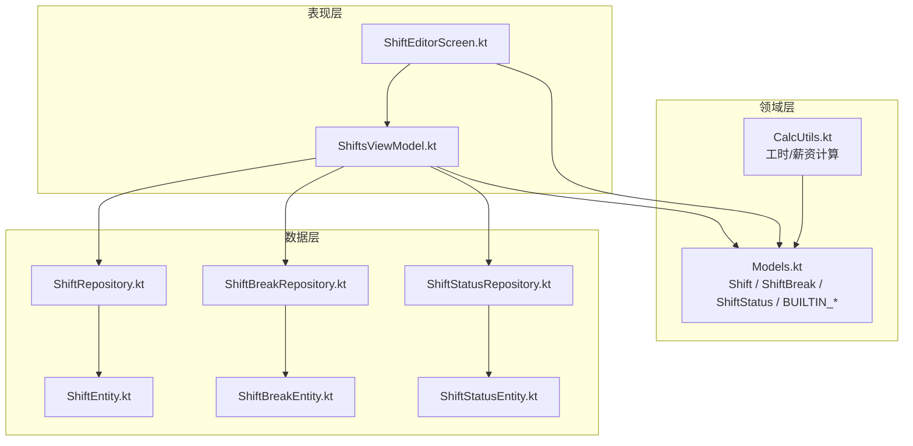
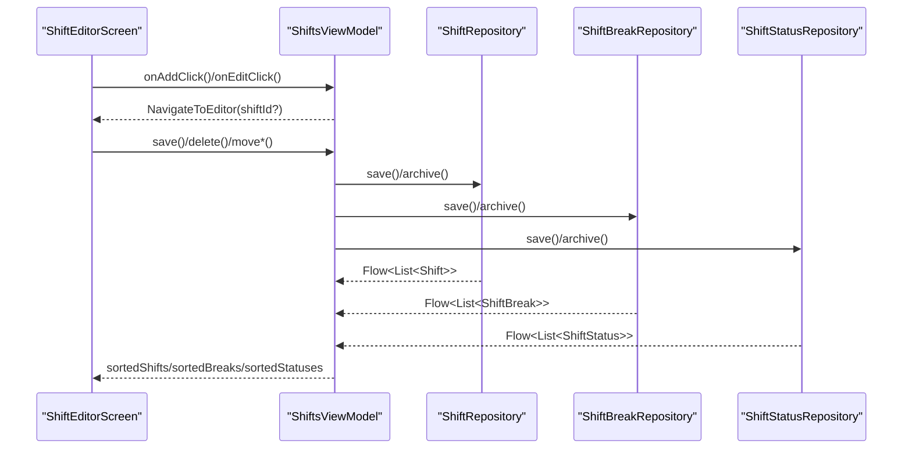
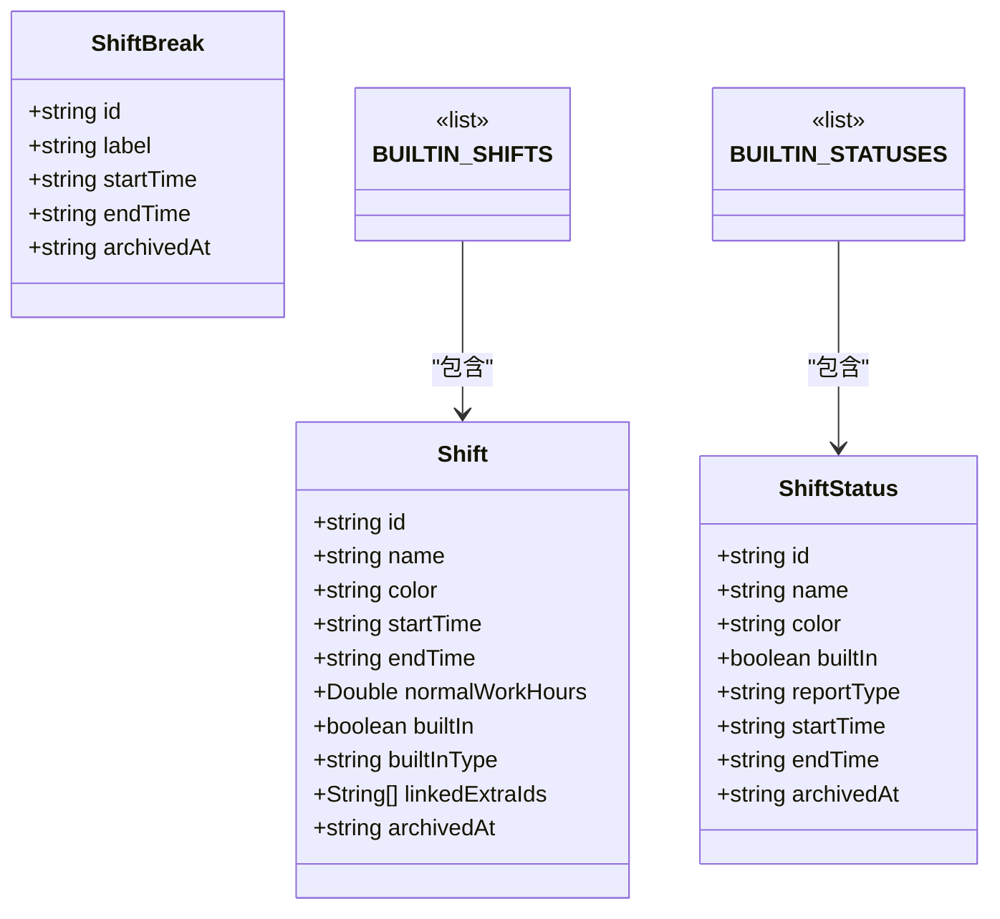
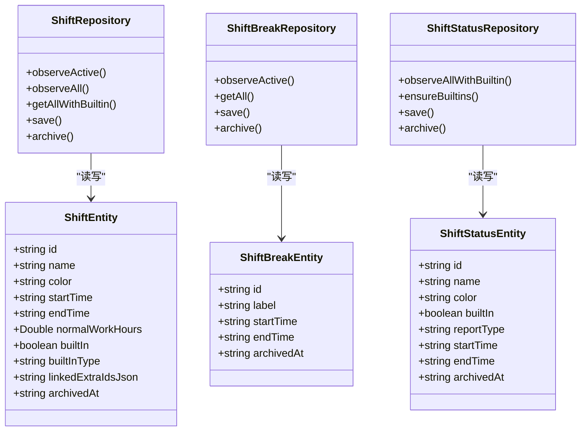
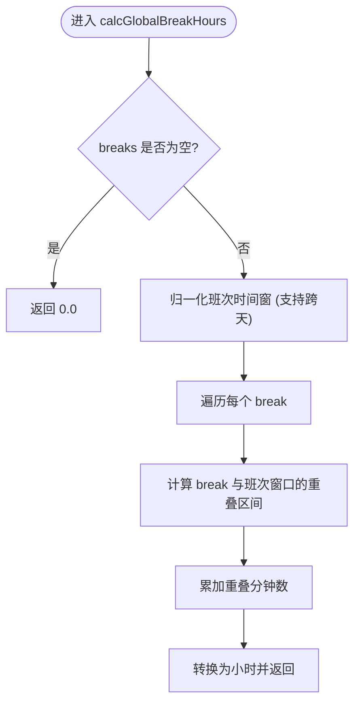
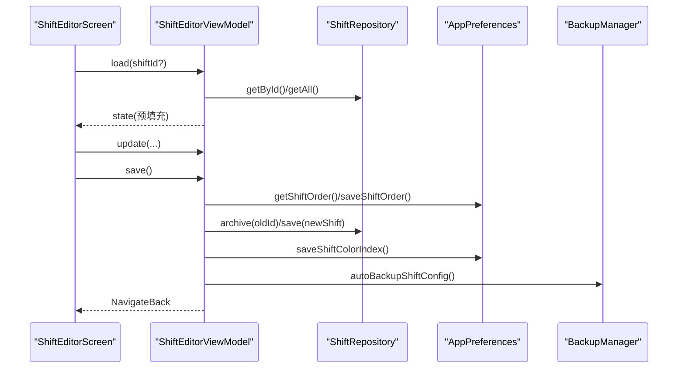
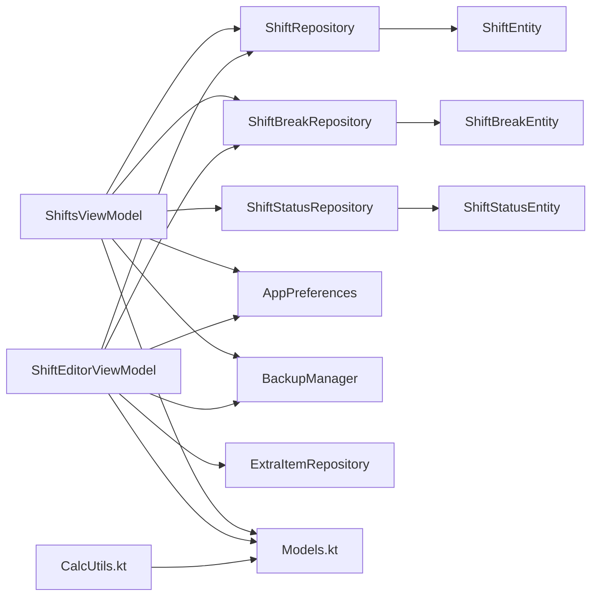

# 班次模型

<cite>
**本文引用的文件**   
- [ShiftEntity.kt](file://app/src/main/java/com/schedulecalendar/app/data/db/entity/ShiftEntity.kt)
- [ShiftBreakEntity.kt](file://app/src/main/java/com/schedulecalendar/app/data/db/entity/ShiftBreakEntity.kt)
- [ShiftStatusEntity.kt](file://app/src/main/java/com/schedulecalendar/app/data/db/entity/ShiftStatusEntity.kt)
- [Models.kt](file://app/src/main/java/com/schedulecalendar/app/domain/model/Models.kt)
- [CalcUtils.kt](file://app/src/main/java/com/schedulecalendar/app/domain/model/CalcUtils.kt)
- [ShiftRepository.kt](file://app/src/main/java/com/schedulecalendar/app/data/repository/ShiftRepository.kt)
- [ShiftBreakRepository.kt](file://app/src/main/java/com/schedulecalendar/app/data/repository/ShiftBreakRepository.kt)
- [ShiftStatusRepository.kt](file://app/src/main/java/com/schedulecalendar/app/data/repository/ShiftStatusRepository.kt)
- [ShiftsViewModel.kt](file://app/src/main/java/com/schedulecalendar/app/ui/shifts/ShiftsViewModel.kt)
- [ShiftEditorScreen.kt](file://app/src/main/java/com/schedulecalendar/app/ui/shifts/ShiftEditorScreen.kt)
</cite>

## 目录
1. [简介](#简介)
2. [项目结构](#项目结构)
3. [核心组件](#核心组件)
4. [架构总览](#架构总览)
5. [详细组件分析](#详细组件分析)
6. [依赖关系分析](#依赖关系分析)
7. [性能与扩展性](#性能与扩展性)
8. [故障排查指南](#故障排查指南)
9. [结论](#结论)
10. [附录：CRUD 与业务逻辑示例路径](#附录crud-与业务逻辑示例路径)

## 简介
本文件围绕“班次模型”进行系统化说明，覆盖以下要点：
- 实体设计与字段语义：Shift、ShiftBreak、ShiftStatus 的领域模型与持久化实体定义
- 时间配置与颜色设置：起止时间、正常班时长、加班分界、全局休息时段扣减、颜色选择与预览
- 内置类型映射：内置班次（休息/调休/请假）与内置状态（请假/调休）的常量与默认值
- 自定义扩展机制：ShiftStatus 的 reportType 映射到报表类型；用户可新增自定义状态
- 内置列表 BUILTIN_SHIFTS 的使用方式与自定义班次创建流程
- 关联补贴/扣款项目的预选与归档管理
- 实际代码示例路径：展示 CRUD 操作与关键业务处理

## 项目结构
与班次模型相关的代码主要分布在三层：
- 领域层 domain.model：领域模型与计算工具（Shift、ShiftBreak、ShiftStatus、BUILTIN_* 常量、CalcUtils）
- 数据层 data.db.entity + data.repository：Room 实体与 Repository 封装（含 observeAllWithBuiltin、archive 等）
- 表现层 ui.shifts：UI 状态与交互（ShiftsViewModel、ShiftEditorScreen）

图表来源
- [Models.kt:51-78](file://app/src/main/java/com/schedulecalendar/app/domain/model/Models.kt#L51-L78)
- [ShiftEntity.kt:1-24](file://app/src/main/java/com/schedulecalendar/app/data/db/entity/ShiftEntity.kt#L1-L24)
- [ShiftBreakEntity.kt:1-16](file://app/src/main/java/com/schedulecalendar/app/data/db/entity/ShiftBreakEntity.kt#L1-L16)
- [ShiftStatusEntity.kt:1-19](file://app/src/main/java/com/schedulecalendar/app/data/db/entity/ShiftStatusEntity.kt#L1-L19)
- [ShiftRepository.kt:1-45](file://app/src/main/java/com/schedulecalendar/app/data/repository/ShiftRepository.kt#L1-L45)
- [ShiftBreakRepository.kt:1-27](file://app/src/main/java/com/schedulecalendar/app/data/repository/ShiftBreakRepository.kt#L1-L27)
- [ShiftStatusRepository.kt:1-54](file://app/src/main/java/com/schedulecalendar/app/data/repository/ShiftStatusRepository.kt#L1-L54)
- [ShiftsViewModel.kt:1-120](file://app/src/main/java/com/schedulecalendar/app/ui/shifts/ShiftsViewModel.kt#L1-L120)
- [ShiftEditorScreen.kt:1-60](file://app/src/main/java/com/schedulecalendar/app/ui/shifts/ShiftEditorScreen.kt#L1-L60)

章节来源
- [Models.kt:51-78](file://app/src/main/java/com/schedulecalendar/app/domain/model/Models.kt#L51-L78)
- [ShiftEntity.kt:1-24](file://app/src/main/java/com/schedulecalendar/app/data/db/entity/ShiftEntity.kt#L1-L24)
- [ShiftBreakEntity.kt:1-16](file://app/src/main/java/com/schedulecalendar/app/data/db/entity/ShiftBreakEntity.kt#L1-L16)
- [ShiftStatusEntity.kt:1-19](file://app/src/main/java/com/schedulecalendar/app/data/db/entity/ShiftStatusEntity.kt#L1-L19)
- [ShiftRepository.kt:1-45](file://app/src/main/java/com/schedulecalendar/app/data/repository/ShiftRepository.kt#L1-L45)
- [ShiftBreakRepository.kt:1-27](file://app/src/main/java/com/schedulecalendar/app/data/repository/ShiftBreakRepository.kt#L1-L27)
- [ShiftStatusRepository.kt:1-54](file://app/src/main/java/com/schedulecalendar/app/data/repository/ShiftStatusRepository.kt#L1-L54)
- [ShiftsViewModel.kt:1-120](file://app/src/main/java/com/schedulecalendar/app/ui/shifts/ShiftsViewModel.kt#L1-L120)
- [ShiftEditorScreen.kt:1-60](file://app/src/main/java/com/schedulecalendar/app/ui/shifts/ShiftEditorScreen.kt#L1-L60)

## 核心组件
本节聚焦三大核心实体的设计、字段含义与业务规则。

### 班次 Shift
- 标识与名称：id、name
- 时间与颜色：startTime、endTime、color
- 正常班时长：normalWorkHours（小时），为 null 表示不限制加班分界；大于 0 时超出部分计为加班
- 内置标记与类型：builtIn、builtInType（rest/swap/leave）
- 关联补贴/扣款：linkedExtraIds（最多 3 个，排班时自动预选）
- 归档：archivedAt（null=有效，非空=已归档）

领域模型与内置列表
- 领域模型定义与默认值见 Models.kt
- 内置班次列表 BUILTIN_SHIFTS 包含休息、调休等预设项，供排班选择与日历显示使用

章节来源
- [Models.kt:51-78](file://app/src/main/java/com/schedulecalendar/app/domain/model/Models.kt#L51-L78)
- [ShiftEntity.kt:1-24](file://app/src/main/java/com/schedulecalendar/app/data/db/entity/ShiftEntity.kt#L1-L24)

### 全局不计入工时时段 ShiftBreak
- 标识与标签：id、label
- 时间段：startTime、endTime（HH:mm）
- 归档：archivedAt（null=有效，非空=已归档）
- 作用范围：对所有班次生效，用于午休、用餐等不计入工时的时段

章节来源
- [Models.kt:14-20](file://app/src/main/java/com/schedulecalendar/app/domain/model/Models.kt#L14-L20)
- [ShiftBreakEntity.kt:1-16](file://app/src/main/java/com/schedulecalendar/app/data/db/entity/ShiftBreakEntity.kt#L1-L16)

### 班次状态类型 ShiftStatus
- 标识与名称：id、name
- 颜色：color
- 内置标记：builtIn
- 报表类型映射：reportType（leave|swap|null），用于将状态映射到请假/调休报表维度
- 可选时间段：startTime、endTime（为空则仅标记状态，不扣除工时）
- 归档：archivedAt（null=有效，非空=已归档）
- 内置状态：BUILTIN_STATUSES 提供请假、调休两种内置类型

章节来源
- [Models.kt:22-35](file://app/src/main/java/com/schedulecalendar/app/domain/model/Models.kt#L22-L35)
- [ShiftStatusEntity.kt:1-19](file://app/src/main/java/com/schedulecalendar/app/data/db/entity/ShiftStatusEntity.kt#L1-L19)

## 架构总览
从 UI 到数据层的调用链如下：
- UI 层通过 ViewModel 暴露 StateFlow 给 Compose 界面
- ViewModel 组合多个 Repository 的数据流，并维护内存排序顺序
- Repository 负责合并内置数据、转换领域模型、执行归档等逻辑
- 领域层提供计算工具 CalcUtils，用于工时/薪资计算与全局休息时段扣减

图表来源
- [ShiftsViewModel.kt:120-170](file://app/src/main/java/com/schedulecalendar/app/ui/shifts/ShiftsViewModel.kt#L120-L170)
- [ShiftRepository.kt:16-45](file://app/src/main/java/com/schedulecalendar/app/data/repository/ShiftRepository.kt#L16-L45)
- [ShiftBreakRepository.kt:15-27](file://app/src/main/java/com/schedulecalendar/app/data/repository/ShiftBreakRepository.kt#L15-L27)
- [ShiftStatusRepository.kt:16-54](file://app/src/main/java/com/schedulecalendar/app/data/repository/ShiftStatusRepository.kt#L16-L54)
- [ShiftEditorScreen.kt:36-50](file://app/src/main/java/com/schedulecalendar/app/ui/shifts/ShiftEditorScreen.kt#L36-L50)

## 详细组件分析

### 领域模型与内置映射
- 内置常量：BUILTIN_SHIFT_REST、BUILTIN_SHIFT_SWAP、BUILTIN_SHIFT_LEAVE、BUILTIN_STATUS_LEAVE、BUILTIN_STATUS_SWAP、BUILTIN_SCHEME_ID、NO_SCHEME_ID
- 内置班次列表 BUILTIN_SHIFTS：包含休息与调休两个预设项，用于排班选择与日历显示
- 内置状态列表 BUILTIN_STATUSES：包含请假与调休两种内置状态，支持报表类型映射

图表来源
- [Models.kt:51-78](file://app/src/main/java/com/schedulecalendar/app/domain/model/Models.kt#L51-L78)
- [Models.kt:22-35](file://app/src/main/java/com/schedulecalendar/app/domain/model/Models.kt#L22-L35)

章节来源
- [Models.kt:51-78](file://app/src/main/java/com/schedulecalendar/app/domain/model/Models.kt#L51-L78)
- [Models.kt:22-35](file://app/src/main/java/com/schedulecalendar/app/domain/model/Models.kt#L22-L35)

### 持久化实体与仓库封装
- 实体表名：shifts、shift_breaks、shift_statuses
- 字段对齐：领域模型与实体一一对应，Repository 负责 toDomain/toEntity 转换
- 内置数据合并：observeAllWithBuiltin 在返回结果中前置内置项并去重
- 归档策略：archive 方法写入 archivedAt 实现逻辑删除

图表来源
- [ShiftEntity.kt:1-24](file://app/src/main/java/com/schedulecalendar/app/data/db/entity/ShiftEntity.kt#L1-L24)
- [ShiftBreakEntity.kt:1-16](file://app/src/main/java/com/schedulecalendar/app/data/db/entity/ShiftBreakEntity.kt#L1-L16)
- [ShiftStatusEntity.kt:1-19](file://app/src/main/java/com/schedulecalendar/app/data/db/entity/ShiftStatusEntity.kt#L1-L19)
- [ShiftRepository.kt:16-45](file://app/src/main/java/com/schedulecalendar/app/data/repository/ShiftRepository.kt#L16-L45)
- [ShiftBreakRepository.kt:15-27](file://app/src/main/java/com/schedulecalendar/app/data/repository/ShiftBreakRepository.kt#L15-L27)
- [ShiftStatusRepository.kt:16-54](file://app/src/main/java/com/schedulecalendar/app/data/repository/ShiftStatusRepository.kt#L16-L54)

章节来源
- [ShiftEntity.kt:1-24](file://app/src/main/java/com/schedulecalendar/app/data/db/entity/ShiftEntity.kt#L1-L24)
- [ShiftBreakEntity.kt:1-16](file://app/src/main/java/com/schedulecalendar/app/data/db/entity/ShiftBreakEntity.kt#L1-L16)
- [ShiftStatusEntity.kt:1-19](file://app/src/main/java/com/schedulecalendar/app/data/db/entity/ShiftStatusEntity.kt#L1-L19)
- [ShiftRepository.kt:16-45](file://app/src/main/java/com/schedulecalendar/app/data/repository/ShiftRepository.kt#L16-L45)
- [ShiftBreakRepository.kt:15-27](file://app/src/main/java/com/schedulecalendar/app/data/repository/ShiftBreakRepository.kt#L15-L27)
- [ShiftStatusRepository.kt:16-54](file://app/src/main/java/com/schedulecalendar/app/data/repository/ShiftStatusRepository.kt#L16-L54)

### 时间配置与全局休息时段扣减
- 起止时间：HH:mm 格式，支持跨天（结束早于开始视为次日）
- 正常班时长：若设置且大于 0，则超过该阈值的工时计入加班；否则全部计入正常工时
- 全局休息时段：对班次时间窗口与所有 ShiftBreak 求交集，累计扣减后得到实际工时
- 考勤粒度与容忍时长：由 AttendConfig 控制，影响早到/迟到/晚退/早退的处理

图表来源
- [CalcUtils.kt:121-134](file://app/src/main/java/com/schedulecalendar/app/domain/model/CalcUtils.kt#L121-L134)

章节来源
- [CalcUtils.kt:121-134](file://app/src/main/java/com/schedulecalendar/app/domain/model/CalcUtils.kt#L121-L134)

### 内置班次列表 BUILTIN_SHIFTS 的使用
- 用途：在排班选择、日历网格历史数据展示、统计汇总等场景中作为不可编辑的预设项
- 获取方式：Repository.observeAllWithBuiltin 或 getAllWithBuiltin 会前置内置项并去重
- 注意：内置项不参与保存/归档（builtIn=true 时跳过 upsert）

章节来源
- [Models.kt:68-72](file://app/src/main/java/com/schedulecalendar/app/domain/model/Models.kt#L68-L72)
- [ShiftRepository.kt:25-37](file://app/src/main/java/com/schedulecalendar/app/data/repository/ShiftRepository.kt#L25-L37)

### 自定义班次的创建流程
- 入口：ShiftsViewModel.onAddClick → ShiftEditorScreen
- 初始化：加载所有 ExtraItem 与 ShiftBreak，按预设颜色索引选择默认色
- 校验：名称非空、起止时间完整、名称唯一（忽略已归档）
- 保存：编辑时先归档旧记录再插入新记录（生成新 ID），同时更新 DataStore 中的排序顺序与颜色索引
- 备份：保存成功后触发自动备份

图表来源
- [ShiftEditorScreen.kt:36-50](file://app/src/main/java/com/schedulecalendar/app/ui/shifts/ShiftEditorScreen.kt#L36-L50)
- [ShiftsViewModel.kt:350-454](file://app/src/main/java/com/schedulecalendar/app/ui/shifts/ShiftsViewModel.kt#L350-L454)

章节来源
- [ShiftsViewModel.kt:350-454](file://app/src/main/java/com/schedulecalendar/app/ui/shifts/ShiftsViewModel.kt#L350-L454)
- [ShiftEditorScreen.kt:36-50](file://app/src/main/java/com/schedulecalendar/app/ui/shifts/ShiftEditorScreen.kt#L36-L50)

### 关联补贴/扣款项目配置
- 字段：Shift.linkedExtraIds（最多 3 个）
- 行为：在 ShiftEditorScreen 中以 FilterChip 形式展示所有 ExtraItem，支持多选切换
- 目的：排班时自动预选关联项目，简化录入

章节来源
- [Models.kt:51-65](file://app/src/main/java/com/schedulecalendar/app/domain/model/Models.kt#L51-L65)
- [ShiftEditorScreen.kt:179-211](file://app/src/main/java/com/schedulecalendar/app/ui/shifts/ShiftEditorScreen.kt#L179-L211)

### 归档管理功能
- 统一归档：Repository.archive 写入 archivedAt 时间戳，实现逻辑删除
- 列表过滤：observeActive 仅返回未归档项；observeAll 返回所有（含已归档）
- 导入导出：ShiftsViewModel.prepareExport/importFromJson 支持 JSON 序列化与导入，内置项在导出时过滤

章节来源
- [ShiftRepository.kt:40-45](file://app/src/main/java/com/schedulecalendar/app/data/repository/ShiftRepository.kt#L40-L45)
- [ShiftBreakRepository.kt:22-27](file://app/src/main/java/com/schedulecalendar/app/data/repository/ShiftBreakRepository.kt#L22-L27)
- [ShiftStatusRepository.kt:48-54](file://app/src/main/java/com/schedulecalendar/app/data/repository/ShiftStatusRepository.kt#L48-L54)
- [ShiftsViewModel.kt:274-327](file://app/src/main/java/com/schedulecalendar/app/ui/shifts/ShiftsViewModel.kt#L274-L327)

### 自定义状态类型的扩展机制
- 字段：ShiftStatus.reportType（leave|swap|null）
- 作用：将自定义状态映射到报表类型，便于统计请假/调休工时
- 内置状态：BUILTIN_STATUSES 提供默认映射，确保首次启动存在

章节来源
- [Models.kt:22-35](file://app/src/main/java/com/schedulecalendar/app/domain/model/Models.kt#L22-L35)
- [ShiftStatusRepository.kt:41-46](file://app/src/main/java/com/schedulecalendar/app/data/repository/ShiftStatusRepository.kt#L41-L46)

## 依赖关系分析
- 低耦合高内聚：领域模型独立于持久化细节；Repository 屏蔽 DAO 与内置数据合并；ViewModel 聚合多源数据流
- 直接依赖：
  - ShiftsViewModel 依赖三个 Repository 与 AppPreferences、BackupManager
  - ShiftEditorViewModel 依赖 ShiftRepository、ExtraItemRepository、ShiftBreakRepository、AppPreferences、BackupManager
- 间接依赖：
  - CalcUtils 依赖 HolidayData（节假日判断）、AttendConfig（考勤规则）
- 潜在循环：无直接循环依赖；Repository 仅依赖 DAO 与领域模型

图表来源
- [ShiftsViewModel.kt:46-120](file://app/src/main/java/com/schedulecalendar/app/ui/shifts/ShiftsViewModel.kt#L46-L120)
- [ShiftEditorViewModel.kt:350-374](file://app/src/main/java/com/schedulecalendar/app/ui/shifts/ShiftsViewModel.kt#L350-L374)
- [ShiftRepository.kt:1-45](file://app/src/main/java/com/schedulecalendar/app/data/repository/ShiftRepository.kt#L1-L45)
- [ShiftBreakRepository.kt:1-27](file://app/src/main/java/com/schedulecalendar/app/data/repository/ShiftBreakRepository.kt#L1-L27)
- [ShiftStatusRepository.kt:1-54](file://app/src/main/java/com/schedulecalendar/app/data/repository/ShiftStatusRepository.kt#L1-L54)
- [Models.kt:51-78](file://app/src/main/java/com/schedulecalendar/app/domain/model/Models.kt#L51-L78)
- [CalcUtils.kt:16-50](file://app/src/main/java/com/schedulecalendar/app/domain/model/CalcUtils.kt#L16-L50)

章节来源
- [ShiftsViewModel.kt:46-120](file://app/src/main/java/com/schedulecalendar/app/ui/shifts/ShiftsViewModel.kt#L46-L120)
- [ShiftEditorViewModel.kt:350-374](file://app/src/main/java/com/schedulecalendar/app/ui/shifts/ShiftsViewModel.kt#L350-L374)
- [ShiftRepository.kt:1-45](file://app/src/main/java/com/schedulecalendar/app/data/repository/ShiftRepository.kt#L1-L45)
- [ShiftBreakRepository.kt:1-27](file://app/src/main/java/com/schedulecalendar/app/data/repository/ShiftBreakRepository.kt#L1-L27)
- [ShiftStatusRepository.kt:1-54](file://app/src/main/java/com/schedulecalendar/app/data/repository/ShiftStatusRepository.kt#L1-L54)
- [Models.kt:51-78](file://app/src/main/java/com/schedulecalendar/app/domain/model/Models.kt#L51-L78)
- [CalcUtils.kt:16-50](file://app/src/main/java/com/schedulecalendar/app/domain/model/CalcUtils.kt#L16-L50)

## 性能与扩展性
- 观察型数据流：Repository.observeActive/observeAllWithBuiltin 以 Flow 形式推送变更，避免频繁轮询
- 内存排序优化：ViewModel 维护 _shiftOrder/_statusOrder/_breakOrder 即时响应拖拽排序，后台异步持久化
- 内置数据前置：在 Repository 层合并内置项，减少 UI 层重复逻辑
- 扩展点：
  - ShiftStatus.reportType 支持新的报表类型映射
  - Shift.linkedExtraIds 可扩展更多关联项目（当前最多 3 个）
  - CalcUtils 提供统一的工时/薪资计算，便于后续扩展计薪规则

[本节为通用指导，无需具体文件引用]

## 故障排查指南
- 名称冲突：保存前检查名称是否重复（忽略已归档），错误信息通过 ShiftEditorUiEvent.ShowError 返回
- 时间不完整：startTime/endTime 为空时阻止保存，提示输入完整时间
- 导入失败：JSON 解析异常或格式不符时抛出错误，UI 层捕获并提示
- 导出失败：Gson 序列化异常时捕获并提示

章节来源
- [ShiftsViewModel.kt:403-454](file://app/src/main/java/com/schedulecalendar/app/ui/shifts/ShiftsViewModel.kt#L403-L454)
- [ShiftsViewModel.kt:274-327](file://app/src/main/java/com/schedulecalendar/app/ui/shifts/ShiftsViewModel.kt#L274-L327)

## 结论
本班次模型以清晰的领域分层与数据封装为基础，提供了灵活的班次定义、全局休息时段扣减、内置与自定义状态扩展、以及完善的归档与导入导出能力。通过 Flow 驱动的实时排序与 UI 联动，用户在体验上获得即时反馈；在业务层面，CalcUtils 保证了工时与薪资计算的准确性与一致性。

[本节为总结，无需具体文件引用]

## 附录：CRUD 与业务逻辑示例路径
- 新增班次
  - 入口：ShiftsViewModel.onAddClick → ShiftEditorScreen
  - 参考路径：[ShiftsViewModel.kt:132-134](file://app/src/main/java/com/schedulecalendar/app/ui/shifts/ShiftsViewModel.kt#L132-L134)、[ShiftEditorScreen.kt:36-50](file://app/src/main/java/com/schedulecalendar/app/ui/shifts/ShiftEditorScreen.kt#L36-L50)
- 编辑班次
  - 加载：ShiftEditorViewModel.load → 读取 Shift 与 ExtraItem/Break
  - 保存：ShiftEditorViewModel.save → 校验、归档旧记录、插入新记录、更新排序与颜色索引
  - 参考路径：[ShiftsViewModel.kt:376-454](file://app/src/main/java/com/schedulecalendar/app/ui/shifts/ShiftsViewModel.kt#L376-L454)
- 删除/归档班次
  - 动作：ShiftsViewModel.deleteShift → Repository.archive
  - 参考路径：[ShiftsViewModel.kt:135-138](file://app/src/main/java/com/schedulecalendar/app/ui/shifts/ShiftsViewModel.kt#L135-L138)、[ShiftRepository.kt:40-45](file://app/src/main/java/com/schedulecalendar/app/data/repository/ShiftRepository.kt#L40-L45)
- 全局休息时段 CRUD
  - 新增/编辑：ShiftsViewModel.saveBreak → 归档旧记录并插入新记录
  - 删除：ShiftsViewModel.deleteBreak → Repository.archive
  - 参考路径：[ShiftsViewModel.kt:173-194](file://app/src/main/java/com/schedulecalendar/app/ui/shifts/ShiftsViewModel.kt#L173-L194)、[ShiftBreakRepository.kt:20-27](file://app/src/main/java/com/schedulecalendar/app/data/repository/ShiftBreakRepository.kt#L20-L27)
- 状态类型 CRUD
  - 新增/编辑：ShiftsViewModel.saveStatus → 归档旧记录并插入新记录，递增颜色索引
  - 删除：ShiftsViewModel.deleteStatus → Repository.archive
  - 参考路径：[ShiftsViewModel.kt:197-223](file://app/src/main/java/com/schedulecalendar/app/ui/shifts/ShiftsViewModel.kt#L197-L223)、[ShiftStatusRepository.kt:48-54](file://app/src/main/java/com/schedulecalendar/app/data/repository/ShiftStatusRepository.kt#L48-L54)
- 排序与预览
  - 排序：moveShiftUp/Down、moveStatusUp/Down、moveBreakUp/Down → 内存排序 + 持久化
  - 时长预览：ShiftEditorScreen 使用 CalcUtils.calcHourDiff 与 calcGlobalBreakHours 计算总时长与实际工时
  - 参考路径：[ShiftsViewModel.kt:146-170](file://app/src/main/java/com/schedulecalendar/app/ui/shifts/ShiftsViewModel.kt#L146-L170)、[ShiftEditorScreen.kt:114-136](file://app/src/main/java/com/schedulecalendar/app/ui/shifts/ShiftEditorScreen.kt#L114-L136)、[CalcUtils.kt:40-47](file://app/src/main/java/com/schedulecalendar/app/domain/model/CalcUtils.kt#L40-L47)、[CalcUtils.kt:121-134](file://app/src/main/java/com/schedulecalendar/app/domain/model/CalcUtils.kt#L121-L134)
- 导入导出
  - 导出：ShiftsViewModel.prepareExport → 生成 JSON（排除内置项）
  - 导入：ShiftsViewModel.importFromJson → 解析 JSON 并保存（支持覆盖/增量）
  - 参考路径：[ShiftsViewModel.kt:274-327](file://app/src/main/java/com/schedulecalendar/app/ui/shifts/ShiftsViewModel.kt#L274-L327)