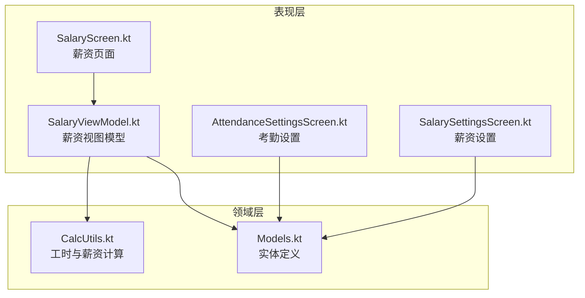
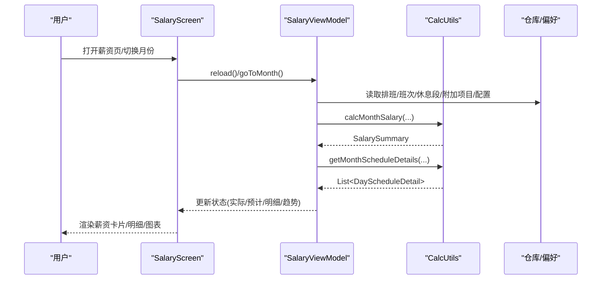
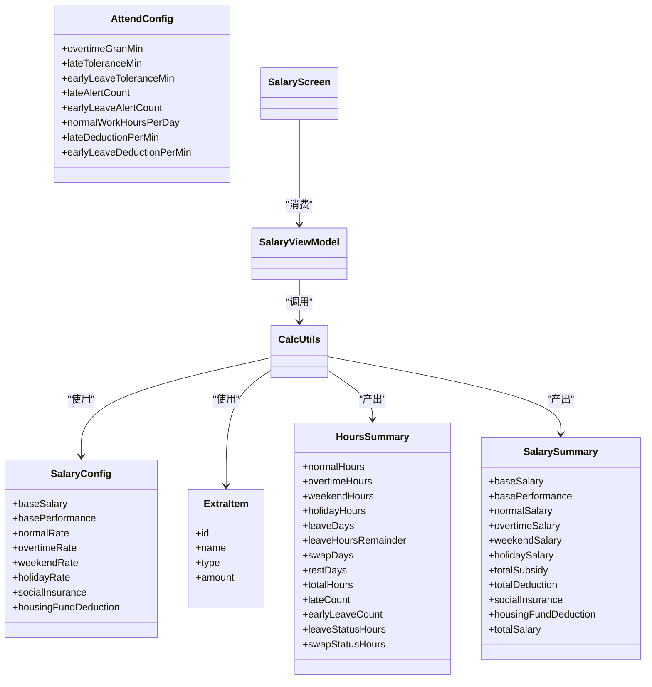
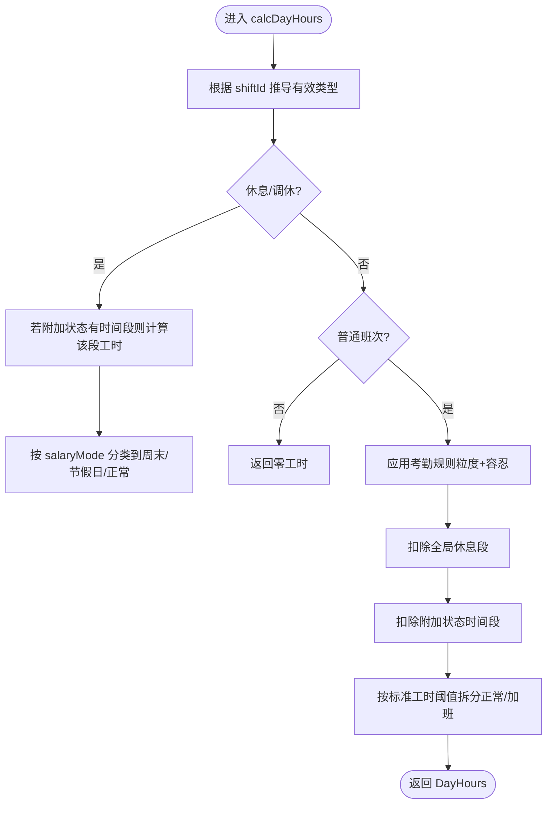
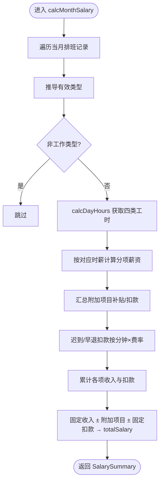

# 薪资配置模型

<cite>
**本文引用的文件**
- [Models.kt](file://app/src/main/java/com/schedulecalendar/app/domain/model/Models.kt)
- [CalcUtils.kt](file://app/src/main/java/com/schedulecalendar/app/domain/model/CalcUtils.kt)
- [SalaryScreen.kt](file://app/src/main/java/com/schedulecalendar/app/ui/salary/SalaryScreen.kt)
- [SalaryViewModel.kt](file://app/src/main/java/com/schedulecalendar/app/ui/salary/SalaryViewModel.kt)
- [AttendanceSettingsScreen.kt](file://app/src/main/java/com/schedulecalendar/app/ui/settings/AttendanceSettingsScreen.kt)
- [SalarySettingsScreen.kt](file://app/src/main/java/com/schedulecalendar/app/ui/settings/SalarySettingsScreen.kt)
</cite>

## 目录
1. [简介](#简介)
2. [项目结构](#项目结构)
3. [核心组件](#核心组件)
4. [架构总览](#架构总览)
5. [详细组件分析](#详细组件分析)
6. [依赖关系分析](#依赖关系分析)
7. [性能与精度考量](#性能与精度考量)
8. [故障排查指南](#故障排查指南)
9. [结论](#结论)
10. [附录：计算流程与示例](#附录计算流程与示例)

## 简介
本文件围绕薪资配置模型展开，系统性梳理以下实体与逻辑：
- SalaryConfig：统一薪资制度（底薪、绩效、正常/加班/周末/节假日时薪、社保与公积金扣款）
- ExtraItem：附加补贴/扣款项（类型、金额）
- HoursSummary：月度工时汇总（正常/加班/周末/节假日工时、请假折算、迟到早退计数等）
- SalarySummary：月度薪资汇总（各分项收入与扣款、实发工资）
- AttendConfig：考勤规则（加班粒度、容忍时长、标准工时、迟到早退扣款等）

文档同时覆盖：
- 费率字段含义与业务影响
- 附加项目类型管理
- 工时统计指标的计算方式
- 薪资汇总核算逻辑
- 完整薪资计算流程与实际应用场景

## 项目结构
薪资相关的数据模型与计算集中在领域层，UI 层负责展示与交互。关键位置如下：
- 领域模型与计算：domain/model/Models.kt、domain/model/CalcUtils.kt
- 薪资页面与状态：ui/salary/SalaryScreen.kt、ui/salary/SalaryViewModel.kt
- 设置界面：ui/settings/AttendanceSettingsScreen.kt、ui/settings/SalarySettingsScreen.kt

图表来源
- [Models.kt:112-141](file://app/src/main/java/com/schedulecalendar/app/domain/model/Models.kt#L112-L141)
- [CalcUtils.kt:149-230](file://app/src/main/java/com/schedulecalendar/app/domain/model/CalcUtils.kt#L149-L230)
- [SalaryScreen.kt:39-186](file://app/src/main/java/com/schedulecalendar/app/ui/salary/SalaryScreen.kt#L39-L186)
- [SalaryViewModel.kt:74-132](file://app/src/main/java/com/schedulecalendar/app/ui/salary/SalaryViewModel.kt#L74-L132)
- [AttendanceSettingsScreen.kt:35-89](file://app/src/main/java/com/schedulecalendar/app/ui/settings/AttendanceSettingsScreen.kt#L35-L89)
- [SalarySettingsScreen.kt:38-89](file://app/src/main/java/com/schedulecalendar/app/ui/settings/SalarySettingsScreen.kt#L38-L89)

章节来源
- [Models.kt:112-141](file://app/src/main/java/com/schedulecalendar/app/domain/model/Models.kt#L112-L141)
- [CalcUtils.kt:149-230](file://app/src/main/java/com/schedulecalendar/app/domain/model/CalcUtils.kt#L149-L230)
- [SalaryScreen.kt:39-186](file://app/src/main/java/com/schedulecalendar/app/ui/salary/SalaryScreen.kt#L39-L186)
- [SalaryViewModel.kt:74-132](file://app/src/main/java/com/schedulecalendar/app/ui/salary/SalaryViewModel.kt#L74-L132)
- [AttendanceSettingsScreen.kt:35-89](file://app/src/main/java/com/schedulecalendar/app/ui/settings/AttendanceSettingsScreen.kt#L35-L89)
- [SalarySettingsScreen.kt:38-89](file://app/src/main/java/com/schedulecalendar/app/ui/settings/SalarySettingsScreen.kt#L38-L89)

## 核心组件
本节聚焦薪资相关核心数据模型与计算入口。

- SalaryConfig（薪资配置）
  - 基础底薪：按月固定发放的底薪
  - 基础绩效：按月固定发放的绩效
  - 正常时薪：工作日正常工时的单价
  - 加班时薪：超出标准工时的加班单价
  - 周末时薪：周末工作时的单价
  - 节假日时薪：法定节假日工作的单价
  - 社保扣款：每月固定扣除的社保费用
  - 公积金扣款：每月固定扣除的公积金费用

- ExtraItem（附加项目）
  - 类型：allowance（补贴）、deduction（扣款）
  - 金额：正数；在汇总中按类型分别计入 totalSubsidy 或 totalDeduction

- HoursSummary（工时汇总）
  - normalHours/overtimeHours/weekendHours/holidayHours：四类工时
  - leaveDays/leaveHoursRemainder：请假折算天数与剩余小时
  - swapDays/restDays：调休/休息天数
  - totalHours：当月总工时
  - lateCount/earlyLeaveCount：迟到/早退次数
  - leaveStatusHours/swapStatusHours：附加状态时间段产生的请假/调休工时

- SalarySummary（薪资汇总）
  - baseSalary/basePerformance：固定收入
  - normalSalary/overtimeSalary/weekendSalary/holidaySalary：按工时×对应时薪
  - totalSubsidy/totalDeduction：附加项目合计
  - socialInsurance/housingFundDeduction：固定扣款
  - totalSalary：实发工资（含所有加减项）

- AttendConfig（考勤规则）
  - overtimeGranMin：加班计量粒度（分钟），用于向下取整
  - lateToleranceMin/earlyLeaveToleranceMin：迟到/早退容忍时长
  - lateAlertCount/earlyLeaveAlertCount：提醒阈值（0=不提醒）
  - normalWorkHoursPerDay：日标准工时，超过部分计为加班
  - lateDeductionPerMin/earlyLeaveDeductionPerMin：迟到/早退扣款费率（元/分钟）

章节来源
- [Models.kt:102-141](file://app/src/main/java/com/schedulecalendar/app/domain/model/Models.kt#L102-L141)
- [Models.kt:224-269](file://app/src/main/java/com/schedulecalendar/app/domain/model/Models.kt#L224-L269)

## 架构总览
薪资计算由 UI 层触发，经 ViewModel 聚合数据后调用领域计算工具完成。

图表来源
- [SalaryViewModel.kt:74-132](file://app/src/main/java/com/schedulecalendar/app/ui/salary/SalaryViewModel.kt#L74-L132)
- [CalcUtils.kt:344-423](file://app/src/main/java/com/schedulecalendar/app/domain/model/CalcUtils.kt#L344-L423)
- [CalcUtils.kt:427-465](file://app/src/main/java/com/schedulecalendar/app/domain/model/CalcUtils.kt#L427-L465)
- [SalaryScreen.kt:39-186](file://app/src/main/java/com/schedulecalendar/app/ui/salary/SalaryScreen.kt#L39-L186)

## 详细组件分析

### 薪资配置 SalaryConfig
- 字段含义与业务影响
  - 基础底薪/基础绩效：直接计入固定收入
  - 正常/加班/周末/节假日时薪：决定不同类别工时的单价
  - 社保/公积金扣款：从总收入中扣除
- 典型使用场景
  - 标准工时制：正常时薪 × 正常工时 + 加班时薪 × 加班工时 + 周末/节假日时薪 × 对应工时 + 固定收入 ± 附加项目 ± 社保/公积金
  - 弹性工时制：通过 AttendConfig.normalWorkHoursPerDay 控制“标准工时”阈值，超出部分自动归入加班

章节来源
- [Models.kt:112-121](file://app/src/main/java/com/schedulecalendar/app/domain/model/Models.kt#L112-L121)
- [SalarySettingsScreen.kt:38-89](file://app/src/main/java/com/schedulecalendar/app/ui/settings/SalarySettingsScreen.kt#L38-L89)

### 附加项目 ExtraItem
- 类型管理
  - allowance：计入 totalSubsidy
  - deduction：计入 totalDeduction
- 关联方式
  - 排班记录可携带多个附加项目 ID，汇总时按类型累加
- 显示与提示
  - 每日明细行会标注名称与金额，并区分补贴/扣款颜色

章节来源
- [Models.kt:102-109](file://app/src/main/java/com/schedulecalendar/app/domain/model/Models.kt#L102-L109)
- [CalcUtils.kt:382-386](file://app/src/main/java/com/schedulecalendar/app/domain/model/CalcUtils.kt#L382-L386)
- [SalaryScreen.kt:458-466](file://app/src/main/java/com/schedulecalendar/app/ui/salary/SalaryScreen.kt#L458-L466)

### 工时统计 HoursSummary
- 指标说明
  - normalHours：当日/当月正常工时（未超标准工时）
  - overtimeHours：当日/当月加班工时（超出标准工时）
  - weekendHours/holidayHours：周末/节假日工时
  - leaveDays/leaveHoursRemainder：请假折算天数与剩余小时
  - swapDays/restDays：调休/休息天数
  - totalHours：四类工时之和
  - lateCount/earlyLeaveCount：迟到/早退次数
  - leaveStatusHours/swapStatusHours：附加状态时间段产生的请假/调休工时
- 计算要点
  - 日期分类：自动判断周末/节假日/工作日
  - 考勤规则：应用加班粒度与容忍时长
  - 全局休息段：午休/用餐等不计入时段需从有效工时中扣除
  - 请假折算：按标准工时将请假小时折算为天数与余数

章节来源
- [Models.kt:224-239](file://app/src/main/java/com/schedulecalendar/app/domain/model/Models.kt#L224-L239)
- [CalcUtils.kt:234-340](file://app/src/main/java/com/schedulecalendar/app/domain/model/CalcUtils.kt#L234-L340)

### 薪资汇总 SalarySummary
- 构成项
  - 固定收入：baseSalary、basePerformance
  - 工时收入：normalSalary、overtimeSalary、weekendSalary、holidaySalary
  - 附加项目：totalSubsidy、totalDeduction
  - 固定扣款：socialInsurance、housingFundDeduction
  - 实发工资：totalSalary = 固定收入 + 工时收入 + 附加项目 - 固定扣款
- 计算路径
  - 先按日期分类计算工时，再乘以对应时薪得到分项薪资
  - 附加项目按类型汇总
  - 迟到/早退扣款按分钟×费率累计
  - 最后汇总得到 totalSalary

章节来源
- [Models.kt:256-269](file://app/src/main/java/com/schedulecalendar/app/domain/model/Models.kt#L256-L269)
- [CalcUtils.kt:344-423](file://app/src/main/java/com/schedulecalendar/app/domain/model/CalcUtils.kt#L344-L423)

### 考勤规则 AttendConfig
- 关键选项
  - overtimeGranMin：加班计量粒度（分钟），用于向下取整到倍数
  - lateToleranceMin/earlyLeaveToleranceMin：迟到/早退容忍时长
  - lateAlertCount/earlyLeaveAlertCount：提醒阈值（0=不启用）
  - normalWorkHoursPerDay：日标准工时，超过部分计为加班
  - lateDeductionPerMin/earlyLeaveDeductionPerMin：迟到/早退扣款费率（元/分钟）
- 业务影响
  - 影响有效开始/结束时间（考虑容忍与粒度）
  - 影响正常/加班工时划分
  - 影响迟到/早退扣款金额
  - 影响请假折算的天数与余数

章节来源
- [Models.kt:123-141](file://app/src/main/java/com/schedulecalendar/app/domain/model/Models.kt#L123-L141)
- [AttendanceSettingsScreen.kt:35-89](file://app/src/main/java/com/schedulecalendar/app/ui/settings/AttendanceSettingsScreen.kt#L35-L89)

## 依赖关系分析
- 领域层
  - Models.kt 提供所有数据模型与常量
  - CalcUtils.kt 实现工时与薪资计算，依赖 HolidayData 进行节假日/补班判断
- 表现层
  - SalaryViewModel 聚合仓库与偏好数据，调用 CalcUtils 生成结果
  - SalaryScreen 消费 ViewModel 的状态进行展示
  - AttendanceSettingsScreen 与 SalarySettingsScreen 编辑 AttendConfig 与 SalaryConfig

图表来源
- [Models.kt:112-141](file://app/src/main/java/com/schedulecalendar/app/domain/model/Models.kt#L112-L141)
- [Models.kt:224-269](file://app/src/main/java/com/schedulecalendar/app/domain/model/Models.kt#L224-L269)
- [CalcUtils.kt:344-423](file://app/src/main/java/com/schedulecalendar/app/domain/model/CalcUtils.kt#L344-L423)
- [SalaryViewModel.kt:74-132](file://app/src/main/java/com/schedulecalendar/app/ui/salary/SalaryViewModel.kt#L74-L132)
- [SalaryScreen.kt:39-186](file://app/src/main/java/com/schedulecalendar/app/ui/salary/SalaryScreen.kt#L39-L186)

## 性能与精度考量
- 精度处理
  - 金额保留两位小数，工时格式化最多一位小数
  - 分钟级运算后进行四舍五入，避免累积误差
- 计算复杂度
  - 月维度遍历排班记录，线性复杂度 O(N)
  - 每日明细与趋势构建均为线性扫描
- 优化建议
  - 对大数据量月份可引入增量刷新（仅变更日期重算）
  - 缓存常用配置与节假日信息，减少重复解析

[本节为通用指导，无需具体文件引用]

## 故障排查指南
- 常见错误
  - 薪资计算失败：检查仓库数据是否齐全（排班、班次、休息段、附加项目、配置）
  - 显示异常：确认日期格式、时区与本地化是否正确
- 定位方法
  - 观察 ViewModel 的错误事件通道输出
  - 核对 AttendConfig 与 SalaryConfig 的输入值范围
  - 验证日期过滤条件（当前月仅统计到今天）

章节来源
- [SalaryViewModel.kt:127-131](file://app/src/main/java/com/schedulecalendar/app/ui/salary/SalaryViewModel.kt#L127-L131)

## 结论
本薪资配置模型以清晰的实体与计算函数为核心，结合灵活的考勤规则与附加项目管理，实现了从工时统计到薪资汇总的完整闭环。通过 UI 层的状态驱动与可视化呈现，用户可直观理解薪资构成与变化趋势。

[本节为总结性内容，无需具体文件引用]

## 附录：计算流程与示例

### 每日工时计算流程

图表来源
- [CalcUtils.kt:149-230](file://app/src/main/java/com/schedulecalendar/app/domain/model/CalcUtils.kt#L149-L230)

### 月度薪资汇总流程

图表来源
- [CalcUtils.kt:344-423](file://app/src/main/java/com/schedulecalendar/app/domain/model/CalcUtils.kt#L344-L423)

### 实际应用场景示例
- 场景一：标准工作日加班
  - 配置：正常时薪、加班时薪、日标准工时
  - 行为：超出标准工时的部分按加班时薪计费
- 场景二：周末工作
  - 配置：周末时薪
  - 行为：周末工时按周末时薪计费
- 场景三：法定节假日工作
  - 配置：节假日时薪
  - 行为：节假日工时按节假日时薪计费
- 场景四：附加补贴/扣款
  - 配置：ExtraItem 列表
  - 行为：按类型汇总至 totalSubsidy/totalDeduction，最终影响 totalSalary
- 场景五：迟到早退扣款
  - 配置：迟到/早退扣款费率
  - 行为：按分钟×费率累计扣款

章节来源
- [CalcUtils.kt:344-423](file://app/src/main/java/com/schedulecalendar/app/domain/model/CalcUtils.kt#L344-L423)
- [Models.kt:102-141](file://app/src/main/java/com/schedulecalendar/app/domain/model/Models.kt#L102-L141)