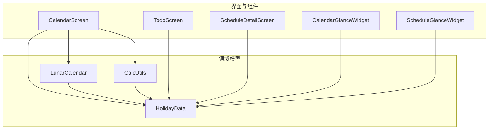
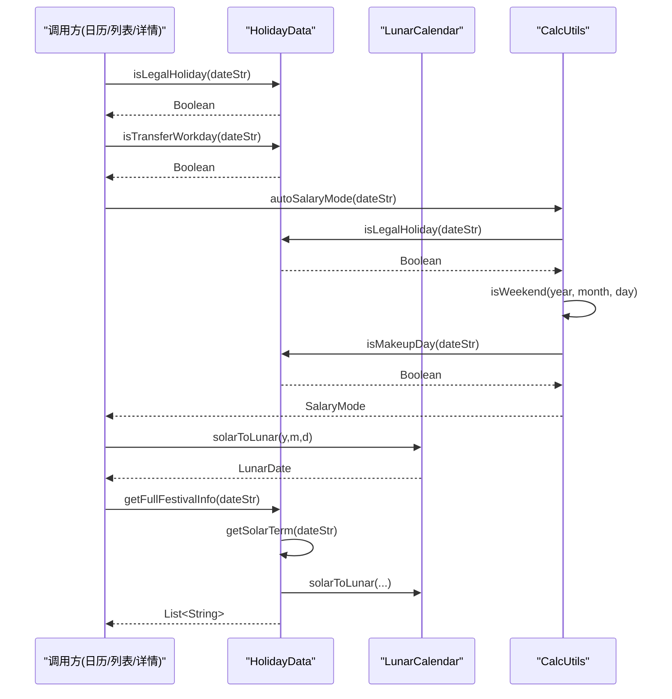
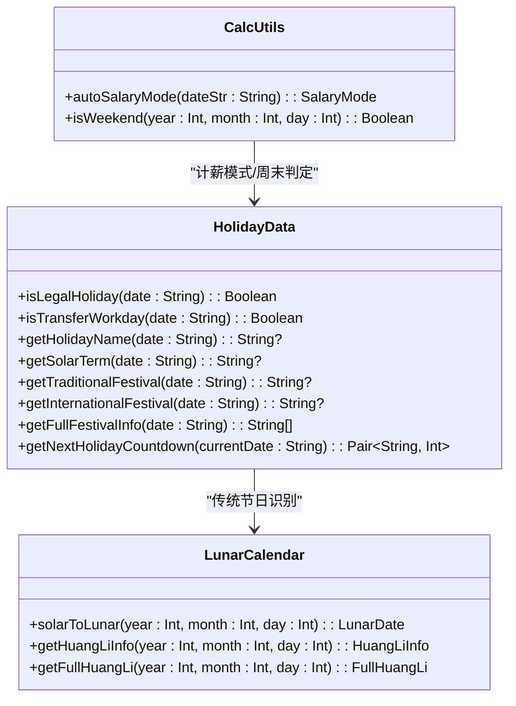
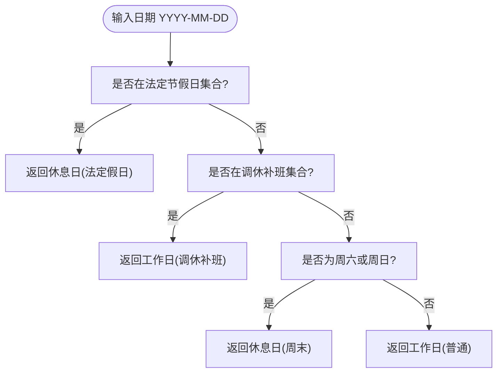
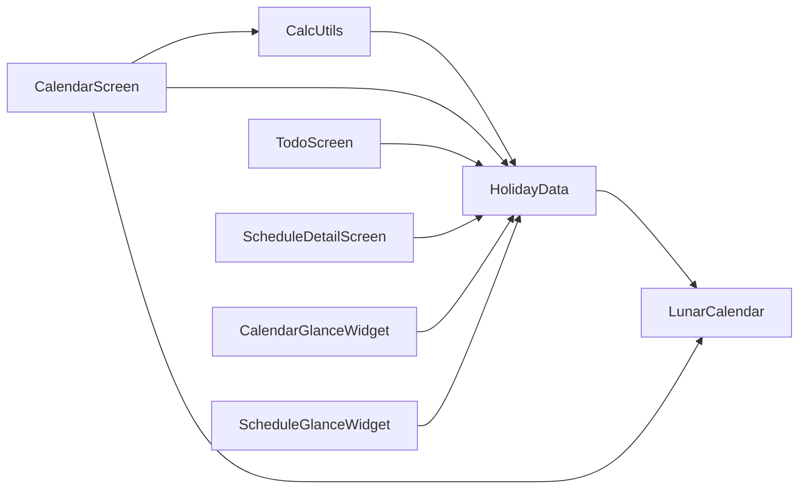

# 节假日数据管理

<cite>
**本文引用的文件**   
- [HolidayData.kt](file://app/src/main/java/com/schedulecalendar/app/domain/model/HolidayData.kt)
- [LunarCalendar.kt](file://app/src/main/java/com/schedulecalendar/app/domain/model/LunarCalendar.kt)
- [CalcUtils.kt](file://app/src/main/java/com/schedulecalendar/app/domain/model/CalcUtils.kt)
- [CalendarScreen.kt](file://app/src/main/java/com/schedulecalendar/app/ui/calendar/CalendarScreen.kt)
- [TodoScreen.kt](file://app/src/main/java/com/schedulecalendar/app/ui/todo/TodoScreen.kt)
- [ScheduleDetailScreen.kt](file://app/src/main/java/com/schedulecalendar/app/ui/detail/ScheduleDetailScreen.kt)
- [CalendarGlanceWidget.kt](file://app/src/main/java/com/schedulecalendar/app/widget/CalendarGlanceWidget.kt)
- [ScheduleGlanceWidget.kt](file://app/src/main/java/com/schedulecalendar/app/widget/ScheduleGlanceWidget.kt)
</cite>

## 目录
1. [简介](#简介)
2. [项目结构](#项目结构)
3. [核心组件](#核心组件)
4. [架构总览](#架构总览)
5. [详细组件分析](#详细组件分析)
6. [依赖关系分析](#依赖关系分析)
7. [性能与复杂度](#性能与复杂度)
8. [故障排查指南](#故障排查指南)
9. [结论](#结论)
10. [附录：使用示例](#附录使用示例)

## 简介
本文件围绕“节假日数据管理”展开，系统性说明节假日数据的结构定义、数据处理逻辑与管理机制。重点覆盖以下方面：
- 存储格式与数据结构：法定节假日、调休补班日、节气与传统节日、国际节日的表示方式与来源
- 数据验证规则：日期格式校验、名称映射一致性、周末与调休冲突处理
- 更新策略与版本管理：内置年份范围、预估数据标注、扩展点建议
- 工作日与休息日判断算法：法定假日优先、调休补班优先级、周末判定
- 与排班系统的集成：自动计薪模式、工时分类、UI 展示联动
- 查询与处理示例：倒计时、完整节日信息、列表聚合等

## 项目结构
节假日相关能力集中在领域模型层（domain.model），由 UI 层与计算工具类共同消费：
- 领域模型
  - HolidayData：法定节假日、调休补班、节气、传统节日与国际节日的数据与查询接口
  - LunarCalendar：公历与农历转换、黄历信息、干支生肖等
  - CalcUtils：工时与薪资计算，包含自动计薪模式与周末判定
- UI 与组件
  - CalendarScreen：日历渲染，结合节假日与调休进行高亮与显示
  - TodoScreen：节假日列表聚合与按月分组展示
  - ScheduleDetailScreen：单日详情中显示节假日名称
  - Widget 组件：桌面小组件读取节假日并展示

图表来源
- [HolidayData.kt:1-636](file://app/src/main/java/com/schedulecalendar/app/domain/model/HolidayData.kt#L1-L636)
- [LunarCalendar.kt:1-418](file://app/src/main/java/com/schedulecalendar/app/domain/model/LunarCalendar.kt#L1-L418)
- [CalcUtils.kt:1-536](file://app/src/main/java/com/schedulecalendar/app/domain/model/CalcUtils.kt#L1-L536)
- [CalendarScreen.kt:370-430](file://app/src/main/java/com/schedulecalendar/app/ui/calendar/CalendarScreen.kt#L370-L430)
- [TodoScreen.kt:1438-1508](file://app/src/main/java/com/schedulecalendar/app/ui/todo/TodoScreen.kt#L1438-L1508)
- [ScheduleDetailScreen.kt:70-80](file://app/src/main/java/com/schedulecalendar/app/ui/detail/ScheduleDetailScreen.kt#L70-L80)
- [CalendarGlanceWidget.kt:180-230](file://app/src/main/java/com/schedulecalendar/app/widget/CalendarGlanceWidget.kt#L180-L230)
- [ScheduleGlanceWidget.kt:140-160](file://app/src/main/java/com/schedulecalendar/app/widget/ScheduleGlanceWidget.kt#L140-L160)

章节来源
- [HolidayData.kt:1-636](file://app/src/main/java/com/schedulecalendar/app/domain/model/HolidayData.kt#L1-L636)
- [LunarCalendar.kt:1-418](file://app/src/main/java/com/schedulecalendar/app/domain/model/LunarCalendar.kt#L1-L418)
- [CalcUtils.kt:1-536](file://app/src/main/java/com/schedulecalendar/app/domain/model/CalcUtils.kt#L1-L536)
- [CalendarScreen.kt:370-430](file://app/src/main/java/com/schedulecalendar/app/ui/calendar/CalendarScreen.kt#L370-L430)
- [TodoScreen.kt:1438-1508](file://app/src/main/java/com/schedulecalendar/app/ui/todo/TodoScreen.kt#L1438-L1508)
- [ScheduleDetailScreen.kt:70-80](file://app/src/main/java/com/schedulecalendar/app/ui/detail/ScheduleDetailScreen.kt#L70-L80)
- [CalendarGlanceWidget.kt:180-230](file://app/src/main/java/com/schedulecalendar/app/widget/CalendarGlanceWidget.kt#L180-L230)
- [ScheduleGlanceWidget.kt:140-160](file://app/src/main/java/com/schedulecalendar/app/widget/ScheduleGlanceWidget.kt#L140-L160)

## 核心组件
- HolidayData
  - 提供法定节假日集合、调休补班集合、节气映射、传统节日与国际节日查询
  - 提供节假日名称精确匹配、下一个法定节假日倒计时、完整节日信息聚合
- LunarCalendar
  - 基于权威库实现公历转农历、干支生肖、黄历宜忌、时辰吉凶等
  - 为传统节日识别提供农历基础
- CalcUtils
  - 提供自动计薪模式推断（法定假日优先、周末次之、工作日默认）
  - 提供周末判定（考虑调休补班）与工时/薪资汇总

章节来源
- [HolidayData.kt:160-280](file://app/src/main/java/com/schedulecalendar/app/domain/model/HolidayData.kt#L160-L280)
- [HolidayData.kt:400-480](file://app/src/main/java/com/schedulecalendar/app/domain/model/HolidayData.kt#L400-L480)
- [LunarCalendar.kt:35-67](file://app/src/main/java/com/schedulecalendar/app/domain/model/LunarCalendar.kt#L35-L67)
- [CalcUtils.kt:499-522](file://app/src/main/java/com/schedulecalendar/app/domain/model/CalcUtils.kt#L499-L522)

## 架构总览
节假日数据在系统中扮演“权威事实源”，被多个模块消费：
- 日历渲染：根据是否法定假日与是否调休补班决定颜色与标签
- 计薪与工时：按法定假日/周末/工作日分类统计
- 列表与详情：展示节假日名称、倒计时、完整节日信息
- 小组件：快速查看今日是否为法定假日及名称

图表来源
- [CalendarScreen.kt:396-422](file://app/src/main/java/com/schedulecalendar/app/ui/calendar/CalendarScreen.kt#L396-L422)
- [CalcUtils.kt:499-522](file://app/src/main/java/com/schedulecalendar/app/domain/model/CalcUtils.kt#L499-L522)
- [HolidayData.kt:406-480](file://app/src/main/java/com/schedulecalendar/app/domain/model/HolidayData.kt#L406-L480)
- [LunarCalendar.kt:35-67](file://app/src/main/java/com/schedulecalendar/app/domain/model/LunarCalendar.kt#L35-L67)

## 详细组件分析

### 节假日数据结构与存储格式
- 法定节假日
  - 以字符串集合形式存储，键为“YYYY-MM-DD”
  - 覆盖 2024-2030 年，其中 2024-2026 为官方数据，2027-2030 为预估
- 调休补班工作日
  - 同样以“YYYY-MM-DD”集合存储，用于将周末标记为工作日
- 节假日名称映射
  - 以“YYYY-MM-DD -> 名称”的映射表存储，支持精确到日的名称查询
  - 补班日名称采用“节假日名+补班”的约定
- 二十四节气
  - 以“YYYY-MM-DD -> 节气名”的映射表存储，覆盖 2024-2030
- 传统节日与国际节日
  - 传统节日通过农历日期匹配（如正月初一为春节）
  - 国际节日通过公历月日匹配（如 10-01 国庆节）

图表来源
- [HolidayData.kt:160-280](file://app/src/main/java/com/schedulecalendar/app/domain/model/HolidayData.kt#L160-L280)
- [HolidayData.kt:406-480](file://app/src/main/java/com/schedulecalendar/app/domain/model/HolidayData.kt#L406-L480)
- [LunarCalendar.kt:35-67](file://app/src/main/java/com/schedulecalendar/app/domain/model/LunarCalendar.kt#L35-L67)
- [CalcUtils.kt:499-522](file://app/src/main/java/com/schedulecalendar/app/domain/model/CalcUtils.kt#L499-L522)

章节来源
- [HolidayData.kt:16-169](file://app/src/main/java/com/schedulecalendar/app/domain/model/HolidayData.kt#L16-L169)
- [HolidayData.kt:180-277](file://app/src/main/java/com/schedulecalendar/app/domain/model/HolidayData.kt#L180-L277)
- [HolidayData.kt:289-399](file://app/src/main/java/com/schedulecalendar/app/domain/model/HolidayData.kt#L289-L399)
- [HolidayData.kt:542-604](file://app/src/main/java/com/schedulecalendar/app/domain/model/HolidayData.kt#L542-L604)
- [LunarCalendar.kt:35-67](file://app/src/main/java/com/schedulecalendar/app/domain/model/LunarCalendar.kt#L35-L67)

### 数据处理逻辑与算法

#### 工作日与休息日判断
- 法定假日优先：若日期在法定节假日集合中，则视为休息日
- 调休补班优先：若日期在调休补班集合中，则视为工作日（即使为周六或周日）
- 周末判定：非调休补班的周六/周日视为休息日
- 自动计薪模式：法定假日 → 加班费率；周末 → 加班费率；工作日 → 正常/加班

图表来源
- [CalcUtils.kt:499-522](file://app/src/main/java/com/schedulecalendar/app/domain/model/CalcUtils.kt#L499-L522)
- [CalendarScreen.kt:396-422](file://app/src/main/java/com/schedulecalendar/app/ui/calendar/CalendarScreen.kt#L396-L422)

章节来源
- [CalcUtils.kt:499-522](file://app/src/main/java/com/schedulecalendar/app/domain/model/CalcUtils.kt#L499-L522)
- [CalendarScreen.kt:396-422](file://app/src/main/java/com/schedulecalendar/app/ui/calendar/CalendarScreen.kt#L396-L422)

#### 调休日识别逻辑
- 调休补班日集合直接命中即视为工作日
- 名称映射中补班日以“节假日名+补班”区分，便于展示与筛选
- 周末判定函数在计算前会先检查是否为补班日，避免误判

章节来源
- [HolidayData.kt:142-169](file://app/src/main/java/com/schedulecalendar/app/domain/model/HolidayData.kt#L142-L169)
- [HolidayData.kt:180-277](file://app/src/main/java/com/schedulecalendar/app/domain/model/HolidayData.kt#L180-L277)
- [CalcUtils.kt:515-522](file://app/src/main/java/com/schedulecalendar/app/domain/model/CalcUtils.kt#L515-L522)

#### 节假日名称与完整节日信息
- 精确名称查询：按“YYYY-MM-DD”获取具体名称（含补班）
- 完整节日信息：合并节气、传统节日、国际节日，去重后返回
- 传统节日识别：基于农历日期（如正月初一、八月十五等）
- 国际节日识别：基于公历月日（如 10-01 国庆节）

章节来源
- [HolidayData.kt:279-280](file://app/src/main/java/com/schedulecalendar/app/domain/model/HolidayData.kt#L279-L280)
- [HolidayData.kt:611-634](file://app/src/main/java/com/schedulecalendar/app/domain/model/HolidayData.kt#L611-L634)
- [HolidayData.kt:542-604](file://app/src/main/java/com/schedulecalendar/app/domain/model/HolidayData.kt#L542-L604)

#### 节假日倒计时
- 针对法定假日集合，计算距离下一个法定假日的天数
- 当天即为法定假日时返回天数为 0
- 跨年查找下一年的代表日期，确保结果正确

章节来源
- [HolidayData.kt:422-480](file://app/src/main/java/com/schedulecalendar/app/domain/model/HolidayData.kt#L422-L480)

### 与排班系统的集成与数据同步
- 日历渲染
  - 使用 isLegalHoliday 与 isTransferWorkday 决定单元格是否高亮为法定假日或周末
  - 首个法定假日日期使用特殊颜色标识
- 计薪与工时
  - autoSalaryMode 依据法定假日与周末自动选择计薪模式
  - calcDayHours 与 calcMonthHours 将工时按类型汇总
- 详情与列表
  - 详情页显示节假日名称
  - 列表页聚合法定、节气、传统、国际节日并按月分组

章节来源
- [CalendarScreen.kt:396-422](file://app/src/main/java/com/schedulecalendar/app/ui/calendar/CalendarScreen.kt#L396-L422)
- [CalendarScreen.kt:679-690](file://app/src/main/java/com/schedulecalendar/app/ui/calendar/CalendarScreen.kt#L679-L690)
- [CalcUtils.kt:499-522](file://app/src/main/java/com/schedulecalendar/app/domain/model/CalcUtils.kt#L499-L522)
- [ScheduleDetailScreen.kt:76-76](file://app/src/main/java/com/schedulecalendar/app/ui/detail/ScheduleDetailScreen.kt#L76-L76)
- [TodoScreen.kt:1438-1508](file://app/src/main/java/com/schedulecalendar/app/ui/todo/TodoScreen.kt#L1438-L1508)

### 版本管理与迁移策略
- 内置年份范围：2024-2030
- 数据来源标注：2024-2026 为国务院官方数据；2027-2030 为预估，需以官方公告为准
- 更新策略建议
  - 新增年份：在法定节假日集合、调休补班集合、名称映射、节气映射中追加新一年度条目
  - 预估修正：当官方公告发布后，替换对应年份的预估数据
  - 向后兼容：保持“YYYY-MM-DD”键格式不变，确保 UI 与计算逻辑无需改动
- 迁移注意事项
  - 名称映射需与小程序 calendar.ts 完全对齐，避免跨端不一致
  - 节气数据来源于权威天文台，更新时需核对日期准确性

章节来源
- [HolidayData.kt:1-15](file://app/src/main/java/com/schedulecalendar/app/domain/model/HolidayData.kt#L1-L15)
- [HolidayData.kt:16-169](file://app/src/main/java/com/schedulecalendar/app/domain/model/HolidayData.kt#L16-L169)
- [HolidayData.kt:289-399](file://app/src/main/java/com/schedulecalendar/app/domain/model/HolidayData.kt#L289-L399)

## 依赖关系分析
- 低耦合设计
  - HolidayData 作为纯数据与查询工具，不持有状态，易于测试与替换
  - CalcUtils 仅依赖 HolidayData 的布尔判断与名称查询，职责清晰
  - UI 层通过静态方法访问，无全局单例污染
- 外部依赖
  - LunarCalendar 依赖 tyme4j 库，保证农历与黄历计算的权威性
- 潜在风险
  - 硬编码数据量大，维护成本随年份增长而上升
  - 名称映射与小程序侧需严格同步，否则出现展示差异

图表来源
- [HolidayData.kt:1-636](file://app/src/main/java/com/schedulecalendar/app/domain/model/HolidayData.kt#L1-L636)
- [LunarCalendar.kt:1-418](file://app/src/main/java/com/schedulecalendar/app/domain/model/LunarCalendar.kt#L1-L418)
- [CalcUtils.kt:1-536](file://app/src/main/java/com/schedulecalendar/app/domain/model/CalcUtils.kt#L1-L536)
- [CalendarScreen.kt:370-430](file://app/src/main/java/com/schedulecalendar/app/ui/calendar/CalendarScreen.kt#L370-L430)
- [TodoScreen.kt:1438-1508](file://app/src/main/java/com/schedulecalendar/app/ui/todo/TodoScreen.kt#L1438-L1508)
- [ScheduleDetailScreen.kt:70-80](file://app/src/main/java/com/schedulecalendar/app/ui/detail/ScheduleDetailScreen.kt#L70-L80)
- [CalendarGlanceWidget.kt:180-230](file://app/src/main/java/com/schedulecalendar/app/widget/CalendarGlanceWidget.kt#L180-L230)
- [ScheduleGlanceWidget.kt:140-160](file://app/src/main/java/com/schedulecalendar/app/widget/ScheduleGlanceWidget.kt#L140-L160)

章节来源
- [HolidayData.kt:1-636](file://app/src/main/java/com/schedulecalendar/app/domain/model/HolidayData.kt#L1-L636)
- [LunarCalendar.kt:1-418](file://app/src/main/java/com/schedulecalendar/app/domain/model/LunarCalendar.kt#L1-L418)
- [CalcUtils.kt:1-536](file://app/src/main/java/com/schedulecalendar/app/domain/model/CalcUtils.kt#L1-L536)
- [CalendarScreen.kt:370-430](file://app/src/main/java/com/schedulecalendar/app/ui/calendar/CalendarScreen.kt#L370-L430)
- [TodoScreen.kt:1438-1508](file://app/src/main/java/com/schedulecalendar/app/ui/todo/TodoScreen.kt#L1438-L1508)
- [ScheduleDetailScreen.kt:70-80](file://app/src/main/java/com/schedulecalendar/app/ui/detail/ScheduleDetailScreen.kt#L70-L80)
- [CalendarGlanceWidget.kt:180-230](file://app/src/main/java/com/schedulecalendar/app/widget/CalendarGlanceWidget.kt#L180-L230)
- [ScheduleGlanceWidget.kt:140-160](file://app/src/main/java/com/schedulecalendar/app/widget/ScheduleGlanceWidget.kt#L140-L160)

## 性能与复杂度
- 时间复杂度
  - isLegalHoliday/isTransferWorkday/getHolidayName：O(1) 哈希集合/映射查找
  - getNextHolidayCountdown：遍历法定假日名称与两年内的代表日期，近似 O(N)，N 为法定假日数量
  - getFullFestivalInfo：调用节气、传统、国际节日查询，常数级开销
- 空间复杂度
  - 主要占用为静态集合与映射，内存占用稳定
- 优化建议
  - 对高频调用场景可引入缓存（如最近 N 天的结果）
  - 列表页聚合时可预计算月份分组，减少重复解析

[本节为通用性能讨论，不直接分析具体文件]

## 故障排查指南
- 常见问题
  - 名称不一致：确认名称映射与小程序侧 calendar.ts 完全一致
  - 调休误判：检查 isMakeupDay 与 isTransferWorkday 的集合是否包含目标日期
  - 节气错误：核对节气映射中的日期是否与权威来源一致
- 定位步骤
  - 打印 isLegalHoliday/isTransferWorkday 的结果
  - 使用 getFullFestivalInfo 输出当日所有节日信息
  - 对比 CalendarScreen 与 CalcUtils 的周末判定逻辑

章节来源
- [HolidayData.kt:160-280](file://app/src/main/java/com/schedulecalendar/app/domain/model/HolidayData.kt#L160-L280)
- [HolidayData.kt:406-480](file://app/src/main/java/com/schedulecalendar/app/domain/model/HolidayData.kt#L406-L480)
- [CalendarScreen.kt:396-422](file://app/src/main/java/com/schedulecalendar/app/ui/calendar/CalendarScreen.kt#L396-L422)
- [CalcUtils.kt:499-522](file://app/src/main/java/com/schedulecalendar/app/domain/model/CalcUtils.kt#L499-L522)

## 结论
节假日数据管理以集中式、静态化的方式提供权威数据与查询接口，配合 UI 与计算工具形成完整的排班与计薪体系。通过明确的优先级规则（法定假日 > 调休补班 > 周末 > 工作日），系统实现了准确的日期分类与展示。未来可通过版本化数据与增量更新策略提升可维护性，同时保持与小程序侧的一致性。

[本节为总结，不直接分析具体文件]

## 附录：使用示例
- 查询某日是否为法定假日
  - 调用路径：HolidayData.isLegalHoliday("YYYY-MM-DD")
  - 参考位置：[HolidayData.kt:170-172](file://app/src/main/java/com/schedulecalendar/app/domain/model/HolidayData.kt#L170-L172)
- 查询某日是否为调休补班
  - 调用路径：HolidayData.isTransferWorkday("YYYY-MM-DD")
  - 参考位置：[HolidayData.kt:171-174](file://app/src/main/java/com/schedulecalendar/app/domain/model/HolidayData.kt#L171-L174)
- 获取某日节假日名称
  - 调用路径：HolidayData.getHolidayName("YYYY-MM-DD")
  - 参考位置：[HolidayData.kt:279-280](file://app/src/main/java/com/schedulecalendar/app/domain/model/HolidayData.kt#L279-L280)
- 获取完整节日信息（节气+传统+国际）
  - 调用路径：HolidayData.getFullFestivalInfo("YYYY-MM-DD")
  - 参考位置：[HolidayData.kt:611-634](file://app/src/main/java/com/schedulecalendar/app/domain/model/HolidayData.kt#L611-L634)
- 计算下一个法定假日倒计时
  - 调用路径：HolidayData.getNextHolidayCountdown("YYYY-MM-DD")
  - 参考位置：[HolidayData.kt:422-480](file://app/src/main/java/com/schedulecalendar/app/domain/model/HolidayData.kt#L422-L480)
- 自动计薪模式推断
  - 调用路径：CalcUtils.autoSalaryMode("YYYY-MM-DD")
  - 参考位置：[CalcUtils.kt:499-509](file://app/src/main/java/com/schedulecalendar/app/domain/model/CalcUtils.kt#L499-L509)
- 周末判定（考虑调休）
  - 调用路径：CalcUtils.isWeekend(year, month, day)
  - 参考位置：[CalcUtils.kt:515-522](file://app/src/main/java/com/schedulecalendar/app/domain/model/CalcUtils.kt#L515-L522)
- 日历展示联动
  - 参考位置：[CalendarScreen.kt:396-422](file://app/src/main/java/com/schedulecalendar/app/ui/calendar/CalendarScreen.kt#L396-L422)
- 列表聚合展示
  - 参考位置：[TodoScreen.kt:1438-1508](file://app/src/main/java/com/schedulecalendar/app/ui/todo/TodoScreen.kt#L1438-L1508)
- 详情页显示节假日名称
  - 参考位置：[ScheduleDetailScreen.kt:76-76](file://app/src/main/java/com/schedulecalendar/app/ui/detail/ScheduleDetailScreen.kt#L76-L76)
- 小组件展示
  - 参考位置：[CalendarGlanceWidget.kt:187-228](file://app/src/main/java/com/schedulecalendar/app/widget/CalendarGlanceWidget.kt#L187-L228), [ScheduleGlanceWidget.kt:149-150](file://app/src/main/java/com/schedulecalendar/app/widget/ScheduleGlanceWidget.kt#L149-L150)