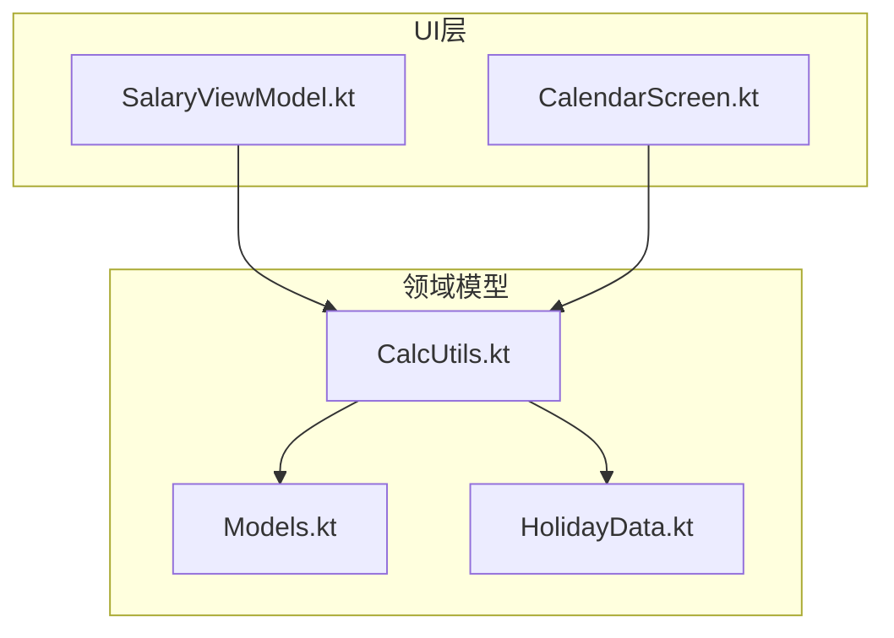
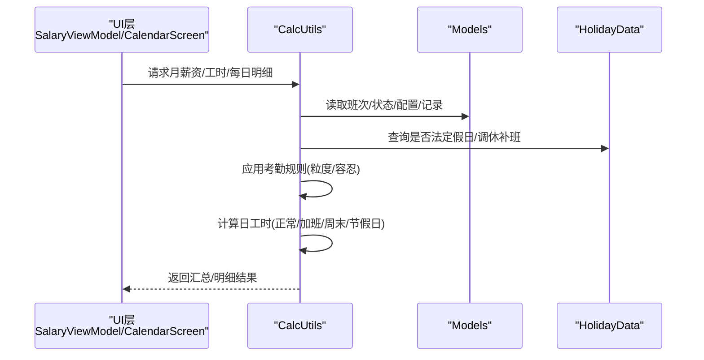
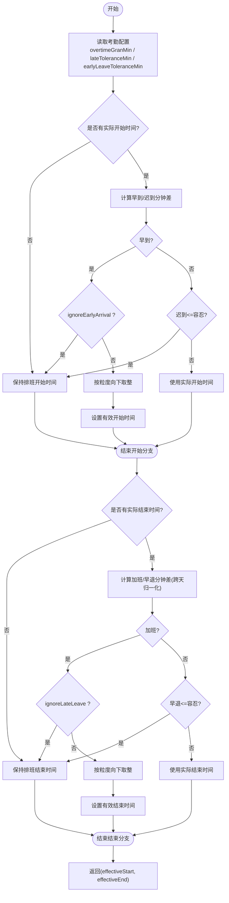
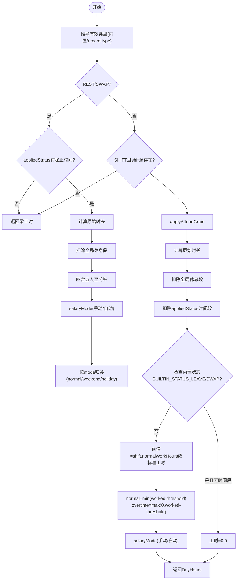
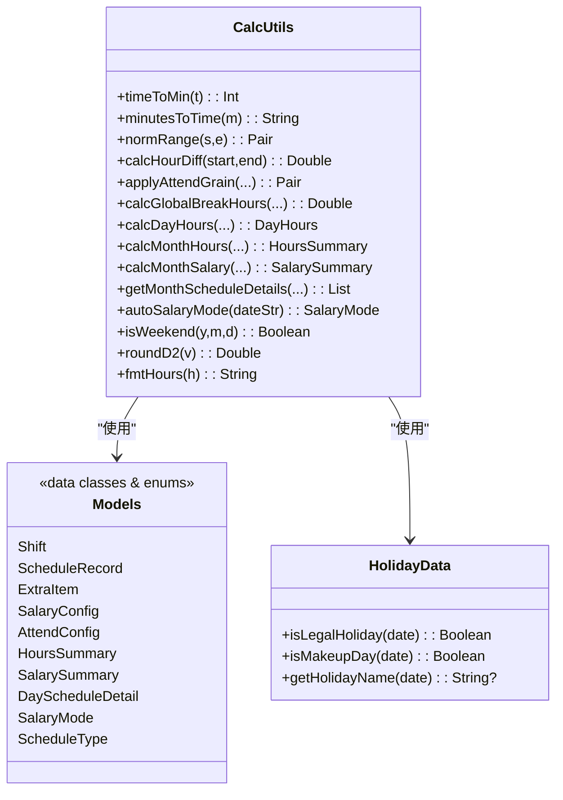

# 计算工具类

<cite>
**本文引用的文件**   
- [CalcUtils.kt](file://app/src/main/java/com/schedulecalendar/app/domain/model/CalcUtils.kt)
- [Models.kt](file://app/src/main/java/com/schedulecalendar/app/domain/model/Models.kt)
- [HolidayData.kt](file://app/src/main/java/com/schedulecalendar/app/domain/model/HolidayData.kt)
- [SalaryViewModel.kt](file://app/src/main/java/com/schedulecalendar/app/ui/salary/SalaryViewModel.kt)
- [CalendarScreen.kt](file://app/src/main/java/com/schedulecalendar/app/ui/calendar/CalendarScreen.kt)
</cite>

## 更新摘要
**所做更改**   
- 增强了时间计算逻辑，新增对BUILTIN_STATUS_LEAVE和BUILTIN_STATUS_SWAP的全天覆盖智能检测
- 改进了REST/SWAP内置班次的处理逻辑，支持空时间段选择时的零工时计算
- 优化了月工时统计中请假/调休状态的完整班次覆盖判断
- 提升了请假折算算法的准确性，支持智能识别全天请假场景
- **新增**：空值安全改进，将 != null 检查替换为 !isNullOrEmpty() 比较，增强空字符串值的处理逻辑

## 目录
1. [简介](#简介)
2. [项目结构](#项目结构)
3. [核心组件](#核心组件)
4. [架构总览](#架构总览)
5. [详细组件分析](#详细组件分析)
6. [依赖关系分析](#依赖关系分析)
7. [性能与复杂度](#性能与复杂度)
8. [精度控制与边界条件](#精度控制与边界条件)
9. [典型场景与示例](#典型场景与示例)
10. [故障排查指南](#故障排查指南)
11. [结论](#结论)

## 简介
本文件围绕"计算工具类"展开，聚焦工时计算、薪资核算、时间处理等核心算法。内容涵盖：
- 加班计算逻辑（早到/晚退的粒度取整、容忍时长）
- 薪资计算公式（正常/加班/周末/节假日时薪及补贴扣款）
- 时间差计算方法（支持跨天）
- 各类计算场景（正常工时、加班工时、周末和节假日）
- 计算精度控制、边界条件与异常处理
- 性能优化策略与算法复杂度分析
- 具体计算示例与测试用例建议

**最新更新**：工作小时计算逻辑完全重构，新增了对BUILTIN_STATUS_LEAVE和BUILTIN_STATUS_SWAP的智能检测，当用户申请全天请假或调休未指定时间段时自动设置工作时间为0.0。改进了REST/SWAP内置班次的处理逻辑，支持空时间段选择。增强了月工时统计中请假/调休状态的完整班次覆盖判断，防止错误的小时计算。**新增空值安全改进**：将传统的 != null 检查替换为 !isNullOrEmpty() 比较，确保空字符串值被正确识别为缺失数据而非有效时间戳，显著提升了系统的健壮性。

## 项目结构
计算相关代码集中在领域模型层与UI层的调用点：
- 领域模型层
  - CalcUtils.kt：全部计算逻辑（时间工具、考勤规则、工时分类、月统计、薪资汇总、每日明细）
  - Models.kt：数据模型与枚举（班次、状态、附加项、配置、汇总结果等）
  - HolidayData.kt：法定节假日与调休补班数据、节气与传统节日信息
- UI层调用点
  - SalaryViewModel.kt：薪资页加载与计算入口
  - CalendarScreen.kt：日历展示中引用格式化方法与部分预览数据

**图表来源**
- [CalcUtils.kt:16-557](file://app/src/main/java/com/schedulecalendar/app/domain/model/CalcUtils.kt#L16-L557)
- [Models.kt:1-278](file://app/src/main/java/com/schedulecalendar/app/domain/model/Models.kt#L1-L278)
- [HolidayData.kt:1-636](file://app/src/main/java/com/schedulecalendar/app/domain/model/HolidayData.kt#L1-L636)
- [SalaryViewModel.kt:90-132](file://app/src/main/java/com/schedulecalendar/app/ui/salary/SalaryViewModel.kt#L90-L132)
- [CalendarScreen.kt:730-741](file://app/src/main/java/com/schedulecalendar/app/ui/calendar/CalendarScreen.kt#L730-L741)

## 核心组件
- 时间工具
  - HH:mm 与分钟数互转、跨天归一化、小时差计算
- 考勤规则
  - applyAttendGrain：根据粒度与容忍时长将实际打卡映射为有效计算时间
- 全局休息段扣减
  - calcGlobalBreakHours：计算全局不计入时段与班次窗口的重叠时长
- 日工时计算
  - calcDayHours：按日期类型自动分类（工作日/周末/节假日），并考虑请假/调休/休息内置类型
- 月工时统计
  - calcMonthHours：汇总当月正常/加班/周末/节假日工时、迟到早退次数、请假折算天数等
- 月薪资统计
  - calcMonthSalary：基于日工时×对应时薪，叠加补贴/扣款、社保公积金，得到实发工资
- 每日明细
  - getMonthScheduleDetails：生成每日工时与薪资明细，用于工时/薪资页展示
- 周末/节假日判断
  - autoSalaryMode/isWeekend：结合法定假日与调休补班数据推断计薪方式

**章节来源**
- [CalcUtils.kt:16-557](file://app/src/main/java/com/schedulecalendar/app/domain/model/CalcUtils.kt#L16-L557)
- [Models.kt:1-278](file://app/src/main/java/com/schedulecalendar/app/domain/model/Models.kt#L1-L278)
- [HolidayData.kt:1-636](file://app/src/main/java/com/schedulecalendar/app/domain/model/HolidayData.kt#L1-L636)

## 架构总览
计算流程从UI层触发，进入领域层进行数据处理与聚合，最终返回结构化结果供展示或进一步使用。

**图表来源**
- [SalaryViewModel.kt:90-132](file://app/src/main/java/com/schedulecalendar/app/ui/salary/SalaryViewModel.kt#L90-L132)
- [CalcUtils.kt:343-423](file://app/src/main/java/com/schedulecalendar/app/domain/model/CalcUtils.kt#L343-L423)
- [Models.kt:1-278](file://app/src/main/java/com/schedulecalendar/app/domain/model/Models.kt#L1-L278)
- [HolidayData.kt:171-174](file://app/src/main/java/com/schedulecalendar/app/domain/model/HolidayData.kt#L171-L174)

## 详细组件分析

### 时间处理与精度控制
- 时间转换与差值
  - HH:mm 解析为分钟数；分钟数回转为HH:mm，并对1440取模以支持跨天
  - 小时差计算支持跨天，空参返回0
- 精度控制
  - 统一保留两位小数（roundD2）
  - 显示格式化为最多一位小数（fmtHours）

**章节来源**
- [CalcUtils.kt:21-50](file://app/src/main/java/com/schedulecalendar/app/domain/model/CalcUtils.kt#L21-L50)
- [CalcUtils.kt:548-554](file://app/src/main/java/com/schedulecalendar/app/domain/model/CalcUtils.kt#L548-L554)

### 考勤规则与加班计算
- 早到/迟到处理
  - 早到：按 overtimeGranMin 向下取整，仅达到粒度的倍数才计入早来加班；可忽略
  - 迟到：在 lateToleranceMin 内视为准点，超出则按实际打卡时间
- 晚退/早退处理
  - 晚退：按 overtimeGranMin 向下取整，仅达到粒度的倍数才计入加班；可忽略
  - 早退：在 earlyLeaveToleranceMin 内视为准点，超出则按实际打卡时间
- 输出
  - 返回 effectiveStart/effectiveEnd，作为后续工时计算的输入

**图表来源**
- [CalcUtils.kt:61-113](file://app/src/main/java/com/schedulecalendar/app/domain/model/CalcUtils.kt#L61-L113)

**章节来源**
- [CalcUtils.kt:61-113](file://app/src/main/java/com/schedulecalendar/app/domain/model/CalcUtils.kt#L61-L113)

### 全局休息段扣减
- 计算目标：对班次窗口与全局休息段的重叠时长求和（支持跨天）
- 方法：normRange 归一化后，分别计算当日与次日偏移的重叠区间，累加分钟再换算为小时

**章节来源**
- [CalcUtils.kt:121-134](file://app/src/main/java/com/schedulecalendar/app/domain/model/CalcUtils.kt#L121-134)

### 日工时计算与分类（已更新）
**更新**：工作小时计算逻辑完全重构，新增了对BUILTIN_STATUS_LEAVE和BUILTIN_STATUS_SWAP的智能检测

- 内置类型推导
  - 通过 shiftId 映射为 LEAVE/SWAP/REST，否则使用 record.type
- 休息/调休增强处理
  - 若存在 appliedStatus 时间段，按该时间段计算工时并按 salaryMode 分类
  - **新增**：当用户申请全天请假或调休未指定时间段时，自动设置工作时间为0.0
- 普通班次
  - 先应用考勤规则，再扣除全局休息段与已应用状态时间段
  - **新增**：智能检测BUILTIN_STATUS_LEAVE和BUILTIN_STATUS_SWAP，当为空时间段时直接返回零工时
  - 按 threshold（shift.normalWorkHours 或 attendConfig.normalWorkHoursPerDay）划分正常/加班
  - 按 salaryMode 分类为 NORMAL/WEEKEND/HOLIDAY
- 自动模式
  - autoSalaryMode 优先法定假日，其次周末（考虑调休补班），最后工作日

**图表来源**
- [CalcUtils.kt:148-234](file://app/src/main/java/com/schedulecalendar/app/domain/model/CalcUtils.kt#L148-234)
- [CalcUtils.kt:205-213](file://app/src/main/java/com/schedulecalendar/app/domain/model/CalcUtils.kt#L205-213)

**章节来源**
- [CalcUtils.kt:148-234](file://app/src/main/java/com/schedulecalendar/app/domain/model/CalcUtils.kt#L148-234)

### 月工时统计（已更新）
**更新**：改进了REST/SWAP内置班次的处理逻辑，支持空时间段选择

- 遍历当月排班记录，累计 normal/overtime/weekend/holiday 工时
- 统计迟到/早退次数（仅普通班次）
- **新增**：智能检测内置请假/调休状态，当无时间段时按日标准工时计入
- **新增**：完整班次覆盖检测，当请假/调休时间段完全覆盖班次时间时，按日标准工时计算
- 请假折算：完整请假天 × 标准工时 + 附加状态请假小时 → 折算天数与剩余小时
- 返回 HoursSummary

**章节来源**
- [CalcUtils.kt:238-361](file://app/src/main/java/com/schedulecalendar/app/domain/model/CalcUtils.kt#L238-361)
- [Models.kt:226-240](file://app/src/main/java/com/schedulecalendar/app/domain/model/Models.kt#L226-240)

### 月薪资统计
- 日维度：按 DayHours × 对应时薪（normalRate/overtimeRate/weekendRate/holidayRate）
- 附加项：allowance/deduction 累加
- 迟到/早退扣款：按分钟费率（lateDeductionPerMin/earlyLeaveDeductionPerMin）
- 最终：baseSalary + basePerformance + 各分项 + 补贴 - 扣款 - 社保 - 公积金 = totalSalary
- 返回 SalarySummary

**章节来源**
- [CalcUtils.kt:365-444](file://app/src/main/java/com/schedulecalendar/app/domain/model/CalcUtils.kt#L365-444)
- [Models.kt:258-270](file://app/src/main/java/com/schedulecalendar/app/domain/model/Models.kt#L258-270)

### 每日明细
- 生成当月每日的 DayScheduleDetail：包含工时、薪资、附加项
- 日历显示：周末/节假日工时统一归类为加班工时（overtimeHours 合并 weekend/holiday）
- 薪资显示：normalSalary 与 overtimeSalary（后者含周末/节假日）

**章节来源**
- [CalcUtils.kt:448-486](file://app/src/main/java/com/schedulecalendar/app/domain/model/CalcUtils.kt#L448-486)
- [CalendarScreen.kt:730-741](file://app/src/main/java/com/schedulecalendar/app/ui/calendar/CalendarScreen.kt#L730-L741)

## 依赖关系分析
- CalcUtils 依赖
  - Models：所有数据模型与枚举
  - HolidayData：法定假日与调休补班判定
- UI 层依赖
  - SalaryViewModel：调用 CalcUtils 完成薪资计算与明细生成
  - CalendarScreen：使用 CalcUtils 的格式化方法

**图表来源**
- [CalcUtils.kt:16-557](file://app/src/main/java/com/schedulecalendar/app/domain/model/CalcUtils.kt#L16-L557)
- [Models.kt:1-278](file://app/src/main/java/com/schedulecalendar/app/domain/model/Models.kt#L1-L278)
- [HolidayData.kt:171-174](file://app/src/main/java/com/schedulecalendar/app/domain/model/HolidayData.kt#L171-L174)

**章节来源**
- [CalcUtils.kt:16-557](file://app/src/main/java/com/schedulecalendar/app/domain/model/CalcUtils.kt#L16-L557)
- [Models.kt:1-278](file://app/src/main/java/com/schedulecalendar/app/domain/model/Models.kt#L1-L278)
- [HolidayData.kt:171-174](file://app/src/main/java/com/schedulecalendar/app/domain/model/HolidayData.kt#L171-L174)

## 性能与复杂度
- 时间复杂度
  - calcDayHours：O(1)，主要操作为常数时间的算术与查找
  - calcMonthHours/calcMonthSalary/getMonthScheduleDetails：O(N)，N为当月排班记录数量
- 空间复杂度
  - 均为 O(1) 额外空间（除返回结果集合外）
- 性能优化建议
  - 批量计算前预过滤月份前缀，避免无效遍历
  - 对 breaks 列表做缓存（若频繁重复使用）
  - 对 shifts 列表建立 ID→对象索引，减少 find 开销
  - 对 HolidayData 的 isLegalHoliday/isMakeupDay 使用哈希集合（已实现）

## 精度控制与边界条件（已更新）
- 精度控制
  - roundD2：保留两位小数，避免浮点误差累积
  - fmtHours：显示最多一位小数，整数去尾零
- 边界条件
  - 空参处理：calcHourDiff 空参返回0
  - 跨天处理：normRange 与 minutesToTime 均对1440取模
  - 休息段重叠：同时考虑当日与次日偏移，防止漏算
  - 请假折算：当标准工时为0时，折算天数按0处理，避免除零
  - **新增**：内置请假/调休无时间段时，工时直接设为0.0
  - **新增**：完整班次覆盖检测，防止错误的小时计算
- 异常情况
  - 缺失 shiftId 或空时间：返回零工时
  - 未找到匹配 shift/status：跳过或返回默认值
  - **新增**：BUILTIN_STATUS_LEAVE/SWAP 智能检测失败时，降级处理
- **空值安全改进**
  - 将传统的 != null 检查替换为 !isNullOrEmpty() 比较
  - 使用 takeIf { !it.isNullOrEmpty() } 进行空字符串处理
  - 确保空字符串值被正确识别为缺失数据而非有效时间戳
  - 在多个关键位置增强了空值安全检查，提升系统健壮性

**章节来源**
- [CalcUtils.kt:40-50](file://app/src/main/java/com/schedulecalendar/app/domain/model/CalcUtils.kt#L40-L50)
- [CalcUtils.kt:121-134](file://app/src/main/java/com/schedulecalendar/app/domain/model/CalcUtils.kt#L121-134)
- [CalcUtils.kt:341-343](file://app/src/main/java/com/schedulecalendar/app/domain/model/CalcUtils.kt#L341-343)
- [CalcUtils.kt:548-554](file://app/src/main/java/com/schedulecalendar/app/domain/model/CalcUtils.kt#L548-L554)
- [CalcUtils.kt:205-213](file://app/src/main/java/com/schedulecalendar/app/domain/model/CalcUtils.kt#L205-213)
- [CalcUtils.kt:320-331](file://app/src/main/java/com/schedulecalendar/app/domain/model/CalcUtils.kt#L320-331)
- [CalcUtils.kt:168](file://app/src/main/java/com/schedulecalendar/app/domain/model/CalcUtils.kt#L168)
- [CalcUtils.kt:190-192](file://app/src/main/java/com/schedulecalendar/app/domain/model/CalcUtils.kt#L190-L192)
- [CalcUtils.kt:291](file://app/src/main/java/com/schedulecalendar/app/domain/model/CalcUtils.kt#L291)

## 典型场景与示例（已更新）

### 场景A：正常工作日+标准8小时
- 输入
  - 排班：08:00-17:00
  - 实际打卡：08:05-17:00
  - 考勤：overtimeGranMin=30，lateToleranceMin=5
- 处理
  - 迟到5分钟≤容忍，视为准点
  - 无加班
- 输出
  - normal=8.0，overtime=0.0，weekend=0.0，holiday=0.0

**章节来源**
- [CalcUtils.kt:61-113](file://app/src/main/java/com/schedulecalendar/app/domain/model/CalcUtils.kt#L61-L113)
- [CalcUtils.kt:148-234](file://app/src/main/java/com/schedulecalendar/app/domain/model/CalcUtils.kt#L148-234)

### 场景B：周末加班（自动识别）
- 输入
  - 日期：周六（非调休补班）
  - 排班：08:00-12:00
  - 实际打卡：07:50-12:10
  - 考勤：overtimeGranMin=30
- 处理
  - 早到10分钟<30，不计早来加班
  - 晚退10分钟<30，不计加班
  - 自动模式：WEEKEND
- 输出
  - weekend=4.0，其余为0

**章节来源**
- [CalcUtils.kt:520-530](file://app/src/main/java/com/schedulecalendar/app/domain/model/CalcUtils.kt#L520-L530)
- [CalcUtils.kt:148-234](file://app/src/main/java/com/schedulecalendar/app/domain/model/CalcUtils.kt#L148-234)

### 场景C：法定节假日加班
- 输入
  - 日期：国庆节当天
  - 排班：10:00-14:00
  - 实际打卡：10:00-14:00
- 处理
  - 自动模式：HOLIDAY
- 输出
  - holiday=4.0，其余为0

**章节来源**
- [HolidayData.kt:171-174](file://app/src/main/java/com/schedulecalendar/app/domain/model/HolidayData.kt#L171-L174)
- [CalcUtils.kt:520-530](file://app/src/main/java/com/schedulecalendar/app/domain/model/CalcUtils.kt#L520-L530)

### 场景D：调休补班（周末但上班）
- 输入
  - 日期：调休补班日（周六需上班）
  - 排班：08:00-17:00
  - 实际打卡：08:00-17:00
- 处理
  - isWeekend 返回 false（因调休补班）
  - 自动模式：NORMAL
- 输出
  - normal=8.0，overtime=0.0

**章节来源**
- [CalcUtils.kt:536-543](file://app/src/main/java/com/schedulecalendar/app/domain/model/CalcUtils.kt#L536-L543)
- [HolidayData.kt:171-174](file://app/src/main/java/com/schedulecalendar/app/domain/model/HolidayData.kt#L171-L174)

### 场景E：请假折算（已更新）
**更新**：改进了请假折算算法，支持内置请假/调休的智能检测和完整班次覆盖判断

- 输入
  - 请假天数：2天
  - 附加状态请假小时：3小时
  - 标准工时：8小时/天
- 处理
  - totalLeaveHours = 2×8 + 3 = 19
  - leaveDays = 19/8 = 2（整除）
  - leaveHoursRemainder = 19 - 2×8 = 3
- **新增**：当内置请假/调休无时间段时，按日标准工时计入
- **新增**：当请假/调休时间段完全覆盖班次时间时，按日标准工时计算
- 输出
  - leaveDays=2，leaveHoursRemainder=3.0

**章节来源**
- [CalcUtils.kt:341-343](file://app/src/main/java/com/schedulecalendar/app/domain/model/CalcUtils.kt#L341-343)
- [CalcUtils.kt:310-337](file://app/src/main/java/com/schedulecalendar/app/domain/model/CalcUtils.kt#L310-337)

### 场景F：薪资计算（含补贴/扣款）
- 输入
  - 正常工时：8h，加班工时：2h
  - 时薪：normalRate=50，overtimeRate=75
  - 补贴：100，扣款：50
  - 社保：200，公积金：150
  - 底薪：5000，绩效：1000
- 处理
  - normalSalary=8×50=400
  - overtimeSalary=2×75=150
  - totalSubsidy=100，totalDeduction=50
  - totalSalary=5000+1000+400+150+100-50-200-150=6250
- 输出
  - totalSalary=6250.0

**章节来源**
- [CalcUtils.kt:365-444](file://app/src/main/java/com/schedulecalendar/app/domain/model/CalcUtils.kt#L365-444)

### 场景G：内置请假/调休无时间段（新增）
**新增**：演示智能检测功能

- 输入
  - 排班：普通工作日
  - 附加状态：BUILTIN_STATUS_LEAVE（请假）
  - 时间段：startTime=null, endTime=null（全天请假）
- 处理
  - 检测到BUILTIN_STATUS_LEAVE且无时间段
  - 自动设置工时为0.0
- 输出
  - normal=0.0，overtime=0.0，weekend=0.0，holiday=0.0

**章节来源**
- [CalcUtils.kt:205-213](file://app/src/main/java/com/schedulecalendar/app/domain/model/CalcUtils.kt#L205-213)

### 场景H：完整班次覆盖检测（新增）
**新增**：演示完整班次覆盖的智能检测

- 输入
  - 排班：08:00-17:00
  - 附加状态：BUILTIN_STATUS_SWAP（调休）
  - 时间段：startTime="08:00", endTime="17:00"（完全覆盖班次）
- 处理
  - 检测到BUILTIN_STATUS_SWAP且时间段完全覆盖班次时间
  - 按日标准工时（8小时）计入调休工时
- 输出
  - swapStatusHours=8.0

**章节来源**
- [CalcUtils.kt:320-331](file://app/src/main/java/com/schedulecalendar/app/domain/model/CalcUtils.kt#L320-331)

### 场景I：空值安全处理（新增）
**新增**：演示空值安全改进的效果

- 输入
  - 实际开始时间：""（空字符串）
  - 实际结束时间：null（空值）
  - 排班时间：08:00-17:00
- 处理
  - 使用 !isNullOrEmpty() 检查空字符串
  - 空字符串被视为缺失数据，使用排班时间
  - 空值也被正确处理，不会导致异常
- 输出
  - effectiveStart="08:00"，effectiveEnd="17:00"

**章节来源**
- [CalcUtils.kt:190-192](file://app/src/main/java/com/schedulecalendar/app/domain/model/CalcUtils.kt#L190-L192)
- [CalcUtils.kt:168](file://app/src/main/java/com/schedulecalendar/app/domain/model/CalcUtils.kt#L168)

## 故障排查指南（已更新）
- 症状：加班时长为0
  - 检查 overtimeGranMin 是否过大导致不足一个粒度
  - 确认 ignoreEarlyArrival/ignoreLateLeave 是否开启
- 症状：周末被当作工作日
  - 检查 HolidayData.isMakeupDay 是否正确标记调休补班
- 症状：薪资偏低
  - 核对 normalWorkHours 与 attendConfig.normalWorkHoursPerDay 阈值
  - 确认附加状态时间段是否被错误扣减
  - **新增**：检查是否存在内置请假/调休无时间段的情况
  - **新增**：检查是否存在完整班次覆盖但未正确识别的情况
- 症状：跨天计算异常
  - 检查 normRange 与 minutesToTime 的跨天处理逻辑
- 症状：除零异常
  - 检查标准工时是否为0，确保折算逻辑安全
- **新增**：症状：请假/调休计算异常
  - 检查BUILTIN_STATUS_LEAVE/SWAP的智能检测逻辑
  - 确认空时间段处理的边界条件
  - 验证完整班次覆盖检测的准确性
- **新增**：症状：空值处理异常
  - 检查是否使用了 isNullOrEmpty() 进行空值检查
  - 确认空字符串被正确识别为缺失数据
  - 验证 takeIf { !it.isNullOrEmpty() } 的使用场景

**章节来源**
- [CalcUtils.kt:61-113](file://app/src/main/java/com/schedulecalendar/app/domain/model/CalcUtils.kt#L61-L113)
- [CalcUtils.kt:121-134](file://app/src/main/java/com/schedulecalendar/app/domain/model/CalcUtils.kt#L121-134)
- [CalcUtils.kt:341-343](file://app/src/main/java/com/schedulecalendar/app/domain/model/CalcUtils.kt#L341-343)
- [HolidayData.kt:171-174](file://app/src/main/java/com/schedulecalendar/app/domain/model/HolidayData.kt#L171-L174)
- [CalcUtils.kt:205-213](file://app/src/main/java/com/schedulecalendar/app/domain/model/CalcUtils.kt#L205-213)
- [CalcUtils.kt:320-331](file://app/src/main/java/com/schedulecalendar/app/domain/model/CalcUtils.kt#L320-331)
- [CalcUtils.kt:190-192](file://app/src/main/java/com/schedulecalendar/app/domain/model/CalcUtils.kt#L190-L192)
- [CalcUtils.kt:168](file://app/src/main/java/com/schedulecalendar/app/domain/model/CalcUtils.kt#L168)

## 结论
CalcUtils 提供了完整的工时与薪资计算能力，覆盖考勤规则、时间处理、分类与汇总、以及薪资核算全流程。其设计清晰、边界条件完备、精度控制严格，并通过 HolidayData 提供法定假日与调休补班支持。**最新更新**增强了内置请假/调休状态的智能检测能力，当用户申请全天请假或调休未指定时间段时自动设置工作时间为0.0，显著提升了系统的智能化水平和用户体验。新增的完整班次覆盖检测功能确保了请假/调休工时的准确计算，避免了因时间段完全覆盖而导致的计算错误。**空值安全改进**通过将传统的 != null 检查替换为 !isNullOrEmpty() 比较，确保空字符串值被正确识别为缺失数据而非有效时间戳，显著提升了系统的健壮性和可靠性。建议在大规模数据场景下引入索引与缓存以提升性能，并在UI层复用格式化与展示逻辑以保证一致性。