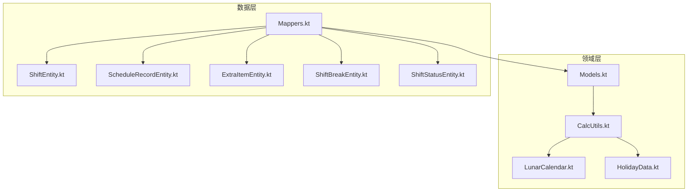
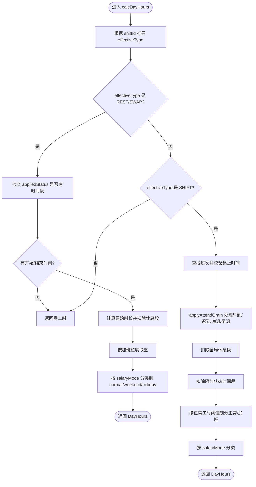
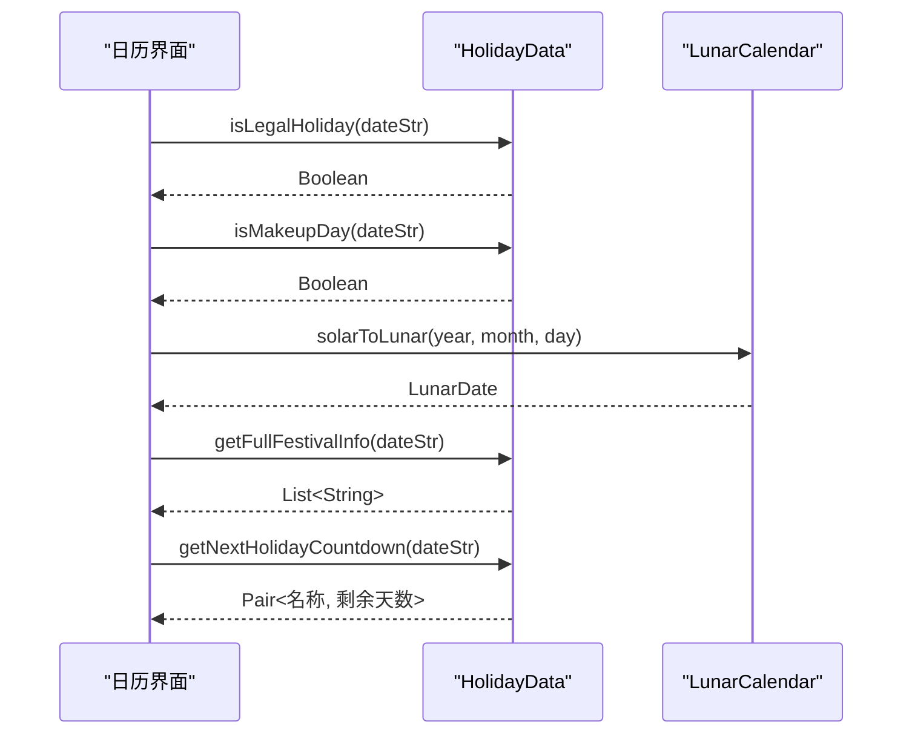
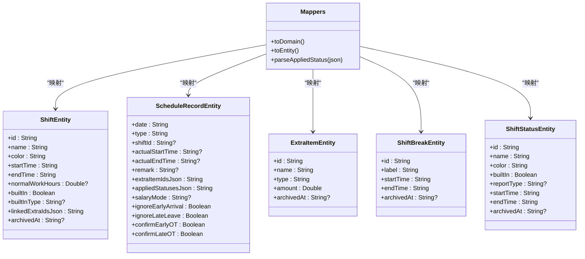
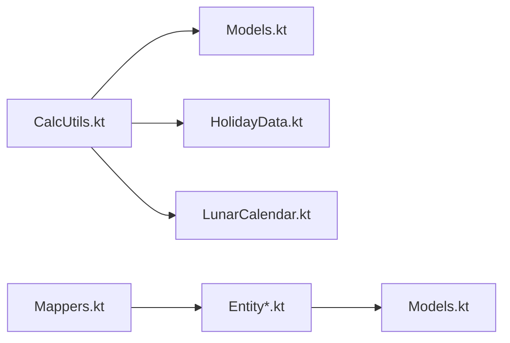

# 领域模型

<cite>
**本文引用的文件列表**
- [Models.kt](file://app/src/main/java/com/schedulecalendar/app/domain/model/Models.kt)
- [CalcUtils.kt](file://app/src/main/java/com/schedulecalendar/app/domain/model/CalcUtils.kt)
- [LunarCalendar.kt](file://app/src/main/java/com/schedulecalendar/app/domain/model/LunarCalendar.kt)
- [HolidayData.kt](file://app/src/main/java/com/schedulecalendar/app/domain/model/HolidayData.kt)
- [ShiftEntity.kt](file://app/src/main/java/com/schedulecalendar/app/data/db/entity/ShiftEntity.kt)
- [ScheduleRecordEntity.kt](file://app/src/main/java/com/schedulecalendar/app/data/db/entity/ScheduleRecordEntity.kt)
- [ExtraItemEntity.kt](file://app/src/main/java/com/schedulecalendar/app/data/db/entity/ExtraItemEntity.kt)
- [ShiftBreakEntity.kt](file://app/src/main/java/com/schedulecalendar/app/data/db/entity/ShiftBreakEntity.kt)
- [ShiftStatusEntity.kt](file://app/src/main/java/com/schedulecalendar/app/data/db/entity/ShiftStatusEntity.kt)
- [Mappers.kt](file://app/src/main/java/com/schedulecalendar/app/data/repository/Mappers.kt)
</cite>

## 目录
1. [引言](#引言)
2. [项目结构](#项目结构)
3. [核心组件](#核心组件)
4. [架构总览](#架构总览)
5. [详细组件分析](#详细组件分析)
6. [依赖关系分析](#依赖关系分析)
7. [性能考量](#性能考量)
8. [故障排查指南](#故障排查指南)
9. [结论](#结论)
10. [附录](#附录)

## 引言
本领域模型文档聚焦 Android 排班日历应用的核心业务逻辑与数据模型，覆盖班次、排班记录、薪资计算、工时统计、节假日与农历转换等关键能力。文档从领域对象设计原则出发，阐述计算工具类的算法实现，解释节假日数据处理与纪念日管理方案，并给出验证规则、业务约束与异常处理机制，最后提供领域驱动设计的最佳实践与扩展指导。

## 项目结构
领域层位于 domain.model 包，包含：
- 领域模型定义（Models.kt）
- 计算工具（CalcUtils.kt）
- 农历与黄历工具（LunarCalendar.kt）
- 节假日与节气数据（HolidayData.kt）

数据持久化实体位于 data.db.entity 包，并通过 Mappers.kt 在领域模型与数据库实体之间进行映射。

图表来源
- [Models.kt:1-277](file://app/src/main/java/com/schedulecalendar/app/domain/model/Models.kt#L1-L277)
- [CalcUtils.kt:1-536](file://app/src/main/java/com/schedulecalendar/app/domain/model/CalcUtils.kt#L1-L536)
- [LunarCalendar.kt:1-418](file://app/src/main/java/com/schedulecalendar/app/domain/model/LunarCalendar.kt#L1-L418)
- [HolidayData.kt:1-636](file://app/src/main/java/com/schedulecalendar/app/domain/model/HolidayData.kt#L1-L636)
- [ShiftEntity.kt:1-24](file://app/src/main/java/com/schedulecalendar/app/data/db/entity/ShiftEntity.kt#L1-L24)
- [ScheduleRecordEntity.kt:1-26](file://app/src/main/java/com/schedulecalendar/app/data/db/entity/ScheduleRecordEntity.kt#L1-L26)
- [ExtraItemEntity.kt:1-16](file://app/src/main/java/com/schedulecalendar/app/data/db/entity/ExtraItemEntity.kt#L1-L16)
- [ShiftBreakEntity.kt:1-16](file://app/src/main/java/com/schedulecalendar/app/data/db/entity/ShiftBreakEntity.kt#L1-L16)
- [ShiftStatusEntity.kt:1-19](file://app/src/main/java/com/schedulecalendar/app/data/db/entity/ShiftStatusEntity.kt#L1-L19)
- [Mappers.kt:1-134](file://app/src/main/java/com/schedulecalendar/app/data/repository/Mappers.kt#L1-L134)

章节来源
- [Models.kt:1-277](file://app/src/main/java/com/schedulecalendar/app/domain/model/Models.kt#L1-L277)
- [Mappers.kt:1-134](file://app/src/main/java/com/schedulecalendar/app/data/repository/Mappers.kt#L1-L134)

## 核心组件
本节概述领域层的关键对象与职责：
- 班次 Shift：定义工作时间、正常工时阈值、内置类型、关联补贴/扣款项等
- 排班记录 ScheduleRecord：每日排班、实际打卡时间、附加状态、薪资模式、加班确认开关等
- 全局休息段 ShiftBreak：不计入工时的时段（如午休），对全部班次生效
- 附加状态 ShiftStatus/AppliedStatus：请假、调休等自定义状态及其时间段
- 薪资配置 SalaryConfig 与考勤配置 AttendConfig：统一制度与考勤规则
- 工时汇总 HoursSummary、日明细 DayScheduleDetail、月汇总 SalarySummary：用于展示与报表
- 显示方案 DisplayScheme/DataRowConfig/DisplayItemType：日历格子展示配置
- 循环规则 ScheduleRule：按周期生成排班的规则
- 节假日信息 HolidayInfo：日期是否法定假日及是否补班工作日
- 计算工具 CalcUtils：工时与薪资计算、自动计薪模式判断、周末判定等
- 农历与黄历 LunarCalendar：公历转农历、干支生肖、宜忌、时辰吉凶等
- 节假日数据 HolidayData：法定节假日、调休补班、二十四节气、节日名称与倒计时

章节来源
- [Models.kt:1-277](file://app/src/main/java/com/schedulecalendar/app/domain/model/Models.kt#L1-L277)
- [CalcUtils.kt:1-536](file://app/src/main/java/com/schedulecalendar/app/domain/model/CalcUtils.kt#L1-L536)
- [LunarCalendar.kt:1-418](file://app/src/main/java/com/schedulecalendar/app/domain/model/LunarCalendar.kt#L1-L418)
- [HolidayData.kt:1-636](file://app/src/main/java/com/schedulecalendar/app/domain/model/HolidayData.kt#L1-L636)

## 架构总览
领域层以纯函数式计算为主，避免副作用；数据层通过 Room 实体存储，使用 Mapper 将领域对象与实体互转。计算工具类依赖节假日与农历数据，形成“领域模型 + 计算工具 + 外部数据”的清晰分层。

```mermaid
classDiagram
class Shift {
+id : String
+name : String
+color : String
+startTime : String
+endTime : String
+normalWorkHours : Double?
+builtIn : Boolean
+builtInType : String?
+linkedExtraIds : String[]
+archivedAt : String?
}
class ScheduleRecord {
+date : String
+type : ScheduleType
+shiftId : String?
+actualStartTime : String?
+actualEndTime : String?
+remark : String?
+extraItemIds : String[]
+appliedStatus : AppliedStatus?
+salaryMode : SalaryMode?
+ignoreEarlyArrival : Boolean
+ignoreLateLeave : Boolean
+confirmEarlyOT : Boolean
+confirmLateOT : Boolean
}
class ShiftBreak {
+id : String
+label : String
+startTime : String
+endTime : String
+archivedAt : String?
}
class ShiftStatus {
+id : String
+name : String
+color : String
+builtIn : Boolean
+reportType : String?
+startTime : String
+endTime : String
+archivedAt : String?
}
class AppliedStatus {
+statusId : String
+startTime : String?
+endTime : String?
}
class SalaryConfig {
+baseSalary : Double
+basePerformance : Double
+normalRate : Double
+overtimeRate : Double
+weekendRate : Double
+holidayRate : Double
+socialInsurance : Double
+housingFundDeduction : Double
}
class AttendConfig {
+overtimeGranMin : Int
+lateToleranceMin : Int
+earlyLeaveToleranceMin : Int
+lateAlertCount : Int
+earlyLeaveAlertCount : Int
+normalWorkHoursPerDay : Double
+lateDeductionPerMin : Double
+earlyLeaveDeductionPerMin : Double
}
class HoursSummary {
+normalHours : Double
+overtimeHours : Double
+weekendHours : Double
+holidayHours : Double
+leaveDays : Int
+leaveHoursRemainder : Double
+swapDays : Int
+restDays : Int
+totalHours : Double
+lateCount : Int
+earlyLeaveCount : Int
+leaveStatusHours : Double
+swapStatusHours : Double
}
class DayScheduleDetail {
+date : String
+record : ScheduleRecord?
+shift : Shift?
+normalHours : Double
+overtimeHours : Double
+weekendHours : Double
+holidayHours : Double
+salary : Double
+normalSalary : Double
+overtimeSalary : Double
+extras : ExtraItem[]
}
class SalarySummary {
+baseSalary : Double
+basePerformance : Double
+normalSalary : Double
+overtimeSalary : Double
+weekendSalary : Double
+holidaySalary : Double
+totalSubsidy : Double
+totalDeduction : Double
+socialInsurance : Double
+housingFundDeduction : Double
+totalSalary : Double
}
class CalcUtils {
+calcDayHours(...)
+calcMonthHours(...)
+calcMonthSalary(...)
+getMonthScheduleDetails(...)
+autoSalaryMode(...)
+isWeekend(...)
}
class HolidayData {
+isLegalHoliday(date) : Boolean
+isMakeupDay(date) : Boolean
+getSolarTerm(date) : String?
+getFullFestivalInfo(date) : String[]
+getNextHolidayCountdown(date) : Pair~String,Int~
}
class LunarCalendar {
+solarToLunar(y,m,d) : LunarDate
+getHuangLiInfo(y,m,d) : HuangLiInfo
+getFullHuangLi(y,m,d) : FullHuangLi
}
CalcUtils --> Shift : "读取"
CalcUtils --> ScheduleRecord : "读取"
CalcUtils --> ShiftBreak : "读取"
CalcUtils --> SalaryConfig : "读取"
CalcUtils --> AttendConfig : "读取"
CalcUtils --> HolidayData : "调用"
CalcUtils --> LunarCalendar : "调用(间接)"
DayScheduleDetail --> ScheduleRecord : "引用"
DayScheduleDetail --> Shift : "引用"
HoursSummary --> ScheduleRecord : "聚合"
SalarySummary --> SalaryConfig : "聚合"
```

图表来源
- [Models.kt:1-277](file://app/src/main/java/com/schedulecalendar/app/domain/model/Models.kt#L1-L277)
- [CalcUtils.kt:1-536](file://app/src/main/java/com/schedulecalendar/app/domain/model/CalcUtils.kt#L1-L536)
- [HolidayData.kt:1-636](file://app/src/main/java/com/schedulecalendar/app/domain/model/HolidayData.kt#L1-L636)
- [LunarCalendar.kt:1-418](file://app/src/main/java/com/schedulecalendar/app/domain/model/LunarCalendar.kt#L1-L418)

## 详细组件分析

### 领域对象设计与业务规则
- 班次 Shift
  - 支持正常工时阈值 normalWorkHours，超出部分计入加班；null 表示不限制分界
  - builtInType 标识内置类型（休息、调休、请假），便于 UI 与计算区分
  - linkedExtraIds 可预关联补贴/扣款项目，减少重复选择
- 排班记录 ScheduleRecord
  - type 为 SHIFT/LEAVE/SWAP/REST，但计算时优先依据 shiftId 推导 effectiveType，确保一致性
  - appliedStatus 支持在排班中附加状态的时间段，用于请假/调休的小时折算
  - salaryMode 可手动指定或自动推断（工作日/周末/节假日）
  - ignoreEarlyArrival/ignoreLateLeave 控制早到/晚退是否产生加班；confirmEarlyOT/confirmLateOT 用于确认加班计入薪资
- 全局休息段 ShiftBreak
  - 对所有班次生效，跨天场景下正确扣除重叠时长
- 附加状态 ShiftStatus/AppliedStatus
  - reportType 映射至报表类型（leave/swap），用于请假/调休小时汇总
- 薪资与考勤配置
  - SalaryConfig 定义底薪、绩效、各类型时薪、社保与公积金扣款
  - AttendConfig 定义加班粒度、迟到/早退容忍度、标准工时、迟到/早退扣款费率
- 展示与汇总
  - DisplayScheme/DataRowConfig/DisplayItemType 控制日历格子显示内容
  - HoursSummary/DayScheduleDetail/SalarySummary 提供工时与薪资的汇总与明细

章节来源
- [Models.kt:1-277](file://app/src/main/java/com/schedulecalendar/app/domain/model/Models.kt#L1-L277)

### 计算工具类 CalcUtils 算法说明
- 时间工具
  - timeToMin/minutesToTime/calcHourDiff/normRange 支持跨天计算与归一化
- 考勤粒度处理 applyAttendGrain
  - 早到：按 overtimeGranMin 向下取整，不足一个粒度视为准点
  - 迟到：在 lateToleranceMin 内视为准点，否则按实际时间
  - 晚退/早退同理
- 全局休息段扣减 calcGlobalBreakHours
  - 计算班次窗口与休息段的重叠时长，支持跨天
- 核心工时计算 calcDayHours
  - 根据 effectiveType 分支：
    - REST/SWAP：若存在 appliedStatus 时间段则按该区间计算工时，并按 salaryMode 分类
    - LEAVE/非 SHIFT：不产生工时
    - SHIFT：基于有效起止时间扣除休息段与附加状态时间段，再按 threshold 划分正常/加班
  - 自动计薪模式 autoSalaryMode 结合 HolidayData.isLegalHoliday 与 isWeekend 判断
- 月度统计 calcMonthHours/calcMonthSalary
  - 遍历当月记录，累计各类工时与薪资，考虑附加状态小时折算与迟到/早退扣款
- 每日明细 getMonthScheduleDetails
  - 生成每日工时与薪资明细，用于工时/薪资页展示

图表来源
- [CalcUtils.kt:149-230](file://app/src/main/java/com/schedulecalendar/app/domain/model/CalcUtils.kt#L149-L230)
- [CalcUtils.kt:499-522](file://app/src/main/java/com/schedulecalendar/app/domain/model/CalcUtils.kt#L499-L522)

章节来源
- [CalcUtils.kt:1-536](file://app/src/main/java/com/schedulecalendar/app/domain/model/CalcUtils.kt#L1-536)

### 节假日数据处理与纪念日管理
- 法定节假日与调休补班
  - HolidayData 维护 2024-2030 年法定假日与补班工作日集合，提供 isLegalHoliday/isMakeupDay 查询
  - 提供 getHolidayName 精确匹配节假日名称，支持“春节补班”等标注
- 二十四节气与传统节日
  - getSolarTerm 获取节气名称；getTraditionalFestival/getInternationalFestival 识别传统与国际节日
  - getFullFestivalInfo 合并节气、传统节日、国际节日并去重
- 倒计时 getNextHolidayCountdown
  - 计算距离下一个法定节假日的天数，排除“补班”类型
- 纪念日与日程
  - 应用侧通过 TodoScreen 等界面管理纪念日事件，并在日历中展示

图表来源
- [HolidayData.kt:171-175](file://app/src/main/java/com/schedulecalendar/app/domain/model/HolidayData.kt#L171-L175)
- [HolidayData.kt:422-480](file://app/src/main/java/com/schedulecalendar/app/domain/model/HolidayData.kt#L422-L480)
- [LunarCalendar.kt:35-67](file://app/src/main/java/com/schedulecalendar/app/domain/model/LunarCalendar.kt#L35-L67)

章节来源
- [HolidayData.kt:1-636](file://app/src/main/java/com/schedulecalendar/app/domain/model/HolidayData.kt#L1-L636)
- [LunarCalendar.kt:1-418](file://app/src/main/java/com/schedulecalendar/app/domain/model/LunarCalendar.kt#L1-L418)

### 农历转换与黄历功能
- 公历转农历
  - 使用 tyme4j 库，提供 lunarYear/lunarMonth/lunarDay、闰月、干支、生肖等信息
- 黄历信息
  - getHuangLiInfo 根据宜忌数量判断吉凶等级
  - getFullHuangLi 整合五行、冲煞、星宿、值神、建除十二神、纳音五行、胎神、时辰吉凶等
- 时辰吉凶
  - 根据日干支计算子时天干，进而推导各时辰干支与吉凶

章节来源
- [LunarCalendar.kt:1-418](file://app/src/main/java/com/schedulecalendar/app/domain/model/LunarCalendar.kt#L1-L418)

### 数据模型与持久化映射
- 实体与领域对象
  - ShiftEntity/ScheduleRecordEntity/ExtraItemEntity/ShiftBreakEntity/ShiftStatusEntity 对应领域模型字段
  - JSON 字段（如 extraItemIdsJson/appliedStatusesJson/linkedExtraIdsJson）通过 Gson 解析/序列化
- 映射器 Mappers
  - toDomain/toEntity 双向转换，兼容旧版 appliedStatus 数组格式与新单对象格式
  - 枚举值（ScheduleType/SalaryMode）安全解析，失败回退默认值

图表来源
- [ShiftEntity.kt:1-24](file://app/src/main/java/com/schedulecalendar/app/data/db/entity/ShiftEntity.kt#L1-L24)
- [ScheduleRecordEntity.kt:1-26](file://app/src/main/java/com/schedulecalendar/app/data/db/entity/ScheduleRecordEntity.kt#L1-L26)
- [ExtraItemEntity.kt:1-16](file://app/src/main/java/com/schedulecalendar/app/data/db/entity/ExtraItemEntity.kt#L1-L16)
- [ShiftBreakEntity.kt:1-16](file://app/src/main/java/com/schedulecalendar/app/data/db/entity/ShiftBreakEntity.kt#L1-L16)
- [ShiftStatusEntity.kt:1-19](file://app/src/main/java/com/schedulecalendar/app/data/db/entity/ShiftStatusEntity.kt#L1-L19)
- [Mappers.kt:1-134](file://app/src/main/java/com/schedulecalendar/app/data/repository/Mappers.kt#L1-L134)

章节来源
- [Mappers.kt:1-134](file://app/src/main/java/com/schedulecalendar/app/data/repository/Mappers.kt#L1-L134)

## 依赖关系分析
- 计算工具 CalcUtils 依赖：
  - 领域模型（Shift/ScheduleRecord/ShiftBreak/SalaryConfig/AttendConfig）
  - 节假日数据 HolidayData（法定假日/补班/节气/节日）
  - 农历工具 LunarCalendar（间接用于黄历与节日展示）
- 数据层依赖：
  - Room 实体与 Mappers 负责持久化与版本兼容
- 耦合与内聚：
  - 领域层保持无副作用与高内聚，计算逻辑集中在 CalcUtils
  - 数据层仅承担存储与映射，降低领域与基础设施耦合

图表来源
- [CalcUtils.kt:1-536](file://app/src/main/java/com/schedulecalendar/app/domain/model/CalcUtils.kt#L1-L536)
- [Models.kt:1-277](file://app/src/main/java/com/schedulecalendar/app/domain/model/Models.kt#L1-L277)
- [HolidayData.kt:1-636](file://app/src/main/java/com/schedulecalendar/app/domain/model/HolidayData.kt#L1-L636)
- [LunarCalendar.kt:1-418](file://app/src/main/java/com/schedulecalendar/app/domain/model/LunarCalendar.kt#L1-L418)
- [Mappers.kt:1-134](file://app/src/main/java/com/schedulecalendar/app/data/repository/Mappers.kt#L1-L134)

章节来源
- [CalcUtils.kt:1-536](file://app/src/main/java/com/schedulecalendar/app/domain/model/CalcUtils.kt#L1-L536)
- [Mappers.kt:1-134](file://app/src/main/java/com/schedulecalendar/app/data/repository/Mappers.kt#L1-L134)

## 性能考量
- 时间计算采用分钟级整数运算与 floor 取整，避免浮点误差累积
- 月度统计按 Map 过滤前缀与可选 dateFilter，减少不必要遍历
- 跨天时间范围通过 normRange 归一化，简化边界条件判断
- 节假日与节气数据以静态集合/映射存储，查询复杂度 O(1)/O(n) 可控

[本节为通用性能建议，无需特定文件来源]

## 故障排查指南
- 枚举解析失败
  - 当数据库中的 type/salaryMode 字符串无法解析为枚举时，Mapper 会回退默认值，避免崩溃
- 附加状态兼容
  - parseAppliedStatus 兼容旧版数组格式与新单对象格式，解析失败返回 null
- 空值与边界
  - calcHourDiff 对空时间返回 0；calcDayHours 对缺失班次或空起止时间直接返回零工时
- 节假日数据更新
  - 法定假日与补班数据需随官方公告更新，注意 2027-2030 年为预估数据

章节来源
- [Mappers.kt:69-84](file://app/src/main/java/com/schedulecalendar/app/data/repository/Mappers.kt#L69-L84)
- [Mappers.kt:92-112](file://app/src/main/java/com/schedulecalendar/app/data/repository/Mappers.kt#L92-L112)
- [CalcUtils.kt:40-47](file://app/src/main/java/com/schedulecalendar/app/domain/model/CalcUtils.kt#L40-L47)
- [CalcUtils.kt:185-188](file://app/src/main/java/com/schedulecalendar/app/domain/model/CalcUtils.kt#L185-L188)
- [HolidayData.kt:1-135](file://app/src/main/java/com/schedulecalendar/app/domain/model/HolidayData.kt#L1-L135)

## 结论
本领域模型以清晰的领域对象与纯函数式计算为核心，结合节假日与农历数据，实现了完整的排班、工时与薪资计算体系。数据层通过 Mapper 保证向后兼容与稳健性。遵循 DDD 的分层与职责分离，系统具备良好的可扩展性与可维护性。

[本节为总结性内容，无需特定文件来源]

## 附录

### 领域模型验证规则与业务约束
- 必填与格式
  - 日期格式 yyyy-MM-dd；时间格式 HH:mm
  - 颜色值为十六进制字符串
- 业务约束
  - 正常工时阈值 normalWorkHours 与 AttendConfig.normalWorkHoursPerDay 共同决定加班分界
  - 加班粒度 overtimeGranMin 必须为正整数；迟到/早退容忍度为非负整数
  - 附加状态时间段 startTime/endTime 需合法且不超过班次窗口
- 异常处理
  - 解析失败回退默认值；空输入返回零结果；非法枚举安全降级

章节来源
- [Models.kt:124-141](file://app/src/main/java/com/schedulecalendar/app/domain/model/Models.kt#L124-L141)
- [Mappers.kt:92-112](file://app/src/main/java/com/schedulecalendar/app/data/repository/Mappers.kt#L92-L112)

### 领域驱动设计最佳实践与扩展指导
- 分层与不变量
  - 领域层不包含 I/O 与 UI 逻辑；通过工厂或 Builder 构造满足不变量的对象
- 计算与展示解耦
  - 计算工具只关注业务规则；展示由 DisplayScheme 与 UI 层组合
- 扩展点
  - 新增薪资模式：扩展 SalaryMode 与 autoSalaryMode 判断逻辑
  - 新增附加状态：扩展 ShiftStatus.reportType 与报表汇总逻辑
  - 扩展节假日数据：在 HolidayData 中增加年份与日期映射
- 测试策略
  - 针对 calcDayHours/calcMonthSalary 编写边界用例（跨天、粒度取整、附加状态、节假日）

[本节为概念性指导，无需特定文件来源]